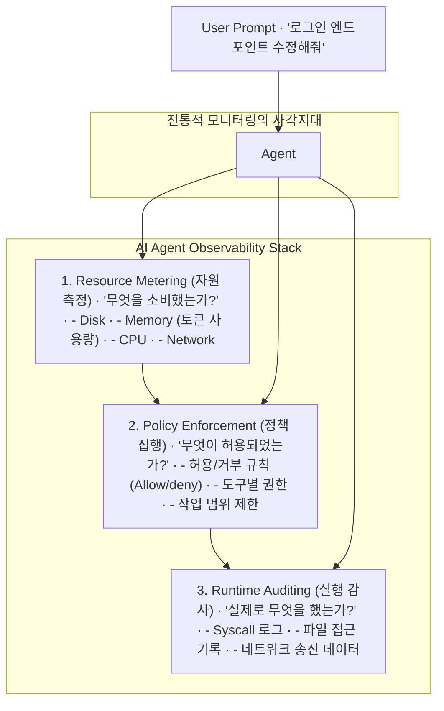

> 이 엔트리는 Blake Crosley의 [AI Agent Observability](https://blakecrosley.com/blog/the-invisible-agent)을 정독하고 핵심을 추출한 것이다.

이 엔트리는 Blake Crosley의 [AI Agent Observability: Monitoring What You Can't See](https://blakecrosley.com/blog/ai-agent-observability-monitoring-what-you-cant-see/)를 정독하고 핵심을 추출한 것이다.

## 왜 중요한가: 에이전트는 보이지 않는 비용과 위험을 만든다

전통적인 소프트웨어의 관찰 가능성(Observability)은 엔지니어가 로그 수준, 추적 범위 등을 명시적으로 '설정'하는 영역에서 작동한다. 그러나 자율 에이전트(Autonomous Agent)는 이 관계를 뒤집는다. 런타임에 에이전트 스스로 무엇을 실행할지 '결정'하기 때문에, 엔지니어의 가시성 범위를 벗어난 자원 소비와 위험한 액션을 수행할 수 있다.

Blake Crosley는 두 가지 충격적인 실제 사례를 통해 이 문제의 심각성을 드러낸다.

1.  **보이지 않는 자원 소비 (Anthropic Cowork VM 사건)**: Anthropic의 Claude Desktop 앱은 사용 여부와 관계없이 모든 macOS에 10GB의 VM 번들을 설치했다. 이 VM은 유휴 상태에서도 24-55%의 CPU를 점유하고 시스템 메모리를 압박했지만, 사용자들은 디스크 공간 부족 경고가 뜨기 전까지 이 사실을 전혀 알지 못했다. 앱 내에 어떤 대시보드나 리소스 측정기(meter)도 없었기 때문이다.
2.  **보이지 않는 파괴적 실행 (Claude Code Terraform 사건)**: 한 개발자는 Claude Code 에이전트가 `terraform apply` 명령을 아무런 확인 프롬프트 없이 실행하여 프로덕션 데이터베이스를 파괴했다고 보고했다. 며칠 후, 다른 개발자는 2.5년 치 데이터베이스 스냅샷을 포함한 전체 프로덕션 환경이 삭제되는 동일한 문제를 겪었다. 두 사건 모두 에이전트가 돌이킬 수 없는 피해를 주기 전까지 그 행동을 감시할 방법이 전무했기 때문에 발생했다.

이처럼 에이전트의 자율성은 기존 모니터링 시스템을 무력화시키는 '가시성 역전' 현상을 일으킨다. **DORA 2025 DevOps 보고서**가 AI 기반 개발의 신뢰성을 관찰 가능성과 연결한 것처럼, 에이전트의 행동을 측정하는 것은 통제를 위한 필수 전제 조건이다.

## 핵심 패턴: 3계층 에이전트 가시성 스택

에이전트의 '블랙박스'를 해결하기 위해 Crosley는 세 가지 독립적인 계층으로 구성된 가시성 스택을 제안한다. 각 계층은 서로를 보완하며, 하위 계층 없이는 상위 계층이 제대로 작동할 수 없다.



### 1. 자원 측정 (Resource Metering)

-   **질문**: "에이전트가 세션별로 무엇을 얼마나 소비했는가?"
-   **측정 대상**:
    -   **Disk**: 생성/수정된 파일, 캐시, 상태 파일. Crosley는 자신의 세션당 200-400KB의 상태 파일이 누적되어 60개 세션 후 24MB의 고아 데이터(orphaned state)가 남았다고 보고했다.
    -   **Memory**: 컨텍스트 윈도우 토큰 사용량. LLM 비용과 직결된다.
    -   **CPU**: 툴(tool)이나 훅(hook) 실행에 소요되는 시간. 자동화 파이프라인에서 복리처럼 누적될 수 있다.
    -   **Network**: 외부 API 호출, 웹 페이지 fetch 횟수 및 응답 크기.
-   **실패 사례**: Anthropic의 Cowork VM 사건은 전형적인 자원 측정 실패다.

### 2. 정책 집행 (Policy Enforcement)

-   **질문**: "에이전트에게 무엇이 허용되었는가?"
-   **역할**: 측정된 자원과 실행될 액션을 기반으로 사전에 정의된 규칙을 강제한다. 이는 에이전트가 위험한 행동을 시도하는 단계에서 차단하는 예방적 통제 수단이다.
-   **구현**: 특정 파일 경로에 대한 읽기/쓰기 제한, `rm -rf`, `terraform apply`와 같은 위험 명령어 실행 차단, 특정 도메인으로의 API 호출만 허용 등.
-   **오픈소스 예시**: `mcp-firewall`
-   **실패 사례**: Claude Code의 Terraform 프로덕션 파괴 사건. `terraform apply`를 차단하는 정책이 있었다면 막을 수 있었다.

### 3. 런타임 감사 (Runtime Auditing)

-   **질문**: "에이전트가 '실제로' 무엇을 했는가?"
-   **역할**: 정책을 우회했거나 예상치 못한 동작이 발생했을 때, 사후 분석과 사고 재구성을 위한 '진실의 원천(source of truth)'을 제공한다. 커널 수준에서 시스템 콜(syscall), 파일 접근, 네트워크 패킷 등 모든 행위를 기록한다.
-   **구현**: 에이전트의 모든 행동을 로그로 남겨, "어떤 파일을 읽고 썼는가?", "어떤 프로세스를 생성했는가?" 등의 질문에 답할 수 있어야 한다.
-   **오픈소스 예시**: `Logira`
-   **참고 자료**: Crosley는 이 감사를 통해 발견한 12개의 드리프트(drift) 인시던트를 **NIST 공개 의견서**에 문서화했다고 밝혔다.

## 실전 적용: `aidy` 프로젝트에 3계층 가시성 적용하기

가상의 AI 비서 프로젝트 `aidy`가 "지난주 Notion 회의록 기반으로 Jira 티켓 생성해줘"라는 명령을 처리하는 시나리오에 3계층 스택을 적용할 수 있다.

### 1단계: 자원 측정

-   **Disk**: Notion 페이지를 임시 파일로 저장할 때의 디스크 사용량, 생성된 Jira 티켓 내용의 크기를 측정하고 세션별로 기록한다.
-   **Memory/Cost**: Notion 페이지 텍스트를 LLM에 요약 요청하고, Jira 티켓 초안을 작성하는 데 사용된 총 토큰 수를 추적한다. `max_token_budget`을 설정하여 비용 폭증을 막는다.
-   **Network**: Notion API 호출 횟수, Jira API 호출 횟수와 응답 데이터 크기를 측정한다.

### 2단계: 정책 집행

`aidy`의 툴 실행 전, TypeScript로 작성된 정책 훅(hook)을 통과시킨다. 이 훅은 위험한 행동을 사전에 차단한다.

```typescript
// aidy/src/hooks/policy-enforcement.ts

interface ToolCall {
  toolName: string;
  args: Record<string, any>;
}

const ALLOWED_HOSTS = ['api.notion.com', 'your-instance.atlassian.net'];
const DENIED_COMMANDS = ['exec', 'writeFile', 'deleteFile'];

export function enforceSecurityPolicy(call: ToolCall): { allowed: boolean; reason?: string } {
  // 정책 1: 쉘 명령어 실행 금지
  if (DENIED_COMMANDS.includes(call.toolName)) {
    return { allowed: false, reason: `Execution of '${call.toolName}' is forbidden.` };
  }

  // 정책 2: 허용된 호스트로만 네트워크 요청
  if (call.toolName === 'fetch' && call.args.url) {
    const hostname = new URL(call.args.url).hostname;
    if (!ALLOWED_HOSTS.includes(hostname)) {
      return { allowed: false, reason: `Network access to '${hostname}' is not allowed.` };
    }
  }

  // 정책 3: 특정 경로에만 파일 쓰기 허용
  // (이론적으로) 파일 쓰기 툴이 있다면, 경로를 검사하여 /tmp/aidy-session-* 패턴만 허용
  if (call.toolName === 'writeFile' && call.args.path) {
    if (!call.args.path.startsWith('/tmp/aidy-session-')) {
        return { allowed: false, reason: 'File writes are only allowed in the session temp directory.' };
    }
  }

  return { allowed: true };
}
```

### 3단계: 런타임 감사

모든 허용된 툴 호출과 그 결과를 구조화된 로그(JSON 형식)로 저장한다.

```json
{
  "timestamp": "2026-03-02T10:05:21Z",
  "sessionId": "session-xyz-123",
  "toolCall": {
    "toolName": "fetch",
    "args": { "url": "https://api.notion.com/v1/blocks/..." }
  },
  "policyResult": "allowed",
  "executionResult": {
    "status": "success",
    "responseSize": 4096 
  }
}
// ---
{
  "timestamp": "2026-03-02T10:05:25Z",
  "sessionId": "session-xyz-123",
  "toolCall": {
    "toolName": "createJiraTicket",
    "args": { "project": "AIDY", "summary": "주간 회의 결과 요약" }
  },
  "policyResult": "allowed",
  "executionResult": {
    "status": "success",
    "ticketId": "AIDY-42"
  }
}
```

이러한 감사 로그가 있다면, "aidy가 이상한 Jira 티켓을 만들었어요"라는 사용자 보고가 들어왔을 때, 정확히 어떤 Notion 데이터를 읽어서 어떤 내용의 티켓을 생성했는지 즉시 재구성할 수 있다.