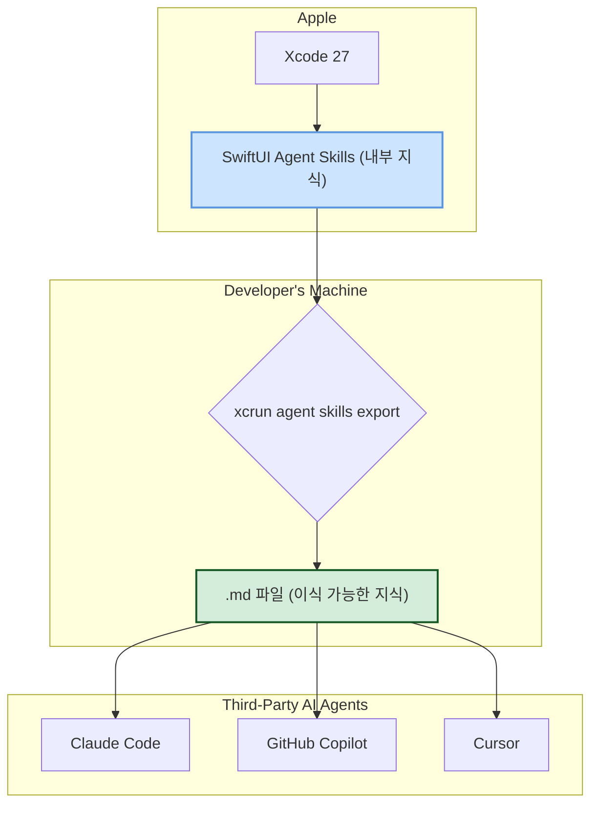

> 이 엔트리는 Blake Crosley의 [Xcode 27 Ships Agent Skills You Can Export Anywhere](https://blakecrosley.com/blog/xcode-27-agent-skills-export)을 정독하고 핵심을 추출한 것이다.

이 엔트리는 Blake Crosley의 [Xcode 27 Ships Agent Skills You Can Export Anywhere](https://blakesanie.com/writing/xcode-27-ships-agent-skills-you-can-export-anywhere)를 정독하고 핵심을 추출한 것이다.

## 왜 중요한가?

LLM(거대 언어 모델)은 공개된 문서와 코드를 학습하지만, 그 데이터는 필연적으로 낡거나 잘못된 패턴을 포함한다. 특히 SwiftUI처럼 빠르게 발전하는 프레임워크의 경우, LLM은 최신 API나 최적의 성능 패턴을 알지 못해 부정확한 코드를 생성하는 경우가 잦았다.

Apple의 Xcode 27에 도입된 '에이전트 스킬'은 이 문제를 근본적으로 해결하는 새로운 패러다임을 제시한다. 이는 **플랫폼 벤더가 직접 큐레이션한 최신 전문 지식을 AI 에이전트가 즉시 소비할 수 있는 형태로 배포하는 채널**이기 때문이다. 웹 스크래핑에 의존하던 낡은 방식에서 벗어나, 가장 신뢰도 높은 소스(First-Party)가 제공하는 '살아있는 문서'를 통해 AI의 코드 생성 품질과 정확성을 극적으로 향상시킨다.

## 핵심 패턴: 전문성 배포 채널로서의 '에이전트 스킬'

Apple이 WWDC 2026에서 선보인 이 패턴의 핵심은, 플랫폼 전문 지식을 독점적인 IDE 기능으로 가두는 대신, **이식 가능한(portable) 자산으로 취급**한다는 점이다. 개발자는 Xcode의 코딩 어시스턴트를 사용하든, Claude Code나 Cursor 같은 외부 에이전트를 사용하든 동일한 고품질의 지식을 활용할 수 있다.

이 패턴은 세 가지 주요 요소로 구성된다.

1.  **퍼스트파티 큐레이션 (First-Party Curation)**
    Apple 내부 엔지니어들의 지식과 모범 사례("all of our internal knowledge, all the best practices")가 직접 스킬에 인코딩된다. 이는 웹에서 긁어모은 부정확한 정보가 아닌, 검증된 전문가의 지식이다.

2.  **이식성을 보장하는 표준 포맷 (Portable Standard Format)**
    `xcrun agent skills export` 명령어를 통해 스킬을 범용적인 마크다운(`.md`) 파일로 추출할 수 있다. 이는 특정 도구에 종속되지 않고, 개발자가 선호하는 모든 에이전트의 컨텍스트나 프롬프트에 쉽게 통합할 수 있음을 의미한다.

3.  **목적 지향적 분리 (Purpose-Driven Separation)**
    스킬은 두 가지로 명확히 분리되어 LLM의 고질적인 약점을 보완한다.
    *   **SwiftUI Specialist Skill**: 시간이 지나도 변치 않는 모범 사례와 성능 최적화 기법(예: 뷰 분리, `body` 최소화)을 담는다.
    *   **What's New In SwiftUI Skill**: 모델이 학습하지 못했을 최신 릴리스의 신규 API와 변경 사항을 담는다.

### 지식 배포 흐름 다이어그램



## 실전 적용

`moneyflow` 프로젝트는 SwiftUI를 기반으로 하는 iOS 앱이다. 팀은 코드 생성과 리팩터링을 위해 Claude Code를 적극적으로 활용하고 있지만, 종종 오래된 SwiftUI API를 사용하거나 최신 성능 가이드라인을 놓친 코드를 생성하는 문제에 직면했다.

Xcode 27의 에이전트 스킬을 도입하여 이 문제를 해결할 수 있다.

### 1. Apple의 공식 스킬 추출하기

먼저, 터미널에서 다음 명령어를 실행하여 Apple이 제공하는 공식 SwiftUI 스킬을 마크다운 파일로 추출한다.

```bash
# 이 명령어는 Xcode 27 툴체인에 포함되어 있다.
xcrun agent skills export
```

실행 결과로 `SwiftUI_Specialist_Skill.md`와 `Whats_New_In_SwiftUI_Skill.md` 두 개의 파일이 생성된다.

### 2. Claude Code 워크플로우에 통합하기

추출된 마크다운 파일들을 `moneyflow` 프로젝트의 `docs/ai_skills` 디렉토리에 추가한다. 이후 팀의 공용 프롬프트나 Claude Code의 커스텀 지침(custom instructions)에 아래와 같은 내용을 추가하여 AI 에이전트가 항상 이 지식을 참조하도록 설정한다.

```typescript
// Claude Code API 호출 시 시스템 프롬프트 예시 (TypeScript)

const swiftuiSpecialistSkill = readFileSync('docs/ai_skills/SwiftUI_Specialist_Skill.md', 'utf-8');
const whatsNewSkill = readFileSync('docs/ai_skills/Whats_New_In_SwiftUI_Skill.md', 'utf-8');

const systemPrompt = `
You are an expert SwiftUI developer.
When generating or refactoring SwiftUI code for the moneyflow project, you MUST strictly adhere to the official Apple guidelines provided below.
These guidelines supersede any prior knowledge you may have.

<apple_swiftui_best_practices>
${swiftuiSpecialistSkill}
</apple_swiftui_best_practices>

<apple_swiftui_latest_apis>
${whatsNewSkill}
</apple_swiftui_latest_apis>
`;

// 이제 이 systemPrompt를 사용하여 API를 호출하면,
// 에이전트는 Apple의 최신 지식을 기반으로 응답한다.
```

### 기대 효과

-   **성능 최적화 자동화**: 복잡한 `TransactionDetailView`를 리팩터링 해달라고 요청하면, 에이전트는 `SwiftUI Specialist Skill`에 명시된 "뷰 본문을 작게 유지하고 하위 뷰로 추출하라"는 지침에 따라 자동으로 코드를 구조화한다.
-   **최신 API 채택**: "새로운 `LazyVGrid`에 적용할 수 있는 2027년 릴리스 API가 있나?"라고 질문하면, 에이전트는 `What's New In SwiftUI Skill`을 참조하여 정확한 최신 API(`toolbar visibilityPriority` 등)를 제안하고 사용법을 보여준다.

이로써 `moneyflow` 팀은 AI 어시스턴트를 활용하면서도 Apple의 공식 모범 사례를 일관되게 유지할 수 있게 된다.

## 근거 자료

이 분석은 Blake Crosley의 블로그 글을 기반으로 하지만, 글에서 인용한 Apple의 공식 발표 자료가 주된 근거이다.

-   **Apple Developer**: [What’s new in SwiftUI (WWDC 2026 세션)](https://developer.apple.com/videos/play/wwdc2026/10123/) (해당 글에서 26:50 지점부터 '에이전트 스킬' 부분을 다룬다고 언급)
-   **Apple Developer**: SwiftUI for Beginners Group Lab (WWDC 2026 랩 세션) (해당 글에서 패널리스트들이 스킬의 효과와 내부 지식에 대해 논의했다고 인용)