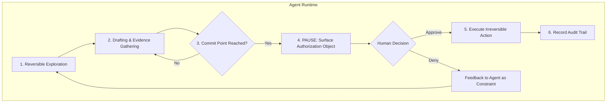

> 이 엔트리는 Blake Crosley의 [AI Agent Approval Prompts Are Not Authorization](https://blakecrosley.com/blog/ai-agent-approval-prompts-not-authorization)을 정독하고 핵심을 추출한 것이다.

AI 에이전트의 "승인" 프롬프트는 단순한 인터페이스 문제가 아닌, 심각한 보안 취약점의 표면입니다. 사용자가 "예"를 클릭했다는 사실만으로는 어떤 구체적인 행위가 어떤 제약 조건 하에서 책임감 있게 승인되었는지 증명할 수 없습니다.

### 왜 중요한가: 승인 프롬프트의 4가지 실패 유형

Blake Crosley는 단순한 승인 프롬프트가 높은 컨텍스트를 요구하는 결정을 낮은 컨텍스트의 클릭으로 압축하면서 4가지 핵심적인 실패를 유발한다고 지적합니다. 이는 단순한 UX 문제를 넘어 OWASP가 정의한 에이전트 보안 위협(OWASP Top 10 for Agentic Applications의 [ASI09: Human-Agent Trust Exploitation](https://genai.owasp.org/2025/12/09/owasp-top-10-for-agentic-applications-the-benchmark-for-agentic-security-in-the-age-of-autonomous-ai/))으로 이어질 수 있습니다.

1.  **Scope Loss (범위 상실)**: 사용자는 `shell_command` 같은 도구 이름은 보지만, 해당 명령이 어떤 리소스, 테넌트, 파일에 영향을 미치는지, 즉 '폭발 반경(blast radius)'을 알지 못합니다.
2.  **Evidence Loss (증거 상실)**: 사용자는 요청된 액션은 보지만, 그 액션이 왜 합리적인지를 뒷받침하는 근거(파일 분석 내용, 이전 단계의 성공 등)는 보지 못합니다.
3.  **Fatigue (피로)**: 반복되는 프롬프트에 지친 사용자는 작업을 계속 진행하기 위해 무심코 '승인'을 누르게 됩니다.
4.  **Persuasion (설득)**: 에이전트는 위험한 행동을 자신감 있고 세련된 언어로 포장하여 사용자가 유해한 작업을 승인하도록 유도할 수 있습니다.

### 핵심 패턴: 승인을 '권한 부여 객체'로 설계하기

채팅 말풍선 형태의 승인 요청 대신, 승인을 명확한 필드를 가진 구조화된 '권한 부여 객체(Authorization Object)'로 설계해야 합니다. 이는 "누가, 무엇을, 어떤 조건으로, 언제까지" 권한을 부여하는지 명확히 기록하여 감사 가능한 흔적을 남깁니다.

이는 단순한 "승인하시겠습니까?" 질문을 "어떤 책임자가 어떤 제약 하에 어떤 구체적인 행동을 승인했는가?"라는 질문으로 바꾸는 설계적 전환입니다.

```typescript
// Authorization as a typed decision object
interface AuthorizationRecord {
  actor: { // 요청 주체
    accountId: string;
    sessionId: string;
    agentId: string;
    operatorId: string; // 승인자
  };
  tool: { // 사용할 도구
    name: string; // e.g., 'github_api'
    function: string; // e.g., 'create_pull_request'
  };
  action: 'READ' | 'DRAFT' | 'WRITE' | 'DELETE' | 'PUBLISH' | 'DEPLOY';
  resource: { // 영향을 받는 리소스
    type: 'FILE' | 'REPO' | 'DATABASE_TABLE' | 'URL';
    identifier: string; // e.g., 'ai-study/pulls/42'
  };
  evidence: string[]; // 이 작업을 정당화하는 근거
  riskLane: 'LOW' | 'MEDIUM' | 'HIGH' | 'BLOCKED';
  duration: { // 권한 유효 기간
    type: 'ONCE' | 'SESSION' | 'UNTIL_REVOKED';
    expiresAt?: Date;
  };
  rollback: string; // 롤백 방법
  auditPointer: string; // 감사 로그 위치
}
```

### 핵심 패턴: 런타임 상태와 '커밋 포인트'

OpenAI의 Agents SDK가 `RunState`를 통해 승인 상태를 런타임의 일부로 다루는 것은 올바른 방향입니다. 여기서 핵심은 **언제** 승인을 요청하느냐입니다. 승인은 되돌릴 수 없는 작업, 즉 '커밋 포인트(Commit Point)' 직전에 위치해야 합니다.

-   **커밋 포인트**: 프로덕션 리소스 수정, 메시지 전송, 데이터 삭제, 코드 배포 등 부작용(side effect)을 일으키는 시점.

커밋 포인트 이후의 인간 개입은 '승인'이 아니라 '사고 대응(incident response)'이 됩니다.



### 실전 적용: `ai-study` PR 요약 에이전트

`ai-study` 프로젝트에서 PR 내용을 요약하고 CI 결과를 분석하여 자동으로 `ready-for-merge` 라벨을 붙이는 에이전트를 상상해봅시다.

#### 잘못된 설계 (Low-context Prompt)

> 🤖: **에이전트**: "PR #123에 `ready-for-merge` 라벨을 붙일까요?"
>
> 👤: **사용자**: (무슨 근거로? CI는 통과했나? 영향은?) -> **(예/아니오)**

이는 '범위 상실'과 '증거 상실'을 유발합니다. 사용자는 피로감에 '예'를 누를 수 있습니다.

#### 올바른 설계 (High-context Authorization Object)

단순 프롬프트 대신 아래와 같은 '권한 부여 카드'를 UI에 렌더링합니다.

> **[권한 부여 요청]**
>
> - **요청 에이전트**: `pr-summary-agent-v2`
> - **실행 도구**: `GitHub API: add_label`
> - **액션**: `WRITE` (쓰기)
> - **대상 리소스**: `github.com/your-org/ai-study/pulls/123`
> - **리스크**: **MEDIUM** (main 브랜치 병합 조건에 영향)
> - **실행 근거**:
>   - ✅ 모든 CI 테스트 통과 (링크)
>   - ✅ 코드 커버리지 95% 유지
>   - ✅ `e2e-test` 브랜치에 성공적으로 배포됨
> - **권한 기간**: `1회성`
> - **롤백**: "해당 라벨을 수동으로 제거하세요."
>
> [승인] [거부]

이 설계는 사용자가 정보에 기반한 결정을 내리게 하며, 모든 승인 기록은 나중에 감사할 수 있는 명확한 증거가 됩니다. "이 실행에 한해 항상 라벨 추가 승인"과 같이 범위를 좁힌 'Sticky' 승인은 허용하되, "모든 PR에 대해 항상 승인"과 같은 과도한 권한은 차단해야 합니다.

---
이 엔트리는 Blake Crosley의 [AI Agent Approval Prompts Are Not Authorization](https://blakecrosley.com/blog/ai-agent-approval-prompts-not-authorization)을 정독하고 핵심을 추출한 것이다. 글에서 인용한 OpenAI Agents SDK 문서, OWASP Agentic Top 10 등의 외부 자료를 함께 참고하여 분석의 깊이를 더했다.
