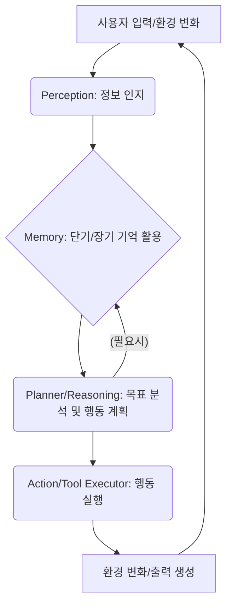

---

기존의 LLM 활용 패턴은 주로 단일 질의-응답 또는 RAG(Retrieval Augmented Generation)를 통한 정보 검색 및 요약에 초점을 맞춰왔습니다. 그러나 실제 비즈니스 환경에서는 사용자 요청이 복합적이고 다단계적인 경우가 많으며, 단순히 정보를 제공하는 것을 넘어 **능동적으로 문제를 해결하고, 목표를 달성하며, 심지어 예측 가능한 행동을 수행하는 AI 시스템**에 대한 요구가 커지고 있습니다. 프론트엔드/iOS 개발자의 관점에서 AI를 실무에 깊이 있게 적용하기 위해서는, 이러한 복잡성을 관리하고 AI의 자율성을 극대화할 수 있는 **자율 에이전트 아키텍처**에 대한 이해가 필수적입니다.

## 왜 에이전트 아키텍처인가? — 복잡성 관리와 자율성 증대

우리가 만드는 서비스는 사용자의 특정 목표 달성을 돕습니다. 예를 들어, 여행 계획 앱은 최저가 항공권 검색뿐만 아니라 숙소 예약, 현지 맛집 추천, 관광 일정 최적화 등 복합적인 단계를 거쳐야 합니다. 기존 방식으로는 이러한 각 단계를 사용자가 직접 명령하거나, 백엔드 로직이 일일이 분기 처리해야 했습니다.

자율 에이전트 아키텍처는 이러한 복잡성을 AI 스스로 관리하고, 더 나아가 사용자의 명시적인 지시 없이도 목표를 향해 나아갈 수 있도록 돕는 강력한 패러다임입니다. 이는 단순히 LLM에 프롬프트를 던지는 것을 넘어, LLM을 에이전트의 '두뇌'로 활용하여 **인지(Sense), 사고(Think), 행동(Act)**의 루프를 지속적으로 반복하게 함으로써 진정한 자율성을 부여합니다. 프론트엔드/iOS 개발자는 이러한 에이전트가 제공하는 높은 수준의 추상화된 기능을 API 형태로 소비하고, 이를 통해 더욱 지능적이고 개인화된 사용자 경험을 구현할 수 있게 됩니다.

## 자율 에이전트의 핵심 구성 요소: Sense-Think-Act 루프

모든 자율 에이전트는 `Sense-Think-Act`라는 기본적인 반복 루프를 통해 작동합니다. 이 루프는 에이전트가 환경을 인지하고, 그 정보를 바탕으로 다음 행동을 계획하며, 최종적으로 계획된 행동을 실행하는 과정을 나타냅니다.

| 컴포넌트      | 역할                                                                        | 주요 기술/패턴                                                                                                       |
| :------------ | :-------------------------------------------------------------------------- | :------------------------------------------------------------------------------------------------------------------ |
| **Perception (인지)** | 외부 환경(사용자 입력, 시스템 상태, 센서 데이터 등)을 감지하고 수집      | API 호출, 데이터 스트림 구독, 웹훅 수신, 프론트엔드 이벤트 리스닝                                                  |
| **Memory (기억)**     | 과거의 경험, 현재 작업 문맥, 장기 지식 등을 저장 및 관리                 | **단기 기억:** 현재 세션의 대화 로그, 작업 진행 상태 (Redis, 인메모리)<br />**장기 기억:** 벡터 데이터베이스(RAG), 관계형 DB, 지식 그래프 |
| **Planner/Reasoning (계획 및 추론)** | 인지된 정보와 기억을 바탕으로 목표 달성을 위한 최적의 행동 계획 수립 | LLM (Prompt Engineering, Chain-of-Thought), 추론 엔진, 스케줄링 알고리즘                                         |
| **Action/Tool Executor (행동 및 도구 실행)** | 계획된 행동을 실제 환경에서 실행하거나 외부 도구(API)를 호출        | Function Calling, 외부 API 연동, 데이터베이스 조작, 시스템 명령 실행                                              |

### Mermaid 다이어그램: 에이전트의 동작 흐름



## 실제 동작하는 코드 예제 (Python 기반 개념 스케치)

여기서는 자율 에이전트의 `Sense-Think-Act` 루프를 개념적으로 보여주는 Python 코드를 제시합니다. 실제 프로덕션에서는 LangChain, LlamaIndex 같은 프레임워크를 활용하여 더욱 견고하게 구현할 수 있습니다. 프론트엔드/iOS 앱은 이 에이전트와 HTTP API를 통해 상호작용하게 될 것입니다.

```python
import time
from typing import List, Dict, Any

# 외부 LLM 라이브러리를 가정한 임포트
# 실제로는 openai, anthropic 등의 SDK를 사용
class MockLLM:
    def chat_completion(self, messages: List[Dict], tools: List[Dict] = None) -> Dict:
        # LLM이 대화 내용과 사용 가능한 툴을 기반으로 응답 또는 툴 호출을 결정
        print(f"  [LLM Thinking] Messages: {messages[-1]['content']}")
        if "여행 계획" in messages[-1]['content'] and not any("book_flight" in m.get('name', '') for m in messages):
            # 여행 계획에 필요한 툴 호출 예시
            return {
                "tool_calls": [{
                    "id": "call_123",
                    "function": {
                        "name": "search_flights",
                        "arguments": '{"destination": "제주", "date": "2024-12-25"}'
                    }
                }]
            }
        elif "날씨" in messages[-1]['content']:
             return {
                "content": "현재 날씨 정보는 제공되지 않습니다. 특정 도시를 알려주세요."
            }
        else:
            return {"content": "무엇을 도와드릴까요?"}

# 외부 툴(Tool)을 가정한 클래스
class ToolExecutor:
    def __init__(self):
        self.available_tools = {
            "search_flights": self._search_flights,
            "book_hotel": self._book_hotel,
            "send_notification": self._send_notification,
            "get_flight_details": self._get_flight_details,
            "cancel_booking": self._cancel_booking
        }

    # 항공편 검색 도구
    def _search_flights(self, destination: str, date: str) -> str:
        print(f"  [Tool] Searching flights to {destination} on {date}...")
        time.sleep(1) # 네트워크 지연 시뮬레이션
        return f"제주행 {date} 항공편 검색 결과: 대한항공 10:00 (150,000원), 아시아나 11:00 (160,000원)."

    # 호텔 예약 도구
    def _book_hotel(self, location: str, check_in: str, check_out: str) -> str:
        print(f"  [Tool] Booking hotel in {location} from {check_in} to {check_out}...")
        time.sleep(1)
        return f"{location} 호텔 예약 완료. 예약번호: BK{hash(location)%10000:04d}"
    
    # 알림 전송 도구
    def _send_notification(self, user_id: str, message: str) -> str:
        print(f"  [Tool] Sending notification to user {user_id}: {message}")
        return "알림 전송 성공."

    # 항공편 상세 정보 조회 도구
    def _get_flight_details(self, flight_code: str) -> str:
        print(f"  [Tool] Fetching details for flight {flight_code}...")
        time.sleep(0.5)
        details = {
            "KE001": "대한항공 - 인천→제주 (10:00-11:20) - 180분 소요",
            "OZ002": "아시아나 - 인천→제주 (11:00-12:15) - 75분 소요"
        }
        return details.get(flight_code, "항공편 정보 없음")

    # 예약 취소 도구
    def _cancel_booking(self, booking_id: str) -> str:
        print(f"  [Tool] Cancelling booking {booking_id}...")
        time.sleep(0.5)
        return f"예약 {booking_id} 취소되었습니다. 환불이 진행 중입니다."

    # 도구 실행 메인 메서드
    def execute_tool(self, tool_call: Dict) -> Any:
        """도구 호출을 실행하고 결과를 반환합니다."""
        function_name = tool_call["function"]["name"]
        # 실제 앱에서는 json.loads() 사용 권장
        arguments = eval(tool_call["function"]["arguments"])
        
        if function_name in self.available_tools:
            try:
                result = self.available_tools[function_name](**arguments)
                return result
            except TypeError as e:
                raise ValueError(f"Tool '{function_name}' called with invalid arguments: {e}")
        else:
            raise ValueError(f"Unknown tool: {function_name}")

class AutonomousAgent:
    def __init__(self, agent_name: str, llm: MockLLM, tool_executor: ToolExecutor):
        self.name = agent_name
        self.llm = llm
        self.tool_executor = tool_executor
        self.memory: List[Dict] = [] # 단기 기억: 대화 로그

        # 에이전트가 사용할 수 있는 툴 정의 (LLM의 Function Calling을 위한 스키마)
        self.tools_schema = [
            {
                "type": "function",
                "function": {
                    "name": "search_flights",
                    "description": "특정 목적지와 날짜의 항공편을 검색합니다.",
                    "parameters": {
                        "type": "object",
                        "properties": {
                            "destination": {"type": "string", "description": "항공편 목적지"},
                            "date": {"type": "string", "description": "항공편 날짜 (YYYY-MM-DD)"}
                        },
                        "required": ["destination", "date"]
                    }
                }
            },
            {
                "type": "function",
                "function": {
                    "name": "book_hotel",
                    "description": "특정 위치에 호텔을 예약합니다.",
                    "parameters": {
                        "type": "object",
                        "properties": {
                            "location": {"type": "string", "description": "호텔 예약 위치"},
                            "check_in": {"type": "string", "description": "체크인 날짜 (YYYY-MM-DD)"},
                            "check_out": {"type": "string", "description": "체크아웃 날짜 (YYYY-MM-DD)"}
                        },
                        "required": ["location", "check_in", "check_out"]
                    }
                }
            },
            {
                "type": "function",
                "function": {
                    "name": "send_notification",
                    "description": "특정 사용자에게 알림 메시지를 보냅니다.",
                    "parameters": {
                        "type": "object",
                        "properties": {
                            "user_id": {"type": "string", "description": "알림을 받을 사용자 ID"},
                            "message": {"type": "string", "description": "전송할 메시지 내용"}
                        },
                        "required": ["user_id", "message"]
                    }
                }
            }
        ]

    def _sense(self, user_input: str):
        # 사용자 입력 및 환경 변화 인지
        print(f"\n[Agent {self.name}] User input detected: '{user_input}'")
        self.memory.append({"role": "user", "content": user_input})

    def _think_and_act(self, max_iterations: int = 5, iteration: int = 0) -> str:
        """
        LLM을 사용하여 추론 및 행동을 반복 실행합니다.
        
        1. LLM이 현재 상황을 분석
        2. 필요시 도구 호출 결정
        3. 도구 실행 결과를 메모리에 저장
        4. 최종 응답 또는 다음 행동 결정
        """
        # 무한 루프 방지
        if iteration >= max_iterations:
            return "최대 반복 횟수 도달. 작업을 마칩니다."
        
        # LLM을 사용하여 추론 및 행동 계획
        llm_response = self.llm.chat_completion(self.memory, self.tools_schema)
        print(f"  [Agent {self.name}] LLM Response (Iteration {iteration+1}/{max_iterations})")
        
        # 툴 호출이 필요한 경우
        if "tool_calls" in llm_response and llm_response["tool_calls"]:
            for tool_call in llm_response["tool_calls"]:
                try:
                    # 도구 실행
                    tool_output = self.tool_executor.execute_tool(tool_call)
                    
                    # 실행 결과를 메모리에 저장 (피드백 루프)
                    self.memory.append({
                        "role": "tool",
                        "tool_call_id": tool_call["id"],
                        "name": tool_call["function"]["name"],
                        "content": str(tool_output)
                    })
                    print(f"  [Agent {self.name}] Tool '{tool_call['function']['name']}' executed.")
                    print(f"    Output: {tool_output}")
                    
                    # 도구 실행 결과를 LLM에 피드백하여 다음 행동 추론
                    # 재귀 호출로 에이전트가 계속 사고하고 행동
                    return self._think_and_act(max_iterations, iteration + 1)
                    
                except Exception as e:
                    # 도구 실행 실패 처리
                    error_message = f"Error executing tool {tool_call['function']['name']}: {str(e)}"
                    self.memory.append({
                        "role": "tool",
                        "tool_call_id": tool_call["id"],
                        "name": tool_call["function"]["name"],
                        "content": error_message
                    })
                    print(f"  [Agent {self.name}] {error_message}")
                    
                    # 에러를 메모리에 저장하고 LLM에 다시 물어보기
                    return self._think_and_act(max_iterations, iteration + 1)
        
        # 툴 호출 없이 LLM이 직접 최종 응답하는 경우
        else:
            agent_response = llm_response.get("content", "처리할 수 없습니다.")
            self.memory.append({"role": "assistant", "content": agent_response})
            print(f"  [Agent {self.name}] Final Response: '{agent_response}'")
            return agent_response

    def run(self, user_input: str) -> str:
        self._sense(user_input)
        return self._think_and_act()

# 에이전트 실행 예시
if __name__ == "__main__":
    llm_model = MockLLM()
    tool_exec = ToolExecutor()
    travel_agent = AutonomousAgent("TravelBuddy", llm_model, tool_exec)

    print("=" * 60)
    print("자율 에이전트 실행 예시: Sense-Think-Act 루프")
    print("=" * 60)
    
    # 사용 사례 1: 항공편 검색 (도구 호출 필요)
    print("\n[사용 사례 1] 항공편 검색 요청")
    print("-" * 60)
    response1 = travel_agent.run("제주도 2024년 12월 25일 항공편 찾아줘")
    print(f"\n최종 응답: {response1}\n")
    
    # 사용 사례 2: 일반 질문 (도구 호출 불필요)
    print("[사용 사례 2] 일반 상담")
    print("-" * 60)
    response2 = travel_agent.run("오늘 점심 뭐 먹지?")
    print(f"\n최종 응답: {response2}\n")
    
    # 사용 사례 3: 복합 작업 (알림 전송)
    print("[사용 사례 3] 알림 요청")
    print("-" * 60)
    response3 = travel_agent.run("나한테 '회의 10분 전'이라고 알림 보내줘 (내 ID는 user123)")
    print(f"\n최종 응답: {response3}\n")
    
    # 에이전트의 메모리(대화 기록) 출력
    print("=" * 60)
    print("에이전트 메모리 (Sense-Think-Act 내역)")
    print("=" * 60)
    for i, msg in enumerate(travel_agent.memory, 1):
        role = msg.get("role", "unknown")
        content = msg.get("content", "")[:100]  # 처음 100자만 출력
        print(f"[{i}] {role}: {content}...")

```

이 코드 예제에서 `AutonomousAgent`는 사용자 입력(`_sense`)을 받아 `_think_and_act` 메서드에서 LLM을 호출합니다. LLM은 현재의 대화 맥락(`self.memory`)과 사용할 수 있는 도구(`self.tools_schema`)를 바탕으로 다음 행동(응답 생성 또는 도구 호출)을 결정합니다. 도구 호출이 필요한 경우 `ToolExecutor`를 통해 실제 기능을 수행하고, 그 결과를 다시 LLM에 전달하여(메모리에 추가) 최종적인 응답을 생성합니다. 이 과정은 프론트엔드/iOS 앱에서 API 호출을 통해 시작되며, 최종 응답을 받아 UI에 표시하게 됩니다.

## 실무 적용 패턴 및 2026년 최신 트렌드

자율 에이전트 아키텍처는 2026년이 되면 더욱 보편화되고 고도화될 것입니다. 프론트엔드/iOS 개발자가 실무에 적용할 수 있는 구체적인 패턴과 예상되는 트렌드는 다음과 같습니다.

### 1. Proactive Personalization (선제적 개인화)
*   **패턴:** 에이전트가 사용자 행동 패턴, 선호도, 과거 이력을 분석하여 다음에 필요한 것을 예측하고 먼저 제안하는 방식.
*   **사례:** 쇼핑 앱에서 사용자의 검색 기록과 장바구니 데이터를 바탕으로 "이 상품과 함께 구매하면 좋은 제품"을 미리 추천하거나, 사용자 선호 시간에 맞춰 세일 정보를 알림으로 제공. iOS에서는 Apple Intelligence가 기기 내에서 사용자의 컨텍스트를 학습하고 개인화된 제안을 앱에 제공하는 형태로 나타날 수 있습니다.

### 2. Adaptive Workflow Automation (적응형 워크플로우 자동화)
*   **패턴:** 에이전트가 반복적인 사용자 작업을 학습하고, 이를 자동화하여 사용자 개입을 최소화하는 방식.
*   **사례:** 비즈니스 협업 도구에서 "오후 5시 회의록 자동 초안 작성 및 참석자에게 공유"와 같은 루틴을 에이전트가 스스로 학습하고 실행. 사용자가 "이메일 초안 작성" 명령을 내리면, 에이전트가 사용자의 이전 이메일 스타일과 내용 패턴을 기반으로 맞춤형 초안을 생성.

### 3. Human-in-the-Loop Collaboration (인간 참여형 협업)
*   **패턴:** 에이전트가 복잡한 결정을 내리기 전에 인간의 검토나 승인을 요청하고, 피드백을 통해 학습하며 점차 자율성을 높여가는 방식. AI의 자율성과 인간의 통제 사이의 균형을 맞추는 중요한 2026년 트렌드입니다.
*   **사례:** 재무 앱에서 에이전트가 투자 포트폴리오 재조정 제안을 만들면, 사용자에게 알림을 보내 최종 승인을 받고 실행. 에이전트가 생성한 UI 흐름이나 콘텐츠를 프론트엔드에서 먼저 프리뷰로 보여주고 사용자가 수정할 수 있게 함.

### 4. Contextual UI Generation (상황 인지형 UI 생성)
*   **패턴:** 에이전트가 사용자의 현재 목표, 맥락, 그리고 사용 가능한 도구를 바탕으로 동적으로 필요한 UI 컴포넌트나 정보 흐름을 제안하거나 생성.
*   **사례:** 모바일 뱅킹 앱에서 사용자가 "대출 신청"이라고 말하면, 에이전트가 필요한 서류 목록, 진행 단계 등을 포함한 맞춤형 UI 흐름을 생성하여 보여줌. 이는 프론트엔드에서 에이전트의 응답에 따라 동적으로 컴포넌트를 렌더링하거나 특정 뷰로 네비게이션하는 방식으로 구현될 수 있습니다.

### 5. Multi-Modal Interaction Agents (다중 모달 인터랙션 에이전트)
*   **트렌드:** 텍스트뿐만 아니라 음성, 이미지, 비디오 등 다양한 형태의 입력을 처리하고, 이에 기반한 행동을 수행하는 에이전트가 주류가 될 것입니다.
*   **사례:** 사용자가 찍은 음식 사진을 보고 레시피를 추천하거나, 특정 공간의 사진을 기반으로 가구 배치 아이디어를 제공하는 에이전트. iOS 앱에서는 카메라, 마이크, 센서 데이터 등 기기의 다양한 모달리티를 에이전트의 'Perception' 레이어로 활용하게 됩니다.

### 프론트엔드/iOS 개발자의 역할과 기회

자율 에이전트 아키텍처는 프론트엔드/iOS 개발자에게 새로운 도전과 기회를 제공합니다.
*   **API 소비 및 UI 연동:** 에이전트가 제공하는 복잡한 API를 효과적으로 호출하고, 에이전트의 상태 변화(예: 특정 작업을 진행 중, 사용자 입력 대기 중, 결과 생성 완료)를 UI에 직관적으로 반영하는 방법을 설계해야 합니다.
*   **피드백 루프 설계:** 사용자의 피드백(명시적 좋아요/싫어요, 암묵적 행동 패턴)을 에이전트에 다시 전달하여 에이전트가 지속적으로 학습하고 개선될 수 있도록 하는 피드백 메커니즘을 구축하는 것이 중요합니다.
*   **클라이언트 측 인텔리전스 활용:** Apple Intelligence와 같은 기기 내 인텔리전스를 활용하여, 개인화된 에이전트 기능을 클라이언트 측에서 구현하거나 서버 측 에이전트와 연동하는 전략을 수립할 수 있습니다.
*   **에이전트 제어 UI:** 에이전트가 너무 자율적이어서 생길 수 있는 오작동이나 사용자 의도와의 불일치를 방지하기 위해, 사용자에게 에이전트의 작동을 일시 중지하거나, 목표를 수정하거나, 특정 단계를 건너뛸 수 있는 제어권을 제공하는 UI/UX 설계가 중요해집니다.

자율 에이전트는 AI 시스템이 단순히 정보를 제공하는 것을 넘어, 사용자의 실제 문제를 해결하고 가치를 창출하는 데 핵심적인 역할을 할 것입니다. 프론트엔드/iOS 개발자들은 이 새로운 패러다임을 이해하고 활용함으로써, 더욱 혁신적이고 지능적인 애플리케이션을 만들어낼 수 있을 것입니다.

---

## AI Agent Directive

**Trigger**: AI 에이전트가 사용자를 대신해 자율적으로 목표를 달성해야 할 때. 특히 다단계 작업(정보 수집 → 판단 → 행동 실행)을 처리해야 하는 경우.

**Prerequisites**: 
- [prompt-engineering/chain-of-thought](/wiki/prompt-engineering/chain-of-thought) — 추론 단계 체계화
- [agents/tool-use](/wiki/agents/tool-use) — 외부 도구 호출 방식

### Actionable Steps
1. 에이전트의 **Sense(인지)** 단계에서 필요한 데이터/환경 정보 정의 (API 호출, 센서 데이터, 사용자 입력 등)
2. **Memory** 구조 설계: 단기 기억(현재 세션 컨텍스트)과 장기 기억(벡터 DB, 관계형 DB) 분리
3. **Planner/Reasoning** 단계에서 LLM이 사용할 프롬프트 작성. 목표, 제약, 사용 가능한 도구 명시
4. **Tool/Action Executor** 구현: 에이전트가 호출할 함수 목록 및 스키마 정의 (Function Calling 형식)
5. **루프 닫기**: 도구 실행 결과를 다시 메모리에 저장하고 LLM에 피드백. 재귀적 추론 활성화
6. **Human-in-the-Loop** 지점 추가: 중요 의사결정 단계에서 사용자 승인 요청 (과신 방지)
7. 에이전트 상태 변화를 UI에 반영 (대기 → 실행 중 → 결과 생성 완료)

### Anti-patterns
- 에이전트에 너무 많은 도구 노출 (혼란 증가, hallucination 위험)
- 도구 설명이 모호하거나 복잡 (LLM이 잘못된 도구 선택)
- 에이전트 자율성만 강조하고 인간 통제 메커니즘 부재 (위험 증가)
- 단기/장기 메모리 구분 없이 모든 정보 섞기 (컨텍스트 오염)

---

## 자기 점검

1.  자율 에이전트 아키텍처가 기존의 단순 LLM 직접 활용 방식(예: 단일 프롬프트 질의-응답)과 다른 주요 특징은 무엇인가요?
2.  에이전트의 `Sense-Think-Act` 루프를 구성하는 핵심 컴포넌트들을 설명하고, 각 컴포넌트가 어떤 역할을 하는지 서술하세요.
3.  프론트엔드/iOS 개발자가 에이전트 기반 시스템과 상호작용할 때, 사용자 경험을 최적화하기 위해 고려해야 할 UI/UX 설계 관점은 무엇인가요? 최소 2가지 이상 제시하세요.
4.  2026년 최신 트렌드 중 `Human-in-the-Loop Collaboration`이 중요한 이유와, 이를 프론트엔드/iOS 앱에 적용할 수 있는 구체적인 사례를 설명해 보세요.

**이 개념을 동료에게 설명한다면?** 당신의 팀이 복잡한 고객 지원 챗봇을 만들려고 합니다. 이 챗봇이 단순히 질문에 답변하는 것을 넘어, 고객의 문제를 파악하고 필요한 정보를 수집하며, 심지어 외부 시스템에 연결하여 문제를 해결하는 자율 에이전트처럼 동작하게 만들고 싶다고 가정해 봅시다. 당신이라면 에이전트 아키텍처의 어떤 점을 강조하며 팀원들을 설득할 것인가요? (예: `Sense-Think-Act` 루프를 통해 어떻게 자율성이 확보되는지, 기존 방식의 한계점을 에이전트가 어떻게 극복하는지 등)

**실습 과제:** 간단한 할 일(Todo) 관리 애플리케이션에 자율 에이전트 개념을 적용한다고 가정해 봅시다. "오늘의 할 일 중 가장 중요한 것을 파악하고, 아직 완료되지 않았다면 사용자에게 알림을 보내라"는 목표를 가진 에이전트의 `Sense-Think-Act` 루프 각 단계에서 어떤 동작이 일어나야 할지 의사 코드(pseudocode) 또는 단계별 설명으로 작성해 보세요. (예: `Perception` 단계에서는 어떤 정보를 인지할 것인지, `Planner` 단계에서는 어떤 결정을 내릴 것인지 등)
