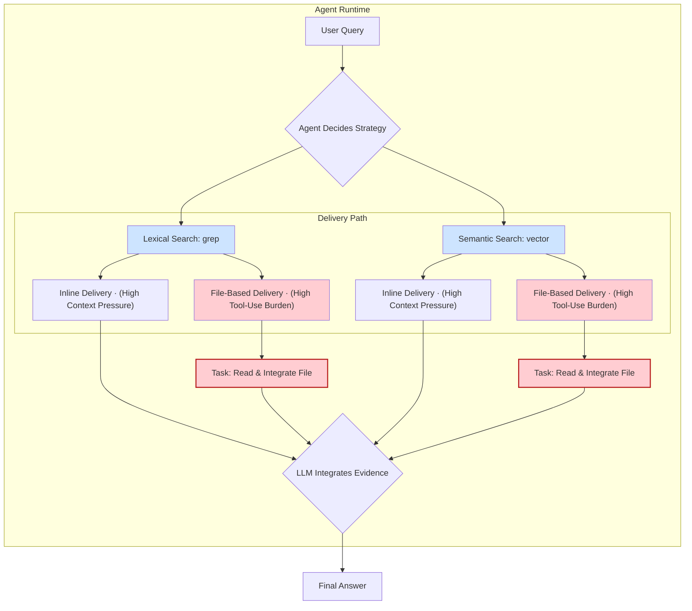

> 이 엔트리는 "에이전트 검색은 런타임 문제다"라는 명제를 다룬다. 직접 근거는 arXiv 논문 [Is Grep All You Need? How Agent Harnesses Reshape Agentic Search](https://arxiv.org/abs/2605.15184) (Sahil Sen 등)이며, Blake Crosley의 에이전트 하네스 관련 글들(예: [HTML Is the Format AI Agents Want](https://blakecrosley.com/blog/html-is-the-format-agents-want))이 같은 주장을 정리하고 있다.

이 글의 핵심은 **검색 품질은 검색기(retriever)가 아니라 런타임(runtime)에 있다**는 것이다. 즉 어떤 검색 알고리즘을 쓰느냐보다, 그것을 감싸는 하네스 — 프롬프트 모양, 도구 인터페이스, 결과 포맷, 전달 경로, 재시도 동작 — 가 성능을 더 크게 좌우한다.

### 왜 중요한가

AI 에이전트 개발 시 "어떤 검색 기술(Lexical vs. Vector)이 더 나은가?"는 흔한 질문이다. 그러나 이 질문은 문제의 핵심을 놓치고 있다. **검색 성능은 검색 알고리즘 자체보다 그것을 감싸는 전체 '런타임(Runtime)'에 의해 더 크게 좌우된다**는 것이 논문과 후속 정리 글들의 공통된 주장이다.

런타임이란 프롬프트, 도구 인터페이스, 셸 환경, 결과 포맷팅, 컨텍스트 압박, 결과 전달 경로, 재시도 로직 등 모델이 도구를 사용하고 결과를 해석하는 전체 시스템을 의미한다. 단순히 검색기(Retriever)만 교체하고 벤치마킹하는 것은 반쪽짜리 테스트에 불과하며, 실제 에이전트의 성능을 보장하지 못한다.

### 핵심 패턴

#### 1. 런타임의 영향력이 검색기 자체를 압도한다

동일한 모델과 데이터셋을 사용하더라도, 에이전트가 어떤 런타임(Harness) 위에서 동작하는지에 따라 결과가 크게 달라졌다고 보고된다.

- **보고된 패턴**: 같은 모델에 같은 `inline grep` 검색을 붙여도, 어떤 하네스(커스텀 런타임 vs 네이티브 CLI) 위에서 돌리느냐에 따라 정답률이 수십 %p 단위로 벌어졌다.

이는 검색 알고리즘이 같아도 프롬프팅, 도구 호출 방식, 결과 파싱 등 런타임의 차이가 큰 성능 격차를 만들었음을 의미한다. 검색기만 독립적으로 평가해서는 안 되며, 반드시 최종 에이전트 시스템과 결합하여 평가해야 한다.

> 구체 수치는 원 논문 표를 직접 참조하라. 여기서 중요한 것은 절대값이 아니라 "검색기 고정 · 런타임만 교체"만으로도 정답률이 크게 흔들린다는 방향성이다.

#### 2. 결과 전달 경로는 그 자체로 하나의 '과업'이다

검색 결과를 모델에게 전달하는 방식은 단순한 구현 디테일이 아니다. 이는 모델에게 새로운 과업을 부여하며, 성능에 결정적인 영향을 미친다.

- **Inline Delivery**: 검색 결과를 프롬프트에 직접 삽입한다. 컨텍스트 윈도우를 많이 차지하지만 모델이 즉시 정보를 활용할 수 있다.
- **File-Based (Programmatic) Delivery**: 결과를 파일에 저장하고 파일 경로를 알려준다. 모델은 파일을 직접 열고, 읽고, 필요한 정보를 추출하는 추가적인 도구 사용(Tool-Use) 과업을 수행해야 한다.

이 방식의 트레이드오프는 명확하다.

- **보고된 패턴**: 동일 CLI 환경에서 같은 `grep`을 써도, 결과를 `inline`으로 주입할 때와 `file-based`로 넘길 때의 정답률 차이가 매우 컸다. 파일 기반에서는 "찾고·열고·읽고·통합하는" 추가 도구 사용 루프가 새 실패 지점이 되어 정답률이 크게 떨어지는 경향이 관찰됐다.

파일 기반 전달은 컨텍스트 압박을 줄여줄 수 있지만, "파일을 찾고, 열고, 읽고, 통합하는" 과정에서 실패할 위험이 크다. 이 도구 사용 루프(Tool-loop)를 안정적으로 닫을 수 있는 런타임이 아니라면, 강력한 검색기도 무용지물이 될 수 있다.

#### 3. `grep`은 여전히 강력한 베이스라인이다

"Vector by default" 접근법은 특정 상황에서 위험할 수 있다. 특히 긴 대화 기록에서 이름, 날짜, 고유명사 등 **문자 그대로의 정보(literal spans)**를 찾아야 하는 QA 작업에서는 `grep`과 같은 어휘 검색(Lexical Search)이 의미 검색(Semantic Search)을 능가했다.

논문이 보고한 방향성은 일관됐다. 여러 하네스-모델 조합에 걸쳐, 같은 검색기를 inline으로 전달했을 때 `grep`(어휘 검색)이 `vector`(의미 검색)보다 일관되게 높은 정답률을 보였다.

| Harness-Model 조합 | Inline `grep` | Inline `vector` |
| ------------------ | ------------- | --------------- |
| 커스텀 런타임      | grep 우세     | grep 대비 하락  |
| 프로바이더 CLI A   | grep 우세     | grep 대비 하락  |
| 프로바이더 CLI B   | grep 우세     | grep 대비 하락  |

> 정확한 정답률 수치와 모델/CLI 식별자는 원 논문(arXiv 2605.15184) 표를 참조하라. 위 표는 "어휘 검색이 의미 검색을 능가하더라"는 방향성만 보존한 요약이다.

물론 이 결과가 벡터 DB가 불필요하다는 뜻은 아니다. 저자들도 이 결론이 '긴 대화 기록 기반 QA'라는 특정 환경에 한정된다고 본다. 핵심은 **어휘 검색을 진지한 베이스라인으로 유지하고, 상황에 맞는 최적의 도구를 선택할 수 있는 런타임을 구축**해야 한다는 점이다.



### 실전 적용: `aidy` 프로젝트의 검색 시스템 설계

`aidy`는 사용자의 과거 대화나 프로젝트 문서를 기반으로 질문에 답하는 기능이 필요하다. 이 글의 교훈을 `aidy`에 적용한다면 다음과 같은 아키텍처를 고려할 수 있다.

#### 1. 런타임을 명시적으로 설계하기

검색 시스템 인터페이스를 설계할 때, 검색 방식뿐만 아니라 '전달 방식'을 명시적인 파라미터로 포함한다.

```typescript
// aidy/src/core/search/types.ts

export enum SearchDeliveryMethod {
  INLINE = 'inline', // 결과를 컨텍스트에 직접 주입
  FILE_ARTIFACT = 'file_artifact', // 결과를 파일로 저장하고 경로 반환
}

export interface SearchRequest {
  query: string;
  targetCorpus: 'chatHistory' | 'projectDocs';
  deliveryMethod: SearchDeliveryMethod;
}

export interface SearchResult {
  content?: string; // INLINE 방식일 때 사용
  filePath?: string; // FILE_ARTIFACT 방식일 때 사용
  metadata: Record<string, any>;
}

export interface SearchProvider {
  search(request: SearchRequest): Promise<SearchResult>;
}
```

#### 2. 두 가지 검색 전략을 모두 구현하고 벤치마킹하기

`grep`의 유효성이 입증되었으므로, `aidy`의 문서 검색 시스템에 어휘 검색과 의미 검색을 모두 구현한다.

```typescript
// aidy/src/core/search/LexicalSearchProvider.ts
import { exec } from 'child_process';
import { SearchProvider, SearchRequest, SearchResult } from './types';

export class LexicalSearchProvider implements SearchProvider {
  async search(request: SearchRequest): Promise<SearchResult> {
    // 실제로는 ripgrep (rg) 같은 고성능 도구 사용
    const command = `rg --json "${request.query}" /path/to/${request.targetCorpus}`;
    const rawResults = await this.executeCommand(command);

    if (request.deliveryMethod === 'file_artifact') {
      const filePath = await this.writeResultsToFile(rawResults);
      return { filePath, metadata: { tool: 'ripgrep' } };
    } else {
      const inlineContent = this.formatForInline(rawResults);
      return { content: inlineContent, metadata: { tool: 'ripgrep' } };
    }
  }
  // ... (helper methods)
}
```

#### 3. 전체 시스템을 함께 벤치마킹하기

`aidy`의 QA 성능을 평가할 때, 검색기만 단독으로 테스트하지 않는다. 아래 4가지 조합을 모두 테스트하고 정답률, 비용, 속도를 종합적으로 측정해야 한다.

1.  **Lexical + Inline**: 간단한 사실 확인에 빠르고 정확할 것으로 기대.
2.  **Lexical + File**: 검색 결과가 매우 클 때 컨텍스트 오염을 막지만, 모델의 파일 처리 능력에 의존.
3.  **Vector + Inline**: 개념적, 유추적 질문에 강하지만, 관련 없는 정보가 섞일 위험.
4.  **Vector + File**: Vector 검색의 방대한 결과를 파일로 분리하여 컨텍스트를 절약.

이러한 체계적인 벤치마킹을 통해, `aidy`는 특정 질문 유형과 상황에 맞춰 동적으로 최적의 `(검색기, 전달 방식)` 조합을 선택하는 라우팅 로직을 개발할 수 있다. 이는 단순한 검색기 교체보다 훨씬 더 강건하고 신뢰도 높은 시스템으로 이어진다.
