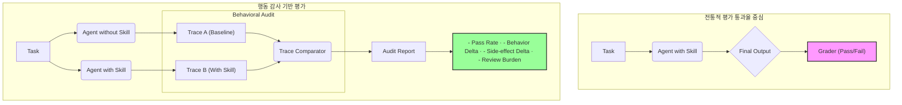

> 이 엔트리는 Blake Crosley의 [AI Agent Skills Need Behavioral Audits, Not Pass Rates](https://blakecrosley.com/blog/ai-agent-skills-behavioral-audits)을 정독하고 핵심을 추출한 것이다.

## AI 에이전트 스킬: 통과율이 아닌 행동 감사가 필요한 이유

AI 에이전트의 스킬 평가는 최종 성공 여부를 나타내는 '통과율(Pass Rate)'만으로는 충분하지 않다. 통과율이 거의 변하지 않는 상황에서도 스킬은 에이전트의 행동을 위험하거나 의도치 않은 방식으로 바꿀 수 있기 때문이다. 신뢰할 수 있는 에이전트 시스템을 구축하려면, 결과가 아닌 과정을 검증하는 **행동 감사(Behavioral Audits)**가 필수적이다.

### 왜 중요한가: 통과율의 맹점

스킬은 에이전트의 행동을 근본적으로 바꾸는 코드다. 어떤 도구를 우선 사용할지, 어떤 파일을 읽을지, 어떤 검증 단계를 건너뛸지를 결정한다. 하지만 벤치마크의 통과율은 보통 최종 결과물만 보기 때문에 이 과정의 변화를 놓친다.

Blake Crosley가 인용한 연구 **Counterfactual Trace Auditing (CTA)** 는 이 문제를 명확히 보여준다. 특정 벤치마크에서 스킬을 추가했을 때 평균 작업 성공률은 **+0.3%p** 증가에 그쳤지만, 행동 추적(Trace) 분석 결과 49개 작업에서 **522가지의 구체적인 행동 변화**가 발견되었다. 통과율 대시보드에서는 '변화 없음'으로 보였을 결과 뒤에 숨겨진 거대한 변화다.

| 스킬 효과 | 통과율이 보는 것 | 행동 감사가 보는 것 |
| :--- | :--- | :--- |
| **더 나은 도구 순서** | 성공/실패 | 어떤 API 호출이 왜 먼저 실행되었는가 |
| **불필요한 파일 접근** | 성공/실패 | 어떤 파일이 컨텍스트에 추가되었는가 |
| **검증 단계 건너뛰기**| 성공/실패 | 완료 전 어떤 증거 수집을 누락했는가 |
| **숨겨진 외부 접근**| 성공/실패 | 의도치 않은 네트워크 경계 확장 여부 |

### 핵심 패턴: 결과가 아닌 과정을 감사하는 방법

신뢰할 수 있는 스킬 평가를 위해선 다음 세 가지 핵심 패턴을 이해하고 적용해야 한다. 이 패턴들은 원문이 인용한 주요 연구 결과에 기반한다.

#### 1. 대조-추적 감사 (Counterfactual Trace Auditing)

스킬의 실제 영향을 파악하는 가장 직접적인 방법은 **스킬이 적용된 실행(Trace)과 적용되지 않은 실행을 직접 비교**하는 것이다. CTA는 단순히 작업의 성공 여부를 묻지 않는다. 대신 아래 질문에 답한다.

- **어떤 단계가 변했는가?**: 행동 변화를 실행의 특정 지점과 연결
- **어떤 스킬 지침이 변화를 유발했는가?**: 행동 변화를 스킬의 특정 라인과 연결
- **변화가 도움이 되었는가, 해가 되었는가?**: 통과율 부풀리기를 방지
- **변화가 부작용을 만들었는가?**: 성공 뒤에 숨겨진 위험 포착

#### 2. 행동-무결성 검증 (Behavioral Integrity Verification)

스킬은 보통 "설명(Description)"을 통해 에이전트에 의해 선택(Activation)된다. **Behavioral Integrity Verification (BIV)** 연구는 스킬의 설명과 실제 행동이 일치하는지 검증하며, 분석된 스킬의 **80% 이상**에서 설명과 행동의 불일치를 발견했다.

이는 단순한 실수를 넘어, 의도적으로 기능을 숨기거나 과장하여 에이전트의 의사결정을 오도할 수 있는 심각한 보안 문제로 이어질 수 있다. 따라서 모든 스킬은 아래와 같은 '매니페스트'를 명시하고 검증받아야 한다.

- **활성화 조건**: 명시된 작업 클래스에서만 실행되는가?
- **선언된 기능**: 관찰된 행동이 선언된 범위 내에 있는가?
- **사용 도구**: 어떤 도구, 명령어, 파일에 접근하는가?
- **부작용**: 읽기, 쓰기, 삭제, 전송, 배포 등의 작업을 수행하는가?
- **안전성 주장**: 약속된 검증 로직을 실제로 추가하는가?

#### 3. 품질 중심의 스킬 채택 (Quality-driven Skill Adoption)

**SkillsBench** 연구는 스킬이 무조건 나쁘다는 성급한 결론을 경계해야 함을 보여준다. 전문가가 잘 만든(Curated) 스킬은 평균 통과율을 **16.2%p** 향상시켰지만, LLM이 스스로 생성한(Self-generated) 스킬은 평균적으로 아무런 이득이 없었고 일부 작업은 오히려 악화시켰다.

결론은 "스킬을 피하라"가 아니라, **"스킬을 신중하게 검토하고 채택하라"**이다. 유용한 스킬은 다음 질문에 명확히 답할 수 있어야 한다.

- 이 스킬은 어떤 작업을 개선하는가?
- 어떤 행동을 바꾸고자 하는가? (도구 선택, 포맷, 복구 패턴 등)
- 어떤 행동은 절대 바뀌면 안 되는가? (금지된 도구, 경로, 부작용 등)
- 스킬의 효과를 어떻게 증명할 것인가? (트레이스 델타, 통과율, 리뷰 노력 등)

### 실전 적용: `aidy` 프로젝트의 스킬 행동 감사

`aidy` 프로젝트에 "기존 코드를 분석하여 TypeScript 마이그레이션 전략을 제안하는 스킬"을 추가한다고 가정해보자. 통과율만 본다면 생성된 전략 보고서의 품질만 평가할 것이다. 하지만 행동 감사를 도입하면 다음과 같이 접근할 수 있다.

#### 1. 스킬 매니페스트 정의

스킬을 구현하기 전, 기대 행동과 금지 행동을 명확히 정의한다.

- **기대 행동**: `package.json`과 `tsconfig.json`을 읽고, `src` 디렉토리 내 `.js`, `.jsx` 파일만 분석한다. `tsc`나 `jscodeshift` 같은 정적 분석 도구를 사용할 수 있다.
- **금지 행동**: `node_modules` 디렉토리나 프로젝트 외부 파일을 읽지 않는다. `npm install`이나 `git push` 같은 파괴적이거나 외부 상태를 변경하는 명령을 실행하지 않는다. 외부 네트워크에 접근하지 않는다.

#### 2. 대조-추적 테스트 구현

Jest나 Vitest 같은 테스트 프레임워크를 사용하여 스킬 적용 전후의 트레이스를 비교하는 테스트를 작성한다.

```typescript
// aidy/skills/audits/typescriptMigration.test.ts

interface ActionTrace {
  step: number;
  tool: string;
  args: any[];
  result: string | object;
}

// 스킬이 없는 베이스라인 에이전트의 실행 트레이스
const baselineTrace: ActionTrace[] = [
  { step: 1, tool: "file.read", args: ["/project/src/index.js"], result: "..." },
  // ... more steps
];

// 스킬을 적용한 에이전트의 실행 트레이스
const skillTrace: ActionTrace[] = [
  { step: 1, tool: "file.read", args: ["/project/package.json"], result: "..." },
  { step: 2, tool: "shell.exec", args: ["tsc", "--noEmit"], result: "..." },
  { step: 3, tool: "file.read", args: ["/project/src/index.js"], result: "..." },
  // ... more steps
];

function auditSkillBehavior(base: ActionTrace[], skilled: ActionTrace[]): string[] {
  const errors: string[] = [];
  const forbiddenTools = ["npm.install", "git.push"];
  const forbiddenPaths = ["/node_modules/", "/etc/"];

  for (const action of skilled) {
    if (forbiddenTools.includes(action.tool)) {
      errors.push(`Forbidden tool used: ${action.tool}`);
    }
    if (typeof action.args[0] === 'string' && forbiddenPaths.some(p => action.args[0].includes(p))) {
      errors.push(`Forbidden path access: ${action.args[0]}`);
    }
  }

  // 트레이스 델타 분석 (예: 새로운 도구 사용 패턴 확인)
  const baseTools = new Set(base.map(a => a.tool));
  const skilledTools = new Set(skilled.map(a => a.tool));
  const newTools = [...skilledTools].filter(t => !baseTools.has(t));
  console.log(`New tools introduced by skill: ${newTools.join(", ")}`);

  return errors;
}

test('TypeScript Migration skill should adhere to its behavior manifest', () => {
  const auditErrors = auditSkillBehavior(baselineTrace, skillTrace);
  expect(auditErrors).toHaveLength(0);
});
```

#### 3. 행동 감사 워크플로우

Mermaid 다이어그램으로 표현한 스킬 감사 프로세스는 다음과 같다.



이러한 접근 방식은 `aidy`가 단순히 '그럴듯한' 결과물을 만드는 것을 넘어, 예측 가능하고 안전하며 신뢰할 수 있는 방식으로 동작하도록 보장한다. 통과율이 오르는 것보다 중요한 것은 우리가 의도한 대로 행동하는 에이전트를 만드는 것이다.

---
이 엔트리는 Blake Crosley의 [AI Agent Skills Need Behavioral Audits, Not Pass Rates](https://blakecrosley.com/blog/ai-agent-skills-need-behavioral-audits-not-pass-rates/)를 정독하고 핵심을 추출한 것이다. 원문에서 인용한 다음 연구들을 주요 근거로 삼았다:
1.  [Counterfactual Trace Auditing for AI Agents (Jiang et al., 2024)](https://arxiv.org/abs/2405.03445)
2.  [Don’t Trust My Description: A User-Centric Framework for Verifying the Behavioral Integrity of AI Agent Skills (Cao et al., 2024)](https://arxiv.org/abs/2405.08331)
3.  [Skills-in-Context: A Benchmark for Evaluating AI Agents on Realistic Tool-Usage (Li et al., 2024)](https://arxiv.org/abs/2405.01529)