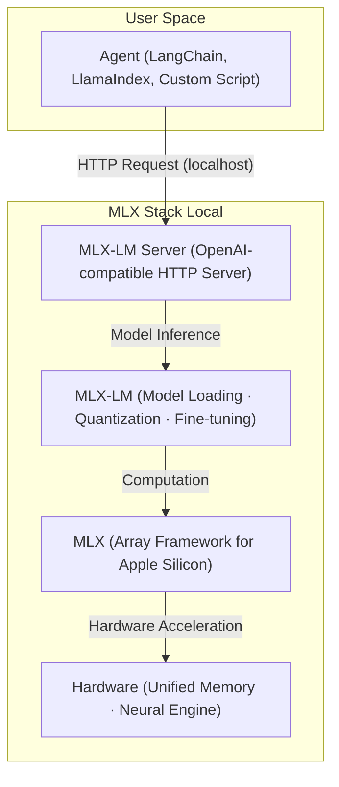

> 이 엔트리는 Blake Crosley의 [Running Agentic AI on the Mac with MLX](https://blakecrosley.com/blog/agentic-ai-mac-mlx)을 정독하고 핵심을 추출한 것이다.

이 엔트리는 Blake Crosley의 [Running Agentic AI on the Mac with MLX](https://blakecrosley.com/blog/agentic-ai-on-mac-with-mlx/)를 정독하고 핵심을 추출한 것이다. 블로그 글은 가상의 WWDC 2026 세션(232, 233 등)을 기반으로 Apple의 로컬 에이전틱 AI 스택을 설명한다.

## 왜 중요한가: 온디바이스 AI의 최종 진화

지금까지 AI 에이전트는 OpenAI나 Anthropic 같은 클라우드 API에 의존했다. 이는 비용(토큰당 과금), 개인정보보호(데이터 외부 전송), 네트워크 지연이라는 명확한 한계를 가졌다.

Apple의 MLX 스택은 이 문제를 정면으로 해결한다. **에이전트의 '생각하는' 부분, 즉 추론-도구호출-관찰-재추론으로 이어지는 '에이전틱 루프(Agentic Loop)' 전체를 Mac에서 로컬로 실행**하는 것이 핵심이다. 이는 API 키, 클라우드 종속성, 토큰 비용 없이 강력한 AI 에이전트를 구축할 수 있는 새로운 패러다임을 제시한다. 이제 개발자의 코드, 기업의 민감한 데이터가 Mac을 떠나지 않고도 AI의 도움을 받을 수 있다.

## 핵심 패턴: 로컬 에이전트를 위한 Apple의 4가지 설계

Apple은 단순한 모델 실행을 넘어, 에이전트 구축에 필요한 스케일링, 보안, 디버깅까지 아우르는 통합된 엔지니어링 환경을 제공한다. 이 모든 것은 WWDC 2026 세션 4개에 걸쳐 소개된 내용에 기반한다.

### 패턴 1: OpenAI 호환성을 활용한 4계층 로컬 스택

Apple은 기존 AI 생태계와의 호환성을 최우선으로 고려했다. 개발자는 새로운 프레임워크를 배울 필요 없이, 기존 OpenAI API 클라이언트를 그대로 사용하여 로컬 모델과 통신할 수 있다.



1.  **MLX**: Apple Silicon에 최적화된 기본 어레이 프레임워크. Metal 가속, 통합 메모리를 활용한다.
2.  **MLX-LM**: Hugging Face 모델을 로드, 양자화, 미세 조정하는 라이브러리.
3.  **MLX-LM Server**: 로컬 모델을 표준 OpenAI Chat Completions API로 노출하는 HTTP 서버. **이 계층이 핵심**으로, 모든 기존 에이전트 프레임워크가 '박스에서 꺼내자마자' 작동하게 만든다.
4.  **Agent**: OpenAI 프로토콜을 사용하는 모든 에이전트. `baseURL`을 `localhost`로 지정하기만 하면 된다.

이 구조 덕분에 설정은 `pip install mlx-lm`과 서버 실행 단 두 단계로 끝난다.

### 패턴 2: Thunderbolt 5와 JACCL을 통한 분산 추론

하나의 Mac으로 부족할 때, Apple은 여러 Mac을 묶어 하나의 거대한 AI 클러스터처럼 사용할 수 있는 솔루션을 제공한다. 이는 800GB 이상의 메모리가 필요한 1.6조 파라미터 모델(e.g., DeepSeek)도 로컬 환경에서 실행 가능하게 만든다.

-   **물리적 연결**: Thunderbolt 5 (RDMA 지원)
-   **통신 백엔드**: **JACCL (Apple의 오픈소스 통신 라이브러리)**. RDMA를 통해 CPU 오버헤드 없이 Mac 간 메모리를 직접 공유한다.
-   **효과**: 4대의 Mac 클러스터에서 추론 및 미세 조정 속도가 약 3배 향상된다.

### 패턴 3: 간접 프롬프트 인젝션 방지를 위한 결정론적 가드레일

에이전트가 외부 도구(e.g., 웹사이트, 파일)를 사용할 때, 해당 콘텐츠에 숨겨진 악성 프롬프트가 에이전트를 탈취할 수 있다. 이를 '간접 프롬프트 인젝션(Indirect Prompt Injection)'이라 한다. Apple은 Foundation Models 프레임워크에 코드 수준의 방어 메커니즘을 내장했다.

```swift
// Swift 예시: 에이전트가 외부 데이터를 처리하기 전 사용자 확인을 강제
import FoundationModels

struct MyAgent {
    let chat = Chat(model: .find("MyLocalModel"))

    func summarizeWebsite(url: URL) async throws -> String {
        let content = try await fetchContent(url: url)

        // 패턴 3-1: 도구 호출 전 사용자 확인
        // .onToolCall을 통해 에이전트가 특정 도구를 사용하기 전
        // 시스템 레벨의 확인창(confirmation)을 띄운다.
        let result = try await chat
            .onToolCall(Tool(fetchContent)) { print("Fetching content from \($0.url)") }
            .complete("Summarize this: \(content)")

        // 패턴 3-2: 잠재적 위협 강조
        // .historyTransform을 사용해 도구 결과(외부 데이터)가
        // 프롬프트에 포함될 때 특정 포맷으로 감싸서 모델에게
        // 이것이 신뢰할 수 없는 외부 정보임을 명시적으로 알린다.
        let safeResult = try await chat
            .historyTransform(.spotlighting) // "[SPOTLIGHTING]...[/SPOTLIGHTING]"
            .complete("Summarize this: \(content)")

        return safeResult
    }
}
```

-   `.onToolCall` 확인: 위험한 도구(e.g., 셸 명령어 실행) 호출 전 사용자 승인을 받는다.
-   `.historyTransform` 스포트라이팅: 도구의 출력을 특별한 태그로 감싸 모델에게 해당 내용이 신뢰할 수 없는 외부 정보임을 알려, 프롬프트 인젝션 공격을 무력화한다.

### 패턴 4: Xcode Instruments를 통한 에이전틱 루프 관찰

에이전트는 종종 '조용히' 실패한다. 잘못된 도구를 호출하거나, 무한 루프에 빠져도 겉으로는 티가 나지 않을 수 있다. Xcode 27의 **Foundation Models Instrument**는 이 문제를 해결한다.

-   **요청별 레인**: 각 추론 요청을 별도의 타임라인 트랙으로 시각화한다.
-   **생각의 사슬(Chain of Thought) 트리뷰**: 모델이 어떤 추론을 거쳐 어떤 도구를 호출했는지 계층 구조로 보여준다.
-   **핵심 성능 지표**: TTFT(첫 토큰까지의 시간), TPS(초당 토큰 수), 총 지연 시간을 측정하여 성능 병목 구간을 정확히 찾아낸다.

## 실전 적용: `ai-study` 위키 자동화 에이전트 구축

`ai-study` 프로젝트는 외부 아티클이나 논문을 분석하여 위키 엔트리를 생성하는 작업이 많다. 이 과정을 MLX 기반 로컬 에이전트로 자동화할 수 있다.

1.  **에이전트 설정**:
    -   `pip install mlx-lm`으로 로컬 서버를 준비한다.
    -   `mlx_lm.server --model Meta-Llama-3-8B-Instruct-4bit` 와 같이 도구 호출이 가능한 경량화 모델을 로컬에서 실행한다.
    -   TypeScript로 작성된 기존 `ai-study` 스크립트에서 OpenAI 클라이언트의 `baseURL`을 `http://localhost:8080/v1`로 변경한다.

2.  **자동화 시나리오**:
    -   **입력**: 사용자가 Blake Crosley의 블로그 글 URL을 에이전트에게 전달한다.
    -   **프롬프트**: "이 글을 ai-study 위키 엔트리 형식으로 요약 분석해줘. Mermaid 다이어그램을 포함하고, '왜 중요한가', '핵심 패턴', '실전 적용' 구조를 따라줘."
    -   **에이전틱 루프 (로컬 실행)**:
        1.  **추론**: "URL 콘텐츠를 가져와야겠다."
        2.  **도구 호출**: 로컬 `fetchURL(url)` 함수를 실행해 블로그 글 텍스트를 가져온다. (네트워크 통신은 이 단계에서만 발생)
        3.  **관찰**: 텍스트 콘텐츠를 확인한다.
        4.  **추론**: "콘텐츠를 분석해보니 4계층 스택, 분산, 보안, 디버깅이 핵심 패턴이다. 이를 기반으로 Mermaid 다이어그램 코드를 생성해야겠다."
        5.  **도구 호출**: 로컬 `generateMermaidCode(description)` 함수를 실행해 다이어그램 마크다운을 생성한다.
        6.  **추론**: "이제 전체 구조에 맞춰 MDX 본문을 작성한다."
        7.  **결과**: 최종 MDX 텍스트를 생성하여 파일로 저장하거나 콘솔에 출력한다.

3.  **기대 효과**:
    -   **비용 절감**: 수백 개의 아티클을 분석해도 API 비용이 전혀 발생하지 않는다.
    -   **보안**: 아직 공개되지 않은 내부 연구 자료나 문서를 분석할 때도 데이터가 외부로 유출될 위험이 없다.
    -   **맞춤화**: `ai-study`의 기존 위키 엔트리들을 데이터셋으로 삼아 로컬 모델을 미세 조정(fine-tuning)하면, 프로젝트의 고유한 톤과 스타일을 완벽하게 모방하는 결과물을 얻을 수 있다.