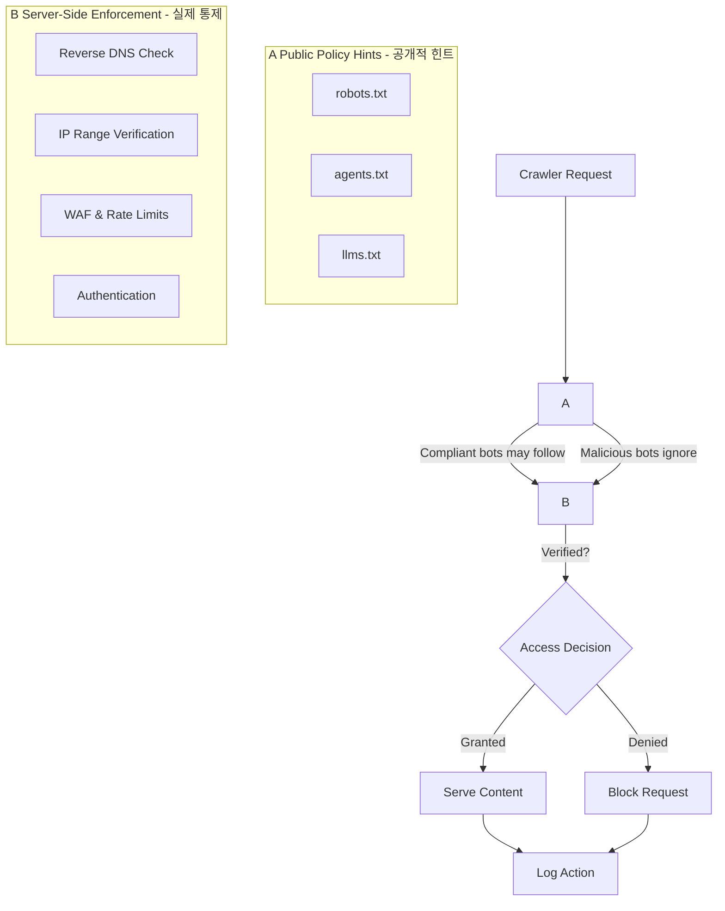

> 이 엔트리는 Blake Crosley의 [Agents.txt Is Not Access Control](https://blakecrosley.com/blog/agents-txt-not-access-control)을 정독하고 핵심을 추출한 것이다.

### 왜 중요한가

`robots.txt`의 시대가 저물고, AI 에이전트와 상호작용하기 위한 `agents.txt`, `llms.txt`와 같은 새로운 파일 규약이 등장하고 있다. DreamHost와 같은 주요 호스팅사가 `agents.txt`를 기본으로 제공하기 시작하면서, 이는 더 이상 일부의 아이디어가 아닌 웹의 표준으로 자리 잡고 있다.

하지만 많은 개발자들이 이 파일들을 접근 제어(Access Control)나 보안 장치로 오해한다. Blake Crosley는 이 파일들이 본질적으로 **"강제성 없는 공개 정책 선언"**에 불과함을 경고한다. 이를 보안 수단으로 착각하고 민감한 경로를 `Disallow`에 명시하는 것은, 오히려 공격자에게 내부 구조에 대한 상세한 지도를 제공하는 치명적인 실수가 될 수 있다.

이 글은 `robots.txt`, `agents.txt`의 올바른 역할을 정의하고, AI 시대에 필요한 목적 기반(purpose-level) 크롤링 정책과 실제적인 서버 측 보안 조치를 구분하여 설명한다.

### 핵심 패턴

#### 1. Crawler 파일은 보안이 아닌 '공개 정책 힌트'다

`robots.txt`나 `agents.txt`에 명시된 규칙은 착한 크롤러를 위한 '권장 사항'일 뿐, 악의적인 봇은 이를 무시하거나 오히려 취약점 탐색의 단서로 활용한다.

- **잘못된 가정**: `Disallow: /private/`라고 적으면 아무도 접근하지 않을 것이다.
- **현실**: 공격자는 `/private/` 경로가 존재함을 인지하고 집중 공격을 시도한다.

이는 Robots Exclusion Protocol(REP) 표준(RFC 9309)과 Google의 공식 문서에서도 명시된 사실이다. "규칙은 접근 허가의 한 형태가 아니며", `robots.txt`에서 금지된 URL이라도 다른 페이지에서 링크가 있다면 검색 결과에 나타날 수 있다.

**나쁜 예시: 민감한 경로 노출**
```
# DON'T DO THIS. This is a map for attackers.
User-agent: *
Disallow: /internal-product-roadmap/
Disallow: /legal-private/
Disallow: /prompt-drafts/
Disallow: /customers/acme-renewal-risk/
```

**좋은 예시: 공개 정책만 선언**
```
# Good: Expresses a real preference without revealing private structure.
User-agent: *
Allow: /
Disallow: /*.md$

Sitemap: https://example.com/sitemap.xml
```
민감한 리소스는 반드시 서버 측 인증(authentication)과 `noindex` 헤더로 보호해야 한다. 텍스트 파일에 그 책임을 전가해서는 안 된다.

#### 2. AI 크롤러는 '목적별 정책'이 필요하다

과거에는 '허용'과 '차단'이라는 이분법적 정책으로 충분했지만, AI 크롤러는 그 목적이 세분화되어 있다. 예를 들어, 사이트 운영자는 특정 페이지가 ChatGPT 검색 결과에는 노출되기를 원하지만, OpenAI의 모델 훈련 데이터로 사용되는 것은 원치 않을 수 있다.

- **OpenAI**: `OAI-SearchBot` (ChatGPT 검색용)과 `GPTBot` (모델 훈련용)을 분리했다. 각각 독립적으로 허용/차단할 수 있다.
- **Google**: `Google-Extended`라는 별도의 `robots.txt` 제품 토큰을 도입했다. 이는 기존 Googlebot이 수집한 데이터를 Gemini 모델 훈련에 사용할지 여부를 제어하며, Google 검색 순위에는 영향을 미치지 않는다.

따라서 이제는 크롤러의 목적에 따라 정책을 다르게 설정해야 한다.

```
# Example: Allow search visibility, but block model training.

# Allow Google Search and ChatGPT Search
User-agent: Googlebot
Allow: /

User-agent: OAI-SearchBot
Allow: /

# Block model training crawlers
User-agent: GPTBot
Disallow: /

User-agent: Google-Extended
Disallow: /
```

#### 3. 진정한 통제는 서버 엣지(Edge)에서 이뤄진다

Crawler 파일은 의도를 표현할 뿐, 신뢰할 수 없는 클라이언트를 막을 수 없다. 실제적인 통제와 보안은 서버 엣지 단에서 구현해야 한다.

- **신원 확인**: `User-Agent` 문자열은 단순한 '주장'일 뿐, 신원이 아니다. 역방향 DNS 조회(reverse DNS lookup)나 통신사가 공개한 IP 대역 확인을 통해 크롤러의 신원을 검증해야 한다.
- **강력한 방어**: 민감한 리소스는 인증(Authentication), 웹 방화벽(WAF), 애플리케이션 정책, 그리고 요청 비율 제한(Rate Limiting)과 같은 강력한 서버 측 메커니즘으로 보호해야 한다.
- **관찰**: 서버 로그는 어떤 일이 '실제로' 일어났는지에 대한 유일한 증거다. 정책 변경 후에는 반드시 로그를 확인하여 의도한 대로 동작하는지 검증해야 한다.



### 실전 적용: `tarosaju` 프로젝트

`tarosaju`는 사용자가 생성한 타로 해석 결과와 같은 민감할 수 있는 콘텐츠를 다룬다. 이 콘텐츠가 검색 엔진에는 노출되어 신규 사용자 유입을 유도하되, 외부 AI 모델의 훈련 데이터로 무단 수집되는 것은 막아야 한다.

**1. `public/robots.txt` 정책 수립**

Next.js 프로젝트의 `public` 디렉토리에 아래와 같이 `robots.txt` 파일을 작성하여 목적별 크롤러 정책을 명시한다.

```
# Allow general search crawlers
User-agent: Googlebot
Allow: /

User-agent: Bingbot
Allow: /

# Allow search/answer crawlers for AI services
User-agent: OAI-SearchBot
Allow: /

# Disallow AI model training crawlers
User-agent: GPTBot
Disallow: /

User-agent: Google-Extended
Disallow: /

User-agent: CCBot
Disallow: /

Sitemap: https://tarosaju.com/sitemap.xml
```

**2. 서버 측 크롤러 신원 검증**

`Googlebot`을 사칭하는 봇은 `User-Agent` 문자열만 위조하면 되므로, 진짜 검증은 역방향 DNS 조회로 한다. Google이 공식 권장하는 방식은 (1) 요청 IP에 대해 reverse DNS lookup → (2) 호스트명이 `.googlebot.com` / `.google.com`으로 끝나는지 확인 → (3) 그 호스트명을 다시 forward DNS로 조회해 원래 IP와 일치하는지 확인하는 3단계다.

주의: 역방향 DNS 조회는 Node `dns` 모듈이 필요하므로 **Edge Runtime에서는 불가능**하다. Node.js 런타임(예: API Route, 또는 `runtime: 'nodejs'`로 설정한 Route Handler)에서 수행해야 한다. 아래는 개념을 보여주는 Node 런타임 예시다.

```typescript
import dns from 'node:dns/promises';

const GOOGLEBOT_SUFFIXES = ['.googlebot.com', '.google.com'];

// Node.js 런타임에서 실행 (Edge Runtime에서는 node:dns 사용 불가)
async function isVerifiedGooglebot(ip: string): Promise<boolean> {
  try {
    // 1. reverse DNS lookup
    const hostnames = await dns.reverse(ip);
    const hostname = hostnames.find(h =>
      GOOGLEBOT_SUFFIXES.some(suffix => h.endsWith(suffix))
    );
    if (!hostname) return false;

    // 2. forward DNS lookup 으로 IP 일치 재확인 (위조 방지 핵심)
    const forward = await dns.resolve4(hostname).catch(() => []);
    return forward.includes(ip);
  } catch {
    // 조회 실패 시 신뢰하지 않음
    return false;
  }
}
```

이 접근법을 통해 `tarosaju`는 `robots.txt`로 정책 '의도'를 명확히 표현하고, 서버 측에서 '실제' 검증을 수행하여 검색 엔진 최적화(SEO)의 이점은 누리면서 콘텐츠를 보호하는 이중 방어 체계를 구축할 수 있다.