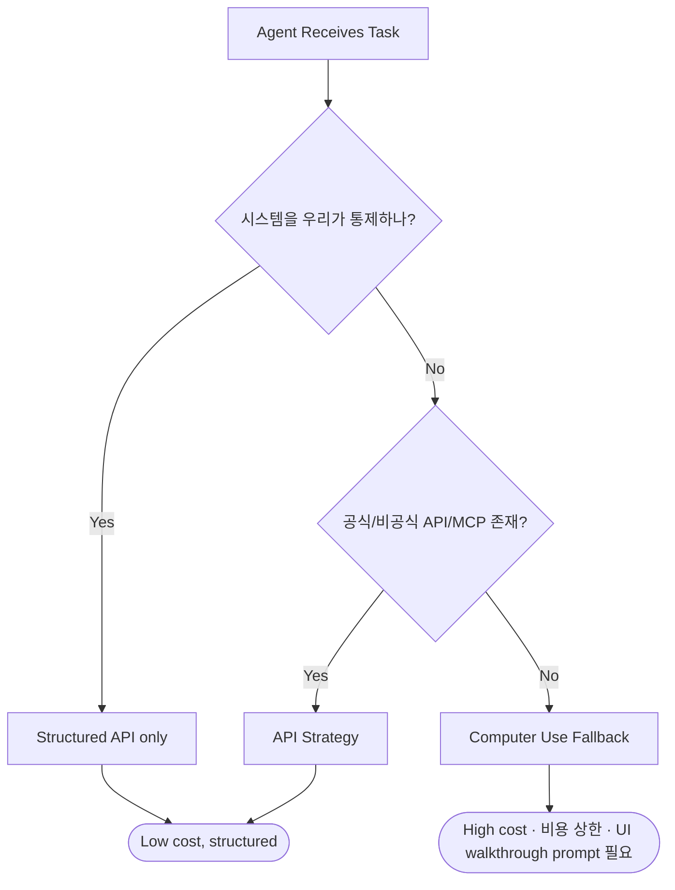

## 출발점: 45배라는 실측 수치

2026년 5월, Reflex 팀은 같은 어드민 패널 작업을 두 가지 방식으로 풀어보는 벤치마크를 공개했습니다 ([reflex.dev/blog/computer-use-is-45x-more-expensive-than-structured-apis](https://reflex.dev/blog/computer-use-is-45x-more-expensive-than-structured-apis/)). 결과는 단순했습니다 — vision agent는 API agent보다 **약 45배 많은 입력 토큰**을 소비했습니다.

이 글은 그 벤치마크의 정확한 숫자를 출발점으로, *언제 Computer Use를 써야 하고 언제 쓰지 말아야 하는지*, 그리고 ai-study/moneyflow/tarosaju 같은 실 프로덕트에 어떤 결정 규칙으로 박제할지를 정리합니다.

### 벤치마크 셋업 (재현 가능한 사실)

- **앱**: react-admin Posters Galore 데모 기반의 어드민 패널
- **데이터**: 고객 900명, 주문 600건, 리뷰 324건
- **작업**: "Smith"라는 고객 중 주문이 가장 많은 사람을 찾아, 가장 최근 pending 주문을 찾고, 모든 pending 리뷰를 승인한 뒤, 주문 상태를 delivered로 바꿔라
- **Path A (Vision)**: Claude Sonnet + browser-use 0.12, 스크린샷+클릭 (n=3)
- **Path B (API)**: Claude Sonnet + tool-use, 앱 핸들러에서 자동 생성된 HTTP 엔드포인트 호출 (n=5)

### 결과 (출처: Reflex 벤치마크)

| 지표 | Vision Agent | API Agent | 비율 |
| :--- | ---: | ---: | ---: |
| 단계 수 | 53 ± 13 | 8 ± 0 | ~6.6× |
| Wall-clock 시간 | 1003s ± 254s (~17분) | 19.7s ± 2.8s | ~51× |
| Input 토큰 | 550,976 ± 178,849 | 12,151 ± 27 | **~45×** |
| Output 토큰 | 37,962 ± 10,850 | 934 ± 41 | ~41× |

추가로 의미 있는 메모: **Claude Haiku는 vision path에서 browser-use 0.12의 structured-output 스키마와 호환되지 않아 실패**했고, API path에서는 7.7s/9,478 input 토큰으로 멀쩡히 완료했습니다. 라우터/오케스트레이터 관점에서 *"작은 모델은 vision-mode에서 사용 불가"* 라는 운영 제약을 시사합니다.

### 핵심 통찰

Reflex 저자의 한 줄 정리: *"보기 위해서는 비용을 내야 하는 아키텍처에서, 모델이 좋아지면 단계당 오류율은 줄어들지만 필요한 스크린샷 개수는 줄지 않는다."* 즉 **45배 차이는 모델 발전으로 좁혀지지 않는 구조적 비용**입니다.

또 하나의 한계: vision agent는 첫 시도에서 4개의 pending review 중 1개만 찾아냈습니다 — 페이지네이션을 인지하지 못한 것입니다. 14단계의 명시적 UI 워크스루 프롬프트를 추가한 뒤에야 통과했는데, 이는 *off-screen 상태에 대한 추론 불가*라는 vision agent의 또 다른 본질적 약점입니다.

## 핵심 트레이드오프: 유연성 vs. 비용 vs. 보이지 않는 상태

| 기준 | Computer Use (UI 조작) | 구조화된 API 호출 |
| :--- | :--- | :--- |
| **비용** | 매우 높음 (Vision 토큰, 다단계 추론) | 낮음 (텍스트 토큰, 단일 호출) |
| **유연성** | 매우 높음 (외부 SaaS/레거시 가능) | 낮음 (사전 정의된 API만 가능) |
| **신뢰성** | 낮음 (UI 변경/페이지네이션에 취약) | 높음 (계약이 안정적인 한 안정) |
| **개발 오버헤드** | 낮음 (API 설계 불필요) | 높음 (API 설계·문서화 필요) |
| **실행 속도** | 매우 느림 (분 단위) | 빠름 (초 단위) |
| **off-screen 추론** | 불가 (보이는 것만 안다) | N/A |

## 결정 규칙: "API-First, UI-Fallback"

> Reflex 저자가 명시한 정당한 use case: *"Vision agents remain the right tool for applications you do not control: third-party SaaS products, legacy systems, anything you cannot modify."*

이걸 결정 규칙으로 박제하면:

1. **통제 가능한 시스템(자체 백엔드, 자체 앱)** → 무조건 API. UI 자동화는 안티패턴.
2. **통제 불가 + API/RSS/MCP 존재** → API.
3. **통제 불가 + API 없음** → Computer Use. 단, 비용 상한·재시도 정책·UI 워크스루 프롬프트를 함께 설계.

### 다이어그램



### 코드 예제 (TypeScript)

```typescript
// strategies/apiStrategy.ts
export async function fetchWithApi(taskId: string): Promise<string | null> {
  try {
    const response = await fetch(`https://api.internal.com/tasks/${taskId}`);
    if (!response.ok) throw new Error(`API ${response.status}`);
    const data = await response.json();
    return data.summary;
  } catch (error) {
    console.warn('[API] Failed:', error);
    return null;
  }
}

// strategies/uiStrategy.ts
import { computerVisionControl } from './computerVisionControl';

export async function fetchWithUi(
  taskUrl: string,
  opts: { maxSteps: number; walkthrough: string[] }
): Promise<string> {
  await computerVisionControl.launchBrowserAndGoTo(taskUrl);
  // 페이지네이션 같은 off-screen 상태를 명시적으로 알려야 함 (Reflex 14-step 교훈)
  for (const step of opts.walkthrough) {
    await computerVisionControl.followInstruction(step);
  }
  return computerVisionControl.extractTextFromMainContent();
}

// TaskExecutor.ts — API-First, UI-Fallback + 비용 상한
class TaskExecutor {
  async execute(task: { id: string; url: string }): Promise<string> {
    const apiResult = await fetchWithApi(task.id);
    if (apiResult !== null) return apiResult;

    // UI fallback은 비용 상한과 명시적 walkthrough가 필수
    return fetchWithUi(task.url, {
      maxSteps: 60,
      walkthrough: [
        '페이지 하단의 다음 페이지 버튼을 확인하라',
        '모든 페이지를 순회하며 pending 항목을 누락 없이 수집하라',
      ],
    });
  }
}
```

핵심: vision fallback에 그냥 던져두면 페이지네이션을 놓칩니다. **walkthrough prompt를 코드에 박제**하는 것이 Reflex 사례의 운영 교훈입니다.

## iOS 관점: App Intents가 "API-First"의 OS 레벨 구현

iOS 26+의 [App Intents](https://developer.apple.com/documentation/appintents) 프레임워크는 사실상 *"앱 개발자가 자기 앱에 대한 구조화 API를 OS 레벨에서 노출하는 방법"*입니다. 시스템 에이전트(Apple Intelligence, Shortcuts)가 앱 UI를 vision으로 분석하지 않고 직접 호출하도록 만드는 게 목적입니다.

iOS 앱에서 AI 통합을 준비한다면 우선순위는:
1. **`AppIntent` 정의** — 앱의 핵심 기능 5–10개를 Intent로 노출
2. **`AppEntity` 도메인 모델 노출** — 에이전트가 데이터를 이해할 수 있게
3. **Spotlight/Shortcuts 동작 검증** — 시스템이 vision fallback 없이 호출 가능한지

이렇게 만들어 두면 미래의 시스템 에이전트가 우리 앱을 "45배 비싼 vision path"로 들어오지 않게 됩니다.

## 프로젝트 적용

### moneyflow (가계부)
- 외부 카드사/은행 데이터 수집 → 모두 통제 불가. **공식 Open Banking API/RSS 우선**, 없는 곳만 vision (현실적으로 비추천: 회당 비용·금융 UI 변경 빈도). 계좌 연결은 PDS(Personal Data Store) 경로를 우선 검토.
- 자체 백엔드 → API only. 자동화 테스트용 vision 금지.

### tarosaju (운세 콘텐츠)
- 외부 운세 사이트 → 1차로 RSS/JSON 엔드포인트 확인, 없으면 vision은 *비용 상한 + 캐시 24h*로만 허용.
- "이론적으로 80% 절감" 같은 추정은 위 Reflex 수치(~45×)로 대체: API 경로가 가능한 도메인 비율 × 45 ≈ 실제 절감.

### ai-study (이 위키)
- 위키는 통제 가능 → 모든 자동화는 manifest/API. browser-use는 회피.
- 외부 출처 인덱싱(긱뉴스 스카우트)은 RSS·웹훅·MCP 우선, 마지막에만 fetch+parse.

## 산업 트렌드 (2026)

1. **Tool-use 표준화**: Anthropic [Model Context Protocol](https://modelcontextprotocol.io)이 "앱이 에이전트에게 API처럼 보이게 하는" 표준 인터페이스로 자리 잡고 있습니다.
2. **OS 레벨 인텐트**: Apple App Intents, Android App Actions가 vision fallback을 줄이는 OS 인프라.
3. **자기 수정 에이전트**: API 명세가 바뀌면 vision으로 한 번 학습 → API 클라이언트를 자동 보정하는 패턴이 연구되고 있습니다 (현재는 paper-stage; 프로덕션 적용 시 비용 상한 필수).

결론: 무조건 vision agent에 매혹되지 말 것. **45×는 구조적 비용**이며, 우리가 통제할 수 있는 시스템에는 절대 vision을 쓰지 않는다 — 이것이 단 하나의 결정 규칙입니다.

---

## 출처

- Reflex, "Computer use is 45x More Expensive Than Structured APIs" (2026-05): https://reflex.dev/blog/computer-use-is-45x-more-expensive-than-structured-apis/
- Hacker News 토론: https://news.ycombinator.com/item?id=48024859
- The Register, "AI vision agents use 45x more tokens than APIs in benchmark" (2026-05-07)
- Apple, App Intents 문서: https://developer.apple.com/documentation/appintents
- Anthropic, Model Context Protocol: https://modelcontextprotocol.io

## 자기 점검

1. Reflex 벤치마크에서 vision agent의 비용이 API agent의 ~45배가 된 *구조적* 이유는 무엇이며, 모델이 좋아지면 이 차이가 좁혀지지 않는 이유는 무엇인가요?
2. "API-First, UI-Fallback" 패턴에서 UI fallback에 walkthrough prompt를 명시적으로 코드에 박제해야 하는 이유는 무엇인가요? (Reflex 14-step 사례)
3. iOS 앱에 AI 에이전트 호환성을 추가하려면 App Intents 외에 어떤 보완이 필요한가요?
4. 동료에게 "왜 우리 자체 어드민 패널 자동화는 절대 vision으로 만들지 말아야 하나"를 1분 안에 설명해보세요.
5. **실습**: 임의의 외부 사이트를 골라 (a) 공식 API 존재 여부, (b) 비공식 JSON 엔드포인트(브라우저 Network 탭), (c) RSS 존재 여부를 차례로 확인하고, 셋 다 없을 때만 Playwright fallback을 쓰는 스크립트를 작성하세요. 비용 상한(`maxSteps`)과 walkthrough prompt를 반드시 포함하세요.
