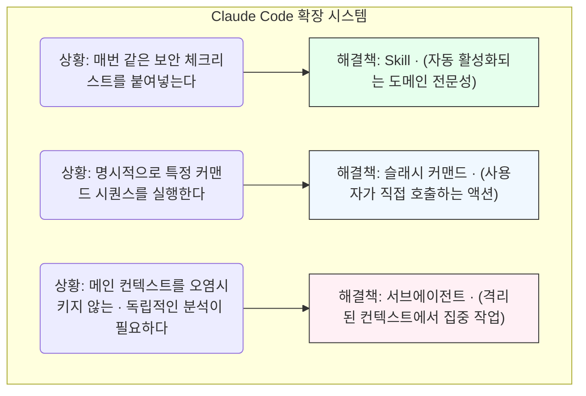

> 이 엔트리는 Blake Crosley의 [Build Custom Skills](https://blakecrosley.com/blog/building-custom-skills)을 정독하고 핵심을 추출한 것이다.

이 엔트리는 Blake Crosley의 [Claude Code Skills: Build Custom Auto-Activating Extensions](https://www.blakecrosley.com/p/claude-code-skills-build-custom-auto-activating-extensions/)를 정독하고 핵심을 추출한 것이다.

### 왜 중요한가

개발자는 반복적으로 동일한 컨텍스트(보안 체크리스트, API 설계 원칙, 코딩 스타일 가이드)를 LLM에 붙여넣는다. 이 작업은 번거롭고, 일관성을 해치며, 인지 부하를 높인다. Claude Code의 'Skill' 기능은 이 문제를 해결하기 위해 등장했다.

Skill은 단순한 프롬프트 템플릿이 아니다. 사용자의 작업 의도를 LLM이 스스로 파악하여, 필요한 '전문 지식'을 컨텍스트에 **자동으로 주입**하는 모델 호출 확장(model-invoked extension)이다. 이를 통해 LLM은 특정 도메인(예: 우리 팀의 코드베이스)에 대한 영구적인 지식을 갖춘 전문가처럼 행동하게 된다. 이는 일회성 프롬프트 엔지니어링을 넘어, 지속 가능하고 확장 가능한 AI 개발 환경을 구축하는 핵심 패러다임이다.

### 핵심 패턴

#### 1. 활성화의 핵심은 '설명(Description)' 기반 LLM 추론

Skill의 가장 중요한 부분은 `SKILL.md` 파일 상단의 YAML frontmatter에 있는 `description` 필드다. Claude는 키워드 매칭이 아닌, 사용자의 프롬프트와 각 Skill의 `description`을 비교하는 **LLM 추론**을 통해 어떤 Skill을 활성화할지 결정한다.

블로그 저자가 공식 문서¹를 인용하며 강조하듯, 이것이 Skill의 신뢰성을 좌우한다.

*   **나쁜 예 (너무 광범위함):** `description: Helps with git-related tasks.`
    *   `git status` 같은 간단한 명령어에도 활성화되어 컨텍스트 예산을 낭비하고 다른 Skill과 충돌한다.
*   **좋은 예 (구체적이고 의도 중심적):** `description: Review code for security vulnerabilities, performance issues, and best practice violations. Use when examining code changes, reviewing PRs, analyzing code quality, or when asked to review, audit, or check code.`
    *   "코드 리뷰", "PR 분석", "코드 품질 검사" 등 명확한 사용자 의도에만 반응하여 정밀하게 활성화된다.

#### 2. 문제에 맞는 올바른 도구 선택: Skill vs. 슬래시 커맨드 vs. 서브에이전트

모든 반복 작업을 Skill로 만들면 안 된다. 저자는 사용 사례에 따른 명확한 구분 기준을 제시한다.



*   **Skill**: **항상 사용 가능해야 하는** 안정적인 도메인 지식(코딩 스타일, 보안 패턴, 비즈니스 규칙)에 적합. "Claude가 이걸 자동으로 적용해야 하는가?"에 대한 답이 "예"일 때 사용.
*   **슬래시 커맨드**: **내가 원할 때 명시적으로 실행**하는 작업(예: 주 1회 사용하는 복잡한 git rebase 헬퍼)에 적합.
*   **서브에이전트**: 별도의 컨텍스트 창에서 독립적으로 분석을 수행할 때 사용. `context: fork` 옵션으로 Skill을 서브에이전트처럼 실행할 수 있다.

#### 3. 모듈화된 전문성: 핵심 Skill 파일과 보조 자료 분리

Skill의 전문성을 단일 `SKILL.md` 파일에 모두 담으려 하면 파일이 비대해지고 컨텍스트 주입 오버헤드가 커진다. 공식 문서³에서는 `SKILL.md`를 500줄 이하로 유지하고, 상세 내용은 별도 파일로 분리할 것을 권장한다.

Skill은 상대 경로 링크를 통해 같은 디렉토리 내의 다른 파일들을 참조할 수 있다.

*   `~/.claude/skills/code-reviewer/SKILL.md`: 핵심 지침과 다른 파일 링크 포함
*   `~/.claude/skills/code-reviewer/SECURITY_PATTERNS.md`: 상세한 OWASP Top 10 체크리스트
*   `~/.claude/skills/code-reviewer/PERFORMANCE_CHECKLIST.md`: 쿼리 최적화 가이드라인

Claude는 Skill이 활성화될 때 이 파일들을 필요에 따라 읽어오므로, 핵심 로직은 간결하게 유지하면서도 깊이 있는 정보를 제공할 수 있다.

### 실전 적용: ai-study 위키 기사 작성 Skill 만들기

`ai-study` 프로젝트의 위키 기여자는 정해진 MDX 형식, 구조, 품질 가드를 준수해야 한다. 이 규칙을 Claude Skill로 만들어 기사 초안 작성 및 리뷰 과정을 자동화할 수 있다.

#### 1. 디렉토리 및 파일 구조 (TypeScript 예시)

```typescript
// 파일 구조 예시 (실제 실행 코드는 아님)
// ~/.claude/skills/ai-study-writer/

// ├── SKILL.md
// ├── STRUCTURE_GUIDE.md
// └── MERMAID_RULES.md
```

#### 2. SKILL.md 작성

`~/.claude/skills/ai-study-writer/SKILL.md` 파일은 다음과 같이 작성한다.

```markdown
---
name: ai-study-wiki-writer
description: ai-study 위키 기사 초안을 작성하거나 기존 글을 리뷰합니다. MDX 형식, '왜 중요한가 -> 핵심 패턴 -> 실전 적용' 구조, Mermaid 다이어그램 및 품질 가드 준수 여부를 확인할 때 사용하세요.
allowed-tools: [Read, Grep, Glob]
---

# ai-study 위키 기사 작성 가이드

당신은 ai-study 프로젝트의 전문 기술 작가입니다. 다음 규칙을 반드시 준수하여 MDX 형식의 위키 엔트리를 작성하거나 리뷰하세요.

### 1. 핵심 구조
- **왜 중요한가**: 문제 정의와 기술의 필요성 설명
- **핵심 패턴**: 문제 해결의 핵심 원리 및 패턴
- **실전 적용**: 구체적인 프로젝트(예: moneyflow, tarosaju)에 적용하는 시나리오 제시

상세 구조는 [STRUCTURE_GUIDE.md](STRUCTURE_GUIDE.md)를 참고하세요.

### 2. 품질 가드
- **실측 기반**: 원문의 실제 사례만 인용하고 추측성 서술("~할 수 있다")을 피합니다.
- **외부 권위 자료 우선**: 원문이 인용한 공식 문서, 논문을 반드시 확인하고 함께 언급합니다.

### 3. Mermaid 다이어그램
- 모든 글에는 Mermaid 다이어그램이 1개 포함되어야 합니다.
- 다이어그램 작성 시, [MERMAID_RULES.md](MERMAID_RULES.md)에 명시된 5대 함정을 반드시 피해야 합니다.
```

#### 3. 보조 자료 작성

`MERMAID_RULES.md` 파일에 `ai-study`의 특정 Mermaid 규칙을 명시한다.

```markdown
# Mermaid 5대 함정

1.  **괄호/특수문자**: `F{"Check Rate (Firestore)"}` 처럼 노드 라벨을 따옴표로 감싸세요.
2.  **`<br/>` 금지**: 줄바꿈은 실제 개행 문자나 `·` 문자를 사용하세요.
3.  **콜론**: `D["Deploy: Production"]` 처럼 라벨에 콜론이 있을 경우 따옴표로 감싸세요.
4.  **ID 충돌 금지**: subgraph와 node의 ID가 중복되지 않도록 유의하세요.
5.  **유니코드 화살표 금지**: `→` 대신 `-->` 또는 `--->`를 사용하세요.
```

이제 개발자가 `claude "블레이크 크로슬리 블로그 글을 ai-study 위키 글로 요약해줘"` 와 같이 요청하면, Claude는 `ai-study-wiki-writer` Skill을 자동으로 활성화하여 정해진 구조와 품질 가드에 맞춰 결과물을 생성할 것이다. 이는 팀 전체의 생산성과 결과물의 일관성을 극적으로 향상시킨다.