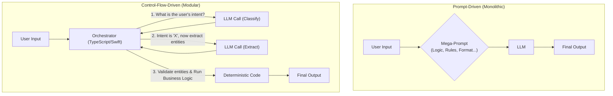
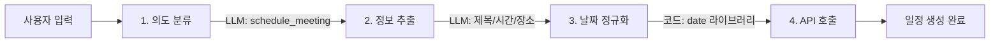

LLM 기반 에이전트를 설계할 때 많은 개발자들이 "완벽한 프롬프트"를 만드는 데 집중합니다. 작업의 모든 세부 사항, 예외 처리, 출력 형식까지 하나의 거대한 프롬프트에 담으려는 시도는 초기 프로토타이핑 단계에서는 매력적으로 보일 수 있습니다. 하지만 이는 프로덕션 환경에서 예측 불가능성, 디버깅의 어려움, 유지보수 비용 증가라는 부작용을 낳습니다.

최근의 업계 논의는 이러한 접근 방식에 근본적인 의문을 제기합니다. 핵심은 **"에이전트에는 더 많은 프롬프트가 아니라, 더 나은 제어 흐름이 필요하다"**는 것입니다. (출처: a16z, "Emerging Architectures for LLM Applications") 이는 LLM을 모든 것을 처리하는 만능 두뇌로 여기는 대신, 강력한 기능을 가진 하나의 컴포넌트로 보고, 전체 워크플로우는 안정적인 결정적 코드(deterministic code)로 제어해야 한다는 패러다임의 전환을 의미합니다.

## 프롬프트 중심 vs. 제어 흐름 중심

두 접근 방식의 차이는 명확합니다. iOS/프론트엔드 개발자에게 익숙한 MVC나 MVVM 아키텍처에 비유할 수 있습니다.

| 접근 방식 | 설명 | 비유 | 장점 | 단점 |
|---|---|---|---|---|
| **프롬프트 중심 (Prompt-Driven)** | 하나의 거대한 프롬프트에 모든 비즈니스 로직, 분기, 예외 처리를 자연어로 기술합니다. LLM이 전체 프로세스를 해석하고 주도합니다. | 모든 로직을 `View` 파일 하나에 다 넣는 것 | 빠른 프로토타이핑 | 비결정성, 디버깅 불가, 모델 의존성, "프롬프트 드리프트"에 취약 |
| **제어 흐름 중심 (Control-Flow-Driven)** | 전체적인 작업 흐름과 비즈니스 로직은 TypeScript, Swift 같은 코드로 작성합니다. LLM은 분류, 요약, 변환 등 명확하게 정의된 특정 작업(task)에만 도구(tool)처럼 호출됩니다. | `Model`, `View`, `Controller/ViewModel`이 명확히 분리된 아키텍처 | 예측 가능성, 신뢰성, 테스트 용이성, 유지보수성, 로직의 명확성 | 초기 설계 복잡도 증가 |

아래 다이어그램은 두 접근 방식의 차이를 시각적으로 보여줍니다. 제어 흐름 중심 설계에서는 코드(`Orchestrator`)가 전체 프로세스를 지휘하며 필요할 때만 LLM이라는 전문가를 호출합니다.



## 실전 예제: 일정 추가 에이전트

사용자가 "내일 오후 3시에 팀 미팅 잡아줘. 장소는 3회의실." 라고 요청했을 때, 두 접근 방식의 차이:

### 프롬프트 중심 — 모든 것을 LLM에 위임

```
LLM(
  "사용자 요청을 파싱해서 제목, 날짜, 시간, 장소를 추출하고
   '내일'은 다음 날, '오후'는 1-5시 사이로 해석해서
   JSON으로 반환해줘. 현재 시각은 {now}."
)
→ 결과가 매번 달라짐. 날짜 계산 틀릴 수 있음. 디버깅 불가.
```

### 제어 흐름 중심 — 코드가 지휘, LLM은 도구



| 단계 | 실행 주체 | 역할 |
|---|---|---|
| 1. 의도 분류 | LLM | "일정 추가"인지 "조회"인지 분류만 |
| 2. 정보 추출 | LLM | 제목, 시간 표현, 장소를 구조화 데이터로 추출만 |
| 3. 날짜 정규화 | **결정적 코드** | "내일 오후 3시" → Date 객체 변환 (date 라이브러리) |
| 4. 액션 실행 | **결정적 코드** | 정제된 데이터로 캘린더 API 호출 |

**핵심**: 날짜 계산처럼 LLM이 환각할 수 있는 작업은 신뢰할 수 있는 라이브러리로 처리. LLM은 분류와 추출이라는 좁은 역할만 수행. 각 단계가 독립적이므로 어디서 오류가 났는지 즉시 추적 가능.

## `tarosaju` 프로젝트 적용 사례

실제 `tarosaju` 프로젝트의 타로 카드 리딩 에이전트 설계에도 이 원칙을 적용할 수 있습니다.

-   **기존 방식 (Prompt-Driven)**: "사용자 질문을 받고, 3장의 카드를 뽑은 후, 각 카드의 의미와 위치를 조합하여 전체적인 운세를 해설해줘." 라는 하나의 거대한 프롬프트로 처리. 결과물의 품질이 매번 달라지고, 특정 카드 해석이 누락되는 문제가 발생할 수 있습니다.

-   **개선 방식 (Control-Flow-Driven)**:
    1.  `Code`: 사용자의 질문을 입력받습니다.
    2.  `Code`: `draw_cards(3)` 함수를 호출하여 3장의 카드 객체를 배열로 가져옵니다. 이 과정은 LLM과 무관합니다.
    3.  `LLM Call (Per-Card Interpretation)`: 3장의 카드에 대해 **개별적으로** LLM을 호출합니다.
        - `get_card_meaning("The Fool", "past")` -> "과거: 새로운 시작, 무모함..."
        - `get_card_meaning("The Magician", "present")` -> "현재: 창의력, 잠재력 발현..."
        - `get_card_meaning("The World", "future")` -> "미래: 완성, 성취..."
    4.  `Code`: 3개의 개별 해석 결과를 수집합니다.
    5.  `LLM Call (Synthesis)`: 수집된 구조화된 데이터를 바탕으로 최종 리딩을 생성합니다.
        ```
        Prompt:
        You are a wise tarot reader. Synthesize the following elements into a cohesive narrative for the user.

        User's Question: "${question}"
        Past Card Interpretation: "${past_meaning}"
        Present Card Interpretation: "${present_meaning}"
        Future Card Interpretation: "${future_meaning}"

        Provide a final, integrated reading.
        ```
이처럼 복잡한 생성 작업을 여러 개의 단순하고 예측 가능한 단계로 분해함으로써, 각 LLM 호출의 역할을 명확히 하고 전체 프로세스의 안정성을 극대화할 수 있습니다. 이는 "에이전트는 먼저 소프트웨어 컴포넌트"라는 SOLID 원칙의 재해석과도 일맥상통합니다.

## 자기 점검

1.  메가 프롬프트에 의존하는 에이전트 설계의 주요 단점 3가지는?
2.  제어 흐름 중심 설계에서 LLM과 결정적 코드의 역할 경계는 어디인가?
3.  tarosaju 예제에서 카드 해석과 최종 리딩 생성을 분리했을 때의 디버깅 이점은?
4.  자기 프로젝트에서 "LLM에 위임하고 있지만, 사실 결정적 코드로 처리해야 하는 작업"을 하나 찾아보자.