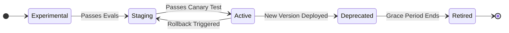
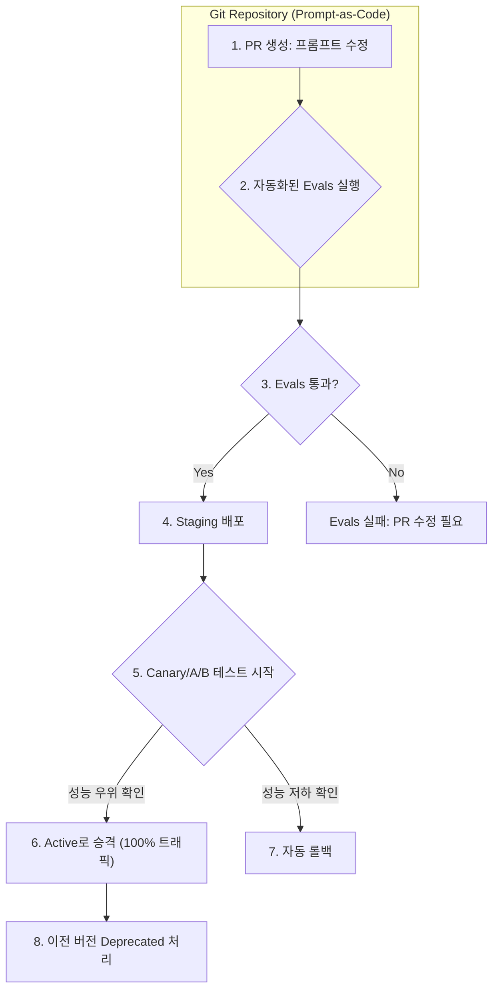

우리는 이제 단일 프롬프트로 작동하는 AI 기능을 넘어, 여러 에이전트가 협력하여 복잡한 작업을 수행하는 '에이전트 플릿(Agent Fleet)'의 시대로 진입하고 있습니다. iOS 앱의 사용자 의도를 파악하는 라우팅 에이전트, API를 호출하는 툴 에이전트, 결과를 요약하는 프론트엔드 표시용 에이전트 등, 하나의 서비스에도 수십 개의 에이전트가 유기적으로 동작합니다.

문제는 여기서 시작됩니다. 에이전트가 10개를 넘어가면, 어떤 에이전트가 어떤 역할을 하는지, 버전은 무엇인지, 성능은 어떤지 추적하기가 불가능해집니다. 이는 마치 팀원 명부나 역할 정의 없이 50명의 개발자 조직을 운영하려는 것과 같습니다. 해결책은 구글 클라우드가 제시한 것처럼, **AI 에이전트 플릿을 하나의 엔지니어링 조직처럼 관리하는 것**입니다.

## 왜 '엔지니어링 조직' 모델이 필요한가?

초기 AI 에이전트 개발은 '코드'를 작성하는 것에 가까웠습니다. 하지만 수십 개의 에이전트 플릿은 '시스템'을 넘어 '조직'에 가깝습니다. 이들에게는 명확한 역할, 성과 측정, 승진(업데이트), 그리고 은퇴(deprecation) 프로세스가 필요합니다. 엔지니어링 조직 운영 모델은 이미 수십 년간 검증된 대규모 지적 노동자 집단 관리 프레임워크이며, 이를 에이전트 플릿에 적용하면 다음과 같은 이점을 얻을 수 있습니다.

- **가시성 (Visibility):** 어떤 에이전트가 어디서, 무슨 일을 하는지 한눈에 파악합니다.
- **책임성 (Accountability):** 특정 작업 실패 시 어떤 에이전트의 문제인지 즉시 식별합니다.
- **확장성 (Scalability):** 새로운 에이전트를 체계적으로 추가하고 기존 에이전트를 안전하게 업데이트합니다.
- **안정성 (Reliability):** 성능이 저하된 에이전트를 조기에 발견하고 대응합니다.

## 에이전트 플릿 거버넌스의 4가지 핵심 요소

엔지니어링 조직을 관리하는 방식을 차용하여 4가지 핵심 거버넌스 요소를 구축할 수 있습니다.

### 1. Agent Registry: 팀원 명부와 역할 정의

모든 거버넌스의 시작은 '명부'입니다. 어떤 에이전트가 존재하는지 중앙에서 관리하는 레지스트리가 필요합니다. 이는 단순한 목록을 넘어, 각 에이전트의 '인사 기록 카드' 역할을 합니다.

| 필드명 | 설명 | 예시 |
| :--- | :--- | :--- |
| `agentId` | 고유 식별자 | `ios-intent-router-v2` |
| `version` | 시맨틱 버전 | `2.1.3` |
| `status` | 에이전트 상태 | `active`, `experimental`, `deprecated` |
| `ownerTeam` | 담당 팀 | `ios-core-feature` |
| `description` | 역할 및 책임 | "사용자 채팅 입력을 분석하여 3가지 주요 의도(검색, 예약, 문의)로 분류" |
| `capabilities` | 사용 가능한 Tools | `['search_api', 'booking_tool']` |
| `sla` | 응답 시간, 성공률 목표 | `{ "latency_ms": 500, "success_rate": 0.98 }` |
| `dependencies` | 의존하는 다른 에이전트/모델 | `['openai:gpt-4o', 'anthropic:claude-3-sonnet']` |

이러한 레지스트리는 Firestore, DynamoDB 같은 NoSQL 데이터베이스나, Git으로 버전 관리되는 YAML/JSON 파일로 간단하게 구축할 수 있습니다.

```typescript
// src/governance/agent-profile.ts
type AgentStatus = 'experimental' | 'staging' | 'active' | 'deprecated' | 'retired';

interface AgentSLA {
  latency_ms: number;
  success_rate: number;
  cost_per_task_usd?: number;
}

interface AgentProfile {
  agentId: string;
  version: string;
  status: AgentStatus;
  ownerTeam: string;
  description: string;
  capabilities: string[]; // Tool or function names
  sla: AgentSLA;
  dependencies: string[];
  lastUpdatedAt: string;
}

// 예시 데이터
const intentRouter: AgentProfile = {
  agentId: 'ios-intent-router-v2',
  version: '2.1.3',
  status: 'active',
  ownerTeam: 'ios-core-feature',
  description: '사용자 채팅 입력을 분석하여 3가지 주요 의도(검색, 예약, 문의)로 분류',
  capabilities: ['search_api', 'booking_tool'],
  sla: { latency_ms: 500, success_rate: 0.98 },
  dependencies: ['openai:gpt-4o'],
  lastUpdatedAt: '2026-05-20T10:00:00Z',
};
```

### 2. Agent Lifecycle: 채용부터 은퇴까지

엔지니어가 입사하여 시니어 개발자로 성장하고, 다른 역할로 전환하거나 퇴사하는 것처럼 에이전트도 명확한 생명주기를 가져야 합니다. 이는 변경 사항을 안전하게 배포하고 시스템을 안정적으로 유지하는 핵심입니다.



- **Experimental:** 개발 환경에서만 사용. 핵심 기능 테스트.
- **Staging:** 내부 사용자 또는 제한된 트래픽에 노출. QA 및 성능 벤치마크.
- **Active:** 모든 프로덕션 트래픽 처리. 핵심 모니터링 대상.
- **Deprecated:** 신규 작업은 할당되지 않음. 기존 진행 중인 작업만 완료. 후속 버전으로 트래픽이 이전됨.
- **Retired:** 시스템에서 완전히 제거.

이러한 상태는 Agent Registry에 기록되고, 에이전트 로드 밸런서나 오케스트레이터는 이 상태를 기반으로 작업을 동적으로 라우팅합니다.

### 3. Observability & Performance Review: OKR과 1-on-1 미팅

에이전트가 '일'을 잘하고 있는지 어떻게 알 수 있을까요? 바로 데이터를 통한 '성과 측정'입니다. 이는 엔지니어의 OKR 설정 및 분기별 성과 리뷰와 유사합니다.

핵심 모니터링 지표(Agent's OKRs):
- **Task Success Rate:** 주어진 작업을 성공적으로 완료한 비율. (가장 중요한 지표)
- **Tool Usage Accuracy:** 올바른 Tool을 올바른 인자(argument)로 호출했는가?
- **Cost Per Task:** 작업당 평균 토큰 비용 또는 API 호출 비용.
- **Latency:** 작업 요청부터 완료까지 걸린 시간.
- **User Feedback Score:** (UI와 연동된 경우) 사용자가 결과에 '좋아요/싫어요'로 평가한 점수.

이러한 지표는 OpenTelemetry와 같은 표준을 사용하여 수집하고, Datadog이나 Grafana 대시보드에서 시각화할 수 있습니다.

```python
# Python 데코레이터를 사용한 간단한 메트릭 로깅 예제
import time
from functools import wraps
from your_monitoring_client import metrics # e.g., Datadog, Prometheus

def agent_monitor(agent_id: str):
    def decorator(func):
        @wraps(func)
        def wrapper(*args, **kwargs):
            start_time = time.time()
            try:
                result, cost = func(*args, **kwargs) # 함수가 결과와 비용을 반환한다고 가정
                metrics.increment(f'agent.{agent_id}.success_count')
                metrics.gauge(f'agent.{agent_id}.cost_per_task', cost)
                status = "success"
                return result
            except Exception as e:
                metrics.increment(f'agent.{agent_id}.failure_count')
                status = "failure"
                raise e
            finally:
                latency = (time.time() - start_time) * 1000
                metrics.timing(f'agent.{agent_id}.latency_ms', latency)
                print(f"Agent '{agent_id}' finished with status: {status}, latency: {latency:.2f}ms")
        return wrapper
    return decorator

@agent_monitor(agent_id="ios-intent-router-v2")
def execute_intent_routing(user_input: str):
    # ... 에이전트 로직 수행 ...
    # result, cost = call_llm_and_tools(...)
    result = {"intent": "search", "entities": ["New York Pizza"]}
    cost = 0.0015 # USD
    return result, cost
```

### 4. Promotion Process: CI/CD 파이프라인과 A/B 테스팅

새로운 버전의 에이전트(예: 프롬프트 개선, 새 Tool 추가)를 어떻게 '승진'시킬까요? 이는 코드 리뷰, 자동화된 테스트, 점진적 배포로 구성된 CI/CD 파이프라인을 통해 이루어져야 합니다.



1.  **Prompt-as-Code:** 모든 프롬프트와 에이전트 설정을 Git에서 코드로 관리합니다. 변경은 Pull Request를 통해 이루어집니다.
2.  **Automated Evals (단위/통합 테스트):** PR이 생성되면, 사전에 정의된 '골든 데이터셋'을 이용해 회귀 테스트를 자동 수행합니다. 새 버전이 기존의 중요한 케이스들을 실패시키지 않는지 확인합니다.
3.  **Canary Deployment & A/B Testing:** Evals를 통과한 에이전트는 `Staging` 상태로 배포되어 일부 트래픽(예: 5%)을 받습니다. 여기서 구버전과 신버전의 핵심 성과 지표(성공률, 비용 등)를 비교하여 '승진' 여부를 데이터 기반으로 결정합니다.

이러한 접근 방식은 감에 의존한 프롬프트 튜닝에서 벗어나, 데이터 기반의 체계적인 에이전트 개선을 가능하게 합니다. 프론트엔드/iOS 개발자에게 익숙한 기능 플래그(feature flag)와 A/B 테스팅 프레임워크를 에이전트 버저닝에 적용하는 것과 같습니다.

AI 에이전트의 개발은 끝났습니다. 이제는 '운영'과 '관리'의 시대입니다. 개별 에이전트를 장인의 손길로 만드는 것을 넘어, 수백 명의 디지털 직원을 거느린 조직의 관리자처럼 생각해야 할 때입니다. 엔지니어링 조직 운영 모델은 복잡하고 혼란스러운 에이전트 플릿에 질서와 확장성을 부여하는 가장 강력한 멘탈 모델이 될 것입니다.

---

## 자기 점검

### 이해도 확인 질문

1.  'Agent Registry'가 에이전트 플릿 거버넌스에서 가장 먼저 필요한 이유는 무엇이며, 어떤 핵심 정보를 포함해야 할까요?
2.  에이전트의 5단계 생명주기(`Experimental` ~ `Retired`)를 설명하고, 각 단계의 목적은 무엇인가요?
3.  에이전트의 성능을 측정하기 위한 3가지 핵심 지표(OKR)를 들고, 이 지표가 왜 중요한지 설명하세요.
4.  프롬프트를 수정하여 에이전트를 개선하는 과정을 전통적인 소프트웨어 CI/CD 파이프라인과 비교하여 설명해보세요. 어떤 점이 유사하고 어떤 점이 다른가요?

### 동료에게 설명하기

이 '에이전트를 엔지니어 조직처럼 관리한다'는 개념을 AI에 익숙하지 않은 동료 프론트엔드 개발자에게 어떻게 비유를 들어 설명하시겠습니까? (예: "새로운 UI 컴포넌트를 라이브러리에 추가하고 버저닝하는 과정과 비교해서...")

### 실습 과제

현재 진행 중인 프로젝트에 간단한 'Agent Registry'를 구현해보세요. Google Sheets나 Notion, 혹은 프로젝트 내의 `agents.json` 파일을 사용하여, 현재 사용 중인 (또는 사용할 예정인) 에이전트 2~3개의 프로필(ID, 버전, 담당 작업, 상태, 담당 팀)을 정의하고 버전 관리를 시작해보세요. 이 명부가 있으면 팀 내 커뮤니케이션이 어떻게 달라질지 예상해보세요.