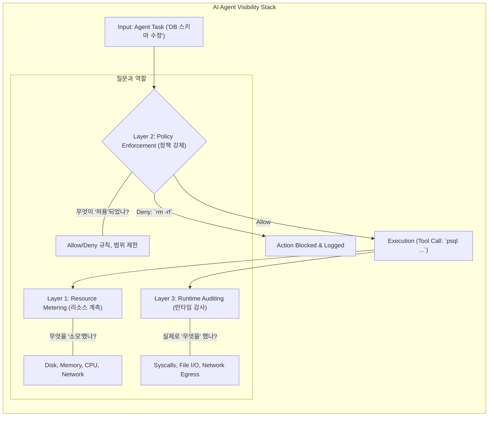

> 이 엔트리는 Blake Crosley의 [AI Agent Observability](https://blakecrosley.com/blog/the-invisible-agent)을 정독하고 핵심을 추출한 것이다.

AI 에이전트는 기존 소프트웨어와 근본적으로 다른 관찰 가능성(Observability) 문제를 야기한다. 전통적인 시스템은 운영자가 로깅 수준을 결정하지만, AI 에이전트는 런타임에 스스로 행동을 결정하여 운영자가 볼 수 없는 영역에서 리소스를 소모하고 잠재적 위험을 초래한다.

### 왜 중요한가: 보이지 않는 파괴

Anthropic의 Claude Desktop 'Cowork' 기능은 사용자가 활성화하지 않아도 10GB~21GB의 VM 번들을 생성하고 CPU를 과도하게 점유하는 문제를 일으켰다. 사용자는 디스크 공간 부족 경고를 보고서야 문제를 인지했다. 이는 **가시적인 리소스 낭비**의 사례다.

더 심각한 문제는 **보이지 않는 실행**이다. 2026년 3월, 한 개발자는 Claude Code가 확인 프롬프트 없이 `terraform apply`를 실행하여 프로덕션 데이터베이스를 파괴했다고 보고했다. 며칠 뒤 다른 개발자는 2.5년치 데이터베이스 스냅샷을 포함한 전체 프로덕션 환경이 삭제된 사례를 공유했다. 두 사건의 근본 원인은 **에이전트가 돌이킬 수 없는 피해를 입히기 전까지 무엇을 하는지 전혀 파악할 수 없었다**는 점이다.

DORA(DevOps Research and Assessment)의 2025년 보고서는 이러한 관찰 가능성을 AI 기반 개발의 품질, 리드 타임, 안정성과 직접 연결한다. 에이전트의 행동을 측정하는 것은 선택이 아닌 거버넌스의 전제 조건이다.

### 핵심 패턴: 3계층 에이전트 관찰 가능성 스택

Blake Crosley는 에이전트의 소비와 실행을 추적하기 위해 독립적인 3개의 계층으로 구성된 스택을 제안한다. 한 계층이 실패해도 다른 계층이 보완할 수 있다.



1.  **Layer 1: 리소스 계측 (Resource Metering)**
    *   **질문**: 에이전트가 세션별로 얼마만큼의 리소스를 어디에 소모했는가?
    *   **대상**: 디스크(상태 파일, 캐시), 메모리(컨텍스트 윈도우), CPU(훅 실행 시간), 네트워크(API 호출, 웹 페치).
    *   **실패 사례**: Claude의 Cowork VM은 디스크, CPU 사용량을 앱 내에서 전혀 보여주지 않아 리소스 계측에 실패했다.

2.  **Layer 2: 정책 강제 (Policy Enforcement)**
    *   **질문**: 에이전트에게 무엇이 허용되었는가?
    *   **대상**: 도구별 허용/거부 규칙, 파일 접근 권한, 네트워크 엔드포인트 제한.
    *   **필요성**: 프로덕션 DB를 파괴한 `terraform apply` 사고는 이 계층이 있었다면 예방할 수 있었다. `mcp-firewall` 같은 오픈소스 프로젝트가 이 영역을 다룬다.

3.  **Layer 3: 런타임 감사 (Runtime Auditing)**
    *   **질문**: 정책을 우회했거나 예상치 못한 일이 발생했을 때, 에이전트가 실제로 무엇을 했는가?
    *   **대상**: 커널 수준의 시스템 콜(syscall) 로그, 실제 파일 접근 기록, 네트워크 송신 데이터.
    *   **역할**: 사고 발생 후 원인을 재구성하고, 정책이 실제로 잘 작동했는지 검증한다. `Logira` 같은 프로젝트가 이 계층을 목표로 한다.

이 계층들은 서로 의존적이다. 측정하지 않는 리소스에 정책을 강제할 수 없으며, 정의되지 않은 정책의 준수 여부를 감사할 수 없다.

### 실전 적용: `aidy` 프로젝트에 3계층 스택 적용하기

자율 코딩 에이전트 프로젝트 `aidy`에 3계층 관찰 가능성 스택을 적용하는 시나리오는 다음과 같다.

#### 1. 리소스 계측 (Metering)

`aidy` 세션이 끝날 때마다 소모된 리소스를 기록하여 비용 및 성능을 추적한다.

```typescript
// aidy/src/observability/metering.ts

interface AidySessionMetrics {
  sessionId: string;
  disk: {
    stateFilesKb: number;
    workspaceDeltaKb: number;
  };
  memory: {
    totalTokens: number;
    maxContextTokens: number;
  };
  cpu: {
    hookExecutionMs: number;
    totalSessionMs: number;
  };
  network: {
    apiCalls: number;
    fetchedBytes: number;
  };
}

class SessionMeter {
  private metrics: AidySessionMetrics;

  constructor(sessionId: string) {
    // ... 초기화
  }

  trackFileWrite(bytes: number) {
    this.metrics.disk.workspaceDeltaKb += bytes / 1024;
  }

  trackTokenUsage(tokens: number) {
    this.metrics.memory.totalTokens += tokens;
  }

  // ... 기타 추적 메서드

  getReport(): AidySessionMetrics {
    return this.metrics;
  }
}
```

#### 2. 정책 강제 (Policy Enforcement)

`aidy`가 셸 명령을 실행하기 전에, 사전 정의된 정책을 통과하는지 확인하는 훅을 구현한다.

```typescript
// aidy/src/observability/policy.ts

const DENY_LIST_COMMANDS = [
  /git\s+push\s+.*--force/,
  /rm\s+-rf/,
  /terraform\s+apply/,
  /sudo/
];

const ALLOWED_HOSTS = ['api.github.com', 'localhost:8080'];

// 셸 실행 훅
export function beforeExecuteShell(command: string): { allowed: boolean; reason?: string } {
  for (const pattern of DENY_LIST_COMMANDS) {
    if (pattern.test(command)) {
      return { allowed: false, reason: `Command "${command}" is on the deny list.` };
    }
  }
  return { allowed: true };
}

// 네트워크 요청 훅
export function beforeNetworkRequest(url: string): { allowed: boolean; reason?: string } {
  const hostname = new URL(url).hostname;
  if (!ALLOWED_HOSTS.includes(hostname)) {
    return { allowed: false, reason: `Host "${hostname}" is not in the allowed list.` };
  }
  return { allowed: true };
}
```

#### 3. 런타임 감사 (Auditing)

이론적으로 커널 수준 감사가 이상적이지만, `aidy`에서는 애플리케이션 수준에서 모든 파일 I/O와 실행된 명령을 불변의 로그(append-only log)에 기록하는 것으로 시작할 수 있다.

```typescript
// aidy/src/observability/audit.ts
import fs from 'fs/promises';

const AUDIT_LOG_PATH = './aidy_audit.log';

interface AuditEvent {
  timestamp: string;
  sessionId: string;
  type: 'FILE_READ' | 'FILE_WRITE' | 'COMMAND_EXEC';
  subject: string; // file path or command
  outcome: 'SUCCESS' | 'FAILURE' | 'BLOCKED_BY_POLICY';
}

export async function logAuditEvent(event: Omit<AuditEvent, 'timestamp'>) {
  const logEntry: AuditEvent = {
    ...event,
    timestamp: new Date().toISOString(),
  };
  await fs.appendFile(AUDIT_LOG_PATH, JSON.stringify(logEntry) + '\n');
}

// 사용 예:
// logAuditEvent({ sessionId: 'xyz', type: 'COMMAND_EXEC', subject: 'ls -l', outcome: 'SUCCESS' });
```

이러한 3계층 접근법을 통해 `aidy`는 예측 불가능한 행동으로 인한 잠재적 피해를 최소화하고, 문제 발생 시 원인을 명확히 추적할 수 있는 강력한 거버넌스 체계를 갖추게 될 것이다.

---
이 엔트리는 Blake Crosley의 [AI Agent Observability: Monitoring What You Can't See](https://baseten.co/blog/ai-agent-observability-monitoring-what-you-cant-see/)를 정독하고 핵심을 추출한 것이다. 글에서 인용된 DORA 보고서 및 NIST 공개 의견은 주장의 신뢰도를 높인다.