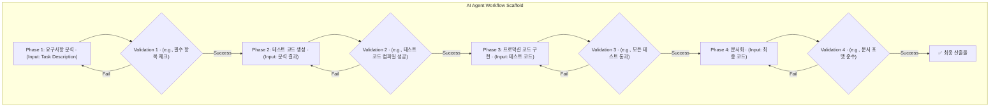

## 문제 제기: 자율 에이전트의 '주니어 개발자' 문제

단순한 작업을 수행하는 AI 에이전트는 이미 충분히 많습니다. 100줄 코드로 GitHub 이슈를 해결하는 `mini-swe-agent` 같은 사례는 인상적이지만, 복잡하고 다단계에 걸친 엔지니어링 태스크 앞에서는 쉽게 길을 잃습니다. 이는 마치 경험이 부족한 주니어 개발자가 명확한 절차 없이 큰 기능을 맡았을 때와 같습니다. 요구사항을 오해하고, 테스트를 건너뛰며, 예외 처리를 잊고, 결국 동작하지 않거나 품질이 낮은 결과물을 내놓습니다.

이 문제의 근본 원인은 '절차의 부재'입니다. 시니어 엔지니어는 머릿속에 내재된 강력한 작업 절차(workflow)를 따릅니다. 예를 들어, 새로운 UI 컴포넌트를 개발할 때 다음과 같은 단계를 거칩니다.

1.  **요구사항 분석 및 명세 확인**: 디자인 시스템과 API 명세를 확인한다.
2.  **테스트 케이스 선행 작성 (TDD)**: 컴포넌트의 props에 따른 다양한 상태를 테스트하는 코드를 먼저 작성한다.
3.  **핵심 로직 구현**: 테스트를 통과시키는 최소한의 코드를 작성한다.
4.  **리팩터링 및 최적화**: 가독성, 성능, 재사용성을 고려하여 코드를 개선한다.
5.  **문서화**: Storybook이나 관련 문서에 사용법과 예시를 추가한다.

AI 에이전트에게 단순히 "이 컴포넌트를 만들어줘"라고 요청하면, 이 중요한 절차들을 건너뛸 확률이 매우 높습니다. '워크플로 스캐폴딩(Workflow Scaffolding)'은 이러한 시니어 엔지니어의 암묵적인 절차를 명시적인 코드로 구조화하여, AI 에이전트가 이를 강제로 따르게 만드는 방법론입니다.

## 워크플로 스캐폴딩의 핵심 구조

워크플로 스캐폴딩은 단순히 프롬프트를 길게 늘어놓는 Chain-of-Thought와는 다릅니다. 각 단계를 독립적인 'Phase'로 정의하고, 각 Phase는 명확한 목표, 입력, 출력, 그리고 가장 중요한 '검증(Validation)' 단계를 가집니다.



이 구조의 핵심은 각 단계가 이전 단계의 성공적인 '검증'을 전제로 한다는 점입니다. 테스트 코드가 컴파일조차 되지 않으면(Validation 2 실패), 프로덕션 코드 구현 단계(Phase 3)로 넘어가지 않습니다. 이는 에이전트의 자유도를 의도적으로 제한하여, 결과물의 안정성과 품질을 보장하는 '가드레일' 역할을 합니다.

이러한 접근법은 외부 권위 자료에서도 중요하게 다루어집니다.
- **자료**: Google AI, "ReAct: Synergizing Reasoning and Acting in Language Models" (ICLR 2023)
- **인사이트**: LLM이 단순히 생각(Thought)만 하는 것이 아니라, 구체적인 행동(Action)을 취하고 그 결과를 관찰(Observation)하는 사이클을 반복할 때 더 복잡한 문제를 해결할 수 있음을 보여줍니다. 워크플로 스캐폴딩은 이 ReAct 패턴을 엔지니어링 절차에 맞게 고도로 구조화한 버전으로 볼 수 있습니다.

### 실전 구현: 코드가 아니라 선언으로

워크플로 스캐폴딩을 TypeScript 클래스로 직접 구현하는 것은 대부분 오버엔지니어링입니다. 실전에서 작동하는 스캐폴딩은 **도구가 이미 제공하는 인프라 위에 절차를 선언**하는 것으로 충분합니다.

이 위키 프로젝트(`ai-study`)의 실제 스캐폴딩 구조:

```
코드 작성 (에이전트) → git commit 시도
                        ↓
               pre-commit hook: npm run build
                  ├── 실패 → 커밋 차단 (Phase 1 Validation)
                  └── 성공 → 커밋 완료
                               ↓
                          git push → Vercel 자동 배포
                               ↓
                          /compound 실행 → CHANGELOG + 회고 + 솔루션 박제
```

이것이 곧 워크플로 스캐폴딩입니다:
- **Phase 1** (코드 작성): 에이전트가 CLAUDE.md의 규약을 읽고 구현
- **Validation 1** (`pre-commit` 빌드 훅): `npm run build` 실패 시 커밋 자체가 차단
- **Phase 2** (배포): Validation 1 통과 후에만 push 가능
- **Validation 2** (Vercel 배포 + 브라우저 QA): 배포 실패 시 자동 알림, `/qa`로 시각적 검증
- **Phase 3** (지식 박제): `/compound`로 학습을 문서화

핵심 인사이트: **CLAUDE.md에 절차를 선언하고 git hook으로 검증을 강제**하는 것이 2026년의 실전 패턴입니다. 에이전트는 CLAUDE.md를 읽고 절차를 따르며, hook이 가드레일 역할을 합니다. 별도의 스캐폴딩 엔진 코드를 작성할 필요가 없습니다.

### Claude Code 하네스에서의 스캐폴딩 레이어

| 레이어 | 역할 | 예시 |
|--------|------|------|
| **CLAUDE.md** | 절차 선언 (Phase 정의) | "커밋 전 빌드, 푸시 후 /compound" |
| **Git Hooks** | Validation 강제 | `pre-commit`: `npm run build` |
| **Slash Commands** | Phase 자동화 | `/ship`, `/compound`, `/qa` |
| **Claude Memory** | 컨텍스트 유지 | 이전 실패 패턴 기억, 반복 방지 |

이 4개 레이어가 조합되면 시니어 엔지니어의 암묵적 절차가 **에이전트가 따를 수밖에 없는 명시적 구조**로 변환됩니다.

## 워크플로 스캐폴딩 vs 다른 접근법

| 접근법 | 특징 | 한계 |
|--------|------|------|
| **단순 프롬프팅** | "이 기능 만들어줘" | 절차 건너뜀, 품질 불안정 |
| **Chain-of-Thought** | "단계별로 생각해서 만들어줘" | 생각만 하고 검증 없음 |
| **워크플로 스캐폴딩** | Phase별 분리 + 각 단계 Validation | 검증 실패 시 다음 단계 차단 |
| **Spec-Driven Development** | 스펙 문서 → 에이전트 구현 → 스펙 대비 검증 | 스캐폴딩의 상위 호환 |

워크플로 스캐폴딩은 Chain-of-Thought의 "생각"에 **행동 + 검증**을 추가한 것이고, Spec-Driven Development는 스캐폴딩의 Phase 정의를 **정형화된 스펙 문서**로 격상시킨 것입니다.

## 자기 점검

1. 워크플로 스캐폴딩이 단순한 Chain-of-Thought 프롬프팅과 구별되는 가장 중요한 특징은 무엇인가요?
2. CLAUDE.md + git hook 조합이 별도의 스캐폴딩 엔진 코드보다 실전에서 더 효과적인 이유는 무엇인가요?
3. 자신의 프로젝트에서 에이전트가 건너뛰는 절차가 있다면, 그것을 어떤 레이어(CLAUDE.md / hook / slash command)로 강제할 수 있을까요?
4. Spec-Driven Development와 워크플로 스캐폴딩의 관계를 자기 말로 설명해보세요.