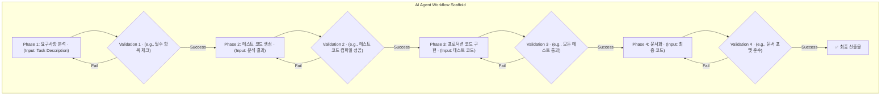

## 문제 제기: 자율 에이전트의 '주니어 개발자' 문제

단순한 작업을 수행하는 AI 에이전트는 이미 충분히 많습니다. 100줄 코드로 GitHub 이슈를 해결하는 `mini-swe-agent` 같은 사례는 인상적이지만, 복잡하고 다단계에 걸친 엔지니어링 태스크 앞에서는 쉽게 길을 잃습니다. 이는 마치 경험이 부족한 주니어 개발자가 명확한 절차 없이 큰 기능을 맡았을 때와 같습니다. 요구사항을 오해하고, 테스트를 건너뛰며, 예외 처리를 잊고, 결국 동작하지 않거나 품질이 낮은 결과물을 내놓습니다.

이 문제의 근본 원인은 '절차의 부재'입니다. 시니어 엔지니어는 머릿속에 내재된 강력한 작업 절차(workflow)를 따릅니다. 예를 들어, 새로운 UI 컴포넌트를 개발할 때 다음과 같은 단계를 거칩니다.

1.  **요구사항 분석 및 명세 확인**: 디자인 시스템과 API 명세를 확인한다.
2.  **테스트 케이스 선행 작성 (TDD)**: 컴포넌트의 props에 따른 다양한 상태를 테스트하는 코드를 먼저 작성한다.
3.  **핵심 로직 구현**: 테스트를 통과시키는 최소한의 코드를 작성한다.
4.  **리팩터링 및 최적화**: 가독성, 성능, 재사용성을 고려하여 코드를 개선한다.
5.  **문서화**: Storybook이나 관련 문서에 사용법과 예시를 추가한다.

AI 에이전트에게 단순히 "이 컴포넌트를 만들어줘"라고 요청하면, 이 중요한 절차들을 건너뛸 확률이 매우 높습니다. '워크플로 스캐폴딩(Workflow Scaffolding)'은 이러한 시니어 엔지니어의 암묵적인 절차를 명시적인 코드로 구조화하여, AI 에이전트가 이를 강제로 따르게 만드는 방법론입니다.

## 워크플로 스캐폴딩의 핵심 구조

워크플로 스캐폴딩은 단순히 프롬프트를 길게 늘어놓는 Chain-of-Thought와는 다릅니다. 각 단계를 독립적인 'Phase'로 정의하고, 각 Phase는 명확한 목표, 입력, 출력, 그리고 가장 중요한 '검증(Validation)' 단계를 가집니다.



이 구조의 핵심은 각 단계가 이전 단계의 성공적인 '검증'을 전제로 한다는 점입니다. 테스트 코드가 컴파일조차 되지 않으면(Validation 2 실패), 프로덕션 코드 구현 단계(Phase 3)로 넘어가지 않습니다. 이는 에이전트의 자유도를 의도적으로 제한하여, 결과물의 안정성과 품질을 보장하는 '가드레일' 역할을 합니다.

이러한 접근법은 외부 권위 자료에서도 중요하게 다루어집니다.
- **자료**: Google AI, "ReAct: Synergizing Reasoning and Acting in Language Models" (ICLR 2023)
- **인사이트**: LLM이 단순히 생각(Thought)만 하는 것이 아니라, 구체적인 행동(Action)을 취하고 그 결과를 관찰(Observation)하는 사이클을 반복할 때 더 복잡한 문제를 해결할 수 있음을 보여줍니다. 워크플로 스캐폴딩은 이 ReAct 패턴을 엔지니어링 절차에 맞게 고도로 구조화한 버전으로 볼 수 있습니다.

### TypeScript를 이용한 워크플로 스캐폴딩 구현 예제

프론트엔드 개발자에게 친숙한 TypeScript로 간단한 스캐폴딩 엔진을 구현해 보겠습니다. React 컴포넌트 생성을 자동화하는 에이전트를 위한 워크플로입니다.

```typescript
// llm.ts - 간단한 LLM 호출 함수 (의사 코드)
async function callLLM(prompt: string): Promise<string> {
  // 실제로는 OpenAI, Anthropic 등의 API를 호출합니다.
  console.log(`\n--- LLM Input ---\n${prompt}\n--- End LLM Input ---\n`);
  const response = `// LLM generated code for: ${prompt.substring(0, 50)}...`;
  console.log(`\n--- LLM Output ---\n${response}\n--- End LLM Output ---\n`);
  return response;
}

// validator.ts - 간단한 검증 함수 (의사 코드)
async function validateTypeScript(code: string): Promise<boolean> {
  // 실제로는 tsc나 esbuild를 이용해 컴파일을 시도합니다.
  const success = !code.includes("ERROR");
  console.log(`Validation result: ${success}`);
  return success;
}

interface Phase {
  name: string;
  promptTemplate: (context: any) => string;
  validator: (output: string, context: any) => Promise<boolean>;
  onSuccess: (output: string, context: any) => void;
}

class WorkflowScaffold {
  private phases: Phase[];
  private context: any = {};

  constructor(phases: Phase[]) {
    this.phases = phases;
  }

  async run(initialContext: any) {
    this.context = { ...initialContext };

    for (const phase of this.phases) {
      console.log(`\n===== Executing Phase: ${phase.name} =====`);
      const prompt = phase.promptTemplate(this.context);
      let output = "";
      let isValid = false;
      let retries = 3;

      while (!isValid && retries > 0) {
        output = await callLLM(prompt);
        isValid = await phase.validator(output, this.context);
        if (!isValid) {
          retries--;
          console.log(`Validation failed. Retries left: ${retries}`);
          // 실패 시, 실패 정보와 함께 프롬프트를 개선하여 재시도할 수 있습니다.
        }
      }

      if (!isValid) {
        throw new Error(`Phase ${phase.name} failed after multiple retries.`);
      }

      phase.onSuccess(output, this.context);
    }
    console.log("\n✅ Workflow completed successfully.");
    return this.context.finalOutput;
  }
}

// 워크플로 정의
const createReactComponentWorkflow = new WorkflowScaffold([
  {
    name: "Generate PropTypes",
    promptTemplate: (ctx) => `
      Create TypeScript interface for a React component named '${ctx.componentName}' 
      with props: ${JSON.stringify(ctx.props)}.
      Export the interface as '${ctx.componentName}Props'.
    `,
    validator: async (output, ctx) => output.includes(`export interface ${ctx.componentName}Props`),
    onSuccess: (output, ctx) => { ctx.propsInterface = output; },
  },
  {
    name: "Generate Component Stub",
    promptTemplate: (ctx) => `
      ${ctx.propsInterface}

      Create a functional React component '${ctx.componentName}' that uses the above props interface.
      Return a simple div containing the component name.
    `,
    validator: async (output, ctx) => validateTypeScript(output) && output.includes(`const ${ctx.componentName}`),
    onSuccess: (output, ctx) => { ctx.componentCode = output; },
  },
  {
    name: "Final Assembly",
    promptTemplate: (ctx) => `
        Combine the following interface and component code into a single, valid TypeScript file.
        
        Interface:
        ${ctx.propsInterface}

        Component:
        ${ctx.componentCode}
    `,
    validator: async (output) => validateTypeScript(output),
    onSuccess: (output, ctx) => { ctx.finalOutput = output; }
  }
]);

// 워크플로 실행
createReactComponentWorkflow.run({
  componentName: "UserProfile",
  props: { name: "string", age: "number" },
}).then(console.log).catch(console.error);
```

이 코드는 각 단계(Props 생성, 컴포넌트 스텁 생성)가 명확히 분리되어 있고, 각 단계마다 결과물을 검증합니다. 만약 LLM이 유효하지 않은 TypeScript 코드를 생성하면, `validator`가 이를 감지하고 재시도를 유도하거나 프로세스를 중단시켜 더 큰 오류를 방지합니다.

## 프로젝트 적용 사례: `ai-study/tarosaju`

`tarosaju` 프로젝트는 사용자의 질문에 대해 타로 카드 기반의 답변을 생성하는 AI 서비스입니다. 초기 버전은 단일 프롬프트로 카드 해석과 조언을 한 번에 생성했습니다. 이 방식은 종종 카드 각각의 의미를 무시하거나, 일관성 없는 조언을 하는 문제를 낳았습니다.

**경험적 관찰**: 단일 프롬프트 방식의 약 20%는 사용자가 "카드의 의미와 조언이 연결되지 않아요"라는 피드백을 줄 정도로 품질이 저하되었습니다.

워크플로 스캐폴딩을 적용하여 이 문제를 해결할 수 있습니다.

1.  **Phase 1: 개별 카드 의미 분석**: 뽑힌 카드 3장(과거, 현재, 미래)의 상징과 핵심 의미를 각각 독립적으로 분석하여 구조화된 JSON으로 출력합니다.
    *   **Validator**: 출력된 결과가 유효한 JSON 형식이며, 3개의 카드에 대한 key-value 쌍을 모두 포함하는지 검증합니다.
2.  **Phase 2: 스토리라인 종합**: 1단계에서 생성된 개별 의미들을 입력받아, '과거-현재-미래'의 시간적 흐름에 맞는 하나의 유기적인 스토리라인으로 종합합니다.
    *   **Validator**: 결과물에 '과거', '현재', '미래' 키워드가 모두 포함되어 있으며, 문장들이 논리적으로 연결되는지 다른 LLM을 이용해 평가합니다. (e.g., "다음 문장이 논리적으로 자연스러운가? true/false")
3.  **Phase 3: 공감형 조언 생성**: 2단계에서 생성된 스토리라인을 바탕으로, 사용자에게 실질적인 도움을 줄 수 있는 따뜻하고 공감적인 어투의 조언을 생성합니다.
    *   **Validator**: 생성된 조언의 어조가 '공감적', '긍정적'인지 또 다른 LLM(Sentiment/Tone Analyzer)을 통해 검증합니다.

이처럼 스캐폴딩을 적용하면, 각 단계의 품질을 독립적으로 제어할 수 있어 최종 결과물의 일관성과 신뢰도를 크게 향상시킬 수 있습니다.

## 2026년 트렌드: 동적 및 자기 개선 스캐폴드

현재의 스캐폴딩은 주로 정적으로 정의됩니다. 하지만 앞으로는 더욱 발전된 형태가 표준이 될 것입니다.

*   **동적 스캐폴딩 (Dynamic Scaffolding)**: 에이전트가 태스크의 복잡도를 초기에 분석하여, 간단한 작업에는 3단계 스캐폴드를, 복잡한 작업에는 7단계 스캐폴드를 동적으로 선택하거나 생성하여 적용합니다.
*   **자기 개선 스캐폴드 (Self-Improving Scaffold)**: 특정 Phase에서 반복적으로 Validation에 실패할 경우, 에이전트가 스스로 실패 원인을 분석하고 해당 Phase의 프롬프트 템플릿이나 검증 로직을 수정하여 워크플로 자체를 개선합니다. 이는 `Hermes Agent`에서 논의된 자기 개선 루프를 프로세스 레벨로 확장한 개념입니다.

이러한 트렌드는 AI 에이전트가 단순히 주어진 작업을 수행하는 것을 넘어, '더 나은 방식으로 일하는 법'을 스스로 학습하는 시대로의 전환을 의미합니다. 시니어 엔지니어의 절차를 코드화하는 것을 넘어, 그 절차 자체를 최적화하는 에이전트가 등장할 것입니다.

## 자기 점검

1.  워크플로 스캐폴딩이 단순한 Chain-of-Thought 프롬프팅과 구별되는 가장 중요한 특징은 무엇인가요?
2.  코드 예제의 `validator` 함수의 역할은 무엇이며, 이것이 왜 에이전트의 안정성에 기여하나요?
3.  `tarosaju` 프로젝트 사례에서 스캐폴딩을 적용했을 때, 단일 프롬프트 방식에 비해 어떤 점이 개선될 것으로 기대할 수 있나요?
4.  이 개념을 동료에게 설명한다면? "우리 팀의 코드 리뷰 봇에 워크플로 스캐폴딩을 적용하자고 제안해야 합니다. 단순 프롬프팅 대비 어떤 장점(예: 비용, 품질, 속도)을 강조하여 동료를 설득하시겠습니까?"
5.  **실습 과제**: `ai-study/moneyflow` 프로젝트에서 '일일 시장 동향을 요약하고, 가장 주목할 만한 뉴스 3가지를 선정하여 투자 의견을 제시하는' 작업을 위한 3단계 워크플로 스캐폴드를 정의해보세요. 각 단계의 이름, 목표, 그리고 `validator`가 무엇을 검증해야 하는지 구체적으로 서술하세요. (코딩은 필요 없습니다. 설계만 해보세요.)