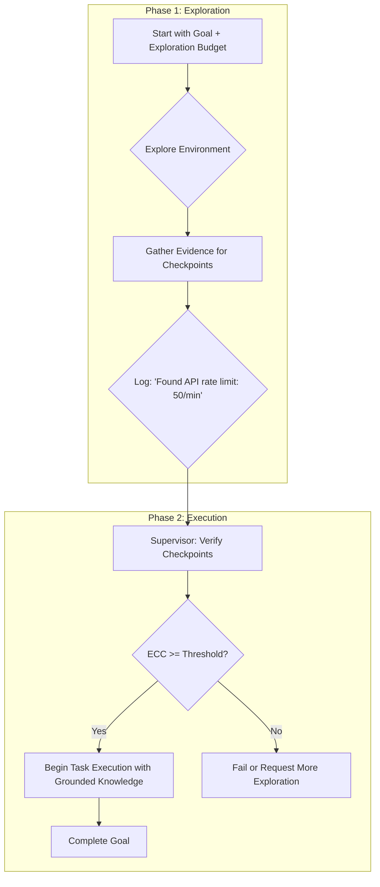

> 이 엔트리는 Blake Crosley의 글 "AI Agents Need Exploration Checkpoints"(blakecrosley.com)와, 글이 인용한 논문 ["Look Before You Leap"](https://arxiv.org/abs/2605.16143)를 정독하고 핵심을 추출한 것이다.

## 왜 중요한가: 성급한 실행의 함정 (Premature Exploitation)

AI 에이전트는 종종 충분한 정보를 얻기 전에 성급하게 행동하여 실패한다. Ziang Ye 등의 논문 "Look Before You Leap"는 이 문제를 '성급한 착취(Premature Exploitation)'라고 명명했다. 이는 에이전트가 미지의 환경 일부를 보고, 나머지 부분도 익숙할 것이라 가정하며, 충분한 탐색 없이 계획을 실행하는 현상이다.

이 문제는 속도나 자신감처럼 보일 수 있지만, 근본 원인은 '발견(discovery)' 단계를 건너뛰는 데 있다. 기존 ReAct 같은 에이전트 루프는 '생각 → 행동 → 관찰'을 반복하며 가시적인 진행에 보상을 준다. 이 구조는 에이전트가 로컬 환경의 규칙을 파악하기보다, 익숙해 보이는 상황에서 바로 실행 예산을 소진하도록 유도하는 숨겨진 편향을 가지고 있다.

성급한 실행은 다음과 같은 구체적인 실패로 이어진다.

| 환경 | 성급한 실행의 예시 |
| :--- | :--- |
| **코드베이스** | 소유권, 테스트, 호출 지점을 확인하지 않고 코드를 수정한다. |
| **웹 앱** | 숨겨진 상태, 비활성화된 컨트롤, 유효성 검사 규칙을 확인하지 않고 UI 플로우를 클릭한다. |
| **리서치 과제** | 핵심 1차 자료를 찾기 전에 종합 보고서를 작성한다. |
| **데이터 과제** | 단위, Null 값의 의미, 컬럼 출처를 확인하지 않고 데이터를 변환한다. |
| **로컬 시스템** | 사용자가 소유한 작업을 식별하지 않고 프로세스를 종료하거나 변경한다. |

결론적으로, 긴 컨텍스트, 빠른 툴 호출, 자신감 있는 문장은 에이전트가 환경을 '발견'했다는 증거가 될 수 없다. 에이전트는 자신이 그린 '지도'를 먼저 보여줘야 한다.

---

## 핵심 패턴: 탐색 체크포인트와 Explore-then-Act

이 문제에 대한 해결책은 **탐색(Exploration)**과 **실행(Execution)**을 명확히 분리하고, 탐색 단계를 측정 가능하게 만드는 것이다. "Look Before You Leap" 논문은 이를 위한 두 가지 핵심 개념을 제안한다.

### 1. 탐색 체크포인트 커버리지 (Exploration Checkpoint Coverage, ECC)

ECC는 에이전트의 '발견'을 정량적으로 측정하는 지표다. 각 환경에 대해 유능한 탐험가라면 발견해야 할 중요한 사실(체크포인트)의 집합을 미리 정의한다.

- **체크포인트란?** 도달 가능한 상태, 중요한 객체, 유효한 상호작용, 제약 조건 등 환경 고유의 검증 가능한 사실.
- **측정 방식:** `(에이전트가 탐색 중 확인한 체크포인트 수) / (전체 정의된 체크포인트 수)`

ECC의 장점은 언어 모델의 판단이 아닌, 환경 내부의 결정론적 증거(로그, API 응답, 시스템 상태)로 검증할 수 있다는 점이다.

| 체크포인트 유형 | 증거 예시 |
| :--- | :--- |
| **State** | 특정 화면, 파일, 테이블, 프로세스 상태를 관찰했는가? |
| **Object** | 관련 버튼, 함수, 컬럼, 소스, 의존성을 식별했는가? |
| **Affordance** | 어떤 작업이 성공하고 실패하는지 검증했는가? |
| **Constraint** | 권한, 스키마, 정책, API 호출 제한, 소유권 경계를 발견했는가? |
| **Failure Case** | 무해한 탐색을 시도하고 경로가 왜 작동하지 않는지 기록했는가? |
| **Plan Impact** | 발견한 증거로 인해 기존 계획을 수정했는가? |

### 2. 먼저 탐색하고, 다음에 행동하라 (Explore-then-Act)

이것은 에이전트의 작업 흐름을 두 단계로 나누는 아키텍처 패턴이다.



논문의 실험 결과는 이 패턴의 유효성을 뒷받침한다 (구체 수치는 원논문 참조).
- **편향 교정:** 표준 과제 지향 강화학습은 오히려 에이전트의 탐색을 좁고 반복적으로 만들어, ECC를 떨어뜨리는 경향이 보고됐다.
- **성능 향상:** 탐색 롤아웃과 실행 롤아웃을 교차시켜 각자의 검증 가능한 보상으로 최적화하면, 곧바로 실행하는 베이스라인보다 다운스트림 성공률이 개선됐다고 보고됐다.

---

## 실전 적용: moneyflow 프로젝트의 금융 데이터 분석 에이전트

`moneyflow` 프로젝트에서 "2024년 1분기 카드 지출 내역을 분석하고 카테고리별 리포트를 생성하라"는 작업을 에이전트에게 부여하는 시나리오를 가정해보자.

### 실패 시나리오 (성급한 실행)

1. 에이전트는 일반적인 지식("카드 내역은 `transactions` 테이블에 있겠지")을 기반으로 `SELECT category, SUM(amount) FROM transactions WHERE date BETWEEN '2024-01-01' AND '2024-03-31' GROUP BY category;` 쿼리를 즉시 실행한다.
2. 하지만 이 환경에서는 `amount` 컬럼이 음수(지출)와 양수(수입)를 모두 포함하고, `category`가 `NULL`인 경우는 '미분류'가 아닌 '데이터 동기화 오류'를 의미한다.
3. 결과적으로 에이전트는 잘못된 데이터를 기반으로 엉터리 리포트를 생성한다.

### Explore-then-Act 적용 시나리오

**1. 탐색 체크포인트 정의**

- `[C1] SCHEMA_VERIFIED`: `transactions` 테이블의 스키마(컬럼명, 데이터 타입)를 `DESCRIBE` 명령으로 확인했는가?
- `[C2] AMOUNT_SEMANTICS_UNDERSTOOD`: `amount` 컬럼에 양수와 음수가 섞여 있는지, 통화 단위는 무엇인지 샘플 쿼리(`SELECT amount FROM transactions LIMIT 10;`)로 확인했는가?
- `[C3] NULL_SEMANTICS_DEFINED`: `category` 컬럼의 `NULL` 값의 의미를 `COUNT(*)`와 `COUNT(category)`를 비교하여 파악했는가?
- `[C4] DATA_FRESHNESS_CONFIRMED`: 데이터가 2024년 1분기를 모두 포함하는지 `MAX(date)`와 `MIN(date)`로 확인했는가?

**2. TypeScript 기반 감독자 코드 예시**

```typescript
// 체크포인트 상태를 관리하는 간단한 클래스
class CheckpointManager {
  private covered: Set<string> = new Set();
  private allCheckpoints: string[];

  constructor(checkpoints: string[]) {
    this.allCheckpoints = checkpoints;
  }

  // 에이전트의 관찰(observation)을 기반으로 체크포인트 달성 여부를 기록
  logEvidence(observation: string) {
    if (observation.includes("Column: amount, Type: DECIMAL")) {
      this.covered.add("C1_SCHEMA_VERIFIED");
    }
    if (observation.includes("Sample amounts: -50.25, 100.00")) {
      this.covered.add("C2_AMOUNT_SEMANTICS_UNDERSTOOD");
    }
    // ... 다른 체크포인트 로깅 로직
  }

  // ECC(Exploration Checkpoint Coverage) 계산
  getCoverage(): number {
    return this.covered.size / this.allCheckpoints.length;
  }
}

// 에이전트 실행을 감독하는 Supervisor
class AgentSupervisor {
  async runTask(agent: Agent, goal: string) {
    const checkpoints = [
      "C1_SCHEMA_VERIFIED",
      "C2_AMOUNT_SEMANTICS_UNDERSTOOD",
      "C3_NULL_SEMANTICS_DEFINED",
      "C4_DATA_FRESHNESS_CONFIRMED",
    ];
    const checkpointManager = new CheckpointManager(checkpoints);

    // 1. 탐색 단계 (Exploration Phase)
    console.log("--- Starting Exploration Phase ---");
    const explorationBudget = 5; // 최대 5번의 탐색 행동 허용
    await agent.explore(goal, explorationBudget, checkpointManager);

    // 2. 검증 단계 (Verification)
    const coverage = checkpointManager.getCoverage();
    console.log(`--- Exploration Complete. ECC: ${coverage * 100}% ---`);

    if (coverage < 0.8) { // 80% 이상 충족하지 못하면 실패 처리
      throw new Error(`Exploration failed. ECC is too low: ${coverage}`);
    }

    // 3. 실행 단계 (Execution Phase)
    console.log("--- Checkpoints passed. Starting Execution Phase ---");
    const result = await agent.execute(goal);
    return result;
  }
}
```

이 접근법은 에이전트가 데이터베이스에 대해 '안다고 주장'하는 대신, '알고 있음을 증명'하도록 강제한다. 이를 통해 에이전트의 신뢰성과 안전성을 크게 향상시킬 수 있다.

> 이 엔트리는 Blake Crosley의 글 "AI Agents Need Exploration Checkpoints"(blakecrosley.com)를 정독하고, 글이 인용한 핵심 논문인 Ziang Ye 등의 ["Look Before You Leap: Autonomous Exploration for LLM Agents"](https://arxiv.org/abs/2605.16143)의 아이디어를 추출하여 재구성한 것이다.