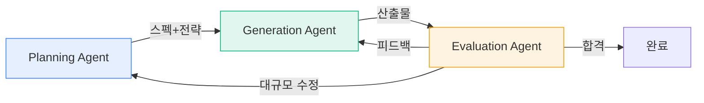

## 왜 이 패턴이 중요한가

단일 에이전트는 2~3시간이면 컨텍스트 한계에 부딪힌다. Anthropic이 공식 발표한 3-Agent 하네스는 **멀티시간(4시간+) 자율 개발 세션**을 가능하게 하는 아키텍처다.

핵심 통찰: 문제를 "더 큰 컨텍스트"로 풀지 않고 **"에이전트를 분리하고 컨텍스트를 리셋"**하는 방식으로 해결.

---

## 3-Agent 구조



| Agent | 역할 | 핵심 설계 |
|-------|------|-----------|
| **Planning** | 태스크 분석, 접근 전략 결정 | 구조화된 스펙 문서(JSON) 생성 |
| **Generation** | 실제 작업 수행 (코드, 디자인) | 스펙 기반 구현, 중간 체크포인트 |
| **Evaluation** | 독립적 품질 평가 + 피드백 | Few-shot calibration, Playwright 사용 |

---

## 컨텍스트 관리: 압축이 아닌 리셋

> "Every new context window is amnesia."

압축(compaction)의 문제: 모델이 컨텍스트 한계 근처에서 **지나치게 신중해진다** — 새로운 시도를 꺼리고 안전한 선택만 함.

Anthropic의 해법:

```
Planning Agent
  ↓ (구조화된 아티팩트: JSON feature spec)
[컨텍스트 리셋]
  ↓
Generation Agent (깨끗한 컨텍스트에서 시작)
  ↓ (산출물)
[컨텍스트 리셋]
  ↓
Evaluation Agent (깨끗한 컨텍스트에서 시작)
```

**구조화된 아티팩트**가 에이전트 간 상태를 전달. 전체 대화 히스토리가 아니라 **핵심 결정 사항만** 다음 에이전트에 전달.

---

## Evaluation Agent: 자기 과신 깨뜨리기

모델은 자기 출력을 과대평가한다 — 특히 디자인 같은 주관적 영역에서 심각.

### Few-shot Calibration

평가 에이전트에 **명시적 점수 기준 + 예시**를 제공:

```
점수 8/10 예시: [구체적 디자인 설명]
점수 5/10 예시: [구체적 디자인 설명]
점수 3/10 예시: [구체적 디자인 설명]

이제 이 산출물을 평가하라:
```

### Frontend 디자인 평가 4메트릭

| 메트릭 | 평가 내용 |
|--------|-----------|
| Design Quality | 시각적 일관성, 레이아웃, 색상 |
| Originality | 템플릿 느낌이 아닌 창의적 접근 |
| Craft | 디테일, 간격, 정렬 — 완성도 |
| Functionality | 실제로 동작하는가 |

### Playwright 기반 라이브 평가

평가 에이전트가 **실제로 브라우저를 열어** 결과물을 확인. 스크린샷이 아닌 실시간 인터랙션.

---

## 반복 사이클

5~15회 반복이 일반적. 때로 **4시간+** 소요.

```
Generation → Evaluation → 피드백 → Generation → Evaluation → ...
                                    (5~15 cycles)
```

**종료 조건**: 4메트릭 모두 기준 초과 + Evaluation Agent의 "승인".

---

## aidy-architect와의 비교

| 요소 | Anthropic 3-Agent | aidy-architect |
|------|-------------------|----------------|
| 에이전트 수 | 3 (P/G/E) | 4+ (Architect + iOS/Android/Server Worker) |
| 분업 기준 | 역할 (계획/실행/평가) | 플랫폼 (iOS/Android/Server) |
| 컨텍스트 관리 | 리셋 + 아티팩트 전달 | tmux 4-pane 독립 세션 |
| 평가 | Evaluation Agent (LLM) | Gate-1/Gate-2 (구조 테스트 + LLM) |
| 아티팩트 | JSON feature spec | API Contract + Work Order |
| 세션 길이 | 4시간+ | 3시간 스프린트 |

**공통점**: 생성과 평가를 분리. 구조화된 아티팩트로 에이전트 간 상태 전달.

**차이점**: Anthropic은 역할별 분리, aidy는 플랫폼별 분리. aidy의 Gate-1은 Computational Sensor(테스트), Anthropic의 Evaluation은 Inferential Sensor(LLM 평가).

---

## 내 프로젝트에 적용하기

- [ ] **aidy-architect에 Evaluation Agent 추가**: 현재 Gate-1(빌드+테스트)은 Computational만. LLM 기반 코드 리뷰(Inferential Sensor) 추가 검토
- [ ] **컨텍스트 리셋 전략**: 현재 aidy는 tmux로 물리적 격리. Planning→Generation 전달 시 아티팩트 포맷을 더 구조화할 수 있는지 검토
- [ ] **Few-shot Calibration**: MoneyFlow의 LLM-as-a-Judge에 점수 기준 예시를 추가하여 평가 정확도 향상

---

## 자기 점검

1. 왜 컨텍스트 압축보다 리셋이 나은 경우가 있는가?
2. 생성 에이전트가 자기 출력을 평가하면 안 되는 이유는?
3. Few-shot Calibration이 평가 품질을 높이는 메커니즘은?
4. aidy-architect의 Gate-1과 Anthropic의 Evaluation Agent의 차이를 Fowler의 Computational/Inferential 프레임워크로 설명할 수 있는가?
5. (열린 질문) 이 패턴을 비개발(디자인, 글쓰기) 영역에 적용하려면 평가 메트릭을 어떻게 설계해야 하나?

### 실습 과제

본인의 에이전트 워크플로우에서 "생성과 평가가 같은 세션에서 이루어지는" 곳을 찾아, 평가를 별도 프롬프트/세션으로 분리해보라. 품질 차이를 비교.

---

## 출처

- [Anthropic Designs Three-Agent Harness Supports Long-Running Full-Stack AI Development](https://www.infoq.com/news/2026/04/anthropic-three-agent-harness-ai/) — InfoQ (2026.04)
