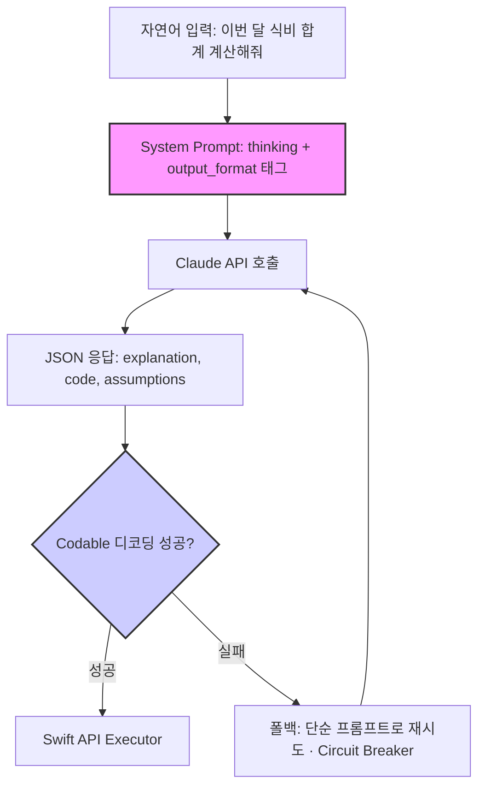

LLM을 시스템 컴포넌트로 통합할 때 개발자가 부딪히는 벽은 출력의 비결정성입니다. Claude로 코드 생성 에이전트를 만들 때, `temperature`를 0으로 낮춰도 동일 입력에 대해 결과가 미묘하게 흔들립니다. 이는 모델의 결함이 아니라 GPU 부동소수점 연산이 결합법칙을 따르지 않고, 대규모 병렬 커널의 누적 순서·클라우드 라우팅·배칭 구성이 실행마다 달라지기 때문입니다. Anthropic도 문서에서 temperature 0이 완전한 결정성을 보장하지 않는다고 명시합니다.

따라서 목표는 비결정성을 *없애는 것*이 아니라, **후처리 레이어가 흡수할 수 있는 형태로 가두는 것**입니다. 출력의 *내용*은 흔들려도 출력의 *구조*(예: JSON 키 집합)는 고정한다면, 에이전트는 마법 상자가 아니라 명세를 가진 소프트웨어 컴포넌트가 됩니다. 이 글은 Claude의 표준 기법인 XML 태그 기반 구조화 프롬프트로 이 일관성을 확보하는 전략과 그 한계를 정리합니다.

> 정정: 초기 메모에서는 XML 태그를 '문서에 없는 비공식 설정'으로 표현했지만, 이는 사실과 다릅니다. `<thinking>`, `<output_format>` 같은 XML 태그는 Anthropic이 [공식 프롬프트 엔지니어링 가이드](https://platform.claude.com/docs/en/build-with-claude/prompt-engineering/claude-prompting-best-practices)에서 권장하는 표준 기법입니다. 본문은 이 표준 기법을 *엔지니어링 관점에서 어떻게 신뢰성 있게 운용하는가*에 초점을 둡니다.

## System Prompt: 지시문이 아니라 입출력 인터페이스

대부분 개발자는 System Prompt를 에이전트의 역할(persona)이나 기본 지침을 적는 공간으로만 씁니다. 하지만 Claude에서는 System Prompt가 모델의 추론 흐름과 출력 형식을 직접 규정하는 인터페이스 역할을 합니다. iOS로 비유하면, `Info.plist`나 빌드 설정으로 앱의 런타임 동작을 미세 조정하는 것과 비슷한 위치입니다.

Anthropic은 마크다운 헤더나 평문 구분자보다 XML 태그가 프롬프트 섹션 간 경계를 더 명확하게 만든다고 설명합니다. Claude가 XML 스타일 태그를 파싱하도록 설계됐기 때문입니다. 특히 코드 생성 에이전트에서는 이 구조화가 출력 안정성에 큰 차이를 만듭니다.

### XML 태그로 사고 흐름과 출력 형식 고정하기

핵심 패턴은 두 가지입니다. (1) `<thinking>` 블록으로 모델이 따라야 할 추론 단계를 명시하고, (2) `<output_format>` 블록으로 최종 결과의 구조를 강제합니다.

```xml
<instructions>
  사용자의 자연어 요청을 Swift 코드로 변환한다.
  반드시 <thinking>에서 추론한 뒤 <output_format> 스키마에 맞는 JSON만 출력한다.
</instructions>

<thinking>
  1. 요청을 Swift 코드로 옮기기 위한 요구사항을 분석한다.
  2. 핵심 로직을 담을 함수와 데이터 구조를 설계한다.
  3. 에러 처리와 엣지 케이스(빈 배열, nil, 음수 금액)를 고려한다.
  4. 완전한 Swift 코드를 작성한다.
</thinking>

<output_format>
  반드시 아래 키만 가진 JSON 한 덩어리로만 응답한다. 마크다운 코드펜스 금지.
  {
    "explanation": "코드에 대한 1~2문장 설명",
    "code": "완전한 Swift 소스. import 포함, 컴파일 가능해야 함",
    "assumptions": ["분석 단계에서 가정한 항목 배열"]
  }
</output_format>
```

`<thinking>` 블록은 "단계별로 생각하라"는 막연한 지시보다 훨씬 구체적이어서, 복잡한 문제에서 모델이 단계를 건너뛰는 것을 줄입니다. `<output_format>`은 결과를 항상 같은 JSON 키 집합으로 반환하게 만들어, 후속 파서가 `Codable`로 안정적으로 디코딩할 수 있게 합니다. iOS 앱에서 API 응답을 `Codable`로 파싱하는 것과 같은 원리입니다.

호출 측 검증 코드까지 함께 두면 계약이 완성됩니다. force unwrap 없이 디코딩 실패를 명시적으로 처리하는 것이 핵심입니다.

```swift
struct AgentResult: Codable {
  let explanation: String
  let code: String
  let assumptions: [String]
}

func parse(_ raw: String) -> AgentResult? {
  // 모델이 가끔 코드펜스를 붙이므로 방어적으로 벗겨낸다
  let trimmed = raw
    .replacingOccurrences(of: "```json", with: "")
    .replacingOccurrences(of: "```", with: "")
    .trimmingCharacters(in: .whitespacesAndNewlines)

  guard let data = trimmed.data(using: .utf8) else { return nil }
  return try? JSONDecoder().decode(AgentResult.self, from: data)
}
```

`parse`가 `nil`을 반환하면 그것이 곧 폴백 트리거입니다. 출력의 *내용*은 매번 달라져도, 디코딩 성공/실패라는 *이진 신호*는 결정적으로 다룰 수 있습니다. 이것이 비결정성을 후처리 레이어로 가두는 방식의 실체입니다.

moneyflow에서 사용자의 자연어 요청을 거래 분석 Swift 코드로 변환하는 에이전트를 만든다고 하면, 항상 동일한 JSON 구조로 결과를 받아야 파이프라인 신뢰성을 확보할 수 있습니다. 바로 이 지점에서 `<output_format>` 강제가 효과를 냅니다.

## 트레이드오프: 일관성을 얻고 유연성을 잃는다

구조화 프롬프트는 강력하지만 비용이 있습니다. 출력을 고정할수록 모델의 탐색 여지가 줄어듭니다. 상황에 따라 이 제약이 오히려 해가 됩니다.

| 기법 | 장점 | 단점 (언제 피해야 하나) | moneyflow 적용 사례 |
| :--- | :--- | :--- | :--- |
| XML 태그 기반 사고·출력 제어 | 높은 출력 일관성, 후처리 용이, 디코딩 실패를 명확한 폴백 신호로 사용 가능 | 자유로운 형식·창의적 해결이 필요한 작업엔 부적합. 출력이 스키마에 갇혀 풍부한 설명이 잘림 | "이번 달 수입 상위 3개 카테고리 리포트 코드 짜줘" 요청에 항상 같은 JSON 스키마의 Swift 조각 생성 |
| 자연어 역할·규칙 부여 | 유연성 유지, 다양한 상황 대처 우수 | 출력 구조 보장 안 됨. 동일 입력에도 형식이 흔들려 파싱 실패율 상승 | 형식이 정해지지 않은 탐색적 데이터 분석 코드 초안 |
| Few-shot 예제 제공 | 원하는 스타일·구조를 구체 예시로 학습 | 프롬프트 길이·비용 증가, 예시에 과적합되어 새 패턴 대응력 저하 | async/await 컨벤션을 따르는 코드를 생성하도록 유도 |

이 기법들이 만능은 아닙니다. Anthropic이 모델 버전을 올리면 동일 프롬프트의 출력 분포가 바뀔 수 있습니다. 따라서 프로덕션에서는 프롬프트 구조 하나에만 의존하지 말고, 아래 다이어그램처럼 검증·폴백 레이어와 결합해야 합니다.



핵심은 `Claude API 호출`을 예측 불가능한 언어 모델이 아니라, 입출력 명세와 폴백 경로를 가진 시스템 컴포넌트처럼 다루는 것입니다. 디코딩 실패가 곧 회로 차단 신호가 됩니다.

## 그래서 뭘 해야 하는가: 점진적 적용과 방어

1. **베이스라인부터 측정하세요.** 처음부터 정교한 태그 구조에 의존하지 말고, 표준 프롬프트로 기준 성능(파싱 실패율, 형식 불일치율)을 먼저 잰 뒤, 문제가 큰 영역에 한해 `<output_format>` 강제를 점진 도입합니다. 추정으로 레버를 당기지 마세요.
2. **System Prompt를 코드로 다루세요.** Git으로 버전을 관리하고, 응답이 목표 JSON 스키마를 준수하는지 검증하는 회귀 테스트 스위트를 둡니다. 모델 버전을 올리기 전에 이 테스트를 돌려 출력 분포 변화를 잡아냅니다.
3. **폴백을 준비하세요.** 구조화 출력이 깨질 때를 대비해, 더 단순하고 안정적인 프롬프트로 전환하는 Circuit Breaker 패턴과, 어긋난 출력을 파싱·보정하는 후처리 레이어를 둡니다. 디코딩 실패를 결정적 신호로 삼아 자동 전환을 트리거하면 됩니다.

결론적으로 XML 태그 기반 구조화는 코드 생성 에이전트의 출력을 신뢰할 수 있는 형태로 가두는 표준이자 강력한 도구입니다. 다만 출력 비결정성을 근본적으로 없애지는 못하므로, 테스트·버전 관리·폴백이라는 소프트웨어 엔지니어링 기본기와 결합해야 비로소 AI가 '가능성'에서 신뢰할 수 있는 '컴포넌트'로 바뀝니다.

## 자기 점검

- 모델 버전 업그레이드로 `<output_format>` 준수율이 떨어진다면, 어떤 회귀 테스트와 아키텍처 안전장치로 이를 조기에 감지하고 흡수할 수 있을까요?
- 당신의 프로젝트에서 어떤 기능은 창의성이, 어떤 기능은 출력 예측성이 더 중요한지 구분하고 이유를 설명해 보세요.
- System Prompt 변경이 왜 코드 변경과 동일한 수준의 리뷰·테스트·배포 절차를 거쳐야 하는지 설명해 보세요.
- 진행 중인 AI 프로젝트에서 출력이 가장 불안정한 지점은 어디인가요? `<output_format>` 강제 + Codable 검증 + 폴백 중 무엇을 어떻게 적용할지 구체적 계획을 세워보세요.

---

출처:
- [Claude prompting best practices — Claude API Docs](https://platform.claude.com/docs/en/build-with-claude/prompt-engineering/claude-prompting-best-practices)
- [Use XML tags to structure your prompts — Claude Docs](https://anthropic.mintlify.app/en/docs/build-with-claude/prompt-engineering/use-xml-tags)
