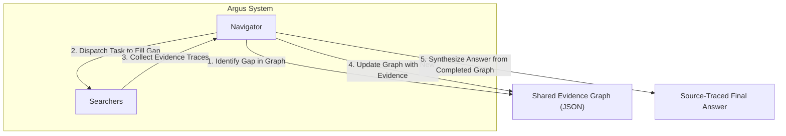

> 이 엔트리는 Blake Crosley의 [Deep Research Agents Need Evidence Graphs](https://blakecrosley.com/blog/deep-research-agents-evidence-graphs)을 정독하고 핵심을 추출한 것이다.

이 엔트리는 Blake Crosley의 [Deep Research Agents Need Evidence Graphs](https://blakecrosley.com/blog/deep-research-agents-need-evidence-graphs/)를 정독하고 핵심을 추출한 것이다.

### 왜 중요한가: '그럴듯한' 보고서의 함정

AI 리서치 에이전트는 수많은 웹 페이지를 검색하고 긴 보고서를 생성할 수 있다. 하지만 **"긴 답변이 누락된 증거를 찾았다는 것을 증명하지는 않는다."** 이것이 현재 딥 리서치 에이전트가 직면한 핵심 문제다.

기존의 '병렬 탐색(Parallel Search)' 방식은 여러 에이전트가 동시에 비슷한 키워드로 검색하게 하여, 다음과 같은 실패 모드로 이어진다:
- **소스 중복**: 서로 보완적인 정보를 찾기보다, 유사한 소스 클러스터를 중복해서 가져온다.
- **핵심 증거 누락**: 각 에이전트가 가장 찾기 쉬운 정보에만 매달려, 정작 찾기 어려운 핵심 증거는 계속 누락된다.
- **추론 공간 부족**: 컨텍스트 창이 단순 발췌문으로 가득 차, 정보 간의 관계나 누락된 부분을 추론할 공간이 사라진다.
- **검증되지 않은 주장 생존**: 여러 요약본이 병합되는 과정에서, 근거가 약한 주장이 검증 없이 최종 보고서에 포함될 수 있다.

이러한 문제에 대해 Zhen Zhang 등이 발표한 **Argus** 논문은 리서치를 '무차별 병렬 탐색'이 아닌 **'증거 조립(evidence assembly)'**으로 재정의할 것을 제안한다. 이는 에이전트의 작업 평가 기준을 '얼마나 많이 검색했는가'에서 '증거 커버리지를 얼마나 확보했는가'로 전환하는 것을 의미한다.

### 핵심 패턴: 증거 그래프 (Evidence Graph)

증거 그래프는 최종 보고서의 텍스트가 굳어지기 전, 그 논리적 뼈대를 시각화하는 자료구조다. 이는 에이전트가 무엇을 증명했고, 무엇을 추론했으며, 무엇이 아직 해결되지 않았는지 명확히 보여준다.

#### Argus 아키텍처: Navigator와 Searcher

Argus는 딥 리서치 역할을 두 가지로 명확히 분리한다.

1.  **Navigator**: 중앙에서 공유된 증거 그래프를 관리한다. 어떤 주장에 근거가 부족한지('Gap')를 파악하고, 이 'Gap'을 메우기 위한 구체적인 작업을 Searcher에게 할당한다. 최종적으로는 완성된 그래프를 기반으로 소스가 명시된 답변을 생성한다.
2.  **Searcher**: Navigator로부터 하위 질의를 받아 ReAct 스타일로 증거를 수집하고, '증거 트레이스(evidence trace)'를 반환하는 역할에 집중한다.

이 구조는 "더 많은 에이전트를 실행"하는 것에서 "누락된 증거를 조립"하는 것으로 작업의 본질을 바꾼다.



#### 증거 그래프의 구성 요소

증거 그래프는 단순히 노드와 엣지의 집합이 아니다. 각 요소는 명확한 목적을 가진다.

-   **노드(Nodes)**:
    -   `Claim`: 보고서가 만들고자 하는 주장 또는 문장.
    -   `Source`: 주장을 뒷받침하는 1차 또는 2차 자료 (e.g., 논문, API 응답).
    -   `Evidence`: 소스에서 직접 추출한 인용문, 표, 그림, 코드 실행 결과.
    -   `Gap`: 근거가 없거나, 약하거나, 오래된 주장을 나타내는 노드.
    -   `Conflict`: 서로 다른 두 소스나 관찰이 충돌하는 지점.
    -   `Scope limit`: 주장의 범위를 제한하여 과잉 주장을 방지하는 경계.

-   **엣지(Edges)**:
    -   `supports`: Evidence가 Claim을 뒷받침함.
    -   `contradicts`: Source가 다른 Source나 Claim과 모순됨.
    -   `depends_on`: 특정 Claim이 다른 Claim이나 정의에 의존함.
    -   `missing_for`: Gap이 특정 Claim의 근거가 없음을 나타냄.
    -   `dispatches`: Navigator가 Searcher에게 Gap을 채우도록 작업을 할당함.

#### TypeScript로 표현한 증거 그래프 구조

복잡한 그래프 데이터베이스 없이, JSON 객체만으로도 충분히 검사 가능한(inspectable) 증거 그래프를 구현할 수 있다.

```typescript
type NodeType = 'Claim' | 'Source' | 'Evidence' | 'Gap' | 'Conflict' | 'ScopeLimit';
type EdgeType = 'supports' | 'contradicts' | 'depends_on' | 'missing_for';

interface EvidenceNode {
  id: string; // e.g., "claim-001", "source-argus-paper"
  type: NodeType;
  content: string; // The actual text or a summary
  metadata?: {
    source_url?: string;
    page_number?: number;
  };
}

interface EvidenceEdge {
  from: string; // Node ID
  to: string;   // Node ID
  type: EdgeType;
  description?: string; // e.g., "Relies on definition of 'MoE'"
}

interface EvidenceGraph {
  nodes: EvidenceNode[];
  edges: EvidenceEdge[];
}

// 예시: "Argus는 병렬 탐색보다 효율적이다"라는 주장을 표현
const exampleGraph: EvidenceGraph = {
  nodes: [
    { id: 'claim-1', type: 'Claim', content: 'Argus is more efficient than parallel search.' },
    { id: 'source-1', type: 'Source', content: 'Zhen Zhang et al., Argus Paper', metadata: { source_url: '...' } },
    { id: 'evidence-1', type: 'Evidence', content: 'Argus gains 12.7 points with eight parallel Searchers...', metadata: { page_number: 1 } },
    { id: 'gap-1', type: 'Gap', content: 'Efficiency claim needs comparison on non-benchmark tasks.' }
  ],
  edges: [
    { from: 'evidence-1', to: 'claim-1', type: 'supports' },
    { from: 'source-1', to: 'evidence-1', type: 'supports' },
    { from: 'gap-1', to: 'claim-1', type: 'missing_for' }
  ]
};
```

### 실전 적용: `ai-study` 위키 엔트리 생성 자동화

`ai-study` 프로젝트에서 특정 논문이나 기술에 대한 위키 엔트리를 생성하는 AI 에이전트를 개발한다고 가정해보자.

**시나리오**: "Mixture-of-Experts (MoE) 기술의 최신 동향"에 대한 위키 엔트리를 생성하는 작업.

1.  **기존 방식의 문제**: 에이전트가 다수의 MoE 관련 논문(e.g., Mixtral, GMoE)을 읽고 하나의 긴 MDX 파일을 생성한다. 리뷰어는 최종 텍스트만 보고, "이 주장이 정말 Mixtral 논문 3.2절에서 나온 게 맞나?" 또는 "혹시 GMoE 논문의 한계를 누락한 것은 아닌가?"를 확인하기 위해 원본 논문들을 다시 읽어야 한다. 이 과정은 비효율적이며, 에이전트의 '그럴듯한 거짓말'을 놓치기 쉽다.

2.  **증거 그래프 적용**:
    -   **1단계 (증거 수집)**: 에이전트는 논문을 읽으며 `paper.json`과 유사한 형태로 구조화된 정보를 추출한다. 논문의 각 주장, 실험 결과, 한계점 등을 개별 `Claim`, `Evidence`, `ScopeLimit` 노드로 만든다.
    -   **2단계 (그래프 조립)**: `Navigator` 역할을 하는 상위 에이전트가 이 노드들을 조립하며 증거 그래프를 구축한다. "MoE는 훈련 비용이 높다"라는 `Claim` 노드를 생성하고, 여러 논문에서 가져온 `Evidence` 노드들을 `supports` 엣지로 연결한다. 만약 최신 논문에서 훈련 비용을 절감하는 기법을 제시했다면, `Conflict` 노드를 추가하여 상반된 증거를 명시한다.
    -   **3단계 (리뷰 및 개선)**: 리뷰어는 최종 MDX 텍스트와 함께 **증거 그래프(JSON 또는 시각화된 다이어그램)를 리뷰 패킷**으로 받는다. 리뷰어는 더 이상 전체 텍스트를 의심하며 읽을 필요가 없다. 대신 그래프를 보며 다음과 같은 질문에 즉시 답을 얻을 수 있다.
        -   "가장 핵심적인 주장에 `Gap` 노드가 연결되어 있는가?" (→ 추가 리서치 필요)
        -   "특정 주장이 너무 많은 소스에 의존하고 있는가? (과잉 일반화 가능성)"
        -   "Navigator가 어떤 `Gap`을 채우기 위해 Searcher를 보냈는가?" (에이전트의 리서치 과정을 추적)

이 방식은 리뷰어의 작업을 단순 '교정'에서 '에이전트의 추론 과정 검증'으로 격상시킨다. 결과적으로 `ai-study` 위키의 신뢰도와 깊이를 획기적으로 향상시킬 수 있다.