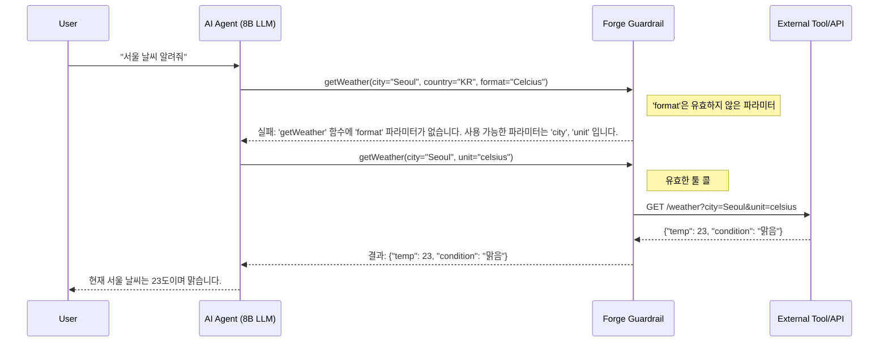

LLM 에이전트가 아무리 똑똑한 계획을 세워도, 단 한 번의 잘못된 API 호출은 전체 워크플로우를 무너뜨립니다. 특히 비용 효율적인 8B(80억 파라미터)급 소형 언어 모델(SLM)을 운영 환경에 적용하려 할 때 이 문제는 더욱 심각해집니다. 각 단계의 성공률이 90%라 해도, 5단계 작업의 최종 성공률은 0.9의 5제곱, 즉 약 59%로 급락하기 때문입니다. 이런 '연쇄 실패' 문제 때문에 값비싼 프론티어 모델에 의존해야만 했던 개발자들에게, **Forge** 프레임워크는 새로운 가능성을 제시합니다. 모델 자체를 바꾸는 대신 그 주변의 실행 환경, 즉 '가드레일'을 견고하게 구축함으로써 8B 모델의 에이전트 작업 성공률을 53%에서 99% 수준(보고된 수치 99.3%)까지 끌어올린 사례는, AI 엔지니어링의 패러다임이 모델 중심에서 시스템 중심으로 이동하고 있음을 보여줍니다.

> **출처/검증**: Forge는 Antoine Zambelli가 공개한 자가 호스팅 LLM 툴 콜링용 오픈소스 신뢰성 레이어다(PyPI 패키지 `forge-guardrails`). "8B 모델 53% → 99%" 수치와 가드레일 스택(재시도 유도, 단계 강제, 오류 복구, 컨텍스트 압축)은 ACM CAIS 2026 데모 논문 *"Forge: Closing the Agentic Reliability Gap Between Self-Hosted and Frontier Language Models"* (DOI: 10.1145/3786335.3813193)에 보고된 내용이다. 단, 이 99% 수치는 특정 벤치마크 세트 기준이며, 공개된 자가 호스팅 구성(Ministral-3 8B)은 전체 26개 시나리오 평균 86.5%, 최난도 티어 76%로 보고된다. 즉 "거의 모든 작업에서 99%"가 아니라 "가드레일이 SLM을 프로덕션급으로 끌어올린다"가 정확한 해석이다.

## 실패를 예측하고 복구하는 Forge의 가드레일 스택

Forge는 LLM과 실제 툴(API) 사이에 위치하는 미들웨어 또는 프록시 서버 역할을 수행하며, LLM의 출력이 최종적으로 툴을 호출하기 전에 여러 단계의 검증과 수정을 거치게 합니다. 이는 단순히 입력과 출력을 필터링하는 기존 가드레일 개념을 넘어, 에이전트의 '행동' 자체를 교정하는 적극적인 개입에 가깝습니다.

Forge의 가드레일 스택은 보고된 바로는 네 개의 기둥으로 구성됩니다.

1. **응답 검증 (Response Validation)** — 모델 출력이 스키마에 맞는지 호출 전에 검사. 깨진 툴 콜은 rescue parsing으로 복구 시도.
2. **재시도 유도 (Retry Nudges)** — 잘못된 출력에 대해 최소한의 교정 피드백만 주입해 모델이 스스로 고치게 함.
3. **단계 강제 (Step Enforcement)** — 워크플로우 그래프에서 추론한 "터미널 툴 호출 전에 반드시 거쳐야 하는 단계"를 추적. 모델이 단계를 건너뛰려 하면 되돌려 보냄.
4. **컨텍스트 관리 (Context Management)** — VRAM 예산을 인지하는 계층형 압축 전략(NoCompact / TieredCompact / SlidingWindowCompact)으로 토큰 예산을 하드웨어 한계 안에 유지.

이 글에서는 그중에서도 안정성 향상의 핵심으로 가장 자주 인용되는 두 패턴, **재시도 유도(Retry Nudges)**와 **오류 복구(Error Recovery)**를 깊이 다룹니다.

### 재시도 유도 (Retry Nudges): 실패를 학습 데이터로 전환하기

소형 모델은 종종 존재하지 않는 파라미터를 호출하거나, JSON 형식을 지키지 못하는 등 기계적인 실수를 저지릅니다. 일반적인 에이전트 프레임워크는 이런 경우 그냥 오류를 반환하고 작업을 중단시키지만, Forge는 다릅니다.

Forge는 모델이 잘못된 툴 콜을 생성했을 때, 단순히 실패로 처리하지 않고 "어떤 부분이 어떻게 잘못되었는지"를 설명하는 작고 외과적인(surgical) 시스템 메시지를 컨텍스트에 추가하여 모델에게 다시 입력을 보냅니다. 전체 루프를 처음부터 재시작하는 게 아니라 "출력이 유효하지 않다, 이유는 이것이다, 다시 시도하라" 수준의 최소 피드백만 주입하는 것이 특징입니다. 이는 마치 컴파일러가 개발자에게 구문 오류를 알려주는 것과 같습니다. 모델은 이 피드백을 통해 자신의 실수를 교정하고 다음 시도에서 올바른 툴 콜을 생성할 확률이 높아집니다. Forge의 ablation 연구에 따르면 이 재시도 유도는 응답 검증·단계 강제·컨텍스트 관리와 함께 4대 핵심 기둥 중 하나로, 비활성화 시 성공률 하락이 가장 큰 레버 중 하나로 보고됩니다.



### 오류 복구 (Error Recovery): 실행 환경의 문제를 모델에게 투명하게 전달

툴 자체가 일시적으로 실패할 수도 있습니다 (예: 503 서버 오류). 기존 방식에서는 에이전트가 이 실패의 원인을 알지 못한 채 같은 시도를 반복하다가 결국 포기하게 됩니다. 하지만 Forge는 실행 환경에서 발생한 HTTP 404·503 같은 raw 오류를, 모델이 추론에 활용할 수 있는 명시적·구조화된 오류 피드백 형태로 변환해 컨텍스트에 전달합니다(여기서는 `ToolResolutionError`를 그런 명시적 예외 타입의 대표 예시로 부른다 — 핵심은 "raw 실패를 모델이 읽을 수 있는 신호로 번역한다"는 설계 원칙이다).

모델은 "툴을 찾을 수 없음" 또는 "서버 오류"라는 명확한 피드백을 받게 되므로, 다른 툴을 사용하거나 사용자에게 문제를 알리는 등 대안적인 행동을 계획할 수 있습니다. Forge 보고에 따르면 이런 오류 복구 계층이 없으면 프론티어 모델조차 일시적 실행 오류에서 스스로 회복하지 못하는 경우가 많았는데, 이는 모델의 역량 문제가 아니라 아키텍처의 부재가 문제였음을 시사합니다. 즉 "모델을 더 똑똑하게"가 아니라 "실패를 모델이 읽을 수 있게"가 레버였습니다.

## Forge 패턴의 트레이드오프와 적용 전략

Forge의 접근 방식은 강력하지만 모든 상황에 적합한 만병통치약은 아닙니다. 장점과 단점을 명확히 이해하고 전략적으로 도입해야 합니다.

| 접근 방식 | 장점 | 단점 | 적합한 사용 사례 |
| :--- | :--- | :--- | :--- |
| **Forge 가드레일** | - 소형 모델(SLM)로 프론티어급 안정성 달성<br />- 모델 교체 없이 시스템만으로 성능 향상<br />- 명시적인 오류 피드백으로 모델의 후속 행동 개선 | - 모든 툴 콜에 검증 과정이 추가되어 약간의 지연 시간(latency) 발생<br />- 복잡한 가드레일 로직 자체를 설계하고 유지보수하는 비용 발생 | - 비용에 민감하고 안정성이 중요한 프로덕션 에이전트 (예: 자동 거래, 고객 지원 봇)<br />- 레거시 API나 외부 시스템처럼 제어할 수 없는 툴을 연동할 때 |
| **프롬프트 기반 교정** | - 별도 시스템 없이 프롬프트 수정만으로 구현 가능<br />- 구현이 매우 간단하고 빠름 | - 모델의 해석에 따라 성능이 좌우되어 일관성 보장 어려움<br />- 복잡한 오류 상황을 프롬프트만으로 모두 처리하기 힘듦 | - 프로토타이핑 또는 내부용 툴과 같이 안정성 요구치가 높지 않은 초기 단계 에이전트 |
| **모델 파인튜닝 (RL)** | - 특정 툴 사용에 대해 모델을 특화시켜 근본적인 성능 향상<br />- 추론 시 추가적인 지연 시간 없음 | - 높은 수준의 전문성과 많은 양의 학습 데이터 필요<br />- 새로운 툴이 추가될 때마다 파인튜닝 다시 해야 함 | - 사용해야 할 툴의 종류가 고정적이고, 호출 빈도가 매우 높은 대규모 서비스 (예: 특정 도메인 전용 AI 비서) |

## 프로젝트 적용: `auto-trade` 시스템 안정성 강화

`auto-trade` 프로젝트는 실시간으로 시장 데이터를 분석하고 거래 API를 호출해야 하므로, 단 한 번의 잘못된 API 호출이 금전적 손실로 이어질 수 있습니다. 현재 GPT-4와 같은 고비용 프론티어 모델을 사용하여 안정성을 확보하고 있다면, Forge 패턴을 적용하여 8B급의 경량 모델(SLM)로 이전하는 것을 고려해볼 수 있습니다.

1.  **프록시 서버 도입**: `auto-trade`의 API 호출 로직과 LLM 사이에 Forge 파이썬 프레임워크의 프록시 서버를 배치합니다. 기존 코드를 거의 수정하지 않고도 Forge의 가드레일 기능을 투명하게 적용할 수 있습니다.
2.  **거래 API 스키마 정의**: `place_order`, `get_balance` 등 거래소 API의 모든 파라미터(타입, 필수 여부, 허용 범위 등)를 명확하게 정의합니다. Forge는 이 스키마를 기반으로 LLM이 생성한 툴 콜을 검증합니다.
3.  **재시도 및 서킷 브레이커 구현**: Forge의 재시도 유도(Retry Nudge)를 활성화하여, `symbol='BTC'` 대신 `ticker='BTC'`와 같이 잘못된 파라미터 이름으로 API를 호출하려는 시도를 모델 스스로 교정하게 합니다. 또한, 거래소 API가 5xx 오류를 반환할 경우, 이를 `ToolResolutionError`로 변환하여 모델에게 전달하고, 연속 실패 시에는 일시적으로 해당 API 호출을 중단시키는 서킷 브레이커(Circuit Breaker) 로직을 추가하여 시스템 과부하를 방지합니다.

Swift 환경에서는 Forge를 직접 사용할 수 없지만, 핵심 아이디어를 차용하여 구현할 수 있습니다. API 호출을 담당하는 `APIService` 레이어에서 LLM의 응답(JSON)을 파싱하기 전에, 정의된 함수 스키마와 대조하여 유효성을 검사하는 `ToolCallValidator`를 추가하는 방식입니다.

```swift
// Swift로 구현하는 Forge의 핵심 아이디어: ToolCallValidator

struct ToolParameter {
    let name: String
    let type: Any.Type
    let isRequired: Bool
}

struct ToolSchema {
    let functionName: String
    let parameters: [ToolParameter]
}

struct ToolCallValidator {
    let schemas: [ToolSchema]

    func validate(toolCall: LLMToolCall) -> (isValid: Bool, feedback: String?) {
        guard let schema = schemas.first(where: { $0.functionName == toolCall.functionName }) else {
            return (false, "실패: '\(toolCall.functionName)' 함수를 찾을 수 없습니다.")
        }

        for param in schema.parameters {
            if param.isRequired && toolCall.arguments[param.name] == nil {
                return (false, "실패: '\(param.name)' 파라미터가 누락되었습니다.")
            }
        }

        for (argName, _) in toolCall.arguments {
            if !schema.parameters.contains(where: { $0.name == argName }) {
                return (false, "실패: '\(argName)'는 유효하지 않은 파라미터입니다. 사용 가능한 파라미터: \(schema.parameters.map { $0.name }.joined(separator: ", "))")
            }
        }

        return (true, nil)
    }
}

// 사용 예시
let agentResponse = // LLM으로부터 받은 툴 콜 JSON
let validator = ToolCallValidator(schemas: [/* 거래 API 스키마들 */])
let result = validator.validate(toolCall: agentResponse)

if !result.isValid {
    // result.feedback을 컨텍스트에 추가하여 LLM에게 재시도 요청
} else {
    // API 호출 실행
}
```

이러한 가드레일 아키텍처는 모델의 지능에만 의존하는 것을 넘어, 견고한 소프트웨어 엔지니어링 원칙을 AI 시스템에 적용하는 접근법입니다. 모델의 확률적 특성을 제어 가능한 시스템의 영역으로 가져옴으로써, 우리는 더 적은 비용으로 더 예측 가능하고 안정적인 AI 에이전트를 만들 수 있습니다.

## 자기 점검

-   Forge의 '재시도 유도(Retry Nudges)'가 단순한 재시도(Retry) 메커니즘과 근본적으로 다른 점은 무엇이며, 이것이 왜 소형 모델의 성공률에 결정적인 영향을 미칠까요?
-   `ToolResolutionError`와 같은 명시적 오류 타입 정의가 모델의 후속 행동 계획에 어떤 긍정적인 변화를 가져올 수 있을까요?
-   Forge의 접근법이 효과적이지 않거나 오히려 오버헤드가 될 수 있는 애플리케이션 시나리오는 어떤 것이 있을까요?
-   현재 진행 중인 프로젝트에서 LLM 에이전트가 가장 자주 실패하는 지점은 어디인가요? 그 실패의 원인이 모델의 추론 능력 부족 때문인지, 아니면 Forge가 해결하려는 기계적/구조적 문제에 가까운지 분석해 보세요.