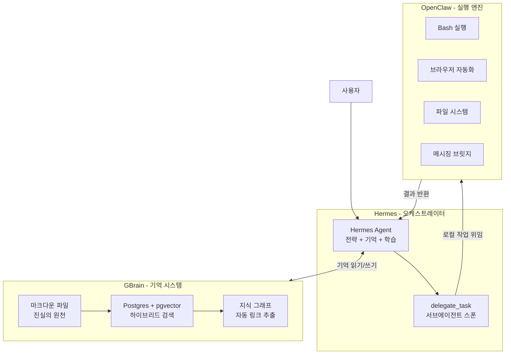

## 왜 지금 이 주제인가

ZeroCho의 AI 하네스 스택 공개 영상에서 GBrain, OpenClaw, Hermes의 조합이 소개되었다. 나는 이미 Claude Code 기반 하네스를 운영 중이지만, "기억·실행·학습"을 **서로 다른 에이전트가 분담**하는 아키텍처는 아직 적용해보지 않았다. 특히 Hermes가 OpenClaw에게 로컬 작업을 위임하는 **Chief of Staff 패턴**은 우리 프로젝트의 [허브-워커 모델](/wiki/harness-engineering/compound-engineering-philosophy)과 공명하는 부분이 있어서 셋업해보고 싶다.

기존 [Hermes Agent 분석](/wiki/agents/hermes-agent-analysis)에서 Hermes 단독의 학습 루프를 다뤘다면, 이 엔트리는 **3개 도구가 어떻게 협업하는가**에 집중한다.

## 핵심 개념

### 3계층 역할 분담

| 계층 | 도구 | 역할 | 핵심 강점 |
|------|------|------|----------|
| **기억 (Brain)** | GBrain | 장기 기억 저장소 + 지식 그래프 | 세션 초기화 후에도 과거 정보 유지. 마크다운 + pgvector 하이브리드 검색 |
| **학습/오케스트레이션** | Hermes | 자기 개선 루프 + 작업 조율 | 매 대화 후 자동으로 기억·스킬 업데이트. delegate_task로 하위 에이전트 위임 |
| **실행 (Runtime)** | OpenClaw | OS 수준 로컬 환경 제어 | bash, 브라우저, 파일 시스템, 24+ 메시징 플랫폼, 13,000+ 커뮤니티 스킬 |

### GBrain — 에이전트의 뇌

[Garry Tan(Y Combinator CEO)](https://github.com/garrytan/gbrain)이 자신의 AI 에이전트를 위해 만든 프로덕션 기억 시스템이다.

**핵심 설계 원칙:**
- **마크다운 = 진실의 원천** (git 추적), Postgres + pgvector = 검색 계층
- **Compiled Truth + Timeline 패턴**: 파일 상단은 최신 종합 판단, 하단은 시간순 증거(append-only)
- **지식 그래프**: 페이지마다 자동 링크 추출, 타입화된 관계 (`attended`, `works_at`, `founded`)
- **26개 스킬**: signal-detector, brain-ops, ingest, daily-task-manager 등
- **SOUL.md**: 6단계 인터뷰로 에이전트 신원을 정의

GBrain의 설계 철학은 **"얇은 구조, 두꺼운 스킬"** — 지능이 런타임이 아니라 스킬 파일에 산다.

### OpenClaw — 로컬 실행 엔진

오스트리아 개발자 Peter Steinberger가 만든 오픈소스 자율 에이전트 런타임. GitHub 346,000+ 스타.

**핵심 강점:**
- **OS 수준 접근**: bash 실행, 브라우저 자동화, 파일 읽기/쓰기, API 호출
- **보안 아키텍처**: 도구별 cascading allow/deny 정책, PRISM 10개 라이프사이클 훅
- **생태계**: 52+ 내장 스킬, 파일 기반 우선순위 시스템 (번들 → 로컬 → 워크스페이스)
- **Lobster 워크플로**: YAML 기반 멀티스텝 오케스트레이션 (루프, 조건, 서브에이전트)

**한계**: 메모리가 명시적 지시 없이는 유지되지 않음. "이거 기억해 줘"라고 말하지 않으면 까먹는다.

### Hermes — 학습하는 오케스트레이터

Nous Research가 만든 자기 개선형 에이전트. 64,000+ GitHub 스타.

**핵심 강점:**
- **3단계 메모리**: 세션 메모리 → 지속성 메모리 → 스킬 메모리
- **자동 스킬 생성**: 5+ 도구 호출 후 SKILL.md로 자동 박제
- **delegate_task**: 서브에이전트 병렬 스폰, 격리된 컨텍스트에서 실행
- **Honcho 사용자 모델링**: 변증법적으로 사용자 패턴·우선순위·의도를 지속 갱신

**한계**: 로컬 컴퓨터 직접 조작이나 특정 메시징 플랫폼 활용에 제한.

## 구조 / 프레임워크 / 다이어그램

### Chief of Staff 위임 아키텍처

### 각 도구의 강약 매트릭스

| 능력 | GBrain | Hermes | OpenClaw |
|------|--------|--------|----------|
| 장기 기억 | **핵심** | 강함 (3단계) | 약함 (명시적 지시 필요) |
| 자기 개선 | - | **핵심** (스킬 자동생성) | 수동 스킬 업데이트 |
| 로컬 OS 제어 | - | 제한적 | **핵심** (bash/fs/browser) |
| 메시징 통합 | - | 제한적 | **핵심** (24+ 플랫폼) |
| 지식 그래프 | **핵심** | - | - |
| 위임/오케스트레이션 | - | **핵심** (delegate_task) | Lobster 워크플로 |
| 보안 | 4계층 프라이버시 | 기본 | **핵심** (PRISM 10 훅) |

### 우리 프로젝트 대응 매핑

| 3계층 스택 | 우리 프로젝트 현재 대응체 | 갭 |
|-----------|----------------------|-----|
| GBrain 기억 시스템 | Claude Memory + `docs/solutions/` + Layer 3 JIT | 지식 그래프 자동 구축은 없음 (수동 connections) |
| Hermes 오케스트레이션 | Claude Code 메인 세션 + `/compound` 자동화 | delegate_task 수준의 서브에이전트 위임은 Agent 도구로 부분 가능 |
| OpenClaw 실행 엔진 | Claude Code 자체 (bash/fs/browser 내장) | 멀티 플랫폼 메시징은 없음 |
| Chief of Staff 패턴 | 허브(ai-study) → 워커(moneyflow/tarosaju) 모델 | 에이전트 간 실시간 위임은 아직 파일 기반 비동기 (`/message`) |

## 실전 팁 / 안티패턴

### 셋업 시 고려사항

**시작점 추천 (독립 소스 교차 확인):**
- 개인 개발자 / 1인 프로젝트 → **Hermes 먼저** (학습 루프 + 메모리가 즉각 가치)
- 팀 협업 / 멀티채널 운영 → **OpenClaw 먼저** (채널 커버리지 + 접근 제어)
- 기억이 핵심 병목 → **GBrain 추가** (Hermes든 OpenClaw든 기억 계층으로 연결)

**배포:**
- 둘 다 VPS(Hostinger, Hetzner 등) 설치 권장. 메인 컴퓨터 직접 설치 비권장
- Hermes는 서버리스 옵션(Modal, Singularity) 지원으로 유휴 비용 절감 가능
- OpenClaw는 관리형 배포(getclaw) 5분 내 셋업 가능

### 안티패턴

- **3개 동시 셋업 시도** — 하나씩 익히고 순차 통합. 한 번에 3개는 디버깅 지옥
- **OpenClaw에게 "기억해 줘" 없이 기억 기대** — 명시적 지시 필요. GBrain이나 Hermes로 보완
- **Hermes에게 bash 대량 작업 직접 시키기** — 로컬 무거운 작업은 OpenClaw에 위임
- **GBrain 없이 Hermes만 오래 돌리기** — 세션 길어지면 컨텍스트 압축으로 기억 손실 위험. GBrain이 안전망

## 내 프로젝트에 적용하기

- **Hermes 단독 셋업 먼저**: 개인 프로젝트이므로 Hermes의 자기 개선 루프부터 경험. VPS에 설치해서 ai-study 관련 리서치 작업을 위임해보고 학습 루프의 실효성 직접 측정
- **GBrain 아키텍처에서 Compiled Truth 패턴 차용**: 우리 `docs/solutions/`에 이미 비슷한 구조가 있지만, 상단=최신 종합 + 하단=시간순 증거 포맷을 명시적으로 도입하면 다음 세션 입력의 정확성이 올라감
- **Chief of Staff 패턴 ↔ 허브-워커 모델 비교 실험**: 현재 파일 기반 비동기(`/message`)인 허브-워커를 Hermes의 delegate_task 방식(실시간 위임 + 결과 반환)과 비교. 동기 위임이 비동기보다 나은 케이스 식별
- **SOUL.md 개념 도입 검토**: 에이전트의 "신원(정체성)"을 명시 파일로 관리하는 것. 현재 CLAUDE.md가 이 역할을 겸하지만, 프로젝트별 에이전트 페르소나를 분리하면 멀티 프로젝트 운영에 도움될 수 있음
- **OpenClaw는 Hermes 경험 후 결정**: 로컬 OS 제어는 Claude Code가 이미 제공하므로, OpenClaw의 추가 가치가 메시징 브릿지나 Lobster 워크플로에 있는지 확인 후 도입 여부 결정

## 자기 점검

1. GBrain, OpenClaw, Hermes 각각의 핵심 역할을 한 문장씩 설명할 수 있는가?
2. "Chief of Staff" 패턴에서 Hermes가 OpenClaw에 위임하는 이유를 Hermes의 한계점으로 설명할 수 있는가?
3. GBrain의 "Compiled Truth + Timeline" 패턴이 우리 `docs/solutions/`와 어떻게 다른지 설명할 수 있는가?
4. 우리 프로젝트에서 이 3계층 중 가장 시급한 갭은 어디인지, 그리고 왜인지 설명할 수 있는가?
5. (열린 질문) Claude Code 자체가 bash + 메모리 + 서브에이전트를 모두 제공하는 상황에서, 별도의 OpenClaw/Hermes를 추가하는 진짜 이유는 무엇인가? 우리에게 Claude Code만으로 부족한 것이 있는가?

### 실습 과제

Hermes Agent를 VPS에 설치하고, 간단한 리서치 작업(예: "ai-study 위키에 빠진 주제 3개 찾아줘")을 delegate_task로 위임해본다. 결과물의 품질과 자동 생성된 스킬 파일의 내용을 Claude Code의 `/compound` 산출물과 비교하는 것이 목적.

## 출처

- 영감: [ZeroCho TV — "제가 쓰고 있는 AI랑 하네스, 비서 스택 공개합니다!"](https://www.youtube.com/watch?v=Z5P6zMMDP_I)
- 보강 자료:
  - [garrytan/gbrain (GitHub)](https://github.com/garrytan/gbrain) — GBrain 공식 리포지토리
  - [OpenClaw vs Hermes Agent: Every Feature That Matters (getclaw)](https://getclaw.sh/blog/openclaw-vs-hermes-agent-feature-comparison-founders-2026)
  - [We Tried Hermes Agent as an Alternative to OpenClaw (CreateWith)](https://www.createwith.com/blog/we-tried-hermes-agent-as-an-alternative-to-openclaw-our-take)
  - [Hermes vs OpenClaw, 직접 이사 가본 사람 이야기 (GPTers)](https://www.gpters.org/events/post/hermes-vs-openclaw-story-Hq1AMOQqXgEY2GK)

### 정보 상태 고지

이 엔트리는 ZeroCho 영상에서 영감을 받았으나, 영상 트랜스크립트 없이 작성되었다. 본문의 기술적 내용은 GitHub 공식 리포(GBrain), 비교 블로그(getclaw, CreateWith), 커뮤니티 포스트(GPTers) 4개 독립 소스에서 교차 확인한 공통 내용만 반영했다. 영상에서만 언급된 고유한 내용이나 인용구는 포함하지 않았다.
