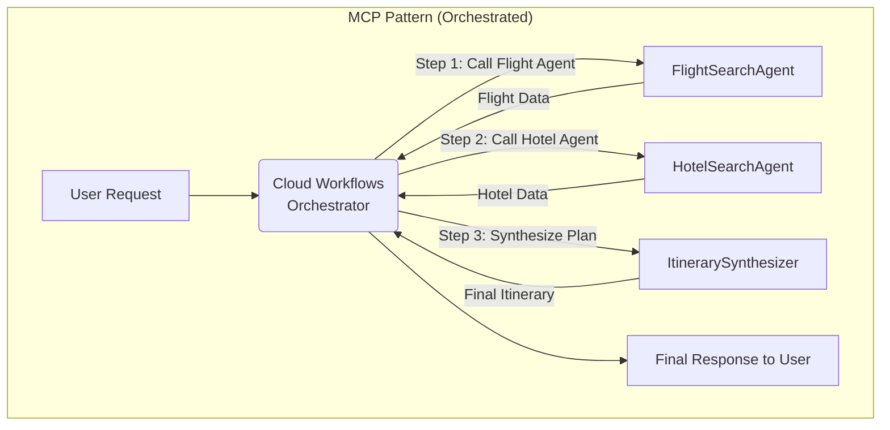

단일 LLM을 호출하는 것을 넘어, 여러 전문 에이전트가 협력하여 복잡한 문제를 해결하는 멀티 에이전트 시스템이 AI 애플리케이션의 새로운 표준으로 자리 잡고 있습니다. 하지만 에이전트의 수가 늘어날수록 이들 간의 통신, 작업 흐름 제어, 상태 관리는 기하급수적으로 복잡해집니다. iOS나 프론트엔드에서 단순히 최종 결과만 기다리기에는 시스템의 동작 방식이 불투명해지고 디버깅은 악몽이 됩니다.

Google Cloud는 이러한 혼돈에 질서를 부여하기 위해 두 가지 핵심 통합 패턴, **A2A(Agent-to-Agent)**와 **MCP(Master Control Program)**를 제시합니다. 이 두 패턴은 에이전트 앙상블을 견고하고 확장 가능하게 만드는 핵심 열쇠입니다.

## 왜 통신 패턴이 중요한가?

3개의 에이전트가 서로 직접 통신한다고 가정해봅시다. A-B, B-C, C-A, 총 3개의 연결이 필요합니다. 에이전트가 10개로 늘어나면 연결 수는 45개(`n(n-1)/2`)로 폭증합니다. 각 연결마다 다른 프로토콜, 데이터 형식, 에러 처리를 하드코딩하는 것은 재앙에 가깝습니다.

이는 마치 프론트엔드에서 수십 개의 컴포넌트가 서로를 직접 참조하며 상태를 변경하는 것과 같습니다. 상태 관리 라이브러리(Redux, Zustand 등)가 필요한 이유와 정확히 같습니다. A2A와 MCP는 멀티 에이전트 시스템을 위한 상태 및 통신 관리 아키텍처입니다.

## 패턴 1: Agent-to-Agent (A2A) - 분산형 자율 협업

A2A는 에이전트들이 중앙 관제탑 없이 서로 직접 메시지를 주고받으며 협력하는 P2P(Peer-to-Peer) 모델에 가깝습니다. 하지만 직접적인 API 호출 대신, 메시지 버스(Message Bus)를 통해 통신하여 서로를 느슨하게 결합(Loose Coupling)하는 것이 핵심입니다.

### 핵심 아이디어와 GCP 구현

- **중개자(Broker):** Google Cloud Pub/Sub과 같은 메시징 큐가 중개자 역할을 합니다.
- **Publish/Subscribe:** 특정 작업이 필요한 에이전트(예: `ImageAnalysisAgent`)는 자신의 능력을 '토픽(Topic)'에 게시(Publish)하는 대신, 도움이 필요한 내용을 토픽에 게시합니다(예: `"image_analysis_needed"` 토픽에 이미지 URL 발행).
- **자율적 구독:** 이미지 분석 능력이 있는 에이전트들은 해당 토픽을 구독(Subscribe)하고 있다가, 메시지가 들어오면 자율적으로 작업을 처리하고 결과를 다른 토픽(예: `"analysis_complete"`)에 게시합니다.

이 방식은 에이전트들이 서로의 존재나 네트워크 주소를 알 필요가 없게 만들어, 새로운 에이전트를 추가하거나 기존 에이전트를 수정해도 시스템 전체에 미치는 영향이 적습니다.

```mermaid
graph TD
    subgraph A2A_Pattern ["A2A Pattern (Event-Driven)"]
        UserRequest[User Request: "이 사진 설명해줘"] --> IngestionAgent[API Gateway / Ingestion Agent]
        IngestionAgent -- "Publishes to 'image_analysis_needed' topic" --> PubSub(Google Cloud Pub/Sub)
        PubSub -- "Message Delivered" --> VisionAgent[VisionAnalysisAgent]
        VisionAgent -- "Analyzes Image & Publishes to 'text_generation_needed' topic" --> PubSub
        PubSub -- "Message Delivered" --> TextAgent[TextGenerationAgent]
        TextAgent -- "Generates Description & Publishes to 'final_result' topic" --> PubSub
        PubSub -- "Result for User" --> ResultHandler[Result Handler]
        ResultHandler --> UserResponse[Final Response to User]
    end
```

### TypeScript 코드 예제 (Google Cloud Functions)

`ImageAnalysisAgent`가 분석을 요청하는 코드입니다. 다른 에이전트의 엔드포인트를 직접 호출하는 대신 Pub/Sub 토픽에 메시지를 발행합니다.

```typescript
// ingestion-agent/index.ts
import { PubSub } from '@google-cloud/pubsub';

const pubsub = new PubSub();
const topicName = 'image_analysis_needed';

// HTTP Trigger Cloud Function
export const handleUserRequest = async (req: any, res: any) => {
  const imageUrl = req.body.imageUrl;
  if (!imageUrl) {
    res.status(400).send('imageUrl is required');
    return;
  }

  // Publish a message to the Pub/Sub topic.
  // This decouples the IngestionAgent from the VisionAnalysisAgent.
  const messageBuffer = Buffer.from(JSON.stringify({ imageUrl }));
  await pubsub.topic(topicName).publishMessage({ data: messageBuffer });

  console.log(`Message published to ${topicName}.`);
  res.status(202).send('Analysis request accepted.');
};
```

`VisionAnalysisAgent`는 `image_analysis_needed` 토픽을 구독하고 있다가 메시지가 오면 트리거됩니다.

```typescript
// vision-agent/index.ts
import { PubSub } from '@google-cloud/pubsub';
import { Vision } from '@google-cloud/vision';

const pubsub = new PubSub();
const vision = new Vision.v1.ImageAnnotatorClient();

// Pub/Sub Trigger Cloud Function
export const analyzeImage = async (message: any, context: any) => {
  const payload = JSON.parse(Buffer.from(message.data, 'base64').toString());
  const imageUrl = payload.imageUrl;

  // Perform vision analysis
  const [result] = await vision.labelDetection(imageUrl);
  const labels = result.labelAnnotations.map(label => label.description);

  // Publish the result to the next topic for the text agent
  const resultTopic = 'text_generation_needed';
  const messageBuffer = Buffer.from(JSON.stringify({ labels, originalUrl: imageUrl }));
  await pubsub.topic(resultTopic).publishMessage({ data: messageBuffer });

  console.log('Image analysis complete, published to next topic.');
};
```

## 패턴 2: Master Control Program (MCP) - 중앙 집중식 오케스트레이션

MCP는 이름 그대로 중앙 관제 프로그램이 전체 작업 흐름을 지휘하는 허브-앤-스포크(Hub-and-Spoke) 모델입니다. 각 에이전트는 특정 기능만 수행하는 '워커(Worker)'가 되고, MCP는 이들을 순서에 맞게 호출하고 상태를 관리하며 최종 결과를 조합합니다.

### 핵심 아이디어와 GCP 구현

- **Orchestrator:** Google Cloud Workflows가 MCP 역할을 수행합니다. 워크플로우는 YAML 또는 JSON으로 작업의 순서, 분기, 병렬 처리, 에러 핸들링 등을 정의합니다.
- **Stateless Workers:** 각 에이전트는 주로 Cloud Functions나 Cloud Run으로 구현된 stateless 함수입니다. MCP로부터 입력을 받아 작업을 수행하고 결과를 반환할 뿐, 전체 프로세스의 상태는 알 필요가 없습니다.
- **Deterministic Flow:** A2A의 비동기적이고 예측 불가능한 흐름과 달리, MCP는 사전에 정의된 순서에 따라 작업을 수행하므로 결과가 일관되고 예측 가능합니다.



### Cloud Workflows YAML 예제

여행 계획을 짜는 워크플로우의 MCP 정의입니다. 각 단계(step)가 에이전트(Cloud Function)를 호출합니다.

```yaml
# trip_planner_workflow.yaml
main:
  params: [userInput]
  steps:
    - init:
        assign:
          - project: ${sys.get_env("GOOGLE_CLOUD_PROJECT_ID")}
          - location: "us-central1" # Or your region
          - query: ${userInput.query}
    - search_flights_and_hotels:
        parallel:
          - shared: [query]
          - branches:
              - flight_search:
                  steps:
                    - call_flight_agent:
                        call: http.post
                        args:
                            url: "https://[REGION]-[PROJECT_ID].cloudfunctions.net/flight-search-agent"
                            auth: {type: OIDC}
                            body: { "query": ${query} }
                        result: flight_results
              - hotel_search:
                  steps:
                    - call_hotel_agent:
                        call: http.post
                        args:
                            url: "https://[REGION]-[PROJECT_ID].cloudfunctions.net/hotel-search-agent"
                            auth: {type: OIDC}
                            body: { "query": ${query} }
                        result: hotel_results
        result: parallel_search_results
    - synthesize_itinerary:
        call: http.post
        args:
            url: "https://[REGION]-[PROJECT_ID].cloudfunctions.net/synthesizer-agent"
            auth: {type: OIDC}
            body:
                flights: ${parallel_search_results[0].flight_results.body}
                hotels: ${parallel_search_results[1].hotel_results.body}
        result: final_itinerary
    - return_result:
        return: ${final_itinerary.body}
```

## A2A vs. MCP: 언제 무엇을 쓸까?

두 패턴은 상호 배타적이지 않으며, 종종 하나의 시스템 안에서 함께 사용됩니다.

| 특징 | Agent-to-Agent (A2A) | Master Control Program (MCP) |
| :--- | :--- | :--- |
| **통신 방식** | 비동기, 이벤트 기반 (Publish/Subscribe) | 동기/비동기, 요청/응답 (Direct Call) |
| **제어 구조** | 분산형, 자율적 (Decentralized) | 중앙 집중형, 지시 기반 (Centralized) |
| **결합도** | 낮음 (Loose Coupling) | 높음 (Tight Coupling w/ Orchestrator) |
| **적합한 작업** | 창의적 브레인스토밍, 실시간 반응, 적대적 토론 | 순차적 파이프라인, 상태 전이가 중요한 트랜잭션 |
| **확장성** | 에이전트 추가/제거 용이 | 워크플로우 수정 필요 |
| **디버깅** | 분산 추적이 필요하여 복잡할 수 있음 | 워크플로우 로그를 통해 흐름 파악 용이 |
| **GCP 서비스**| `Pub/Sub`, `Eventarc` | `Cloud Workflows`, `Cloud Tasks` |

### 2026년 트렌드: 하이브리드 패턴의 부상

미래의 복잡한 AI 시스템은 순수한 A2A나 MCP가 아닌, 두 가지를 결합한 하이브리드 모델이 주도할 것입니다. 예를 들어, 사용자의 초기 요청은 MCP가 받아서 구조적인 작업(DB 조회, 외부 API 호출)을 순서대로 처리한 뒤, 그 결과를 A2A 네트워크에 던져 여러 전문 에이전트들이 자유롭게 의견을 내고 최고의 해결책을 도출하게 하는 방식입니다. MCP는 '지휘자' 역할을, A2A는 '유능한 연주자들의 즉흥 연주' 역할을 맡는 셈입니다.

프론트엔드/iOS 개발자 입장에서 이 패턴을 이해하는 것은 중요합니다. 백엔드 AI 시스템이 어떻게 동작하는지 알아야 스트리밍 응답, 중간 진행 상태 피드백, 부분적 결과 표시 등 고도화된 UX를 구현할 수 있기 때문입니다. 이제 AI는 단순히 API를 호출하고 응답을 기다리는 블랙박스가 아니라, 내부 동작을 이해하고 상호작용해야 하는 복잡한 시스템이 되어가고 있습니다.

## 자기 점검

1.  수십 개의 에이전트가 참여하여 쇼핑몰의 '개인화 추천 상품' 목록을 만드는 시스템을 구축하려 합니다. 이 작업은 정해진 순서보다 다양한 에이전트(최신 유행 분석, 사용자 구매 이력 분석, 재고 확인 등)의 자율적인 기여가 중요합니다. A2A와 MCP 중 어떤 패턴이 더 적합하며, 그 이유는 무엇인가요?
2.  Google Cloud Workflows를 사용하여 MCP 패턴을 구현할 때의 가장 큰 장점은 무엇이라고 생각하시나요? (힌트: 상태 관리, 에러 처리)
3.  A2A 패턴에서 Pub/Sub과 같은 메시지 버스를 사용하는 것이 에이전트 간 직접 HTTP API를 호출하는 것보다 나은 점을 확장성 관점에서 설명해보세요.
4.  동료 프론트엔드 개발자에게 A2A와 MCP 패턴의 차이를 '프론트엔드 상태 관리'에 비유하여 어떻게 설명하시겠습니까? (예: 컴포넌트 간 props drilling vs. Redux/Zustand 스토어)
5.  **실습 과제:** 간단한 '코드 리뷰 자동화' 시스템을 MCP 패턴으로 구상해보세요. (1) Git 커밋을 트리거로 받는 `CodeFetcherAgent`, (2) 코드의 정적 분석을 수행하는 `LinterAgent`, (3) LLM을 이용해 코드의 논리적 개선점을 제안하는 `ReviewerAgent` 세 가지 에이전트가 있습니다. 이 세 에이전트를 순차적으로 호출하는 Cloud Workflows YAML의 기본 구조를 작성해보세요. (실제 엔드포인트는 placeholder로 두어도 됩니다.)