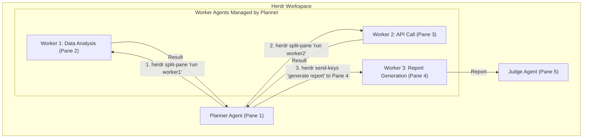

SLUG: herdr-tmux-for-ai-agent-workflows

단일 LLM과의 대화형 프롬프트 엔지니어링 시대가 저물고, 여러 전문 에이전트가 협력하여 복잡한 문제를 해결하는 멀티 에이전트 시스템이 부상하면서 새로운 차원의 개발 복잡성이 대두되었습니다. 10개가 넘는 에이전트가 동시에 시장을 분석하고, 거래 전략을 수립하며, 위험을 관리하는 `auto-trade` 프로젝트를 로컬 환경에서 실행하고 디버깅하는 상황을 상상해 보십시오. 이는 더 이상 간단한 `print()`문으로 해결할 수 없는, 분산 시스템에 가까운 문제입니다. 각 에이전트는 독립된 프로세스로 실행되며, 자체적인 상태와 로그, 그리고 예상치 못한 오류 가능성을 안고 있습니다. 이러한 혼돈 속에서 개발자는 길을 잃기 쉽습니다. Herdr는 바로 이 문제, 즉 다중 AI 에이전트 워크플로우의 로컬 개발 경험(DX) 문제를 해결하기 위해 등장한 `tmux` 스타일의 터미널 관리자입니다.

## AI 에이전트 개발의 새로운 병목: 워크플로우 관리

iOS 개발자가 Xcode의 디버거와 Instruments를 사용해 복잡한 비동기 작업과 뷰 계층을 시각적으로 추적하듯, AI 엔지니어에게는 여러 에이전트의 동시 실행을 한눈에 파악하고 제어할 수 있는 도구가 필수적입니다. 기존의 터미널 탭 여러 개를 띄우거나 `docker-compose logs`로 모든 로그를 한꺼번에 보는 방식은 특정 에이전트의 문제를 분리하고 분석하기 매우 어렵습니다.

Herdr는 터미널 멀티플렉서 `tmux`의 핵심 개념을 AI 에이전트 관리에 적용하여 이 문제를 해결합니다. `tmux`가 세션, 윈도우, 패널(pane)을 통해 단일 터미널에서 여러 셸 환경을 관리하듯, Herdr는 이러한 개념을 에이전트 워크플로우에 맞게 재해석합니다.

*   **세션 (Session):** 전체 멀티 에이전트 워크플로우 실행 단위. 예를 들어, `auto-trade` 프로젝트의 하루치 거래 시뮬레이션 전체가 하나의 세션이 될 수 있습니다. SSH 연결이 끊어져도 세션은 계속 실행되어 작업의 영속성을 보장합니다.
*   **워크스페이스/탭 (Workspace/Tab):** 특정 목적을 위해 그룹화된 에이전트들의 집합. '시장 분석 에이전트 그룹'을 위한 탭, '거래 실행 에이전트 그룹'을 위한 탭 등으로 분리하여 관리할 수 있습니다.
*   **패널 (Pane):** 개별 AI 에이전트의 실행 단위. 각 패널은 에이전트의 실시간 로그, 내부 상태(예: Chain of Thought), 도구 사용 내역 등을 독립적으로 표시합니다. 이는 마치 Xcode에서 특정 스레드나 객체의 상태를 개별 창에서 관찰하는 것과 같습니다.

Herdr는 이 구조를 통해 개발자가 각 에이전트의 활동을 명확히 분리하여 관찰하고, 문제 발생 시 즉각적으로 원인을 파악할 수 있도록 돕습니다.

## 단순 로깅을 넘어선 상호작용과 제어

Herdr의 진정한 가치는 단순히 여러 에이전트의 로그를 병렬로 보여주는 것을 넘어섭니다. 각 에이전트의 상태를 시각적으로 표시하고 직접 제어할 수 있는 '컨트롤 서페이스'를 제공한다는 점이 핵심입니다.

### 에이전트 상태의 시각화

Herdr는 사이드바나 상태 표시줄을 통해 각 에이전트의 현재 상태를 `blocked`, `working`, `done` 등으로 명확하게 알려줍니다. 예를 들어, 특정 에이전트가 사용자 입력이나 권한 승인을 기다리며 멈춰있는 `blocked` 상태가 되면 시각적 알림과 소리 알림을 통해 개발자가 즉시 개입할 수 있도록 합니다. 이는 장시간 실행되는 작업에서 어느 에이전트가 병목 지점인지 빠르게 파악하는 데 결정적인 역할을 합니다.

### 에이전트 오케스트레이션 API

Herdr는 CLI 및 Unix 소켓을 통해 API를 제공하여 에이전트가 다른 에이전트를 프로그래밍 방식으로 제어할 수 있게 합니다. 예를 들어, 'Planner' 에이전트가 자신의 계획에 따라 여러 'Worker' 에이전트를 위한 패널을 동적으로 생성하고, 작업을 할당한 뒤, 그 결과를 다시 수집하는 고도의 자동화가 가능해집니다.

Mermaid 다이어그램: Herdr의 API를 사용해 Planner 에이전트가 동적으로 Worker 에이전트들을 생성하고 작업을 지시하는 오케스트레이션 워크플로우

이러한 기능은 하드코딩된 파이프라인을 넘어, 에이전트가 런타임에 스스로 작업 환경을 구성하고 확장하는 유연한 워크플로우를 구현할 수 있게 합니다.

## 워크플로우 관리 도구 비교

Herdr가 모든 상황에 맞는 만능 해결책은 아닙니다. 로컬 개발 환경에서의 상호작용성과 즉각적인 피드백에 특화되어 있으며, 프로덕션 환경의 대규모 로깅 및 모니터링과는 목적이 다릅니다.

| 접근 방식 | 장점 | 단점 | 적합한 사용 사례 |
| :--- | :--- | :--- | :--- |
| **`print()` / 터미널 탭** | 설정이 필요 없음. 가장 간단함. | 확장성 부재, 로그 뒤섞임, 상태 추적 불가. | 1-2개의 에이전트로 구성된 간단한 스크립트 테스트. |
| **Docker Compose** | 환경 격리, 의존성 관리 용이. | 로그 스트림이 하나로 합쳐져 분석이 어려움. 실시간 상호작용 및 제어 불가. | 여러 에이전트를 안정적으로 실행하는 데 집중할 때. |
| **프로덕션 Observability (LangSmith 등)** | 프로덕션 환경에 적합. 추적, 분석, 평가에 강력함. | 로컬 개발에 사용하기에는 과도하고 비용 발생. 즉각적인 제어/수정 어려움. | 배포된 에이전트의 성능 모니터링 및 디버깅. |
| **Herdr** | **로컬 개발 생산성 극대화**, `tmux`의 익숙함, 실시간 상태 시각화 및 상호작용. | 프로덕션 모니터링 도구가 아님. 학습 곡선 존재. | 여러 에이전트가 복잡하게 상호작용하는 시스템의 로컬 개발 및 디버깅. |

## `auto-trade` 프로젝트에 Herdr 적용하기

13개 에이전트가 협력하는 `auto-trade` 프로젝트를 로컬에서 개발한다고 가정해 보겠습니다. Herdr가 없다면, 13개의 터미널 프로세스를 띄우고 문제가 생겼을 때 어떤 에이전트가 원인인지 찾기 위해 로그를 일일이 뒤져야 합니다.

Herdr를 도입하면 다음과 같은 워크플로우가 가능해집니다.

1.  `auto-trade` 시뮬레이션을 위한 Herdr 세션을 시작합니다.
2.  에이전트 역할을 기준으로 탭을 나눕니다: "Data Ingestion", "Analysis", "Execution", "Risk Management".
3.  각 탭 안에 관련된 에이전트들을 개별 패널로 실행합니다. 예를 들어, "Analysis" 탭에는 '거시 경제 분석 에이전트', '기술적 지표 분석 에이전트', '뉴스 감성 분석 에이전트'가 각각의 패널에서 실행됩니다.
4.  시뮬레이션 도중 'Execution' 탭의 '주문 실행 에이전트' 패널 상태가 `blocked`로 바뀌는 것을 사이드바에서 즉시 인지합니다.
5.  해당 패널로 이동해 로그를 확인하니, API 키 인증 오류가 발생한 것을 발견합니다.
6.  Herdr의 `detach` 기능(`Ctrl+b q`)으로 세션을 백그라운드에서 계속 실행시킨 채, 코드에서 API 키를 수정한 후 다시 `attach`하여 중단된 지점부터 작업을 재개합니다.

이처럼 Herdr는 복잡한 멀티 에이전트 시스템을 다루는 개발자에게 마치 Xcode의 통합 디버깅 환경과 같은 제어력과 가시성을 터미널 내에서 제공합니다.

## 자기 점검

*   `tmux`의 세션, 윈도우, 패널 개념이 Herdr에서는 AI 에이전트 워크플로우 관리를 위해 각각 어떻게 재해석되었나요?
*   Herdr의 에이전트 상태 시각화(`blocked`, `working`, `done`)가 기존의 로그만 보는 방식에 비해 가지는 실질적인 이점은 무엇일까요?
*   Herdr는 어떤 상황에서는 적합하지 않은 도구이며, 그 대안은 무엇이 될 수 있을까요?
*   현재 진행 중인 iOS 프로젝트의 여러 모듈이나 서비스(네트워킹, 데이터베이스, UI 렌더링 등)를 디버깅한다고 상상했을 때, 각 요소를 Herdr의 패널처럼 분리하여 동시에 모니터링하고 제어한다면 어떤 이점이 있을지 생각해 보세요.