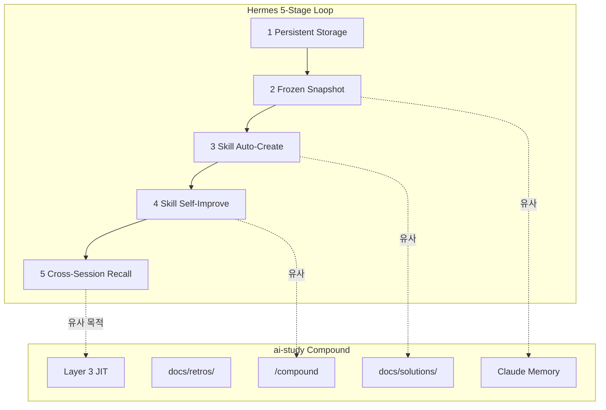

## 왜 지금 이 주제인가

NousResearch의 Hermes Agent는 2026년 2월 공개 후 6만+ GitHub 스타를 모은 자기 개선형 에이전트 프레임워크다. Superpowers가 "개발 규율"을 강제하는 방법론이라면, Hermes는 "에이전트가 경험에서 배우는 구조"에 집중한다.

나는 이미 `/compound` 워크플로우로 스프린트 회고 + 솔루션 문서화를 자동화하고 있다. Hermes의 학습 루프는 이 Compound Engineering 철학과 공명하는 부분이 있고, 동시에 우리가 아직 못 하는 것(Progressive Disclosure, Frozen Snapshot 등)도 보인다. [Superpowers 분석](/wiki/harness-engineering/superpowers-framework-analysis)에 이어 두 번째 외부 프레임워크 비교.

## 핵심 개념

### Hermes Agent 5단계 학습 루프

Hermes는 LLM 가중치를 수정하지 않는다. 자기 개선은 전부 **스킬 + 메모리 레이어**에서 일어난다.

| 단계 | 메커니즘 | 핵심 |
|------|---------|------|
| **1. Persistent Storage** | SQLite + FTS5 + WAL | 세션 체이닝 (`parent_session_id`)으로 압축 후에도 연속성 유지 |
| **2. Frozen Memory Snapshot** | `MEMORY.md` + `USER.md` 세션 시작 시 1회 주입 | 중간 쓰기는 디스크만 업데이트 → prefix cache 보존 |
| **3. Skill Auto-Creation** | 5+ 도구 호출 후 자동 생성 | 절차 + 함정 + 검증 단계를 SKILL.md로 박제 |
| **4. Skill Self-Improvement** | 실행 중 edge case 발견 시 in-place 업데이트 | 버전 관리 없이 최신 상태 유지 |
| **5. Cross-Session Recall** | FTS5 전문 검색 + LLM 요약 | 과거 대화에서 패턴 추출 |

### Progressive Skill Disclosure (토큰 효율 핵심)

648개 스킬(79 core + 48 optional + 521 community)을 가지고 있으면서도 토큰 비용을 통제하는 방법:

1. **목록 단계**: 메타데이터만 표시 (~전체의 2~3% 토큰)
2. **호출 단계**: 해당 스킬의 전체 지시사항 로드
3. **참조 단계**: 지원 파일(references/, templates/) on-demand 로드

토큰 비용이 라이브러리 크기가 아니라 **실제 사용량에 비례**한다.

### GEPA: 프롬프트 진화 (RL 없이)

별도 리포(`hermes-agent-self-evolution`)의 연구 모듈. ICLR 2026 Oral 논문 기반.

- 실행 trace를 읽어 **왜** 실패했는지 이해 (단순 성공/실패가 아닌 원인 분석)
- DSPy로 개선안 제안 → 후보 생성 → Pareto 알고리즘으로 선택
- GRPO(RL 베이스라인) 대비 평균 +6%, 최대 +20%, **rollout 35배 절감**
- 진화된 스킬은 **PR로 제출** → 사람 승인 후에만 적용 (자동 덮어쓰기 금지)

## 구조 / 프레임워크 / 다이어그램

### ai-study 기존 패턴 vs Hermes 대조

### 갭 분석 결과

| Hermes 기능 | ai-study 대응 | 판정 | 이식 가치 |
|---|---|---|---|
| Frozen Memory Snapshot | Claude Code 자체 메모리 | **다른 접근** | prefix cache 최적화 관점에서 관찰 |
| Skill Auto-Creation | `/compound` (retros + solutions) | **부분 겹침** | 솔루션을 스킬 포맷으로 정형화하면 재사용성 높아짐 |
| Progressive Disclosure | CLAUDE.md 풀 로딩 | **갭 있음** | 토큰 절감 직결 |
| Skill Self-Improvement | `docs/solutions/` 수동 축적 | **부분 겹침** | N=3 자동 승격 규칙 이미 있음 |
| Cross-Session Recall (FTS5) | Layer 3 JIT 검색 | **다른 접근** | 우리는 위키 기반, Hermes는 대화 기반 |
| GEPA Self-Evolution | 없음 | **관찰만** | 연구 단계, ai-study에 직접 적용은 시기상조 |
| Multi-Platform Gateway | 없음 | **불필요** | 위키 프로젝트에 해당 없음 |
| agentskills.io 표준 | 커스텀 슬래시 커맨드 | **갭 있음** | 포터빌리티는 좋지만 우리 체계와 호환 비용 높음 |

## 실전 팁 / 안티패턴

### 이식 대상 3개 패턴 상세

#### 패턴 1: Progressive Skill Disclosure

**현재 문제**: CLAUDE.md의 skill routing 섹션이 모든 스킬 설명을 한꺼번에 로드한다. 스킬이 늘어날수록 토큰 비용이 선형 증가.

**Hermes 방식**: 메타데이터(이름 + 1줄 설명)만 시스템 프롬프트에 넣고, 실제 호출 시에만 전체 프롬프트를 로드. 648개 스킬을 가지면서도 초기 비용은 2~3%.

**ai-study 적용 아이디어**: CLAUDE.md의 skill routing을 2단 구조로 전환. 1단: 스킬명 + 트리거 키워드만 나열. 2단: Skill 도구 호출 시 `.claude/commands/` 또는 `.claude/skills/`에서 풀 프롬프트 로드. 이미 Claude Code의 Skill 시스템이 이 구조를 지원함 — [Skill 시스템 도입](/wiki/harness-engineering/skill-system-introduction) 참조.

#### 패턴 2: 경험 → 스킬 자동 생성 루프

**현재 문제**: `/compound`가 회고 + 솔루션을 생성하지만, 이것이 다음 세션에서 자동으로 로드되는 "스킬"이 되지는 않는다. `docs/solutions/`에 축적만 되고, 에이전트가 능동적으로 참조하지 않음.

**Hermes 방식**: 복잡한 작업(5+ 도구 호출) 완료 후 자동으로 SKILL.md 생성. 다음에 유사 작업을 만나면 자동 로드.

**ai-study 적용 아이디어**: `/compound` 실행 시 솔루션이 N=3 이상 누적된 카테고리가 있으면, 해당 솔루션들을 종합한 스킬 초안을 `.claude/skills/`에 자동 생성. 이미 [솔루션 → validator 승격 규칙](/wiki/harness-engineering/harness-journal-024-solution-to-validator-promotion)이 있으므로 이 흐름의 자연스러운 확장.

#### 패턴 3: Frozen Snapshot (Tokenomics 관점)

**현재 문제**: Claude Code의 메모리는 세션 중간에도 업데이트되면 시스템 프롬프트가 변경될 수 있음. 이는 prefix cache를 무효화할 가능성이 있음.

**Hermes 방식**: `MEMORY.md`를 세션 시작 시 1회만 시스템 프롬프트에 주입. 중간 쓰기는 디스크만 업데이트. 다음 세션에서 반영.

**ai-study 적용 가능성**: Claude Code의 메모리 시스템은 직접 제어 불가. 그러나 이 원칙은 CLAUDE.md 설계에 적용 가능 — CLAUDE.md를 세션 중간에 수정하면 prefix cache가 깨질 수 있으므로, 세션 중 CLAUDE.md 수정은 최소화하고 세션 종료 시 일괄 반영하는 것이 토큰 효율적.

### 관찰만 할 패턴: GEPA

GEPA는 "프롬프트/스킬을 진화 알고리즘으로 자동 최적화"하는 연구 모듈이다. 흥미로운 결과(RL 대비 +6%, rollout 35배 절감)이지만:

- 별도 인프라(DSPy + 평가 세트 + 실행 trace 저장) 필요
- 위키 프로젝트의 스킬 수가 아직 10~20개 수준 — 진화 최적화의 ROI가 낮음
- PR 기반 승인 흐름은 좋은 안전장치이므로 기억해둘 것

**안티패턴 경고**: Hermes 문서 자체가 인정하는 한계 — "에이전트가 거의 항상 자신이 잘했다고 판단한다." 자기 평가 기반 스킬 생성은 과신 바이어스가 있으므로, 자동 생성 스킬에도 사람 리뷰 게이트가 필수.

## 내 프로젝트에 적용하기

> 아래는 **이식 계획**이다. 즉시 실행이 아니라 향후 세션에서 하나씩 진행.

- **Progressive Disclosure 적용**: CLAUDE.md의 skill routing 테이블을 경량화 — 스킬명 + 트리거 조건만 나열하고, 실제 프롬프트는 `.claude/commands/`에 위임. 이미 구조적으로 가능하며, 토큰 절감 효과를 [ccusage 베이스라인](/wiki/tokenomics/project-level-cost-analysis-pattern)으로 측정
- **경험 → 스킬 자동 생성 루프**: `/compound` 실행 시 `docs/solutions/` 카테고리별 N=3 체크 → 스킬 초안 자동 제안. [validator 승격 규칙](/wiki/harness-engineering/harness-journal-024-solution-to-validator-promotion)의 다음 단계
- **세션 중 CLAUDE.md 수정 최소화**: Frozen Snapshot 원칙 차용 — 세션 중 CLAUDE.md 변경이 필요하면 메모리에 기록만 해두고, 세션 종료 시 `/compound`에서 일괄 반영. prefix cache 보존
- **Superpowers + Hermes 교차 참조**: [Superpowers 분석](/wiki/harness-engineering/superpowers-framework-analysis)의 SDD 2-stage review와 Hermes의 스킬 자동 생성을 조합하면 "리뷰 통과한 작업에서만 스킬 생성" 흐름 가능
- **GEPA는 관찰 대기**: 스킬 수가 30+ 이상 축적되면 재평가. 현 단계에서는 수동 개선이 ROI 높음

## AI Agent Directive

**Trigger**: 스킬/커맨드의 토큰 효율을 개선하거나, `/compound` 회고 품질을 높이거나, 메모리 시스템을 설계할 때.

**Prerequisites**:
- `harness-engineering/compound-engineering-philosophy`
- `harness-engineering/skill-system-introduction`

**Actionable Steps**:
1. Progressive Disclosure — 새 스킬 추가 시 CLAUDE.md에는 1줄 트리거만, 풀 프롬프트는 `.claude/commands/`에 위임
2. Frozen Snapshot — 세션 중 CLAUDE.md 수정 최소화, `/compound` Phase 3에서 일괄 반영
3. 자동 생성 스킬에는 반드시 사람 리뷰 게이트 포함 (과신 바이어스 방지)
4. `docs/solutions/` N=3+ 누적 시 스킬 승격 검토

**Anti-patterns**:
- GEPA를 지금 단계에서 도입 (스킬 30+ 미만이면 ROI 낮음)
- 에이전트 자기 평가만으로 스킬 품질 판단
- 세션 중간에 CLAUDE.md 반복 수정 (prefix cache 파괴)

## 자기 점검

1. Hermes의 5단계 학습 루프에서 "Frozen Snapshot"이 prefix cache와 무슨 관계인지 설명할 수 있는가?
2. Progressive Disclosure의 3단계(목록 → 호출 → 참조)에서 각 단계의 토큰 비용 차이를 직감적으로 알고 있는가?
3. 우리 `/compound` 워크플로우와 Hermes의 Skill Auto-Creation의 핵심 차이점은?
4. GEPA가 RL 없이 프롬프트를 최적화하는 3단계를 설명할 수 있는가?
5. (열린 질문) Hermes가 인정한 "에이전트가 항상 잘했다고 자기 평가하는" 바이어스를 우리 `/compound` 회고에서도 겪고 있지 않은가?

### 실습 과제

현재 CLAUDE.md의 "Skill routing" 섹션 바이트 수를 측정하고, 스킬명 + 트리거 조건만 남긴 경량 버전의 바이트 수를 비교해본다. Progressive Disclosure 적용 전후의 토큰 절감 추정치를 계산하는 것이 목적.

## 출처

- 원본: [NousResearch/hermes-agent](https://github.com/NousResearch/hermes-agent) — NousResearch, MIT License, 64k+ stars
- 보강 자료:
  - [Hermes Agent: The Self-Improving AI Agent (2026) — Petronella Cybersecurity News](https://petronellatech.com/blog/hermes-agent-ai-guide-2026)
  - [What Is Hermes Agent? Complete Guide (2026) — NxCode](https://www.nxcode.io/resources/news/hermes-agent-complete-guide-self-improving-ai-2026)
  - [How Hermes Agent is Redefining AI Autonomy in 2026 — BotLearn](https://www.botlearn.ai/news/news-analysis-how-hermes-agent-is-redefining-ai-autonomy-in-2026)
