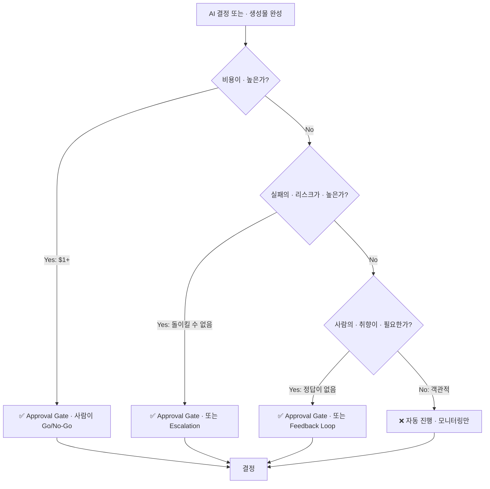

## HITL(Human-in-the-Loop)란?

AI 에이전트의 모든 결정을 자동화할 수는 없다. 비용이 높거나 실패 시 리스크가 크거나 사람의 취향(taste)이 개입되는 순간들이 있기 때문이다.

**HITL**은 이런 순간들에 **사람의 개입 지점**을 명시적으로 설계하는 패턴이다. 단순히 "사용자에게 물어본다"가 아니라, **언제 물어볼지**, **무엇을 물어볼지**, **사람의 판단 속도에 맞춘 UX는 무엇인지**를 체계적으로 결정하는 일이다.

---

## HITL의 3가지 패턴

### 1. Approval Gate (승인 게이트)

**정의**: AI가 결정한 후 사람이 "이대로 할까, 말까?"를 판단하는 지점.

**특징**:
- AI는 추천안을 만들고
- 사람은 **Go/No-Go** 결정만
- 결정 비용이 **명확함** (결과가 뚜렷하다)

**예시**:
- Claude Code의 file write/delete 요청 → 사용자가 [y/n] 입력
- 거액 금융 거래 → 승인자의 사인 대기
- 배포 파이프라인의 "배포 진행 확인" 버튼
- ai-study의 generate-on-pick: AI가 3개 주제 추천 → 사용자가 1개 선택 → AI가 즉시 생성

**비용-리스크 매트릭스**:

| 상황 | 개입해야 하나? | 왜? |
|------|:---:|---|
| API 호출 비용 $0.01 미만 | ❌ | 승인 대기 시간이 절감액보다 크다 |
| API 호출 비용 $1~$100 | ✅ | 실패했을 때 손실이 명확하다 |
| 파일 삭제 (돌이킬 수 없음) | ✅ | 롤백 불가능 |
| UI 텍스트 생성 (사용자 취향 개입) | ✅ | 정답이 없고 맥락이 필요하다 |

---

### 2. Escalation (에스컬레이션)

**정의**: AI가 **자기 자신이 처리할 수 없다고 판단**하면 더 높은 권한(또는 사람)으로 올려보내는 패턴.

**특징**:
- AI가 먼저 판단 ("내가 이걸 할 수 있나?")
- "아니다"라고 판단하면 → 사람 또는 상위 에이전트에게 위임
- **confidence threshold** 기반 (모델 출력의 신뢰도 점수)

**예시**:
- Claude Code의 /investigate: 단순 디버그 → 자체 해결 / 복잡한 아키텍처 문제 → "전문가 상담 필요" 메시지 + consult skill 제안
- 고객 서비스 챗봇: FAQ 답변 가능 → 자체 응답 / 주문 취소·환불 → 인간 에이전트로 이관
- ai-study 위키의 generate-lesson: 신뢰도 낮은 주제 생성 → AI가 "이 카테고리 엔트리를 더 읽고 다시 시도하세요" 제안

**구현 코드 스케치**:

```typescript
async function processQuery(query: string, confidence: number) {
  // 1단: 자체 처리 가능한가?
  if (confidence >= 0.85) {
    return await handleDirectly(query);
  }
  
  // 2단: confidence 부족 → escalate
  if (confidence >= 0.60) {
    return {
      status: 'escalated',
      reason: 'Low confidence — human review recommended',
      suggestedReviewer: 'specialist',
      draft: await generateDraft(query), // 사람이 참고할 드래프트
    };
  }
  
  // 3단: 너무 낮으면 거절
  return {
    status: 'rejected',
    reason: 'Out of scope for this agent',
  };
}
```

---

### 3. Feedback Loop (피드백 루프)

**정의**: AI가 **반복적으로** 사람의 피드백을 받아 개선되도록 설계하는 패턴.

**특징**:
- 한 번의 "승인"이 아니라, **여러 번의 반복**
- 사람의 댓글·수정·평점이 다음 실행에 반영된다
- 학습 곡선이 가파르다 (초기 결과가 나쁘어도 빠르게 개선)

**예시**:
- ai-study의 generate-on-pick PR: AI가 생성 → 사용자가 PR 코멘트로 수정 지시 → AI가 자동으로 커밋 추가 (반복)
- 이미지 생성 모델: 사용자가 생성된 이미지에 "더 어두운 톤으로", "배경 제거" 등 댓글 → 모델이 재생성
- Claude Code의 /qa 테스트: 첫 QA 실패 → 버그 고치고 다시 실행 → 다시 실패 → 다시 고쳐진다

**속도 차이**:

```
Approval Gate:    사람 결정 (초~분) + 배포 (분~시간)
Escalation:       상위자 대기 (분~시간)
Feedback Loop:    사람 피드백 (초~분) + AI 재시도 (초) → 빠르다
```

---

## 언제 사람이 개입해야 하는가? — 의사결정 프레임

### 비용-리스크 기반 룰



**판단 체크리스트**:

| 요소 | 체크 | 결론 |
|------|:---:|---|
| API 호출 비용 ≥ $1 | ✅ | Approval 또는 Escalation 필수 |
| 삭제/배포/공개 (돌이킬 수 없음) | ✅ | Approval 필수 |
| 정확성/품질에 명확한 "정답"이 없음 (예: UI 텍스트, 이미지) | ✅ | Feedback Loop 또는 Approval 권장 |
| 객관적 판단 가능 (데이터 기반 완결) | ❌ | 자동 진행, 사후 모니터링만 |

---

## Claude Code의 Permission Mode가 HITL의 실례

Claude Code는 **모든 파일 쓰기/삭제 전에 사용자에게 묻는다**. 이것이 HITL의 좋은 예다:

```
Claude: I found the bug in line 42. Should I update src/utils.ts?
         [Show diff]
         [Approve]  [Decline]
User:   [Click Approve]
Claude: Done. Committed and pushed.
```

**왜 이게 HITL인가?**

- **AI는 판단함** ("이 파일을 수정해야 한다")
- **사람은 검증함** ("맞나? 다른 곳은 안 깨질까?")
- **비용이 명확함** ("파일을 변경한다" = 리스크)
- **피드백이 즉각적** (사용자가 거절하면 AI는 대안을 제시)

이와 대조:

```
❌ Auto-Approve Mode (과도한 자동화)
  - AI가 파일 수정 후 즉시 푸시
  - 버그 발생 후 회피 불가능
  - "자동화의 의미가 없다" (신뢰 상실)

✅ Permission Mode (적절한 HITL)
  - AI가 사용자의 "한 번의 클릭"을 요청
  - 사용자는 5초 안에 판단 가능 (diff 보고)
  - 신뢰 + 속도의 균형
```

---

## ai-study 위키의 generate-on-pick: HITL의 교과서적 사례

```
1. GitHub Actions (09:00 KST)
   ↓
2. AI가 3개 주제 추천 & Issue 생성
   (HITL 시작: 사람이 개입할 지점 생성)
   ↓
3. 사용자가 댓글로 번호(1/2/3) 또는 자유 텍스트 입력
   (Approval Gate: 주제 선택)
   ↓
4. AI가 MDX 생성 & PR 자동 생성
   (자동 진행: 사용자가 선택하면 바로 실행)
   ↓
5. 사용자가 PR을 리뷰/수정/머지
   (Feedback Loop: "더 자세히" "이 부분 제거" 등)
   ↓
6. AI가 자동 커밋 추가 또는 재생성
   (반복)
```

**이것이 효율적인 이유**:

- AI가 하지 말아야 할 일 (주제 선택) → 사람이 결정
- AI가 잘하는 일 (마크다운 생성, 영문 slug 자동화) → AI가 실행
- **비용**: 문제 없음 (Gemini Flash는 저가)
- **리스크**: 낮음 (위키 엔트리는 롤백 가능)
- **취향**: 필수 (어떤 주제를 배울지는 개인의 선택)

---

## autoceo의 HITL 설계: Taste Decision만 사람에게

autoceo (/autoceo 슬래시 커맨드)는 **풀 자동 스프린트 루프**다. 하지만 완전히 자동이 아니다:

```typescript
async function autoCeoLoop() {
  while (true) {
    // 1단: AI가 계획
    const plan = await generatePlan();
    
    // 2단: 사람이 "이 방향이 맞나?" 판단 (Taste Decision)
    const approval = await askUser({
      question: "Proceed with this plan?",
      details: plan.summary,
      buttons: ["Go", "Adjust", "Pause"],
    });
    
    if (approval === "Go") {
      // 3단: 완전 자동 실행
      await executeFullLoop(plan);
    } else if (approval === "Adjust") {
      // 4단: 피드백 반영
      const feedback = await getUserFeedback();
      const revisedPlan = await regenerateWithFeedback(feedback);
      // 루프 재진입
    } else {
      // Pause
      break;
    }
  }
}
```

**핵심**: 자동화되지 않는 부분은 **취향이 필요한 결정**뿐이다.

- ✅ 자동: 코드 분석, 테스트 실행, 깃 커밋
- ✅ 자동: 에러 처리, 재시도, 폴백
- ❌ 자동 불가: "이 방향이 사용자가 원하는 방향인가?"

---

## 과도한 HITL의 안티패턴

**"모든 것을 확인받으면 자동화 의미가 없다"**

```typescript
// ❌ 안티패턴: Approval Fatigue
async function badHITL() {
  // 사용자가 100번 버튼을 눌러야 1개 기능이 완성된다
  await askApproval("Start task?");
  await askApproval("Call API 1?");
  await askApproval("Parse result?");
  await askApproval("Store in DB?");
  await askApproval("Return response?");
  // ... 너무 많다
  
  // 결과: 사용자가 귀찮아서 자동화를 외면한다
  // "그냥 손으로 할래"
}

// ✅ 올바른 패턴: Approval 최소화
async function goodHITL() {
  // 사용자가 1번 승인하면 나머지는 자동
  const approval = await askApproval(
    "Process 100 records and save to DB?"
  );
  if (approval) {
    await processAll(); // 사용자는 기다린다 (또는 배경 실행)
  }
}
```

**가이드**:

| 상황 | Approval 빈도 | 이유 |
|------|:---:|---|
| 비용 ≥ $100 | 매번 | 손실이 크다 |
| 비용 $1~$10 | 배치당 1회 | 합리적 균형 |
| 비용 $0.01 미만 | 배치당 1회 또는 0회 | 승인 대기 > 절감액 |
| 취향 개입 필요 | 매번 | 정답이 없다 |

---

## 실전: HITL 체크리스트

새로운 AI 에이전트를 설계할 때:

1. **비용 분석**
   - API 호출 비용은? 시간 비용은?
   - 임계값: "사용자가 승인 대기하는 동안 절감액이 나오는가?"

2. **리스크 평가**
   - 실패했을 때 피해 규모는?
   - 롤백 비용은?
   - "실패하지 않는다"는 보장이 있는가?

3. **취향 개입도**
   - 정답이 1개인가, 여러 개인가?
   - 사용자 맥락이 필요한가?
   - 객관적 메트릭으로 판단 가능한가?

4. **Approval Gate 설계**
   - 사용자가 판단할 정보는 충분한가? (diff, 드래프트)
   - 결정에 소요 시간은? ("30초 이내 판단 가능"이 기준)
   - "Go/No-Go"만으로 충분한가, 아니면 미세 조정이 필요한가?

5. **Feedback Loop 설계**
   - 반복이 필요한가?
   - 사람의 피드백이 AI 판단에 반영되는가?
   - 속도: 초 단위로 반영되는가? (분 단위면 느리다)

---

## 정리

| 패턴 | 언제 | 예시 |
|------|------|------|
| **Approval Gate** | 비용/리스크 명확 | 파일 삭제, 거액 거래, 퍼블리시 |
| **Escalation** | AI 신뢰도 낮음 | 전문가 상담 필요, 범위 밖 |
| **Feedback Loop** | 반복 필요, 취향 개입 | 생성 콘텐츠, 추천 시스템 |

**핵심 원칙**:
- 사람은 **판단**만, AI는 **실행**
- 승인 대기 시간 > 절감액이면 자동화
- 정답이 없으면 feedback loop 설계

---

