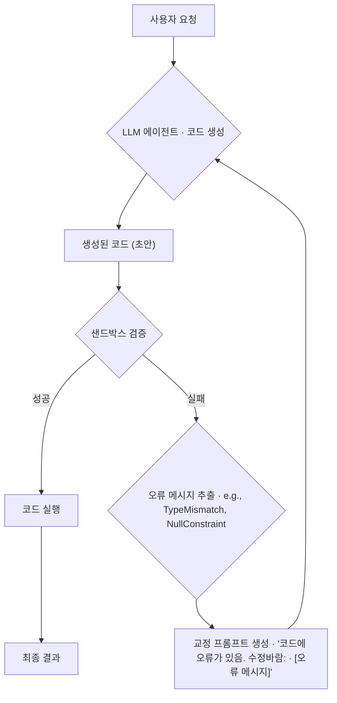

LLM 에이전트가 작성한 코드가 로컬에서는 완벽하게 작동했지만, 스테이징 환경의 실제 데이터베이스에 연결되자마_자 `NOT NULL constraint failed` 오류를 내뿜으며 비정상 종료되는 상황을 마주한 적이 있습니까? 이는 단순한 버그가 아니라, 장기 컨텍스트를 처리하는 LLM 에이전트의 근본적인 취약점, 바로 '제약 조건 붕괴(Constraint Decay)' 현상 때문일 가능성이 높습니다. 이 현상은 에이전트가 여러 차례의 대화를 거치거나 복잡한 코드를 생성하는 과정에서 초기에 제시된 핵심 제약 조건(예: 데이터베이스 스키마, API 속도 제한, 필수 필드)을 점차 '망각'하고, 그 결과 문법적으로는 유효하지만 의미적으로는 결함이 있는 코드를 생성하는 문제를 지칭합니다. 이는 단순 프롬프트 엔지니어링만으로는 해결할 수 없으며, 백엔드 시스템의 안정성과 데이터 무결성을 위협하는 심각한 엔지니어링 과제입니다.

## 제약 조건 붕괴: 보이지 않는 실패 지점

제약 조건 붕괴는 LLM의 어텐션 메커니즘이 컨텍스트 창이 길어질수록 초기 정보보다 최신 정보에 더 큰 가중치를 두는 경향에서 비롯됩니다. iOS 개발에 비유하자면, `viewDidLoad`에서 설정한 중요한 초기 상태값을 복잡한 비동기 콜백 체인 속에서 잃어버리는 것과 같습니다.

초기 프롬프트에 데이터베이스 스키마를 명시하더라도, 에이전트가 여러 기능을 구현하고 사용자 피드백을 반영하는 과정에서 해당 스키마 정보는 컨텍스트 창의 뒤로 밀려나 어텐션의 집중을 덜 받게 됩니다. 결국 에이전트는 `user_id`가 `NOT NULL`이라는 제약 조건을 잊고 `nil` 값을 허용하는 코드를 생성할 수 있습니다.

이 문제는 "데이터베이스 스키마를 반드시 준수해"와 같은 자연어 명령만으로는 해결되지 않습니다. 이는 LLM이 제약 조건을 구조적으로 이해하는 것이 아니라, 텍스트의 일부로 처리하기 때문입니다. 따라서, 우리는 더 견고한 시스템적 접근이 필요합니다.

## 제약 조건 유지를 위한 3가지 엔지니어링 전략

단순히 프롬프트를 개선하는 것을 넘어, 제약 조건 붕괴를 완화하고 코드 생성의 신뢰도를 높일 수 있는 세 가지 엔지니어링 전략이 있습니다. 각 전략은 트레이드오프가 존재하므로, 상황에 맞는 선택이 중요합니다.

| 전략 | 핵심 아이디어 | 장점 | 단점 | 적합한 상황 |
| --- | --- | --- | --- | --- |
| **제약 조건 재주입** | 코드 생성 직전, 관련 제약 조건을 컨텍스트에 다시 주입 | 구현이 간단하고 기존 아키텍처 변경이 적음 | 컨텍스트 창 낭비, 재주입 시점 판단의 어려움 | 제약 조건이 비교적 단순하고, 코드 생성 작업이 명확히 분리될 때 |
| **구조화된 제약 조건 표현** | 제약 조건을 자연어가 아닌 JSON Schema, OpenAPI 등 구조화된 형식으로 제공 | LLM이 제약 조건을 더 명확하게 해석, Tool Use와 결합 용이 | 모든 제약 조건을 구조화하기 어려움, 초기 설계 비용 증가 | API 기반 상호작용이 많거나, 명확한 스키마가 존재하는 경우 |
| **생성 후 검증 및 교정** | 생성된 코드를 실행 전 검증하고, 실패 시 오류와 함께 LLM에 피드백 | 가장 견고하고 신뢰도 높음, 예상치 못한 오류까지 포착 가능 | 검증 환경 구축 필요, 추가 LLM 호출로 인한 비용 및 지연 증가 | 데이터 무결성과 시스템 안정성이 최우선인 프로덕션 환경 |

### 제약 조건 재주입 (Constraint Re-injection)

가장 직관적인 방법입니다. 에이전트가 데이터베이스와 상호작용하는 코드를 생성할 것이라 예상되는 시점에, 관련 테이블의 스키마를 다시 프롬프트에 삽입하는 것입니다.

예를 들어, 파이썬으로 구현된 오케스트레이터는 다음과 같은 로직을 수행할 수 있습니다.

```python
# Swift가 아닌 Python 예시: 오케스트레이션 로직 표현에 더 적합
def generate_db_code(user_query: str, table_schema: dict):
    # LLM 호출 직전, 스키마 정보를 프롬프트에 명시적으로 추가
    prompt = f"""
    Here is the database schema you must adhere to:
    {json.dumps(table_schema, indent=2)}

    Based on the schema, generate Swift code for the following request:
    {user_query}
    """
    # LLM API 호출
    response = call_llm(prompt)
    return response.code
```

이 접근법은 빠르고 간단하지만, 언제 어떤 제약 조건을 재주입할지 결정하는 메타-로직이 필요하다는 단점이 있습니다.

### 구조화된 제약 조건 표현 (Structured Constraint Representation)

LLM에게 제약 조건을 텍스트 덩어리가 아닌, 기계가 읽을 수 있는 형식으로 제공하는 전략입니다. OpenAPI 명세나 JSON Schema를 활용하면, LLM은 파라미터의 타입, 필수 여부, 형식 등을 훨씬 더 정확하게 이해할 수 있습니다.

Swift에서는 `Codable` 프로토콜을 활용하여 데이터 모델을 정의하고, 이 모델 자체를 LLM에게 컨텍스트로 제공하여 타입-세이프한 코드 생성을 유도할 수 있습니다.

```swift
// LLM에게 컨텍스트로 제공할 Swift 데이터 모델
// 이 구조 자체는 강력한 제약 조건으로 작용한다.
struct Transaction: Codable {
    let transactionId: UUID
    let amount: Decimal
    let currency: String // 추후 Enum으로 개선하여 더 강력한 제약 가능
    let userId: UUID
    let merchantName: String?
    let timestamp: Date
}
```

이 방식은 특히 Function Calling과 결합될 때 강력한 힘을 발휘하지만, 데이터베이스의 복잡한 논리적 제약(예: `CHECK (balance >= 0)`)까지 표현하기에는 한계가 있습니다.

### 생성 후 검증 및 교정 (Post-generation Validation & Correction)

가장 강력하고 신뢰성 있는 접근법은 "일단 생성하고, 즉시 검증"하는 것입니다. 에이전트가 생성한 코드를 바로 실행하는 대신, 샌드박스 환경에서 정적 분석기(linter), 컴파일러, 단위 테스트 등을 통해 검증합니다. 만약 검증에 실패하면, 발생한 오류 메시지를 LLM에게 다시 전달하여 코드를 수정하도록 요청하는 자동화된 교정 루프를 구축하는 것입니다.

이 워크플로우는 다음과 같이 시각화할 수 있습니다.



이 방식은 초기 구축 비용이 높지만, 제약 조건 붕괴뿐만 아니라 다양한 종류의 코드 생성 오류를 방어할 수 있는 가장 효과적인 방어막이 됩니다.

## 프로젝트 적용: MoneyFlow의 거래 기록 에이전트

`ai-study/moneyflow` 프로젝트에서 사용자의 자연어 입력(예: "어제 스타벅스에서 5,500원 쓴 거 기록해줘")을 받아 데이터베이스에 저장하는 LLM 에이전트를 개발한다고 가정해봅시다. `transactions` 테이블에는 `amount (NUMERIC)`와 `currency (VARCHAR(3))` 컬럼이 `NOT NULL` 제약 조건과 함께 존재합니다.

제약 조건 붕괴가 발생하면, 에이전트는 `amount`를 Swift의 `Double` 타입으로 처리하거나 `currency`를 "원"으로 입력하는 코드를 생성할 수 있습니다. 이는 각각 부동소수점 정밀도 문제와 데이터 형식 위반을 초래합니다.

'생성 후 검증 및 교정' 전략을 적용하면 이 문제를 해결할 수 있습니다.

1.  **코드 생성**: LLM 에이전트가 `CoreData` 또는 `Vapor Fluent`를 사용하여 데이터를 삽입하는 Swift 코드 스니펫을 생성합니다.
2.  **컴파일 검증**: 생성된 스니펫을 별도의 샌드박스에서 컴파일합니다. `amount`에 `Double`을 할당하려 했다면, Swift 컴파일러가 `Cannot assign value of type 'Double' to type 'Decimal'` 오류를 발생시킬 것입니다.
3.  **스키마 검증**: 컴파일을 통과하면, 목(mock) 데이터베이스나 스키마 유효성 검사기를 통해 정합성을 확인합니다. `currency`에 "원"을 넣으려고 하면, `CHECK constraint failed` 또는 `value too long for type VARCHAR(3)` 같은 오류가 발생합니다.
4.  **자동 교정**: 이 컴파일/실행 오류 메시지를 캡처하여 "당신이 생성한 코드는 다음 오류로 실패했습니다: `...`. `amount`는 `Decimal` 타입이어야 하고, `currency`는 'KRW'와 같은 3자리 ISO 코드를 사용해야 합니다. 코드를 수정하세요." 라는 프롬프트를 구성하여 LLM에게 다시 전달합니다.
5.  **재생성 및 최종 실행**: 수정된 코드는 검증 단계를 통과할 가능성이 매우 높으며, 통과 시에만 실제 데이터베이스에 적용됩니다.

이러한 방어적 아키텍처는 에이전트의 자율성을 허용하면서도, 시스템의 안정성과 데이터 무결성이라는 핵심 가치를 지킬 수 있게 해줍니다.

## 자기 점검

- 제약 조건 붕괴(Constraint Decay)가 LLM 에이전트의 어텐션 메커니즘과 어떤 관계가 있는지 설명할 수 있나요?
- '제약 조건 재주입' 전략의 가장 큰 장점과, 이 전략이 오히려 비효율적일 수 있는 시나리오는 무엇일까요?
- '생성 후 검증 및 교정' 루프를 설계할 때, 비용(latency, token usage)과 안정성 사이의 트레이드오프를 어떻게 관리하시겠습니까?
- 현재 참여하고 있는 프로젝트(또는 가상의 iOS 앱)에서 LLM 에이전트가 생성하는 데이터나 설정 값이 따라야 하는 암묵적/명시적 제약 조건에는 어떤 것들이 있을까요? 이 제약 조건들을 어떻게 시스템적으로 강제할 수 있을지 구상해보세요.