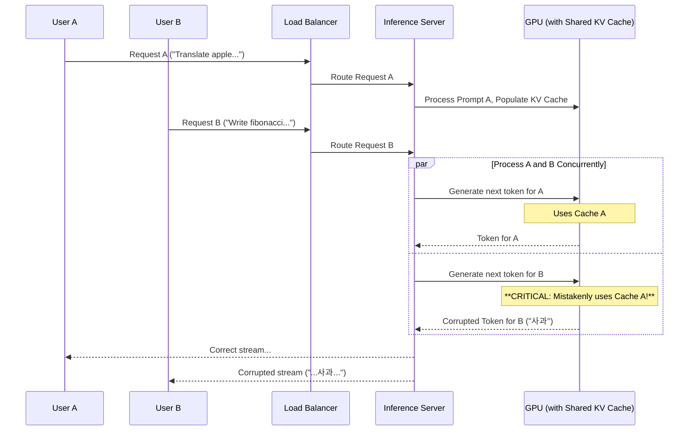
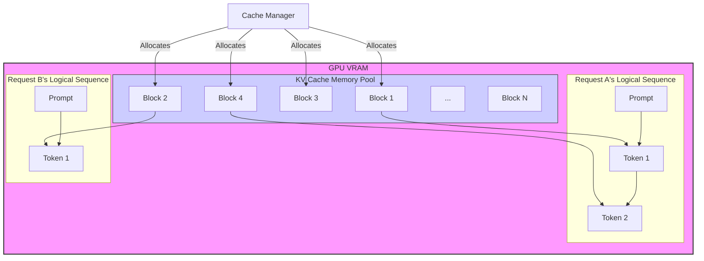

## 왜 KV 캐시가 중요한가?

프론트엔드나 iOS 개발자에게 '캐시'는 익숙한 개념입니다. API 응답을 저장해 불필요한 네트워크 요청을 줄이거나, 이미지를 메모리에 올려 UI를 부드럽게 만드는 데 사용하죠. 대규모 언어 모델(LLM)의 세계에도 'KV 캐시'라는 매우 중요한 캐시가 존재합니다. 하지만 이는 단순한 데이터 저장을 넘어, 추론 성능을 좌우하는 핵심 요소이며 동시에 대규모 서비스에서 미묘한 버그의 온상이 되기도 합니다.

LLM은 다음 단어를 예측하기 위해 지금까지 입력된 모든 단어(토큰)를 참고합니다. 예를 들어 "오늘 날씨는 정말"이라는 문장 다음에 올 단어를 예측하려면, 이 문장 전체를 어텐션 메커니즘(Attention Mechanism)으로 계산해야 합니다. 문제는 다음 단어인 "좋네요"를 생성한 후, 그 다음 단어를 예측할 때 "오늘 날씨는 정말 좋네요"를 처음부터 다시 계산해야 한다는 점입니다. 이는 엄청난 낭비입니다.

KV 캐시는 바로 이 중복 계산을 막아줍니다. 어텐션 레이어를 통과하며 생성되는 중간 결과물인 Key와 Value를 GPU 메모리에 저장해두는 것입니다. 새로운 토큰이 추가되면, 기존 토큰들에 대한 Key-Value 값은 캐시에서 가져오고 새로 추가된 토큰에 대한 계산만 수행하면 됩니다. 이 덕분에 긴 문장을 생성할 때도 속도를 유지할 수 있습니다.

문제는 여기서 시작됩니다. **하나의 고성능 GPU에서 수십, 수백 명의 사용자 요청을 동시에 처리하려면 어떻게 해야 할까요?** 모든 요청이 이 공유된 GPU 메모리의 KV 캐시 공간을 사용하려고 할 때, 바로 'Race Condition'이라는 시한폭탄이 작동하기 시작합니다.

## 지옥의 문: KV 캐시 Race Condition

가장 순진한 방법은 들어오는 요청을 하나의 GPU에서 순차적으로 처리하는 것입니다. 하지만 이는 GPU의 병렬 처리 능력을 전혀 활용하지 못하는 방식입니다. 그래서 현대적인 추론 서버들은 여러 요청을 하나의 배치(batch)로 묶어 동시에 처리하려고 시도합니다.

이때 각 요청은 자신만의 대화 문맥, 즉 자신만의 KV 캐시를 가져야 합니다. 만약 이 캐시가 제대로 격리되지 않으면 어떤 일이 벌어질까요?

- **요청 A:** "Translate 'apple' to Korean:"
- **요청 B:** "Write a python function to calculate fibonacci:"

추론 서버가 두 요청을 동시에 처리하다가 실수로 요청 B의 다음 토큰을 생성할 때 요청 A의 KV 캐시를 참조했다고 가정해 봅시다. 결과는 끔찍할 것입니다.

```python
# 요청 B의 결과 (오염된 경우)
def fibonacci(n):
    # 'apple'의 한국어 번역인 '사과'가 뜬금없이 나타남
    사과 a, b = 0, 1
    ...
```

이것이 바로 GLM-5와 같은 대규모 모델의 초기 서비스 단계에서 발견된 버그의 본질입니다. 여러 요청이 동일한 물리적 메모리 블록에 대한 포인터를 공유하거나, 캐시 슬롯 할당/해제 로직에 결함이 있을 때 발생합니다. 요청들이 서로의 '단기 기억'을 침범하여 완전히 망가진 결과를 내놓는 것입니다.

### 시각화된 Race Condition 시나리오

아래 다이어그램은 Race Condition이 어떻게 발생하는지를 보여줍니다. Inference Server의 Cache Manager가 각 요청의 KV 캐시를 명확히 구분하지 못하면, User B는 User A의 문맥이 섞인 잘못된 응답을 받게 됩니다.



## 해결책: 요청 단위의 완벽한 메모리 격리

이 문제를 해결하기 위한 현대적인 추론 인프라의 핵심은 **논리적, 물리적 메모리 격리**입니다. vLLM, TensorRT-LLM과 같은 최신 서빙 프레임워크들은 PagedAttention이라는 기법을 사용합니다. 이는 운영체제의 가상 메모리 페이징 기법에서 영감을 얻은 것으로, 다음과 같이 동작합니다.

1.  **메모리 풀링 (Pooling):** 시작 시점에 전체 GPU VRAM의 KV 캐시 공간을 수많은 작은 블록(block)으로 미리 할당해 둡니다.
2.  **요청별 블록 할당:** 새로운 요청이 들어오면, 해당 요청만을 위한 논리적인 시퀀스(sequence)를 생성하고 필요한 만큼 물리적인 메모리 블록을 이 시퀀스에 매핑합니다.
3.  **동적 관리:** 텍스트가 길어지면 더 많은 블록을 할당하고, 요청이 끝나면 블록들을 다시 풀(pool)에 반납합니다.

각 요청은 자신에게 할당된 메모리 블록에만 접근할 수 있으므로, 다른 요청의 캐시를 침범할 가능성이 원천적으로 차단됩니다.



이 구조에서 `Cache Manager`는 각 요청의 논리적 시퀀스에 물리적 메모리 블록을 안전하게 연결해주는 역할을 합니다. Request A와 B는 서로 다른 물리 블록(B1, B4 vs B2)을 사용하므로 충돌이 발생하지 않습니다.

## 2026년 인프라 트렌드: 정적 배치를 넘어 연속 배치로

Race Condition을 해결했다고 끝이 아닙니다. 진정한 '스케일링'은 GPU 활용률을 극대화하는 데서 나옵니다.

| 접근 방식 | 설명 | 장점 | 단점 (Scaling Pain) |
| :--- | :--- | :--- | :--- |
| **정적 배치 (Static Batching)** | 여러 요청을 모아 길이가 가장 긴 요청에 맞춰 패딩(padding)을 추가하고 한 번에 처리 | 구현이 비교적 간단 | 짧은 요청이 긴 요청을 기다려야 함 (Head-of-Line Blocking), 패딩으로 인한 GPU 자원 낭비 |
| **연속 배치 (Continuous Batching)** | GPU가 한 스텝(토큰 생성)을 마칠 때마다, 완료된 요청은 배치에서 제거하고 대기 중인 새 요청을 즉시 추가 | GPU 유휴 시간 최소화, 처리량(Throughput) 최대 20배 이상 향상, 공정한 스케줄링 | 스케줄러 구현이 복잡, KV 캐시 관리가 더욱 중요해짐 |

2026년의 대규모 AI 에이전트 서비스는 **연속 배치(Continuous Batching)** 또는 이와 유사한 동적 스케줄링 기법을 기본으로 채택할 것입니다. 이는 마치 iOS의 `Grand Central Dispatch`나 프론트엔드의 `RequestAnimationFrame`처럼, 시스템의 리소스를 가장 효율적으로 사용하기 위한 정교한 스케줄링 전략입니다.

프론트엔드/iOS 개발자 입장에서 이 백엔드의 복잡성은 다음과 같은 영향을 미칩니다.
- **스트리밍 우선 API:** 토큰이 생성되는 대로 바로 클라이언트에 전송하는 스트리밍(Server-Sent Events 등) 방식이 표준이 됩니다. UI는 이런 비동기적이고 점진적인 데이터 수신에 맞춰 설계되어야 합니다.
- **첫 토큰까지의 시간 (TTFT):** 연속 배치 덕분에 시스템 전체 처리량은 높아지지만, 내 요청이 GPU 연산 사이클에 포함될 때까지 약간의 대기 시간이 발생할 수 있습니다. 로딩 인디케이터나 스켈레톤 UI로 이 지연 시간을 자연스럽게 처리해야 합니다.
- **문맥 관리의 책임:** KV 캐시는 서버의 '휘발성 단기 기억'일 뿐입니다. 대화의 전체 문맥(history)을 관리하고, 다음 API 요청에 필요한 부분을 포함해 보내는 책임은 여전히 클라이언트 또는 BFF(Backend for Frontend)에 있습니다.

## 자기 점검

1.  LLM 추론에서 KV 캐시가 왜 필수적인가요? 이것이 없다면 어떤 성능 문제가 발생할까요?
2.  여러 사용자의 요청을 동시에 처리할 때 KV 캐시에서 Race Condition이 발생하는 근본적인 원인은 무엇인가요?
3.  PagedAttention과 같은 현대적인 기법은 어떻게 Race Condition을 방지하고 메모리 단편화를 줄이나요?
4.  정적 배치와 연속 배치의 가장 큰 차이점은 무엇이며, 왜 연속 배치가 대규모 서비스에 더 적합한가요?
5.  **동료에게 설명하기:** 동료 프론트엔드 개발자에게 "LLM 추론 서버가 왜 일반적인 CRUD 백엔드 서버보다 상태 관리가 훨씬 복잡하고 어려운지" KV 캐시와 동시성 문제를 중심으로 비유를 들어 설명해 보세요.
6.  **실습 과제:** TypeScript 또는 Swift를 사용하여 SSE(Server-Sent Events) 클라이언트를 구현해 보세요. 서버가 `data: {"token": "hello"}`와 같은 JSON 객체를 토큰 단위로 스트리밍한다고 가정하고, 이를 받아 UI 텍스트 뷰에 부드럽게(타이핑 효과처럼) 표시하는 로직을 작성합니다. 중간에 `[DONE]`과 같은 종료 메시지를 받으면 스트림을 닫도록 처리합니다. 이를 통해 서버 측의 순차적 생성 프로세스가 클라이언트에 미치는 영향을 직접 경험할 수 있습니다.