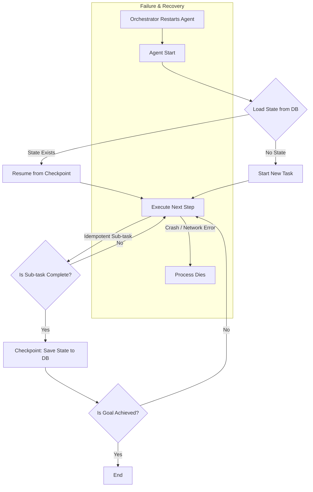

단순한 API 호출 래퍼(wrapper)를 넘어, AI 에이전트가 며칠, 심지어 몇 주 동안 자율적으로 작업을 수행해야 한다면 무엇이 달라질까요? iOS나 프론트엔드 개발자에게 익숙한 세션 기반의 단기 실행 모델과 달리, 장기 실행 에이전트는 '실패는 필연적'이라는 가정 하에 설계되어야 합니다. 네트워크 오류, API 제한, 인프라 재시작, 심지어 예기치 못한 버그까지, 실행 시간이 길어질수록 실패 확률은 100%에 수렴합니다.

이 문제의 핵심은 **상태(State)를 실행(Execution)과 분리**하는 것입니다. 에이전트 프로세스는 언제든 중단될 수 있는 일회용 컨테이너로 취급하고, 작업의 맥락과 진행 상황(상태)은 외부의 영구 저장소에 보관해야 합니다.

### 단기 실행 vs. 장기 실행: 근본적인 설계 차이

| 관점 | 단기 실행 에이전트 (Short-Lived) | 장기 실행 에이전트 (Long-Lived) |
| :--- | :--- | :--- |
| **상태 관리** | 인-메모리(In-Memory) 변수, 세션 스토리지 | 외부 영구 저장소 (DB, File System) |
| **실패 처리** | 재시도(Retry) 후 실패 반환 | 체크포인트에서 자동 복구 및 재개 |
| **작업 단위** | 원자적(Atomic), 단일 트랜잭션 | 멱등성(Idempotent)을 보장하는 여러 단계 |
| **핵심 가정** | "실패하지 않을 것이다" | "반드시 실패할 것이다" |

이러한 패러다임 전환은 Temporal.io 같은 Durable Execution 프레임워크의 핵심 철학과도 맞닿아 있습니다.

> **외부 권위 자료:** "Durable Execution: The Pervasive Abstraction for Reliable Applications" (Temporal.io Blog)
> **핵심 인사이트:** 워크플로우 로직을 상태 관리와 분리하여, 코드가 수십 년 동안 실행되더라도 인프라 장애로부터 복원력을 갖도록 보장합니다.

장기 실행 에이전트는 단순히 `while True:` 루프를 실행하는 스크립트가 아니라, 신뢰성 높은 분산 시스템의 원칙을 적용한 아키텍처입니다.

## 장기 실행 에이전트의 3대 아키텍처 패턴

장기 실행 에이전트의 생존을 보장하기 위한 세 가지 핵심 패턴은 상태 지속성, 작업 체크포인팅, 그리고 자동 복구입니다.

### 1. 상태 지속성 (State Persistence)

에이전트의 '기억'은 외부에 존재해야 합니다. 메모리에 저장된 모든 변수는 프로세스가 종료되는 순간 사라집니다.

-   **무엇을 저장하는가?**
    -   현재 작업 목표 (Overall Goal)
    -   완료된 하위 작업 목록 (Completed Sub-tasks)
    -   다음 실행할 하위 작업 (Next Sub-task)
    -   지금까지 수집한 정보 및 중간 결과물 (Collected Context)
    -   API 사용량, 토큰 카운트 등 메타데이터
-   **어디에 저장하는가?**
    -   **파일 시스템 (JSON, YAML):** 간단한 에이전트나 단일 인스턴스 환경에 적합합니다.
    -   **NoSQL 데이터베이스 (Firestore, DynamoDB):** 상태를 구조화된 문서로 저장하기 용이하며, 확장성이 좋습니다.
    -   **Key-Value 스토어 (Redis):** 빠른 읽기/쓰기가 필요할 때 유용하지만, 영속성 설정에 주의해야 합니다.

### 2. 작업 체크포인팅 (Task Checkpointing)

전체 작업을 하나의 거대한 트랜잭션으로 보는 대신, 여러 개의 작은 '저장 가능한' 단위로 나눕니다. 각 단위 작업이 끝날 때마다 현재 상태를 영구 저장소에 기록하는 것을 체크포인팅이라고 합니다.

체크포인팅의 핵심은 **멱등성(Idempotency)** 입니다. 동일한 입력으로 여러 번 호출해도 항상 동일한 결과를 반환해야 합니다. 예를 들어, '파일 A 생성' 작업이 실패 후 재시도될 때, 이미 파일이 존재한다면 오류를 발생시키지 않고 성공으로 처리해야 합니다.

### 3. 자동 복구 및 재개 (Automatic Recovery & Resumption)

에이전트 프로세스가 다시 시작될 때, 가장 먼저 해야 할 일은 영구 저장소에서 마지막 체크포인트를 불러오는 것입니다.

1.  에이전트 시작
2.  지정된 ID의 상태를 DB에서 조회
3.  상태가 존재하면:
    1.  상태를 메모리로 로드
    2.  마지막으로 성공한 작업 다음부터 실행 재개
4.  상태가 없으면 (새로운 작업):
    1.  초기 상태를 설정하고 DB에 저장
    2.  첫 번째 작업부터 실행 시작

이 전체 흐름을 다이어그램으로 표현하면 다음과 같습니다.



## Python 코드 예제: 파일 기반 체크포인팅

다음은 파일 시스템을 이용해 상태를 저장하고 복구하는 간단한 장기 실행 에이전트의 예시입니다.

```python
import json
import os
import time

class LongRunningAgent:
    def __init__(self, agent_id: str, goal: str):
        self.agent_id = agent_id
        self.state_file = f"{agent_id}_state.json"
        self.state = self._load_state()

        if not self.state:
            # Initialize state for a new agent
            self.state = {
                "goal": goal,
                "completed_steps": [],
                "next_step": 0,
                "context": {}
            }
            self._save_state()

    def _load_state(self):
        """Loads agent state from the JSON file if it exists."""
        if os.path.exists(self.state_file):
            with open(self.state_file, 'r') as f:
                print("Found existing state. Resuming...")
                return json.load(f)
        return None

    def _save_state(self):
        """Saves the current state to the JSON file."""
        with open(self.state_file, 'w') as f:
            json.dump(self.state, f, indent=2)
        print(f"Checkpoint saved at step {self.state['next_step']}.")

    def run(self):
        """Main execution loop with checkpointing."""
        total_steps = 5 # Example: a task with 5 steps
        
        while self.state['next_step'] < total_steps:
            current_step = self.state['next_step']
            
            try:
                print(f"Executing step {current_step}...")
                # --- Simulate work ---
                # This is where you'd call an LLM, an API, etc.
                time.sleep(2) 
                
                # Simulate a potential failure
                if current_step == 2 and "crashed_before" not in self.state:
                    self.state["crashed_before"] = True
                    self._save_state() # Save state before crashing
                    raise Exception("Simulating a crash!")
                
                # --- Work simulation ends ---
                
                self.state['completed_steps'].append(current_step)
                self.state['next_step'] += 1
                
                # Checkpoint after each successful step
                self._save_state()

            except Exception as e:
                print(f"An error occurred: {e}. Agent will stop. It can be resumed later.")
                return # Stop execution

        print("Goal achieved. All steps completed.")


# --- Simulation ---
AGENT_ID = "web-research-agent-001"
GOAL = "Analyze market trends for AI in frontend development"

# 1. First run: It will run up to step 2 and then "crash"
print("--- Starting first run ---")
agent = LongRunningAgent(agent_id=AGENT_ID, goal=GOAL)
agent.run()

print("\n--- Agent crashed. Restarting... ---\n")

# 2. Second run: It will load the state and resume from step 2
agent_restarted = LongRunningAgent(agent_id=AGENT_ID, goal=GOAL)
agent_restarted.run()

# Clean up
if os.path.exists(f"{AGENT_ID}_state.json"):
    os.remove(f"{AGENT_ID}_state.json")
```

이 코드는 2번 단계에서 의도적으로 예외를 발생시켜 에이전트를 중단시킵니다. 다시 실행하면 `_load_state`가 `web-research-agent-001_state.json` 파일을 읽어 마지막으로 성공한 체크포인트(step 2 실행 직전)부터 작업을 재개합니다.

## `ai-study` 프로젝트의 '개인화 학습 튜터'에 적용하기

`ai-study` 프로젝트에서 사용자가 4주 과정의 학습 계획을 따라가는 '개인화 학습 튜터' 에이전트를 만든다고 가정해봅시다. 이 에이전트는 사용자의 진행 상황을 추적하고, 퀴즈 결과를 분석하며, 다음 학습 내용을 추천하는 장기 실행 작업이 필요합니다.

-   **상태 (State):**
    -   `user_id`: "user-123"
    -   `current_week`: 2
    -   `completed_modules`: ["intro_to_swiftui", "state_management"]
    -   `last_quiz_scores`: `{"state_management": 85}`
    -   `next_recommendation`: "advanced_animations"
-   **체크포인트 시점:** 사용자가 모듈 하나를 완료하거나 퀴즈를 제출할 때마다.
-   **장애 시나리오:** 주말에 서버가 재시작되더라도, 월요일에 사용자가 다시 접속했을 때 튜터 에이전트는 정확히 중단된 지점(`advanced_animations` 모듈 추천)에서 대화를 이어갈 수 있습니다. 만약 상태가 인-메모리에만 있었다면, 모든 학습 기록이 사라지고 처음부터 다시 시작해야 했을 것입니다.

이처럼 상태 지속성과 체크포인팅은 사용자 경험을 해치지 않고 안정적인 장기 서비스를 제공하는 데 필수적입니다.

## 자기 점검

1.  상태 지속성(State Persistence)과 작업 체크포인팅(Task Checkpointing)의 주요 차이점은 무엇인가요?
2.  장기 실행 에이전트의 작업 단위가 '멱등성(Idempotent)'을 가져야 하는 이유는 무엇인가요? 실제 예시를 들어 설명해 보세요.
3.  위 Python 예제에서 상태 저장소로 JSON 파일 대신 Firestore를 사용하도록 변경하려면 코드의 어느 부분을 수정해야 할까요?
4.  만약 에이전트가 외부 API를 호출하는 도중(예: `time.sleep(2)` 부분)에 프로세스가 강제 종료된다면 어떤 문제가 발생할 수 있으며, 이를 어떻게 완화할 수 있을까요?
5.  **동료에게 설명하기:** "AI 에이전트가 며칠 동안 돌아가게 만들려면, 그냥 `while` 루프를 쓰는 것과 우리가 여기서 논의한 아키텍처를 쓰는 게 근본적으로 어떻게 다른지" 동료 개발자에게 설명해 보세요.
6.  **실습 과제:** 위 Python 코드 예제에 '실행 횟수(run_count)'와 '마지막 에러 메시지(last_error)'를 `state`에 추가해 보세요. 에이전트가 재시작될 때마다 `run_count`를 1씩 증가시키고, 예외 발생 시 에러 메시지를 `last_error`에 기록한 후 상태를 저장하도록 코드를 수정해 보세요.