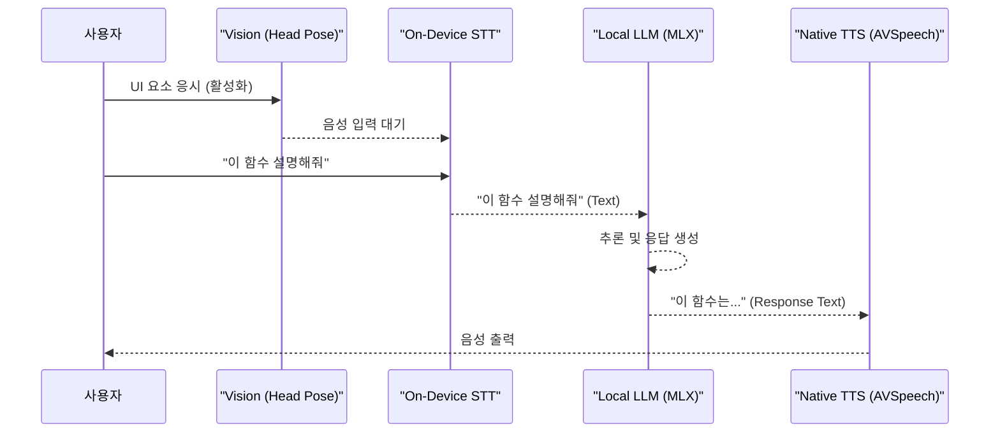

클라우드 API를 왕복하던 데스크톱 AI 에이전트 모델이 한계를 드러내고 있습니다. 사용자는 Rabbit R1이나 Humane AI Pin 같은 웨어러블 디바이스가 약속했던 즉각적이고 끊김 없는 상호작용을 기대하지만, 정작 해답은 새로운 하드웨어가 아닌 이미 우리가 가진 강력한 M-시리즈 Mac에 있을 수 있습니다. 최근 등장하는 로컬 음성 에이전트 프로젝트들(예: `mac-echo`, `RealtimeVoiceChat`, Pipecat 기반 `macos-local-voice-agents` 등 오픈소스 사례)은 이러한 변화를 잘 보여줍니다. 이 글에서는 이런 부류의 에이전트를 편의상 **TalkMode**라고 부르겠습니다 — 특정 상용 제품이 아니라 "온디바이스 실시간 음성 에이전트"라는 아키텍처 패턴을 가리키는 작업명입니다. 핵심은 클라우드 의존성을 최소화하고 macOS 네이티브 기술을 활용하여 턴 지연(latency)을 밀리초(ms) 단위로 줄이는 것입니다.

이 글은 단순한 LLM 연동을 넘어, VisionKit 시선 추적, 온디바이스 STT/TTS, 그리고 Apple Silicon에 최적화된 로컬 LLM을 결합하여 어떻게 진정한 실시간 음성 에이전트를 설계할 수 있는지 그 전략과 트레이드오프를 심도 있게 다룹니다. iOS 시니어 개발자가 AI 엔지니어링의 세계로 진입할 때, 가장 강력한 무기는 바로 플랫폼에 대한 깊은 이해입니다.

## 실시간 에이전트의 핵심 병목: 지연 시간과의 전쟁

음성 에이전트의 사용자 경험은 응답 속도에 의해 결정됩니다. 사용자가 말을 마친 후 에이전트가 응답하기까지의 시간, 즉 '턴 지연(turn latency)'은 여러 단계에서 누적됩니다.

1.  **음성 인식 (STT):** 오디오 데이터를 텍스트로 변환하는 시간.
2.  **생각 (LLM Inference):** 텍스트를 이해하고 응답을 생성하는 시간.
3.  **음성 합성 (TTS):** 응답 텍스트를 오디오로 변환하는 시간.
4.  **네트워크 왕복 (RTT):** 각 단계를 클라우드 API로 처리할 때 발생하는 네트워크 지연.

기존 방식은 이 모든 과정을 네트워크를 통해 클라우드에서 처리하여 수 초의 지연이 발생하는 것이 일반적이었습니다. 하지만 실시간 음성 에이전트의 목표는 이 지연을 1초 미만(대화가 끊겼다고 느끼는 경계는 통상 ~500ms 전후로 알려져 있다)으로 단축하여 대화가 끊기지 않게 하는 것입니다. 가장 직접적인 해법은 RTT를 발생시키는 클라우드 왕복을 제거하고 처리를 디바이스 내부, 즉 '온디바이스(On-device)'로 가져오는 것입니다.



## macOS 네이티브 기술 스택 조합 전략

빠른 응답성을 확보하기 위해 우리는 macOS가 제공하는 강력한 프레임워크들을 적극적으로 활용해야 합니다. 각 컴포넌트 선택에는 명확한 트레이드오프가 따릅니다.

### 1. 활성화 트리거: 키보드를 넘어 시선으로

음성 에이전트를 '언제' 활성화할지는 중요한 설계 결정입니다. 단축키나 "Hey Siri" 같은 핫워드도 유용하지만, 시선/얼굴 방향 기반 트리거는 훨씬 더 지능적이고 문맥적인 상호작용을 가능하게 합니다. 예를 들어, 사용자가 코드 에디터의 특정 함수를 응시하는 것만으로 에이전트를 활성화하여 "이 함수를 설명해줘"라고 말할 수 있습니다.

> **프레임워크 주의:** 흔히 "VisionKit"과 "Vision"을 혼용하는데, Apple의 `VisionKit`은 문서 스캐너(`VNDocumentCameraViewController`)와 Live Text/Visual Look Up용 프레임워크다. 카메라 프레임에서 얼굴 랜드마크나 머리 회전각을 얻는 ML 작업은 `Vision` 프레임워크(`VNDetectFaceLandmarksRequest` 등)의 영역이다. 또한 진짜 "안구 시선(gaze)" 추적은 일반 카메라만으로는 한계가 있어 ARKit의 `ARFaceAnchor.lookAtPoint`(TrueDepth 카메라 필요)나 별도 하드웨어가 필요하다. 아래 코드는 카메라 프레임의 **머리 방향(head pose)** 으로 시선을 *근사*하는 개념 예시다.

**Swift 개념 코드 (VisionKit):**

```swift
// VisionKit을 활용한 시선 또는 얼굴 방향 감지 로직 (개념적)
// 실제 Gaze 추적은 ARKit 또는 특정 하드웨어 API가 필요할 수 있음
// 여기서는 Vision의 얼굴 랜드마크를 활용한 방향 추정을 예시로 함

import Vision
import AVFoundation

class GazeTrigger: NSObject, AVCaptureVideoDataOutputSampleBufferDelegate {
    private let sequenceHandler = VNSequenceRequestHandler()

    // 카메라 캡처 세션에서 비디오 프레임을 받아 처리
    func captureOutput(_ output: AVCaptureOutput, didOutput sampleBuffer: CMSampleBuffer, from connection: AVCaptureConnection) {
        guard let pixelBuffer = CMSampleBufferGetImageBuffer(sampleBuffer) else { return }

        // 얼굴 랜드마크 감지 요청
        let faceLandmarksRequest = VNDetectFaceLandmarksRequest { (request, error) in
            guard let results = request.results as? [VNFaceObservation], let firstResult = results.first else { return }

            // 머리의 회전 각도(yaw, 단위는 라디안)를 통해 시선 방향 근사
            // 0.5 rad ≈ 28.6°. 임계값은 실제 카메라 배치/사용자 거리에 맞춰 보정 필요
            if let yaw = firstResult.yaw, abs(yaw.doubleValue) > 0.5 {
                print("Head turned past threshold. Activating agent...")
                // 여기에 음성 에이전트 활성화 로직 호출
            }
        }

        try? sequenceHandler.perform([faceLandmarksRequest], on: pixelBuffer, orientation: .leftMirrored)
    }
}
```
Vision 프레임워크는 얼굴 및 신체 부위를 추적하는 강력한 기능을 제공합니다.

**활성화 방법 비교**

| 방법 | 지연 시간 | 사용자 방해 | 문맥 인식 | 전력 소모 |
| :--- | :--- | :--- | :--- | :--- |
| **키보드 단축키** | 매우 낮음 | 낮음 | 낮음 | 매우 낮음 |
| **핫워드 ("Hey Siri")** | 낮음-중간 | 중간 | 낮음 | 중간 |
| **시선 추적 (VisionKit)** | 낮음 | 낮음-중간 | **높음** | 높음 |
| **UI 버튼 클릭** | 매우 낮음 | 높음 | 높음 | 매우 낮음 |

시선 추적은 전력 소모가 높고 최신 하드웨어가 필요하다는 단점이 있지만, '손을 사용하지 않고(hands-free)' 문맥을 파악하는 가장 자연스러운 방법이라는 점에서 매력적인 선택지입니다.

### 2. STT/TTS: 클라우드 의존성 제거

실시간 상호작용에서 네트워크 지연은 가장 큰 적입니다. 따라서 음성 인식(STT)과 합성(TTS)은 반드시 온디바이스에서 처리해야 합니다.

*   **온디바이스 STT:** Apple의 네이티브 `SFSpeechRecognizer`는 빠르고 정확하지만 짧은 발화(dictation) 중심입니다. iOS 26/macOS Tahoe(WWDC25)부터 도입된 `SpeechAnalyzer` 프레임워크는 장문 오디오, 자동 언어 관리, 낮은 지연을 노린 새 온디바이스 모델로, MacRumors 테스트에서는 OpenAI Whisper 대비 약 55% 빠른 처리 속도가 보고되었습니다(34분 영상 ≈ 45초 처리). `SpeechAnalyzer`는 `SpeechTranscriber`(장문)·`DictationTranscriber`(단문, 기존 `SFSpeechRecognizer` 대체)·`SpeechDetector`(VAD) 모듈로 구성됩니다. 다만 신규 프레임워크는 아직 커스텀 어휘(domain vocabulary) 등록을 지원하지 않으므로, 도메인 전문 용어 인식이 중요하다면 레거시 API를 병행하거나 CoreML로 변환된 Whisper 모델(예: WhisperKit)을 앱에 내장하는 것이 대안입니다.

*   **네이티브 TTS:** `AVSpeechSynthesizer`는 macOS에 내장된 TTS 엔진으로, 지연 시간이 거의 없고 무료입니다. ElevenLabs 같은 클라우드 기반 TTS의 목소리 품질에는 미치지 못할 수 있지만, '즉각적인 피드백'이라는 실시간 에이전트의 목표에는 가장 부합합니다. 품질보다 속도가 우선인 상황에서는 절대적인 선택입니다.

이 접근법의 트레이드오프는 명확합니다. 클라우드 API 대비 TTS 품질이 다소 낮고, STT의 언어 지원이 제한될 수 있습니다. 하지만 오프라인 작동, 완벽한 개인정보 보호, 그리고 결정적으로 수백 ms의 지연 시간 감소라는 압도적인 장점을 얻게 됩니다.

### 3. LLM 연동: Apple Silicon을 위한 로컬 추론

Apple Silicon의 통합 메모리 아키텍처는 디바이스에서 LLM을 실행하기에 최적의 환경을 제공합니다. Apple이 직접 개발한 `MLX` 프레임워크나 `llama.cpp`를 활용하면 Swift 코드에서 로컬 LLM을 직접 구동할 수 있습니다.

*   **모델 선택:** 모든 작업을 처리하는 거대한 모델 대신, 특정 작업에 파인튜닝된 소형 모델(예: 3B~8B)을 사용하는 것이 현실적입니다. 예를 들어, 코드 설명 에이전트라면 CodeLlama나 Phi-3의 파인튜닝 버전을 사용할 수 있습니다.
*   **양자화 (Quantization):** 모델의 가중치를 4-bit 정수 등으로 압축하여 메모리 사용량을 크게 줄이는 기술입니다. 런타임과 포맷이 짝지어진다는 점에 주의하세요 — `llama.cpp`는 GGUF 포맷(예: `Q4_K_M`)을, `MLX`는 자체 `mlx` 양자화 포맷을 사용합니다. 4-bit 양자화하면 7B급 모델의 가중치가 대략 4GB대로 줄어, 통합 메모리 16GB MacBook에서도 다른 앱과 공존하며 실행할 만합니다(컨텍스트 길이가 길어지면 KV 캐시 메모리가 추가로 든다는 점은 별도로 측정 필요).
*   **클라우드 폴백(Fallback):** 로컬 모델이 처리하기 어려운 복잡한 요청(예: 장문의 보고서 작성, 긴 멀티스텝 추론)이 들어올 경우에만 선택적으로 고성능 클라우드 모델(GPT/Claude 계열 프런티어 모델)을 호출하는 '하이브리드' 전략을 쓸 수 있습니다. 비용과 성능의 균형을 맞추는 현실적인 접근법이지만, 폴백이 발생하는 순간 RTT가 다시 끼어들어 턴 지연이 튀므로 — 폴백 판단 기준(토큰 길이/난이도 분류)을 보수적으로 잡고, 폴백 중에는 "잠시만요" 같은 즉각적 음성 큐로 체감 지연을 가리는 것이 실패 모드 완화책입니다.

## 프로젝트 적용: `ai-study`를 위한 실시간 코드 어시스턴트

이 아키텍처를 `ai-study` 프로젝트에 적용하는 시나리오를 생각해 볼 수 있습니다. 개발자가 Xcode에서 특정 Swift 코드를 읽고 있다고 가정해 봅시다.

1.  **활성화:** 개발자가 이해하기 어려운 `complexFunction`을 5초 이상 응시합니다. VisionKit 기반 트리거가 이를 감지하고 TalkMode를 활성화하며 부드러운 오디오 큐를 재생합니다.
2.  **입력:** 개발자가 "이 함수가 하는 일을 설명하고, 더 효율적인 방식으로 리팩토링해 줘"라고 말합니다.
3.  **처리:** `SpeechAnalyzer`가 실시간으로 음성을 텍스트로 변환합니다. 변환된 텍스트와 현재 커서가 위치한 코드 컨텍스트가 로컬에서 실행 중인 Phi-3-mini 모델로 전달됩니다. 모델은 코드 분석 후 설명과 리팩토링 제안을 생성합니다.
4.  **출력:** `AVSpeechSynthesizer`가 생성된 텍스트를 즉시 음성으로 변환하여 개발자에게 들려줍니다. 전체 과정은 1-2초 안에 완료됩니다.

이 경험은 웹페이지를 열고, 코드를 복사하여 붙여넣고, 응답을 기다리는 기존의 ChatGPT 사용 방식과는 차원이 다른 생산성을 제공합니다.

## 자기 점검

*   클라우드 기반 STT/TTS 서비스가 온디바이스 기술보다 음성 품질이 더 높음에도 불구하고, 실시간 음성 에이전트에서 온디바이스를 우선해야 하는 이유는 무엇인가요?
*   VisionKit의 시선 추적을 활성화 트리거로 사용할 때 발생할 수 있는 주요 단점 두 가지는 무엇이며, 이를 완화할 방법은 무엇일까요?
*   로컬 LLM과 클라우드 LLM을 함께 사용하는 하이브리드 아키텍처에서, 어떤 기준으로 두 모델 간의 작업을 분배하는 것이 합리적일까요?
*   당신이 현재 참여하고 있는 iOS/macOS 프로젝트에 이 글에서 설명한 '온디바이스 실시간 에이전트' 아키텍처를 적용한다면, 어떤 기능을 가장 먼저 구현하고 싶으며 그 이유는 무엇입니까?