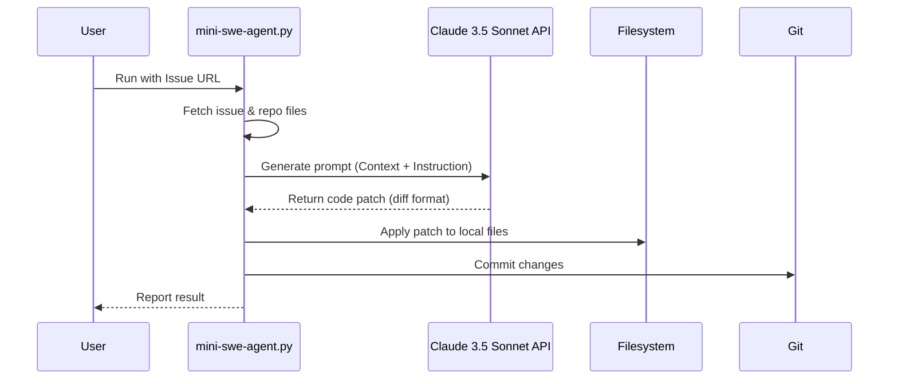

## 복잡성은 이제 그만: 최소주의 AI 에이전트의 부상

AI 에이전트 분야는 멀티에이전트 오케스트레이션, 자율적 학습 루프, 복잡한 거버넌스 모델 등 거대 담론으로 가득 차 있습니다. 하지만 iOS 및 프론트엔드 개발자의 일상적인 업무에 필요한 것은 범용인공지능(AGI)이 아니라, 당장 눈앞의 반복적인 작업을 처리해 줄 가벼운 자동화 도구입니다. `mini-swe-agent`는 바로 이 지점을 파고드는 최소주의 철학의 산물입니다.

이 접근법이 중요한 이유는 '비용'과 '효용'의 균형에 있습니다. 수십 개의 에이전트가 협력하는 시스템을 구축하는 것은 막대한 엔지니어링 비용을 요구하지만, 정작 우리가 해결하려는 문제는 "라이브러리 버전 업데이트", "오타 수정", "로컬라이제이션 키 추가" 같은 작은 단위의 작업일 때가 많습니다. `mini-swe-agent`는 이러한 '마이크로 태스크'를 해결하기 위해 100줄 남짓한 코드로 구성된 단일 목적 AI 에이전트라는 해법을 제시합니다. 이는 복잡한 아키텍처 없이도 즉각적인 생산성 향상을 경험할 수 있음을 의미합니다.

## `mini-swe-agent`의 핵심 동작 원리

`mini-swe-agent`의 워크플로우는 놀랍도록 단순합니다. 복잡한 '생각-계획-실행(Think-Plan-Act)' 루프 대신, 명확한 '지시-실행(Instruct-Execute)' 모델을 따릅니다.



이 흐름의 핵심은 두 가지입니다.

1.  **컨텍스트 자동화:** 에이전트는 주어진 GitHub 이슈 URL을 기반으로 이슈 설명, 댓글, 그리고 연관된 코드 파일을 자동으로 수집하여 LLM에게 제공할 컨텍스트를 구성합니다. 개발자가 직접 파일을 복사-붙여넣기 할 필요가 없습니다.
2.  **출력 형식 제약 (Output Constraint):** LLM에게 자유로운 코드 생성을 요구하는 대신, `git diff` 형식의 '패치(patch)'를 생성하도록 명확하게 지시합니다. 이 제약 덕분에 에이전트는 LLM의 출력을 안전하게 파싱하고, `patch` 명령어를 통해 파일 시스템에 원자적으로(atomically) 적용할 수 있습니다. 이는 에이전트의 예측 가능성과 안정성을 크게 높입니다.

### Python으로 구현된 핵심 로직

`mini-swe-agent`는 Python으로 작성되었지만, 그 로직은 TypeScript나 Swift로도 쉽게 재현할 수 있습니다. 핵심 아이디어는 외부 라이브러리 의존성을 최소화하고, 순수 API 호출과 셸 명령어 실행으로 문제를 해결하는 것입니다.

```python
# mini-swe-agent의 핵심 로직을 단순화한 의사코드
import os
import subprocess
from anthropic import Anthropic

# 1. 초기 설정
ISSUE_URL = "https://github.com/owner/repo/issues/123"
# ANTHROPIC_API_KEY는 환경 변수에서 로드
client = Anthropic()

# 2. 컨텍스트 수집 (실제로는 GitHub API 사용)
issue_body = "The button color in `Button.swift` should be `.blue` instead of `.red`."
file_content = open("Sources/Views/Button.swift", "r").read()

# 3. 프롬프트 엔지니어링 (가장 중요한 부분)
PROMPT = f"""
You are an expert software engineer.
Based on the following GitHub issue and file content, generate a code patch in the `diff` format.
Only output the diff, with no additional explanation.

## GitHub Issue:
{issue_body}

## File: Sources/Views/Button.swift
```swift
{file_content}
```
"""

# 4. LLM 호출
response = client.messages.create(
    model="claude-3-5-sonnet-20240620",
    max_tokens=1024,
    messages=[
        {"role": "user", "content": PROMPT}
    ]
)
patch_content = response.content[0].text

# 5. 실행: 패치 적용
with open("changes.patch", "w") as f:
    f.write(patch_content)

# `patch` 명령어를 사용하여 원본 파일에 변경사항 적용
# -p1 옵션은 경로의 첫 번째 디렉토리(a/, b/)를 무시합니다.
subprocess.run(["patch", "-p1", "<", "changes.patch"])

print("Patch applied successfully!")
```

이 코드에서 볼 수 있듯이, 복잡한 상태 관리나 메모리, 동적 도구 사용(tool use) 없이도 강력한 자동화가 가능합니다. 이것이 바로 최소주의 에이전트의 힘입니다.

## iOS/프론트엔드 개발자를 위한 실용적인 적용 패턴

2026년의 개발 환경은 거대한 단일 에이전트가 모든 것을 해결하는 모습이 아닐 것입니다. 대신, 개발자 각자가 자신의 워크플로우에 맞는 작은 '에이전트 플릿(fleet)'을 운영하는 형태가 될 가능성이 높습니다. `mini-swe-agent`와 같은 접근법은 이러한 개인화된 에이전트를 만드는 완벽한 출발점입니다.

다음은 당장 실무에 적용해볼 수 있는 구체적인 사례입니다.

| 태스크 예시 | iOS 적용 | 프론트엔드 적용 | 에이전트의 역할 |
| :--- | :--- | :--- | :--- |
| **로컬라이제이션 자동화** | `Localizable.strings` 파일에 새로운 키-값 쌍 추가 | `locales/en.json`에 새로운 키-값 쌍 추가 | 이슈 본문에서 `key: "Welcome", value: "환영합니다"` 형식의 텍스트를 파싱하여 `diff` 생성 및 적용. |
| **단순 리팩토링** | deprecated된 `UIView` 코드를 `SwiftUI` 컴포넌트로 일부 교체 | 클래스 기반 React 컴포넌트를 함수형 컴포넌트로 변환 | 특정 패턴의 코드를 찾아 최신 스타일로 변경하는 `diff`를 생성. `find`와 `grep`을 결합한 스크립트 활용. |
| **종속성 업데이트** | `Podfile`의 라이브러리 버전을 최신으로 업데이트하고 `pod install` 실행 | `package.json`의 라이브러리 버전을 업데이트하고 `npm install` 실행 | `npm outdated`나 `pod outdated` 결과를 파싱하여 `diff`를 만들고, PR 생성까지 자동화. |
| **보일러플레이트 생성** | 새로운 SwiftUI View (`HomeView.swift`)와 ViewModel (`HomeViewModel.swift`) 파일 생성 | 새로운 React 컴포넌트 (`Button.tsx`), 스타일 (`Button.module.css`), 스토리북 파일 (`Button.stories.tsx`) 생성 | "Create new component: Button"이라는 이슈 제목을 기반으로 사전에 정의된 템플릿을 사용하여 파일 생성 `diff`를 만듦. |

이러한 에이전트들은 GitHub Actions와 결합될 때 더욱 강력해집니다. 예를 들어, `chore-localization` 라벨이 붙은 이슈가 생성되면 자동으로 로컬라이제이션 에이전트를 트리거하여 PR을 생성하는 워크플로우를 구축할 수 있습니다. 이는 개발자가 반복적인 작업에서 해방되어 더 창의적인 문제 해결에 집중할 수 있도록 돕습니다.

## 자기 점검

### 이해도 확인 질문

1.  `mini-swe-agent`가 복잡한 'Think-Plan-Act' 루프 대신 단순한 'Instruct-Execute' 모델을 사용하는 이유는 무엇인가요?
2.  에이전트가 LLM에게 자유로운 코드 생성이 아닌 `diff` 형식의 출력을 요구하는 것의 가장 큰 장점은 무엇인가요?
3.  위에서 제시된 "종속성 업데이트" 에이전트를 구현한다고 가정할 때, LLM에게 제공해야 할 핵심 컨텍스트는 무엇일까요?
4.  이러한 최소주의 에이전트 접근법이 실패할 가능성이 높은 복잡한 개발 태스크의 예시는 무엇일까요?

### 동료에게 설명하기

이 글에서 소개된 '최소주의 AI 에이전트'의 개념을, AI 에이전트를 처음 접하는 동료 iOS/프론트엔드 개발자에게 어떻게 설명하시겠습니까? 이 접근법의 핵심 장점과 명백한 한계를 포함하여 설명해보세요.

### 실습 과제

자신이 참여하고 있는 iOS 또는 프론트엔드 프로젝트에서 가장 반복적이고 귀찮은 작업을 하나 선정하세요. (예: 다크 모드용 색상 에셋 추가, 테스트 ID 추가, 간단한 문서 오타 수정 등). 그리고 해당 작업을 자동화하는 150줄 미만의 스크립트 에이전트를 만들어보세요. GitHub API를 직접 호출하는 대신, 로컬 파일 시스템에서 특정 파일을 읽고 수정하여 `diff`를 생성하고 적용하는 과정까지만 구현합니다. LLM 호출 부분은 실제 API 대신, 미리 정의된 `diff` 텍스트를 반환하는 모의(mock) 함수로 대체해도 좋습니다. 이 과제의 목표는 에이전트의 전체 흐름을 직접 코드로 경험하는 것입니다.