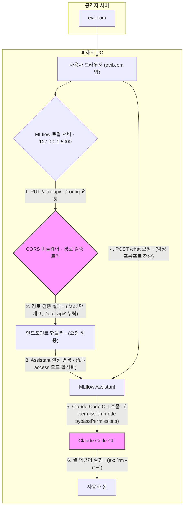

> 이 엔트리는 Blake Crosley의 [Loopback Is Not a Trust Boundary: CVE-2026-2611 MLflow 3.9.0's Assistant exposed a local AI](https://blakecrosley.com/blog/loopback-is-not-a-trust-boundary)을 정독하고 핵심을 추출한 것이다.

루프백(Loopback)은 더 이상 신뢰 경계가 아니다. 로컬 환경에서 실행되는 AI 에이전트는 기존 웹 보안 모델에 새로운 차원의 위협을 제기한다. 개발자 도구가 로컬 웹 UI 내부에 LLM 에이전트를 통합하면서, 과거에는 사소했던 CORS(Cross-Origin Resource Sharing) 설정 오류가 원격 코드 실행(RCE)으로 이어지는 치명적인 취약점으로 변모했다.

MLflow에서 발견된 CVE-2026-2611은 이러한 새로운 종류의 취약점을 보여주는 교과서적인 사례다. 이 엔트리는 해당 사례를 통해 로컬 AI 에이전트의 보안 위협 모델을 분석하고, `aidy`와 같은 프로젝트에 적용할 수 있는 구체적인 방어 전략을 제시한다.

### 왜 중요한가: 로컬 AI 에이전트가 바꾼 위협 모델

과거 로컬 웹 서버의 CORS 취약점은 설정 정보 유출이나 서비스 거부(DoS) 공격 수준에 그쳤다. 하지만 로컬 서버가 파일 시스템 접근, 셸 명령어 실행, 코드 푸시 권한을 가진 AI 에이전트를 구동한다면 이야기가 달라진다.

- **권한 증폭기(Privilege Amplifier)**: AI 에이전트는 합법적인 도구(tool) 사용 권한을 갖는다. 공격자는 CORS 같은 진입점(entrypoint) 취약점을 이용해 에이전트의 설정을 조작하고, 이 합법적인 권한을 원격 셸처럼 악용할 수 있다.
- **공격 표면의 변화**: `127.0.0.1`에만 바인딩된 서비스는 안전하다는 기존의 통념이 깨졌다. 브라우저 탭에서 실행되는 악성 웹페이지는 로컬 서버로 얼마든지 cross-origin 요청을 보낼 수 있다. 서버가 이 요청을 제대로 검증하지 못하면, '루프백 전용'이라는 보안 장치는 무력화된다.

CVE-2026-2611은 이 위협이 이론이 아님을 증명했다. MLflow의 Assistant 기능은 `/ajax-api/`라는 새로운 엔드포인트 경로를 추가했지만, CORS 보호 경로 목록을 업데이트하지 않았다. 이 작은 누락으로 인해 공격자는 악성 웹페이지를 통해 MLflow Assistant 설정을 변경하고, 내장된 Claude Code CLI를 통해 사용자의 PC에서 임의의 명령을 실행할 수 있었다.

### 핵심 패턴: 경로 열거 누락으로 인한 권한 증폭

CVE-2026-2611의 공격 체인은 각 단계가 합법적인 기능을 사용하지만, 그 조합이 치명적인 결과를 낳는다는 점에서 교훈적이다. 이 취약점은 CRITICAL 등급(CVSS 9점대)으로 보고되었으며, MLflow 3.10.0에서 수정되었다.



이 공격의 근본 원인은 MLflow의 `security_utils.py`에 있던 불완전한 경로 열거(path enumeration) 로직이었다.

**취약한 코드 (MLflow 3.9.0 이전):**
```python
# security_utils.py
API_PATH_PREFIX = "/api/"

def is_api_endpoint(path: str) -> bool:
    # /api/ 로 시작하는 경로만 CORS 보호 대상으로 간주
    return path.startswith(API_PATH_PREFIX)
```
새로 추가된 `/ajax-api/` 경로는 이 함수를 통과하여 CORS 보호를 받지 못했다.

**수정된 코드 (MLflow 3.10.0에서 적용된 방향, 개념 재구성):**
```python
# security_utils.py
API_PATH_PREFIX = "/api/"
AJAX_API_PATH_PREFIX = "/ajax-api/"

def is_api_endpoint(path: str) -> bool:
    # 보호해야 할 모든 경로 접두사를 명시적으로 열거
    return (
        path.startswith(API_PATH_PREFIX) or
        path.startswith(AJAX_API_PATH_PREFIX)
    )
```
이처럼 보안 경계에 영향을 미치는 경로는 단일 소스(single source of truth)에서 관리하고, 새로운 경로가 추가될 때마다 반드시 업데이트하는 프로세스가 필요하다.

### 실전 적용: `aidy` 프로젝트의 로컬 에이전트 보안 강화

`aidy`가 개발 중인 기능을 테스트하기 위해 로컬 웹 UI를 제공한다고 가정하자. 이 UI는 `127.0.0.1`에서 실행되며, 에이전트의 상태를 확인하고 디버그 명령을 내리는 API 엔드포인트를 노출한다. 이 시나리오에 CVE-2026-2611의 교훈을 적용할 수 있다.

**1. 보호 경로의 중앙 집중 관리 (TypeScript 예시)**

Express.js 미들웨어를 사용하여 API 경로를 중앙에서 관리하고 검증한다. 새로운 API(e.g. `/internal-v2/`)가 추가될 때, 이 배열만 수정하면 된다.

```typescript
// src/middleware/cors.ts

const PROTECTED_API_PREFIXES = [
  "/api/v1/",
  "/debug/",
  "/agent-control/",
];

const LOCALHOST_ORIGIN_REGEX = /^http:\/\/localhost(:\d+)?$/;

export const strictOriginFirewall = (req, res, next) => {
  const isApiRequest = PROTECTED_API_PREFIXES.some(prefix => 
    req.path.startsWith(prefix)
  );
  
  if (!isApiRequest) {
    return next(); // API 요청이 아니면 통과
  }

  const origin = req.headers.origin;
  if (origin && LOCALHOST_ORIGIN_REGEX.test(origin)) {
    res.setHeader('Access-Control-Allow-Origin', origin);
    // ... 기타 CORS 헤더 설정
    return next();
  }

  // 허용되지 않은 cross-origin API 요청은 거부
  console.warn(`[SECURITY] Blocked cross-origin request from ${origin} to ${req.path}`);
  return res.status(403).send('Forbidden: Invalid Origin');
};
```

**2. `allow_origins=["*"]` 절대 금지**

로컬 서버라도 `*`는 절대 사용해서는 안 된다. 위 코드의 `LOCALHOST_ORIGIN_REGEX`처럼, 정규식을 사용하여 `http://localhost`와 `http://localhost:3000` 같은 변형만 명시적으로 허용해야 한다.

**3. 파괴적 작업에는 사용자 제스처(User Gesture) 강제**

`aidy` 에이전트가 `project.cleanup()`과 같이 파일을 삭제하는 파괴적인(destructive) 작업을 수행할 수 있다면, API 요청만으로 트리거해서는 안 된다. `Origin` 헤더 검증에 더해, CSRF 토큰이나 최근 사용자 상호작용(e.g., 버튼 클릭) 없이는 실행되지 않도록 하는 방어-in-depth 전략이 필요하다.

이론적으로, Web-based `aidy`가 VSCode 확장과 로컬 HTTP 서버를 통해 통신한다면, 이 서버의 모든 엔드포인트는 이와 같은 엄격한 CORS 정책과 경로 관리가 필수적이다. 하나의 경로 누락이 전체 개발 환경을 장악하는 통로가 될 수 있다.

---
이 엔트리는 Blake Crosley의 [Loopback Is Not a Trust Boundary: CVE-2026-2611](https://blakecrosley.com/blog/loopback-is-not-a-trust-boundary)을 정독하고 핵심을 추출한 것이다.