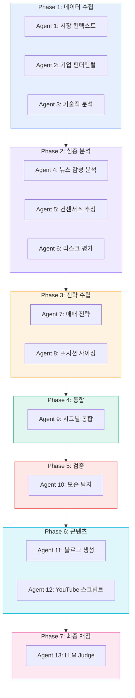

## 왜 이 Flow Map인가

MoneyFlow는 종목 분석 한 번에 **13개 AI 에이전트**가 순차+병렬로 동작하는 파이프라인을 운영한다. "AAPL 분석해줘" 한마디가 어떻게 Signal Strength Score + 블로그 초안 + YouTube 스크립트로 변환되는지, 그 전 과정을 관통한다.

이 Flow Map은 [aidy-architect Flow Map](/wiki/harness-engineering/architect-flow-map-via-aidy-architect)이 "WO 한 건의 여정"을 그린 것처럼, **"분석 요청 한 건의 여정"**을 그린다.

---

## 13-Agent 파이프라인: 9 Phase



---

## 각 에이전트의 역할

### Phase 1: 데이터 수집 (병렬)

| Agent | 역할 | 입력 | 출력 |
|-------|------|------|------|
| 시장 컨텍스트 | 매크로 환경(금리, 유가, VIX) 수집 | 종목 코드 | 시장 요약 JSON |
| 기업 펀더멘털 | 재무제표, PER, EPS, 성장률 | 종목 코드 + Yahoo Finance | 펀더멘털 JSON |
| 기술적 분석 | RSI, MACD, 이동평균, 볼린저밴드 | 가격 데이터 | 기술 지표 JSON |

3개가 **병렬 실행** — 각자 독립적 데이터 소스에서 수집.

### Phase 2: 심층 분석 (병렬)

| Agent | 역할 | 핵심 |
|-------|------|------|
| 뉴스 감성 | 최근 뉴스의 감성(긍정/부정/중립) 분석 | 감성 점수 + 근거 뉴스 목록 |
| 컨센서스 | 애널리스트 목표가/의견 종합 | 목표가 범위 + 의견 분포 |
| 리스크 평가 | 변동성, 유동성, 섹터 리스크 | 리스크 등급 (1-5) |

### Phase 3: 전략 수립 (순차)

매매 전략 에이전트가 Phase 1-2의 결과를 종합하여 매수/매도/관망 전략을 수립. 포지션 사이징 에이전트가 리스크 대비 적정 비중을 계산.

### Phase 4: 시그널 통합

9개 에이전트의 결과를 하나의 **Signal Strength Score (0-100)**로 통합.

### Phase 5: 모순 탐지 (Harness Engineering의 핵심)

**"강력 매수인데 신뢰도 30%"** 같은 내부 모순을 자동 감지하여 차단. 이것이 없으면 환각이 그대로 사용자에게 전달된다.

### Phase 6: 콘텐츠 생성 (병렬)

분석 결과를 블로그 글 + YouTube Shorts 스크립트로 자동 변환. DALL-E 3로 썸네일 이미지 생성.

### Phase 7: LLM-as-a-Judge

생성 AI와 **다른 모델**이 최종 결과를 4차원(정확성/일관성/완성도/안전성) 채점. 기준 미달 시 재생성.

---

## Harness 패턴이 녹아있는 곳

### Bounded Retry + 모델 폴백

```
요청 → Claude 시도 (1차)
         ↓ 실패
       Claude 재시도 (2차)
         ↓ 실패
       Gemini 전환 (3차)
         ↓ 실패
       GPT 폴백 (4차)
         ↓ 실패
       캐시된 이전 결과 반환 (최종 폴백)
```

같은 인터페이스(Adapter 패턴)를 사용하므로 모델 교체가 투명. `ClaudeAdapter`, `GeminiAdapter`, `GPTAdapter`가 모두 동일한 `AnalysisResult` 타입 반환.

### 비용 제한 해제 (#163)의 교훈

초기에는 각 에이전트에 토큰 제한을 걸었다. 결과: 에이전트가 토큰을 아끼려고 **분석을 축약** → 품질 저하. PR #163에서 13개 에이전트의 비용 제한을 전부 해제(풀스로틀)하고, 대신 **Prompt Caching**으로 비용을 최적화. 품질 우선 + 비용은 캐싱으로.

### 투자 데이터 통합 보강 (#168-#169)

Finnhub + Yahoo Finance + Alpaca 3개 데이터 소스를 통합. 하나가 실패해도 나머지로 폴백. **4대 갭**(컨센서스 누락, 실적 이력 부족, 배당 데이터 불일치, ETF 메타데이터 미스매치)을 순차 수정.

---

## 실전 팁

- **에이전트 수 = 분석 차원 수**: 13개가 최적이 아니라 "분석해야 할 독립 차원이 13개"라서 13개. 차원이 줄면 에이전트도 줄여야.
- **병렬 가능한 Phase는 반드시 병렬**: Phase 1(3개), Phase 2(3개), Phase 6(2개)은 의존성 없으므로 병렬. 순차로 돌리면 3배 느림.
- **모순 탐지는 별도 에이전트**: 생성과 검증을 같은 에이전트가 하면 자기 실수를 못 잡음. Phase 5가 독립된 이유.

---

## 내 프로젝트에 적용하기

- [ ] 이 파이프라인 구조를 ai-study의 Gemini 과외 파이프라인에 적용 가능한지 검토 (현재 단일 LLM 호출)
- [ ] Bounded Retry 패턴을 tarosaju의 AI 리딩 파이프라인에도 이식
- [ ] Prompt Caching 적용 후 비용 측정 (ccusage 베이스라인 대비)

---

## 자기 점검

1. 13개 에이전트를 왜 1개로 합치면 안 되는지 SRP 관점에서 설명할 수 있는가?
2. Bounded Retry에서 "같은 인터페이스"가 왜 중요한가?
3. 모순 탐지 에이전트를 생성 에이전트와 분리하는 이유는?
4. 비용 제한 해제가 오히려 효율적인 이유를 Prompt Caching과 연결하여 설명할 수 있는가?
5. (열린 질문) 이 파이프라인에서 에이전트를 추가/제거할 때의 판단 기준은?

### 실습 과제

MoneyFlow의 9 Phase 중 하나를 골라, 해당 Phase의 에이전트가 실패했을 때 전체 파이프라인에 미치는 영향과 폴백 전략을 설계해보라.

---

## 출처

- MoneyFlow PR #163: 분석 품질 풀스로틀 — 13개 비용 제한 해제
- MoneyFlow PR #168-#169: 투자 데이터 3대 통합 + 4대 갭 수정
- MoneyFlow CLAUDE.md: 13-Agent 9 Phase 파이프라인 구조
