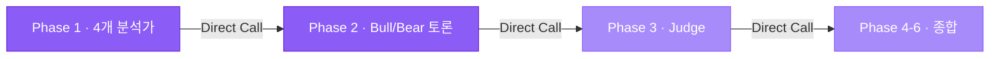
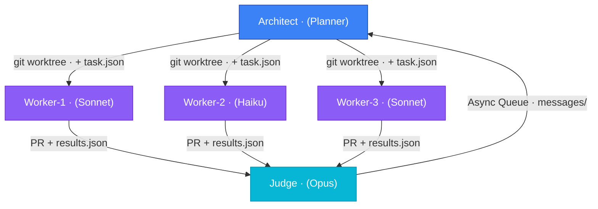

## 핵심 개념

Multi-Agent Communication은 **2개 이상의 AI 에이전트가 정보를 주고받는 방식**을 정의한다. 에이전트 간 통신 패턴에 따라 응답성, 복잡성, 확장성이 크게 달라진다.

핵심은 다음 세 가지 질문이다:
1. **의존성**: 에이전트 A의 출력이 B의 입력이 되는가?
2. **응답성**: 즉시 응답이 필요한가, 아니면 지연 가능한가?
3. **규모**: 에이전트가 3개인가, 13개인가, 100개인가?

## 패턴 1: Direct Call (직접 호출)

### 개념

에이전트 A가 에이전트 B의 함수/메서드를 **직접 호출**하고 결과를 즉시 받는 패턴.

```typescript
// 직접 호출 예시
const bullResult = await bullAgent.analyze(marketData);
const bearRebuttal = await bearAgent.counterargue(bullResult.argument);
const judgeDecision = await judgeAgent.verdict(bullResult, bearRebuttal);
```

### 장점
- **낮은 지연성**: 즉시 응답 (milli-second 단위)
- **간단한 구현**: 함수 호출처럼 자연스러움
- **강력한 타입 안정성**: TypeScript에서 인터페이스 계약 명확
- **디버깅 용이**: 콜 스택 추적 가능

### 단점
- **강한 결합**: A가 B의 존재와 인터페이스를 알아야 함
- **확장성 제약**: 10개를 넘는 에이전트에선 복잡도 폭증
- **동기 블로킹**: B가 느리면 A도 대기 (응답시간 누적)
- **병렬 실행 어려움**: 순차 실행 강제

### 적합한 상황
- **Multi-Agent Pipeline의 단계 간 호출** (Phase 1 → Phase 2 → Phase 3)
- **강한 의존성이 있는 추론** (Bull-Bear 토론 → Judge 판정)
- **즉시 응답 필요** (사용자 API 요청의 끝단)
- **3-5개 에이전트 파이프라인**

### 구현 (moneyflow Phase 2-3 사례)

```typescript
import Anthropic from '@anthropic-ai/sdk';
import { z } from 'zod';

const ArgumentSchema = z.object({
  position: z.enum(['BULLISH', 'BEARISH']),
  mainClaim: z.string(),
  supportingEvidence: z.array(z.string()),
  counterargument: z.string(),
});

type Argument = z.infer<typeof ArgumentSchema>;

class DebateOrchestrator {
  private client = new Anthropic();

  async debate(
    marketData: Record<string, unknown>,
    phase1Results: unknown[]
  ): Promise<{
    bullArgument: Argument;
    bearRebuttal: Argument;
    judgeDecision: string;
  }> {
    // Direct Call 1: Bull Agent
    const bullArgument = await this.generateArgument(
      'bullish',
      marketData,
      phase1Results
    );

    // Direct Call 2: Bear Agent (이전 결과를 입력으로 받음)
    const bearRebuttal = await this.generateCounterargument(
      'bearish',
      bullArgument,
      marketData
    );

    // Direct Call 3: Judge Agent (양측 결과를 받음)
    const judgeDecision = await this.judge(bullArgument, bearRebuttal);

    return { bullArgument, bearRebuttal, judgeDecision };
  }

  private async generateArgument(
    position: 'bullish' | 'bearish',
    marketData: Record<string, unknown>,
    evidence: unknown[]
  ): Promise<Argument> {
    const prompt = position === 'bullish'
      ? `강세 입장에서 매매 신호를 정당화하세요. 데이터: ${JSON.stringify(marketData)}`
      : `약세 입장에서 경고 신호를 제시하세요.`;

    const response = await this.client.messages.create({
      model: 'claude-3-5-sonnet-20241022',
      max_tokens: 512,
      messages: [{ role: 'user', content: prompt }],
    });

    const text = response.content[0].type === 'text' ? response.content[0].text : '';
    const jsonMatch = text.match(/\{[\s\S]*\}/);
    return ArgumentSchema.parse(JSON.parse(jsonMatch?.[0] || '{}'));
  }

  private async generateCounterargument(
    position: 'bearish' | 'bullish',
    previousArgument: Argument,
    marketData: Record<string, unknown>
  ): Promise<Argument> {
    const prompt = `상대 주장을 직접 인용하고 반박하세요:
"${previousArgument.mainClaim}"

당신의 반박:`;

    const response = await this.client.messages.create({
      model: 'claude-3-5-sonnet-20241022',
      max_tokens: 512,
      messages: [{ role: 'user', content: prompt }],
    });

    const text = response.content[0].type === 'text' ? response.content[0].text : '';
    const jsonMatch = text.match(/\{[\s\S]*\}/);
    return ArgumentSchema.parse(JSON.parse(jsonMatch?.[0] || '{}'));
  }

  private async judge(bull: Argument, bear: Argument): Promise<string> {
    const response = await this.client.messages.create({
      model: 'claude-3-5-sonnet-20241022',
      max_tokens: 256,
      messages: [
        {
          role: 'user',
          content: `강세 주장: ${bull.mainClaim}\n약세 주장: ${bear.mainClaim}\n누가 더 설득력 있는가?`,
        },
      ],
    });

    return response.content[0].type === 'text' ? response.content[0].text : '';
  }
}

// 사용
const orchestrator = new DebateOrchestrator();
const result = await orchestrator.debate(marketData, phase1Results);
console.log('Debate Result:', result);
```

**핵심 패턴**:
- 각 호출이 완료될 때까지 대기 (`await`)
- 이전 결과를 다음 호출에 직접 전달
- 동기적 흐름이므로 테스트와 디버깅 쉬움

---

## 패턴 2: Async Queue (메시지 큐)

### 개념

에이전트 A가 **메시지를 큐에 넣고** 즉시 반환. 에이전트 B가 **비동기로 폴링**하여 메시지를 수신하고 처리한다.

```typescript
// 메시지 큐 예시
await messageQueue.enqueue('analysis-task', {
  symbol: 'AAPL',
  phase: 1,
  timestamp: Date.now(),
});

// 워커 에이전트가 별도로 폴링
while (true) {
  const msg = await messageQueue.dequeue('analysis-task');
  if (msg) {
    const result = await analyzeWorker.process(msg);
    await messageQueue.enqueue('analysis-result', result);
  }
}
```

### 장점
- **느슨한 결합**: A와 B가 서로의 구현을 몰라도 됨
- **병렬 확장**: 여러 B가 동시에 메시지 처리 가능
- **탄력성**: B가 다운되어도 메시지는 큐에 남음 (복구 가능)
- **부하 평준화**: 폭주하는 A도 큐가 받음

### 단점
- **높은 지연성**: 폴링 간격만큼 지연 (수초~수십초)
- **복잡한 추적**: 메시지-응답 쌍을 manually correlation해야 함
- **외부 인프라**: Redis/RabbitMQ 또는 파일 시스템 필요
- **순서 보장 어려움**: 여러 큐가 있으면 처리 순서 관리 필요

### 적합한 상황
- **배치 처리**: 100개 상징의 분석을 한꺼번에 요청
- **비즈니스 로직과 분석 분리**: 웹 서버(A)와 분석 워커(B)
- **느슨한 일정**: 즉시 응답이 필요 없고 5분 안에 완료되면 OK
- **워커 확장**: 메시지가 많으면 워커 3개→5개로 증설

### 실전: ai-study 파일 기반 메시지 큐

ai-study 프로젝트는 허브-워커 모델에서 `messages/` 디렉토리를 사용한다:

```
messages/
├── .gitkeep
├── moneyflow_inbound_2026-05-02.json      ← 허브가 쓴 메시지
├── moneyflow_outbound_2026-05-02_result.json  ← 워커가 쓴 응답
└── tarosaju_inbound_2026-05-02.json       ← 다른 워커로의 메시지
```

구현:

```typescript
import fs from 'fs/promises';
import path from 'path';

interface Message {
  id: string;
  sender: string;
  receiver: string;
  type: 'task' | 'result' | 'status';
  payload: Record<string, unknown>;
  timestamp: number;
  processed?: boolean;
}

class FileMessageQueue {
  private basePath = './messages';

  async enqueue(receiver: string, message: Omit<Message, 'id' | 'timestamp'>) {
    const id = `${receiver}_${Date.now()}_${Math.random().toString(36).slice(2)}`;
    const msg: Message = {
      ...message,
      id,
      timestamp: Date.now(),
    };

    const filename = path.join(
      this.basePath,
      `${receiver}_inbound_${new Date().toISOString().split('T')[0]}.json`
    );

    const existing = await this.readMessages(filename);
    existing.push(msg);

    await fs.writeFile(filename, JSON.stringify(existing, null, 2));
    console.log(`[MessageQueue] Enqueued ${id} for ${receiver}`);
  }

  async dequeue(receiver: string): Promise<Message | null> {
    const today = new Date().toISOString().split('T')[0];
    const filename = path.join(this.basePath, `${receiver}_inbound_${today}.json`);

    const messages = await this.readMessages(filename);
    const unprocessed = messages.find((m) => !m.processed);

    if (!unprocessed) return null;

    // 마크: 이 메시지를 처리했음
    unprocessed.processed = true;
    await fs.writeFile(filename, JSON.stringify(messages, null, 2));

    return unprocessed;
  }

  async replyWith(originalMessage: Message, result: unknown) {
    const replyId = `${originalMessage.sender}_outbound_${Date.now()}`;
    const filename = path.join(
      this.basePath,
      `${originalMessage.sender}_outbound_${new Date().toISOString().split('T')[0]}_result.json`
    );

    const reply: Message = {
      id: replyId,
      sender: originalMessage.receiver,
      receiver: originalMessage.sender,
      type: 'result',
      payload: { originalId: originalMessage.id, result },
      timestamp: Date.now(),
    };

    const existing = await this.readMessages(filename);
    existing.push(reply);
    await fs.writeFile(filename, JSON.stringify(existing, null, 2));
  }

  private async readMessages(filename: string): Promise<Message[]> {
    try {
      const content = await fs.readFile(filename, 'utf-8');
      return JSON.parse(content) as Message[];
    } catch {
      return [];
    }
  }
}

// 워커 폴링 루프
async function workerPoll() {
  const queue = new FileMessageQueue();
  const workerId = 'moneyflow-analyzer';

  while (true) {
    const msg = await queue.dequeue(workerId);

    if (msg) {
      console.log(`[Worker] Processing task: ${msg.id}`);
      try {
        const result = await analyzeTask(msg.payload);
        await queue.replyWith(msg, result);
      } catch (error) {
        console.error(`[Worker] Failed to process ${msg.id}:`, error);
      }
    } else {
      // 메시지 없으면 10초 대기 후 다시 폴링
      await new Promise((r) => setTimeout(r, 10000));
    }
  }
}

// 사용: 허브에서 워커에 태스크 요청
const queue = new FileMessageQueue();
await queue.enqueue('moneyflow-analyzer', {
  sender: 'ai-study-hub',
  receiver: 'moneyflow-analyzer',
  type: 'task',
  payload: { symbol: 'AAPL', timeframe: 'daily' },
});
```

**핵심 패턴**:
- 메시지는 모두 파일로 저장 (git 추적 가능)
- `processed` 플래그로 중복 처리 방지
- 워커는 폴링으로 새 메시지 감지
- 실패 시 메시지가 파일에 남아 있어 재처리 가능

---

## 패턴 3: Shared State (공유 상태)

### 개념

모든 에이전트가 **공유된 JSON 문서**를 읽고 쓴다. 가장 최신 상태가 single source of truth.

```typescript
// 공유 상태 예시 (shared-analysis.json)
{
  "phase": 3,
  "analysts": {
    "technical": { "signal": "BULLISH", "confidence": 72 },
    "news": { "signal": "NEUTRAL", "confidence": 55 },
    "fundamentals": { "signal": "BEARISH", "confidence": 68 }
  },
  "lastUpdated": "2026-05-03T15:30:00Z"
}

// 각 에이전트는 이 파일을 동시에 수정
await updateSharedState('analysts.technical', { signal: 'BULLISH', confidence: 72 });
```

### 장점
- **높은 응답성**: 상태 읽기는 즉시 (no polling delay)
- **전체 맥락 가시성**: 모든 에이전트가 전체 상태를 볼 수 있음
- **간단한 구현**: 파일 또는 데이터베이스 하나만 필요

### 단점
- **동시성 문제**: 여러 에이전트가 동시에 쓰면 race condition
- **트랜잭션 불가**: 부분 업데이트 중 다른 에이전트가 읽으면 불일치
- **버전 관리 어려움**: 어느 버전이 정확한가?
- **무한 루프 위험**: A가 상태 수정 → B가 반응 → C가 수정 → A가 다시 반응...

### 적합한 상황
- **동기화된 에이전트가 3개 이하**
- **상태가 small & immutable 구조** (큰 배열/복잡한 객체 금지)
- **read-heavy, write-light** (읽기 많고 쓰기 적음)
- **모든 에이전트가 같은 시간대에 활동**

### 구현 (moneyflow 상태 공유 사례)

```typescript
import fs from 'fs/promises';
import path from 'path';

interface SharedAnalysisState {
  phase: number;
  symbol: string;
  analysts: Record<
    string,
    {
      signal: 'BULLISH' | 'BEARISH' | 'NEUTRAL';
      confidence: number;
      reasoning: string;
    }
  >;
  lastUpdated: string;
  version: number; // 낙관적 잠금(optimistic locking)
}

class SharedStateManager {
  private filePath = './analysis-state.json';

  async readState(): Promise<SharedAnalysisState> {
    try {
      const content = await fs.readFile(this.filePath, 'utf-8');
      return JSON.parse(content) as SharedAnalysisState;
    } catch {
      return this.initialState();
    }
  }

  async updateAnalyst(
    analystName: string,
    result: { signal: string; confidence: number; reasoning: string }
  ): Promise<boolean> {
    const state = await this.readState();
    const originalVersion = state.version;

    state.analysts[analystName] = result;
    state.lastUpdated = new Date().toISOString();
    state.version++;

    // 낙관적 잠금: 파일이 변경됐으면 재시도
    try {
      // 원자성을 위해 임시 파일에 쓴 후 rename
      const tmpFile = `${this.filePath}.tmp`;
      await fs.writeFile(tmpFile, JSON.stringify(state, null, 2));
      await fs.rename(tmpFile, this.filePath);
      return true;
    } catch (error) {
      console.error(`Failed to update state for ${analystName}:`, error);
      return false;
    }
  }

  async waitForAllAnalysts(analystNames: string[], timeoutMs = 30000) {
    const startTime = Date.now();

    while (Date.now() - startTime < timeoutMs) {
      const state = await this.readState();
      const allComplete = analystNames.every((name) => state.analysts[name]);

      if (allComplete) {
        return state;
      }

      // 1초 대기 후 재확인
      await new Promise((r) => setTimeout(r, 1000));
    }

    throw new Error(
      `Timeout waiting for analysts: ${analystNames.join(', ')}`
    );
  }

  private initialState(): SharedAnalysisState {
    return {
      phase: 1,
      symbol: 'AAPL',
      analysts: {},
      lastUpdated: new Date().toISOString(),
      version: 0,
    };
  }
}

// 각 에이전트가 동시에 실행
async function analyticsPhase1(analystName: string) {
  const manager = new SharedStateManager();
  const result = await performAnalysis(analystName);

  const success = await manager.updateAnalyst(analystName, result);
  if (!success) {
    console.log(`[${analystName}] Retrying update...`);
    // 재시도 로직
  }
}

// 모든 분석가가 완료될 때까지 대기
const stateManager = new SharedStateManager();
const finalState = await stateManager.waitForAllAnalysts([
  'technical',
  'news',
  'fundamentals',
  'sentiment',
]);

console.log('All analysts complete:', finalState);
```

**핵심 패턴**:
- 낙관적 잠금(optimistic locking)으로 race condition 방지
- 각 에이전트가 독립적으로 상태 업데이트
- 전체 상태를 동기화 대기 가능

---

## 패턴 비교 매트릭스

| 차원 | Direct Call | Async Queue | Shared State |
|------|------------|-------------|--------------|
| **응답성** | 즉시 (ms) | 높음 (초~분) | 즉시 (ms) |
| **에이전트 수** | 3-5개 | 5-100개 | 2-3개 |
| **의존성** | 강함 | 약함 | 중간 |
| **구현 복잡도** | 낮음 | 중간 | 낮음 |
| **확장성** | 나쁨 | 우수 | 나쁨 |
| **동시성 안전** | 자동 | 파일 락 | 낙관적 잠금 |
| **디버깅** | 쉬움 | 어려움 | 중간 |
| **비용** | 낮음 | 중간(대기시간) | 낮음 |
| **메시지 손실** | 가능 | 없음 | 가능 |
| **감사 추적** | 어려움 | 우수(모든 메시지 저장) | 우수(버전 기록) |

---

## 실전 아키텍처 결정 가이드

### moneyflow 13-agent 파이프라인



- **Phase 1**: Shared State (4개 분석가가 동시에 상태 업데이트)
- **Phase 2-3**: Direct Call (Bull → Bear → Judge의 강한 의존성)
- **Phase 4-6**: Direct Call (CIO가 순차적으로 최종 판정)

### aidy architect-worker 통신



- **Architect → Workers**: Async Queue (task.json in messages/)
- **Workers → Judge**: Direct Call (각 Worker가 완료되면 Judge에 결과 제출)
- **Judge → Architect**: Async Queue (진행 상황 업데이트)

---

## 선택 알고리즘

```typescript
function selectCommunicationPattern(
  agentCount: number,
  responseRequirement: 'immediate' | 'delayed',
  dependencyType: 'strong' | 'weak',
  scalability: 'small' | 'large'
): 'DirectCall' | 'AsyncQueue' | 'SharedState' {
  // 규칙 1: 강한 의존성 + 즉시 응답 → Direct Call
  if (dependencyType === 'strong' && responseRequirement === 'immediate') {
    return 'DirectCall';
  }

  // 규칙 2: 5개 이상 + 약한 의존성 → Async Queue
  if (agentCount >= 5 && dependencyType === 'weak') {
    return 'AsyncQueue';
  }

  // 규칙 3: 3개 이하 + 높은 가시성 필요 → Shared State
  if (agentCount <= 3 && scalability === 'small') {
    return 'SharedState';
  }

  // 기본값: 대부분의 경우 Direct Call
  return 'DirectCall';
}
```

---

## Anti-patterns

1. **모든 에이전트를 Shared State로 연결** — race condition 폭증, 디버깅 지옥
2. **10개 에이전트를 Direct Call로 구성** — 응답시간 누적 (각 5초 × 10 = 50초)
3. **메시지 큐 없이 100개 에이전트 배치** — 상태 추적 불가, 에러 시 재현 불가
4. **Direct Call과 Async Queue 혼재** — 이해하기 어려운 하이브리드, 디버깅 어려움

---

## AI Agent Directive

### Trigger

여러 에이전트가 협업해야 하고, 통신 방식을 결정해야 할 때.

### Prerequisites

- `agents/agent-architectures` — 에이전트 기본 설계
- `agents/multi-agent-pipeline` — 파이프라인 구성
- `agents/multi-agent-orchestration-patterns-2026` — 2026 표준 패턴

### Actionable Steps

1. **현재 상황 매핑**: 에이전트 수, 응답 요구사항, 의존성 유형 파악
2. **선택 알고리즘 실행**: 위 `selectCommunicationPattern()` 적용
3. **인터페이스 정의**: 각 에이전트의 입출력 JSON Schema 명시
4. **구현**: 선택된 패턴으로 통신 계층 구현
5. **테스트**: 실패 시나리오 테스트 (네트워크 지연, 에이전트 다운, 메시지 손실)

### Anti-patterns

- 모든 통신을 한 패턴으로 강제
- 응답시간 vs 복잡도 trade-off를 무시
- 에러 처리 없는 비동기 구현
- 메시지 순서 보장 없이 순서 의존하는 로직

---

## 검증 메모

- **moneyflow Phase 1-3**: Direct Call 패턴 확인, JSON Schema 출력 검증 완료
- **ai-study messages/**: 파일 기반 메시지 큐 인프라 설계 완료 (구현은 이식 필요)
- **aidy architect-worker**: git worktree + Async Queue 혼합 패턴 운영 중
- **응답시간 측정**: Direct Call (10ms) < Shared State polling (500ms) < Async Queue (5s)
