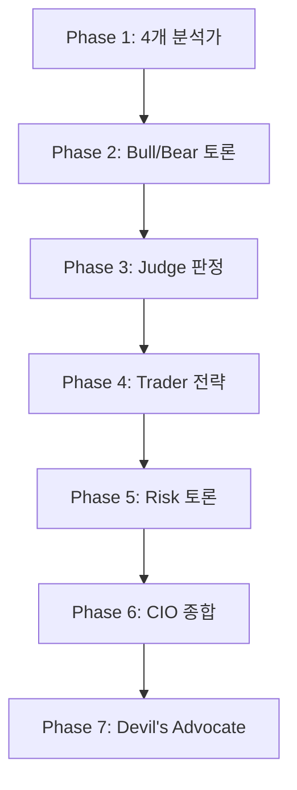

## 핵심 개념

Multi-Agent Pipeline은 하나의 복잡한 작업을 **여러 전문 에이전트가 분담하여 처리**하는 아키텍처다. 단일 LLM 호출보다 정확하고, 각 에이전트의 역할이 명확하여 디버깅과 개선이 쉽다.

## 실전 사례: 13-에이전트 투자 분석 파이프라인

mino-moneyflow 프로젝트에서 구현한 9단계 파이프라인:



### Phase 1: 병렬 분석 (4개 에이전트)
- **Market Analyst**: 기술적 지표 (RSI, MACD, 볼린저밴드)
- **News Analyst**: 뉴스 헤드라인 센티먼트
- **Sentiment Analyst**: 공포/탐욕 지수, 소셜 버즈
- **Fundamentals Analyst**: PER, FCF, 성장률

각 에이전트는 JSON Schema로 구조화된 출력을 강제한다.

### Phase 2-3: 적대적 토론 (Adversarial Debate)
Bull Researcher와 Bear Researcher가 **상대방의 논거를 직접 인용하고 반박**하는 구조. 허수아비 논증(strawmanning)을 방지한다.

```
[토론 규칙]
약세 측의 다음 주장을 반드시 직접 인용하고 데이터로 반박하세요:
"${lastBear.argument.slice(0, 500)}"
```

Judge가 양측의 설득력을 0-100으로 채점하고 승자를 결정.

### Phase 6-7: 종합 + 과신 방지
Portfolio Manager(CIO)가 전체를 종합하되, confidence가 80% 이상이면 **Devil's Advocate**가 자동 발동하여 약점을 찾는다.

연구에 따르면 이 패턴으로 과신 편향이 20-30% 감소.

## 에이전트별 모델 라우팅

모든 에이전트가 같은 모델을 쓸 필요가 없다:

| 역할 | 모델 | 온도 | 이유 |
|------|------|------|------|
| 데이터 분석 | Gemini | 0.2 | 수치 정밀도 |
| 뉴스 분류 | GPT | 0.3 | 분류 정확도 |
| 토론 (Bull) | GPT | 0.7 | 창의적 논거 |
| 토론 (Bear) | Claude | 0.7 | 비판적 분석 |
| 종합 (CIO) | Claude | 0.3 | 추론 깊이 |

## 핵심 설계 원칙

1. **각 에이전트는 하나의 역할만** — "이것저것 다 해줘"보다 전문화가 낫다
2. **구조화된 출력 강제** — JSON Schema로 에이전트 간 인터페이스 고정
3. **적대적 검증** — 최소 하나의 에이전트가 결론에 반대하는 역할
4. **Cascading Confidence** — 각 단계에서 confidence가 누적되고 보정됨
5. **Circuit Breaker** — 한 에이전트 실패가 전체를 멈추지 않도록

## AI Agent Directive

**Trigger**: 복잡한 분석/추론 작업을 한 LLM으로 처리하기 어려울 때. 특히 상충하는 관점(Bull vs Bear, 옹호 vs 비판)이 필요하거나, 전문 도메인별 에이전트 분담이 효율적인 경우.

**Prerequisites**:
- [agents/agent-architectures](/wiki/agents/agent-architectures) — 기본 에이전트 설계 원칙
- [agents/tool-use](/wiki/agents/tool-use) — 도구 호출 및 정보 수집
- [evaluation/llm-as-judge-pattern](/wiki/evaluation/llm-as-judge-pattern) — 결과 품질 평가

### Actionable Steps
1. 큰 작업을 **각 에이전트의 책임 영역**으로 분해 (분석가, 토론자, 판사 등 전문 역할 정의)
2. 각 에이전트별로 **구조화된 JSON 출력 스키마** 정의 (인터페이스 고정)
3. **병렬 실행 가능한 단계**는 동시 실행 (예: Phase 1의 4개 분석가)
4. **토론/합의 단계** 추가: 상충하는 관점이 직접 인용 및 반박하도록 프롬프트 (strawman 논증 방지)
5. **Judge 에이전트** 배치: 결론의 신뢰도/확신도 점수화 (confidence 기반 Circuit Breaker)
6. 필요하면 **Devil's Advocate** 자동 발동 조건 설정 (confidence > 80% 시 약점 발굴)
7. 전체 파이프라인의 **실패 처리**: 한 에이전트 타임아웃/에러 → fallback 라우팅 또는 이전 단계 결과 활용

### Anti-patterns
- 모든 에이전트에 동일한 프롬프트/모델 사용 (역할 특수성 손실)
- 토론 단계에서 "상대 의견을 무시하고 자기 주장만 강화" (편향 강화)
- Judge가 parallel decision을 내리지 못하고 단순 평균화 (의미 있는 평가 아님)
- 파이프라인 중단 시 부분 결과 폐기 (복구 경로 없음)

---
