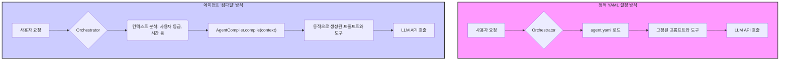

## YAML 설정의 한계, 그리고 '컴파일' 패러다임의 등장

AI 에이전트를 처음 만들 때, 우리는 보통 YAML이나 JSON 같은 설정 파일로 시작합니다. 시스템 프롬프트, 모델 파라미터, 사용 가능한 도구 목록을 정의하죠. 이 방식은 간단하고 직관적이지만, 에이전트가 복잡해지고 그 수가 늘어나면서 명확한 한계에 부딪힙니다.

- **정적 구조:** 사용자 유형, 현재 시간, 이전 대화 맥락에 따라 프롬프트나 도구를 동적으로 바꾸기 어렵습니다. 모든 로직을 거대한 프롬프트 안에 `if/else`처럼 구겨 넣어야 합니다.
- **재사용성 부족:** 여러 에이전트가 공통으로 사용하는 프롬프트 조각이나 도구 설정을 관리하기가 번거롭습니다. 하나를 수정하면 관련된 모든 YAML 파일을 찾아 바꿔야 합니다.
- **타입 안정성 부재:** 도구 이름에 오타가 있거나 파라미터 형식이 잘못되어도, 런타임에서 직접 실행해보기 전까지는 알 수 없습니다. 이는 디버깅을 어렵게 만듭니다.
- **테스트의 어려움:** 설정 파일의 작은 변화가 에이전트 전체 동작에 미치는 영향을 단위 테스트하기가 까다롭습니다.

이러한 문제를 해결하기 위해 등장한 것이 바로 에이전트를 '설정(Configuration)'이 아닌 '컴파일(Compilation)'한다는 개념입니다. 이는 에이전트의 정의 자체를 코드로 관리하여, 런타임에 주어진 컨텍스트에 맞춰 최적의 설정(프롬프트, 도구 등)을 동적으로 생성하는 접근 방식입니다.

## 에이전트 '컴파일'이란 무엇인가?

여기서 '컴파일'은 코드를 기계어로 번역하는 전통적인 의미가 아닙니다. 여러 코드 조각(프롬프트 컴포넌트, 도구 정의, 컨텍스트별 예시 등)을 조합하여 최종적으로 LLM이 실행할 단일 시스템 프롬프트와 도구 명세를 만들어내는 과정을 의미하는 메타포입니다.

마치 프론트엔드 개발에서 여러 개의 TypeScript/JSX 컴포넌트를 '빌드'하여 최종 HTML/JS 번들을 만드는 것과 유사합니다. 우리는 재사용 가능한 작은 부품(컴포넌트)을 만들고, 컴파일러가 이들을 조립해 완성품을 만드는 것입니다.



이 다이어그램처럼, '컴파일' 방식은 중간에 컨텍스트를 분석하고 그에 맞는 에이전트 설정을 동적으로 생성하는 단계가 추가됩니다. 이로 인해 에이전트는 훨씬 유연하고 강력해집니다.

## TypeScript로 구현하는 에이전트 컴파일러

프론트엔드/iOS 개발자에게 익숙한 TypeScript를 사용하여 간단한 에이전트 컴파일러를 구현해 보겠습니다. 이 예제는 사용자 등급(`free`, `premium`)에 따라 다른 도구와 프롬프트 지침을 제공하는 에이전트를 동적으로 생성합니다.

```typescript
// 1. 재사용 가능한 컴포넌트 인터페이스 정의
interface AgentComponent {
  render(context: AgentContext): string;
}

interface AgentTool {
  name: string;
  description: string;
  // ... tool schema definition
}

interface AgentContext {
  userTier: 'free' | 'premium';
  userName: string;
}

// 2. 각 역할을 수행할 컴포넌트 클래스 구현
class BasePromptComponent implements AgentComponent {
  render(context: AgentContext): string {
    return `당신은 사용자를 돕는 AI 어시스턴트입니다. 항상 ${context.userName}님에게 친절하게 응대하세요.`;
  }
}

class PremiumFeatureComponent implements AgentComponent {
  render(context: AgentContext): string {
    if (context.userTier === 'premium') {
      return "Premium 사용자는 고급 분석 도구를 사용할 수 있습니다. 'analyze_data' 도구를 적극적으로 활용하세요.";
    }
    return '더 많은 기능을 원하시면 Premium으로 업그레이드하세요.';
  }
}

// 3. 도구를 정의하는 함수
function getToolsForContext(context: AgentContext): AgentTool[] {
  const commonTools: AgentTool[] = [
    { name: 'search_web', description: '웹에서 정보를 검색합니다.' },
  ];

  if (context.userTier === 'premium') {
    return [
      ...commonTools,
      { name: 'analyze_data', description: '제공된 데이터를 분석하고 시각화합니다.' },
    ];
  }

  return commonTools;
}

// 4. 컴포넌트와 도구를 조합하는 '컴파일러'
class AgentCompiler {
  private components: AgentComponent[];

  constructor(components: AgentComponent[]) {
    this.components = components;
  }

  compile(context: AgentContext): { systemPrompt: string; tools: AgentTool[] } {
    const systemPrompt = this.components
      .map(c => c.render(context))
      .join('\n\n');
    
    const tools = getToolsForContext(context);

    return { systemPrompt, tools };
  }
}

// 5. 실제 사용 예시
const compiler = new AgentCompiler([
  new BasePromptComponent(),
  new PremiumFeatureComponent(),
]);

// Free 사용자용 에이전트 '컴파일'
const freeUserContext: AgentContext = { userTier: 'free', userName: '김민준' };
const freeAgentSpec = compiler.compile(freeUserContext);
console.log('--- Free User Agent ---');
console.log(freeAgentSpec.systemPrompt);
console.log(freeAgentSpec.tools.map(t => t.name));


// Premium 사용자용 에이전트 '컴파일'
const premiumUserContext: AgentContext = { userTier: 'premium', userName: '이수현' };
const premiumAgentSpec = compiler.compile(premiumUserContext);
console.log('\n--- Premium User Agent ---');
console.log(premiumAgentSpec.systemPrompt);
console.log(premiumAgentSpec.tools.map(t => t.name));
```

**실행 결과:**

```
--- Free User Agent ---
당신은 사용자를 돕는 AI 어시스턴트입니다. 항상 김민준님에게 친절하게 응대하세요.

더 많은 기능을 원하시면 Premium으로 업그레이드하세요.
[ 'search_web' ]

--- Premium User Agent ---
당신은 사용자를 돕는 AI 어시스턴트입니다. 항상 이수현님에게 친절하게 응대하세요.

Premium 사용자는 고급 분석 도구를 사용할 수 있습니다. 'analyze_data' 도구를 적극적으로 활용하세요.
[ 'search_web', 'analyze_data' ]
```
이처럼 동일한 컴파일러를 사용하더라도 컨텍스트에 따라 완전히 다른 역할과 능력을 가진 에이전트가 동적으로 생성됩니다. 이것이 바로 '컴파일' 전략의 핵심입니다.

## 실무 적용 패턴: 역할 기반 동적 에이전트 생성

이러한 '컴파일' 방식은 다양한 실무 시나리오에 즉시 적용할 수 있습니다. 특히 iOS/프론트엔드 앱에서 사용자의 상태에 따라 다른 경험을 제공해야 할 때 유용합니다.

### 고객 지원 챗봇 에이전트
고객 지원 챗봇은 사용자의 등급, 문의 유형, 현재 시스템 상태에 따라 다른 대응을 해야 합니다.

| 사용자 등급 | 주어지는 역할 및 지침 | 사용 가능한 도구 (동적 주입) |
| :--- | :--- | :--- |
| **비회원/방문자** | 간단한 FAQ 답변, 회원가입 유도 | `faq_lookup`, `get_product_info` |
| **무료 회원** | 기본적인 계정 정보 조회, 티켓 생성 | `get_user_info`, `create_support_ticket` |
| **유료 회원 (Pro)**| 우선순위 높은 티켓 생성, 담당자 배정 요청 | `create_priority_ticket`, `request_human_agent`|
| **기업 고객 (Ent)**| 내부 기술 문서 검색, 실시간 시스템 상태 확인 | `search_internal_docs`, `check_system_status` |

'컴파일러'는 API 요청 시 전달된 인증 토큰을 분석하여 사용자 등급을 파악하고, 위 표에 따라 적절한 프롬프트 컴포넌트와 도구 정의를 조합하여 해당 유저만을 위한 맞춤형 에이전트를 실시간으로 '컴파일'합니다.

## 2026년 에이전트 트렌드: '코드형 에이전트(Agent-as-Code)'의 보편화

'컴파일' 패러다임은 '코드형 인프라(Infrastructure-as-Code)' 트렌드의 연장선에 있습니다. 2026년경에는 YAML로 에이전트를 관리하는 것이 레거시 방식으로 여겨질 것입니다. 모든 에이전트 정의는 코드로 관리(Agent-as-Code)될 것입니다.

- **Git 기반 버전 관리:** 에이전트의 모든 변경사항(프롬프트 수정, 도구 추가)이 Git 커밋으로 관리되어 추적과 롤백이 용이해집니다.
- **CI/CD 파이프라인:** 새로운 프롬프트 컴포넌트가 Pull Request로 제출되면, 자동으로 단위 테스트 및 통합 테스트를 거쳐 에이전트의 성능 저하가 없는지 확인한 후 배포됩니다.
- **에이전트 테스트 프레임워크:** 에이전트의 특정 행동을 검증하는 테스트 코드를 작성하는 것이 보편화될 것입니다. (예: `expect(agent.run(context, "환불해줘")).toUseTool('create_refund_ticket')`)

이러한 변화는 프론트엔드/iOS 개발자들이 기존의 소프트웨어 엔지니어링 역량을 AI 개발에 그대로 적용할 수 있게 하여, 더 안정적이고 확장 가능한 AI 애플리케이션을 만드는 기반이 될 것입니다. 정적 설정 파일의 시대를 넘어, 코드로 AI의 행동을 설계하고 제어하는 시대로의 전환이 이미 시작되었습니다.

## 자기 점검

1.  기존의 YAML/JSON 설정 방식이 복잡한 멀티 에이전트 시스템에서 가지는 주요 한계점 3가지를 설명해 보세요.
2.  이 글에서 설명하는 에이전트 '컴파일'이란 무엇이며, 전통적인 코드 컴파일과 어떻게 다른가요?
3.  'Agent-as-Code' 접근 방식이 에이전트 개발의 테스트 용이성을 어떻게 향상시키나요?
4.  이 개념을 동료에게 설명한다면? "동료에게 YAML 설정 방식과 에이전트 '컴파일' 방식의 차이점을 위 TypeScript 코드 예시를 바탕으로 설명해 보세요. 특히 어떤 비즈니스 요구사항이 있을 때 '컴파일' 방식이 명확한 이점을 가지게 될까요?"
5.  **실습 과제:** 사용자 리뷰의 감정(긍정/부정/중립)에 따라 Claude 에이전트의 응답 톤앤매너(Tone & Manner)를 동적으로 변경하는 간단한 `ReviewResponderCompiler`를 TypeScript 또는 Python으로 작성해 보세요.
    -   **요구사항:** 긍정 리뷰(`context: { sentiment: 'positive' }`)에는 감사를 표현하고 신기능을 추천하는 프롬프트를 생성합니다. 부정 리뷰(`context: { sentiment: 'negative' }`)에는 사과와 함께 문제 해결을 위한 `create_issue_ticket` tool-use를 제안하도록 프롬프트와 도구를 동적으로 구성합니다.