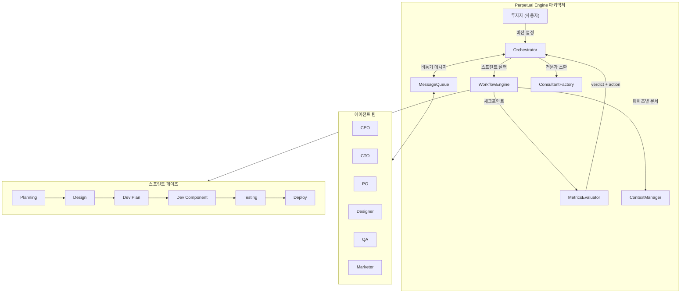

## 왜 지금 이 주제인가

[perpetual-engine](https://github.com/greatsk55/perpetual-engine)은 AI 에이전트 6명으로 가상 스타트업 팀을 운영하는 CLI 프레임워크다. 2026-04-17에 공개된 매우 새로운 프로젝트지만, 소스코드를 분석하면 우리 hub-worker 모델에 즉시 이식할 수 있는 패턴이 3가지 보인다.

우리 프로젝트(ai-study + moneyflow + tarosaju)는 이미 Planner-Worker-Judge 모델과 Compound Engineering을 운영 중이다. 하지만 **"언제 방향을 틀어야 하는가?"** (지표 기반 판정), **"임시 전문가가 필요할 때?"** (온디맨드 소환), **"에이전트 간 비동기 통신"** (파일 메시징) — 이 3가지는 아직 체계적인 메커니즘이 없다.

## 핵심 개념

### 1. MetricsEvaluator — 지표 기반 자동 판정

perpetual-engine의 가장 인상적인 패턴. 모든 이니셔티브에 가설 + KPI + 타임라인을 정의하고, 달성률에 따라 **자동으로 다음 행동을 결정**한다.

| 달성률 | 판정 (verdict) | 행동 (action) | 의미 |
|---|---|---|---|
| ≥120% | exceeded | scale_up | 더 투자 |
| ≥100% | achieved | maintain | 현재 전략 유지 |
| ≥60% | improving | iterate | 실행 개선 |
| ≥30% | stagnant | pivot | 근본적 변경 |
| 30% 미만 | failed | kill | 자원 재배치 |

핵심 설계 포인트:
- **중간 체크포인트는 한 단계 관대**: stagnant → iterate (pivot 대신), failed → pivot (kill 대신). 아직 시간이 남았으므로
- **direction 속성**: `higher` (높을수록 좋음) vs `lower` (낮을수록 좋음) — DAU는 higher, 에러율은 lower
- **baseline 필수**: 개선을 측정하려면 시작점이 있어야 한다. `ccusage` 베이스라인 측정 의무와 동일한 원리

### 2. ConsultantFactory — 온디맨드 에페메럴 전문가

고정된 전문가 풀이 아니라, **자유 텍스트 서술로 즉석 생성**되는 임시 전문가 에이전트:

```typescript
// 요청자가 서술하면 그게 곧 정체성이 된다
const request: ConsultantRequest = {
  expertise: "GDPR 및 한국 PIPA 전문 변호사",
  context: "사용자 데이터 처리 방식 검토 필요",
  questions: ["현재 구조가 GDPR Article 17을 충족하는가?"],
  requested_by: "cto",
};
// → ConsultantFactory.create(request) → 에페메럴 에이전트 생성
// → 자문 완료 → 5분 타임아웃 → 자동 소멸
```

설계 원칙:
- **사전 카테고리 없음**: "핀테크 결제 PCI-DSS 전문가"든 "B2B SaaS 판매 전략가"든, 서술하면 생긴다
- **진실성 원칙 내장**: 시스템 프롬프트에 "출처 미확인은 명시, 범위 밖은 인정" 가드 포함
- **자동 소멸**: 목적 완수 후 리소스 회수. 상시 대기 비용 제로

### 3. 파일 기반 MessageQueue — 인프라 제로 비동기 메시징

```typescript
// messages/ 디렉토리에 JSON 파일로 메시지 저장
interface Message {
  id: string;
  from: string;        // 발신 에이전트
  to: string;          // 수신 에이전트 또는 "all"
  type: 'info' | 'request' | 'meeting_invite' | 'review_request' | 'directive';
  content: string;
  read: boolean;
  created_at: string;
}
```

장점:
- **인프라 의존성 제로**: Redis/RabbitMQ 없이 파일시스템만으로 동작
- **git 추적 가능**: 메시지 이력이 커밋 히스토리에 남음
- **디버깅 용이**: JSON 파일이라 사람이 직접 읽고 수정 가능
- **chokidar 감시**: 새 메시지 파일 생성 → 오케스트레이터가 즉시 감지 → 라우팅

보완 메커니즘: **역할 단위 직렬화** (`processingRoles` Map). tmux 세션이 역할 기반이라 같은 역할의 태스크를 동시에 돌리면 충돌 → 한 역할당 1태스크만 진입.

## 구조 / 프레임워크



### 우리 프로젝트와의 매핑

| Perpetual Engine | 우리 모델 (ai-study hub-worker) | 이식 가능성 |
|---|---|---|
| MetricsEvaluator 5단계 판정 | `/compound` 회고에서 수동 판단 | **높음** — 자동화 가능 |
| ConsultantFactory | 없음 (Claude 한 세션이 모든 역할) | **중간** — 특정 도메인 자문 시 유용 |
| MessageQueue (파일 JSON) | `/projects-sync` 읽기 전용 진단 | **높음** — 양방향 통신으로 확장 |
| ContextManager (페이즈별 문서 로딩) | CLAUDE.md + SPEC.md 고정 로딩 | **중간** — 태스크별 동적 로딩 |
| Role serialization | `/projects-sync` 충돌 감지 | **낮음** — 이미 충분 |
| Sprint phases (6단계) | `/autoceo` 자동 루프 | **낮음** — 이미 구현됨 |

## 실전 팁 / 안티패턴

### 이식할 때의 팁

1. **MetricsEvaluator부터 시작**: 가장 독립적이고 즉시 효과가 보인다. `/compound` 회고 시점에 KPI 달성률 체크를 붙이면 "계속할지 방향 전환할지"가 데이터 기반이 된다
2. **중간 체크포인트 관대함 원칙 유지**: 학습 프로젝트에서 너무 일찍 kill 판정을 내리면 탐색이 줄어든다
3. **ConsultantFactory는 프롬프트 패턴으로 먼저**: 코드 구현 전에 "이 세션에서만 ~전문가 역할을 해줘" 프롬프트를 쓰는 것으로 충분할 수 있다

### 안티패턴

- **지표 없는 이니셔티브**: perpetual-engine은 KPI 없으면 시작 자체를 안 한다. "좋아 보이니까" 진행하는 것이 가장 위험
- **전문가 상시 대기**: ConsultantFactory의 핵심은 에페메럴. 상시 대기 에이전트는 컨텍스트 비용만 늘린다
- **메시지큐에 큰 데이터 넣기**: JSON 파일 기반이라 본문이 길면 파싱 비용 급증. content는 요약 + 문서 경로 참조가 정석

## 내 프로젝트에 적용하기

- [ ] **MetricsEvaluator 프로토타입**: `/compound` Phase 1에 "이번 스프린트 KPI 달성률" 체크 단계 추가. 5단계 verdict 테이블을 회고 템플릿에 포함
- [ ] **ConsultantFactory 프롬프트 패턴화**: 특정 도메인 자문이 필요할 때 사용할 "에페메럴 전문가 소환" 프롬프트 템플릿 작성. expertise + context + questions 3필드 구조
- [ ] **MessageQueue 양방향 통신**: 현재 `/projects-sync`는 읽기 전용. 허브 → 워커 방향 directive 메시지를 `messages/` 디렉토리 JSON으로 추가하는 PoC
- [ ] **baseline 측정 의무화**: 새 이니셔티브 시작 시 `ccusage` 등으로 현재 상태 숫자 기록 → MetricsEvaluator 입력으로 사용
- [ ] **Phase-aware Context 로딩 검토**: 태스크 유형별로 로딩하는 컨텍스트 문서를 달리하는 패턴. 현재 CLAUDE.md 고정 로딩을 보완

## 자기 점검

1. MetricsEvaluator의 5단계 verdict 중 "중간 체크포인트에서만 다른 action을 내리는 것"은 어떤 2가지인가?
2. ConsultantFactory가 "사전 정의된 도메인 목록 없음"을 설계 원칙으로 삼은 이유는?
3. 파일 기반 MessageQueue의 동시 쓰기 문제를 perpetual-engine은 어떻게 해결하는가?
4. 우리 프로젝트의 `/projects-sync`와 perpetual-engine의 MessageQueue의 근본적 차이는?
5. (열린 질문) MetricsEvaluator를 학습 프로젝트에 적용할 때, KPI로 적합한 지표는 무엇일까? 엔트리 수? confidence 평균? 토큰 효율성?

### 실습 과제

`/compound` 회고 템플릿에 MetricsEvaluator 테이블을 추가하라. 이번 스프린트에서 달성하고자 했던 KPI 2개를 정의하고, 실제 달성률을 계산해서 verdict와 action을 도출하라. 그 결과가 "감으로 내린 판단"과 다른지 비교하라.

## 출처

- 원본: [perpetual-engine](https://github.com/greatsk55/perpetual-engine) — greatsk55, AI Agent Startup Framework (2026-04-17 공개)
- 분석 대상 소스 파일:
  - `src/core/metrics/metrics-evaluator.ts` — 5단계 verdict + action 자동 판정
  - `src/core/agent/consultant-factory.ts` — 에페메럴 전문가 생성
  - `src/core/messaging/message-queue.ts` — 파일 기반 비동기 메시지
  - `src/core/workflow/orchestrator.ts` — 역할 직렬화 + 메시지 라우팅
  - `src/core/context/context-manager.ts` — 페이즈별 문서 로딩
  - `src/core/workflow/phases.ts` — 스프린트 6단계 정의
