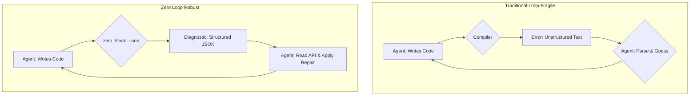

SLUG: zero-language-agent-first-compiler-design

---

AI 에이전트에게 코드를 작성하게 하는 시도는 활발하지만, 시니어 Swift 개발자에게는 불편한 지점이 명확합니다. 우리는 수십 년간 인간의 인지 구조에 맞춰 발전해 온 프로그래밍 언어와 도구를 사용해, LLM(거대 언어 모델)이라는 완전히 다른 패러다임의 '지능'을 제어하려 하고 있습니다. 이 근본적인 미스매치는 특히 에이전트가 코드를 '수정'해야 하는 디버깅 루프에서 심각한 취약점으로 드러납니다. 에이전트는 Xcode가 보여주는 구조화된 오류가 아닌, 컴파일러가 뱉어내는 날것의 텍스트 문자열을 해석해야만 합니다. 이 과정은 본질적으로 불안정하며 예측 불가능합니다.

Vercel Labs가 공개한 실험적 시스템 언어 Zero는 이 문제를 언어와 컴파일러 설계단에서 해결하려는 급진적인 접근법을 제시합니다. Zero의 핵심은 "만약 컴파일러가 인간이 아닌 AI 에이전트를 최우선 사용자로 삼는다면 어떻게 설계되어야 하는가?"라는 질문에서 출발합니다.

## 컴파일러는 인간을 위한 것: AI 에이전트 개발의 숨겨진 장벽

현재 AI 에이전트의 코딩 워크플로우는 깨지기 쉬운 루프에 갇혀 있습니다.

1.  **생성 (Generate):** 에이전트가 목표에 따라 코드를 작성합니다.
2.  **실행 (Execute):** 코드를 컴파일하거나 인터프리터로 실행합니다.
3.  **오류 발생 (Fail):** 컴파일러는 인간 개발자가 이해하도록 설계된 오류 메시지를 텍스트로 출력합니다. (예: `error: cannot find 'userProfile' in scope`)
4.  **해석 및 추측 (Parse & Guess):** 에이전트는 이 비구조화된 텍스트를 파싱하여 문제의 원인과 해결책을 '추측'해야 합니다.
5.  **수정 시도 (Attempt Fix):** 추측을 바탕으로 코드를 수정하고 1번으로 돌아갑니다.

이 루프의 4번 단계가 바로 핵심적인 취약점입니다. 컴파일러 오류 메시지의 형식은 버전마다 미묘하게 바뀌며, 동일한 근본 원인에 대해서도 다른 맥락의 메시지를 출력할 수 있습니다. Swift 개발자는 강력한 타입 시스템과 Xcode의 정교한 오류 표시에 익숙하지만, 에이전트에게 컴파일러는 그저 모호한 문자열을 출력하는 블랙박스일 뿐입니다. 이는 마치 잘 정의된 REST API 대신, 매번 형식이 바뀌는 웹사이트의 HTML을 스크래핑하여 정보를 얻으려는 것과 같습니다.

## Zero의 해법: 컴파일러를 에이전트의 API로 재설계하기

Zero는 컴파일러와 툴체인 전체를 AI 에이전트가 소비하는 하나의 잘 정의된 API로 취급합니다. 이는 세 가지 핵심 설계 원칙으로 구체화됩니다.

### 원칙 1: 진단은 데이터다 - 구조화된 JSON 출력

Zero의 가장 큰 특징은 모든 툴체인 출력이 구조화된 JSON을 지원한다는 점입니다. 예를 들어, `zero check --json` 명령어는 인간이 읽기 위한 산문(prose) 대신 기계가 파싱하기 위한 데이터를 반환합니다.

**전통적인 컴파일러 오류 (Swift 예시):**
```text
main.swift:3:5: error: cannot find 'printMessage' in scope
    printMessage("Hello")
    ^~~~~~~~~~~~
```

**Zero의 진단 출력 (JSON 예시):**
```json
{
  "ok": false,
  "diagnostics": [{
    "code": "NAM003",
    "message": "unknown identifier",
    "line": 3,
    "repair": {
      "id": "declare-missing-symbol"
    }
  }]
}
```

이 접근법은 게임의 규칙을 바꿉니다. 에이전트는 더 이상 `message` 필드의 자연어를 해석할 필요가 없습니다. 안정적인(stable) `code`인 "NAM003"을 통해 문제 유형을 명확히 인지하고, `repair` 필드의 제안을 통해 무엇을 해야 할지 직접적인 힌트를 얻습니다. 더 나아가 `zero fix --plan --json` 같은 명령어는 코드 수정을 위한 구체적인 계획을 기계가 읽을 수 있는 형식으로 제공하여 '추측'의 영역을 제거합니다.

### 원칙 2: '무엇을 하는가'의 명시 - 역량 기반(Capability-Based) I/O

시스템 프로그래밍 언어인 Zero는 함수가 수행하는 부작용(Side Effect)을 타입 시그니처에 명시하도록 강제합니다. 예를 들어, 파일 시스템에 접근하거나 네트워크 요청을 보내는 함수는 자신의 시그니처에 해당 '역량(capability)'을 선언해야만 컴파일됩니다.

Swift 개발자에게 이는 `async`나 `throws` 키워드와 유사하게 느껴질 수 있습니다. 이 키워드들은 함수가 비동기적으로 동작하거나 오류를 던질 수 있다는 사실을 시그니처 수준에서 명시하여 호출자가 대응하도록 만듭니다. Zero는 이 개념을 모든 종류의 I/O로 확장합니다.

이러한 명시성은 코드를 분석하는 AI 에이전트에게 엄청난 이점을 제공합니다. 에이전트는 함수 본문을 전부 읽고 이해하지 않고도, 시그니처만 보고 "이 함수는 네트워크 통신은 하지만 파일 시스템은 건드리지 않는다"와 같이 핵심 동작을 안전하게 추론할 수 있습니다. 이는 코드 변경 시 잠재적인 영향을 분석하고, 보안적으로 민감한 동작을 제한하는 데 결정적인 역할을 합니다.

### 에이전트-컴파일러 상호작용 루프 비교

아래 다이어그램은 전통적인 방식과 Zero의 방식이 어떻게 다른지 명확히 보여줍니다.



## Zero의 원칙 vs. 기존 언어: 트레이드오프 분석

Zero의 접근법이 혁신적인 것은 사실이지만, 현실적인 트레이드오프를 고려해야 합니다. LLM은 이미 방대한 양의 Python, Go, Swift 코드로 학습되었으며, 이 언어들은 거대한 생태계를 가지고 있습니다. 새로운 언어를 도입하는 것은 이 모든 이점을 포기하는 것을 의미합니다.

| 특징 | Python (에이전틱 프레임워크) | Swift (네이티브) | Zero (에이전트 우선 설계) |
| :--- | :--- | :--- | :--- |
| **컴파일러 피드백** | 비구조화 텍스트 (린터/인터프리터) | 비구조화 텍스트 (컴파일러 오류) | **구조화된 JSON API** |
| **부작용(Side Effect)** | 암시적, 런타임에 발견됨 | 암시적 (async/throws 제외) | **타입 시그니처에 명시적** |
| **에이전트의 목표** | 문법적으로 올바른 코드 생성 | 문법적으로 올바른 코드 생성 | **의미적으로 정확하고, 수리 가능한 코드 생성** |
| **개발자 경험** | 높음 (거대한 생태계) | 높음 (탁월한 IDE 통합) | 낮음 (실험 단계, 최소 생태계) |
| **최적 활용 사례** | 빠른 프로토타이핑, 연구 | 명확한 I/O를 가진 온디바이스 앱 | 자율적, 자가 복구 코드 생성 작업 |
| **치명적 약점** | 깨지기 쉬운 수정 루프 | 에이전트에게 깨지기 쉬운 수정 루프 | **완전히 새롭고, 검증되지 않았으며, 프로덕션 사용 불가** |

Zero의 베팅은 단순히 더 많은 기존 코드 예제를 학습시키는 것보다, 에이전트와 도구 간의 상호작용 방식을 근본적으로 개선하는 것이 더 높은 레버리지 포인트라는 것입니다. 이는 거대한 기존 생태계를 포기하는 대신 '설계적으로 올바른(correct-by-construction)' 피드백 루프를 얻는 선택입니다.

## MoneyFlow 프로젝트에 Zero 원칙 적용하기

13개의 에이전트가 협업하는 `MoneyFlow` 트레이딩 파이프라인 같은 복잡한 시스템에서 Zero의 가치는 극명해집니다.

가령, `DataIngestionAgent`가 새로운 API 소스를 추가하기 위해 `MarketAnalysisAgent`의 코드를 수정해야 하는 시나리오를 생각해 봅시다.

*   **Python/LangChain 접근법:** 에이전트가 Python 코드를 수정하고 `pytest`를 실행합니다. 테스트가 실패하면 여러 줄의 스택 트레이스(stack trace) 문자열을 받습니다. 에이전트는 이 문자열을 파싱하다가 의존성 문제나 미묘한 타입 오류에 혼동을 겪고, 잘못된 추측으로 코드를 더 망가뜨리는 재시도 루프에 빠질 수 있습니다. 디버깅은 로그를 파헤치는 고된 작업이 됩니다.
*   **Zero 접근법:** 에이전트가 Zero 코드를 수정합니다. `zero check --json`은 안정적인 오류 코드와 함께 타입 불일치를 보고하며, 필요한 import 구문을 추가하라는 `repair` 제안을 함께 반환합니다. 에이전트는 이 구조화된 데이터를 읽고 정확한 패치를 적용합니다. 전체 과정은 휴리스틱한 추측이 아닌, 결정론적이고 감사 가능한(auditable) 작업이 됩니다. 금융 시스템에서 요구되는 신뢰성 수준을 달성하는 데 이는 필수적입니다.

Zero는 아직 프로덕션에 적용할 수 있는 단계가 아닌 실험입니다. 하지만 이는 우리에게 중요한 방향성을 제시합니다. AI 에이전트의 성능을 끌어올리는 다음 단계는 더 똑똑한 모델을 만드는 것뿐만 아니라, 에이전트가 실제로 추론하고, 상호작용하고, 스스로를 수정할 수 있도록 설계된 새로운 종류의 언어, 컴파일러, 런타임을 구축하는 것일 수 있습니다.

## 자기 점검

*   Swift/Xcode에서 보는 컴파일러 오류 메시지와 Zero 툴체인의 진단 출력 사이의 핵심적인 차이점은 무엇인가요?
*   Zero의 '명시적 효과'(역량 기반 I/O) 개념은 AI 에이전트가 더 안전하고 예측 가능한 코드를 작성하는 데 어떻게 도움이 되나요?
*   '에이전트 우선' 언어인 Zero의 이론적 이점에도 불구하고, 특정 팀이 새로운 프로젝트에 AI 에이전트를 이용해 Go 코드를 작성하도록 선택하는 이유는 무엇일까요?
*   **프로젝트 적용 질문:** 현재 진행 중인 iOS 프로젝트에서 반복적으로 수행하는 코딩 작업(예: 새로운 SwiftUI 뷰와 ViewModel 생성, 데이터 모델 및 관련 API 서비스 업데이트)을 생각해 보세요. 만약 AI 에이전트가 이 작업을 자동화한다면 가장 실패 확률이 높은 지점은 어디일 것이며, Zero와 같은 구조화된 피드백 루프가 어떻게 그 자동화의 신뢰성을 높일 수 있을까요?