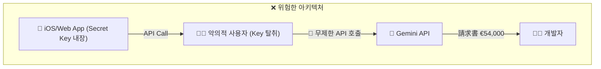
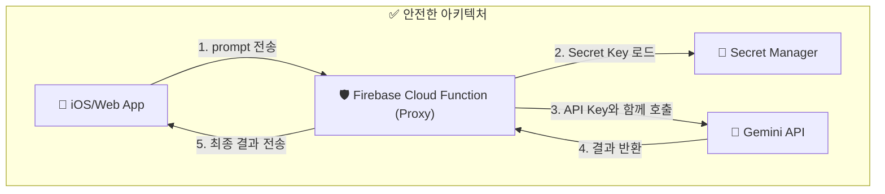
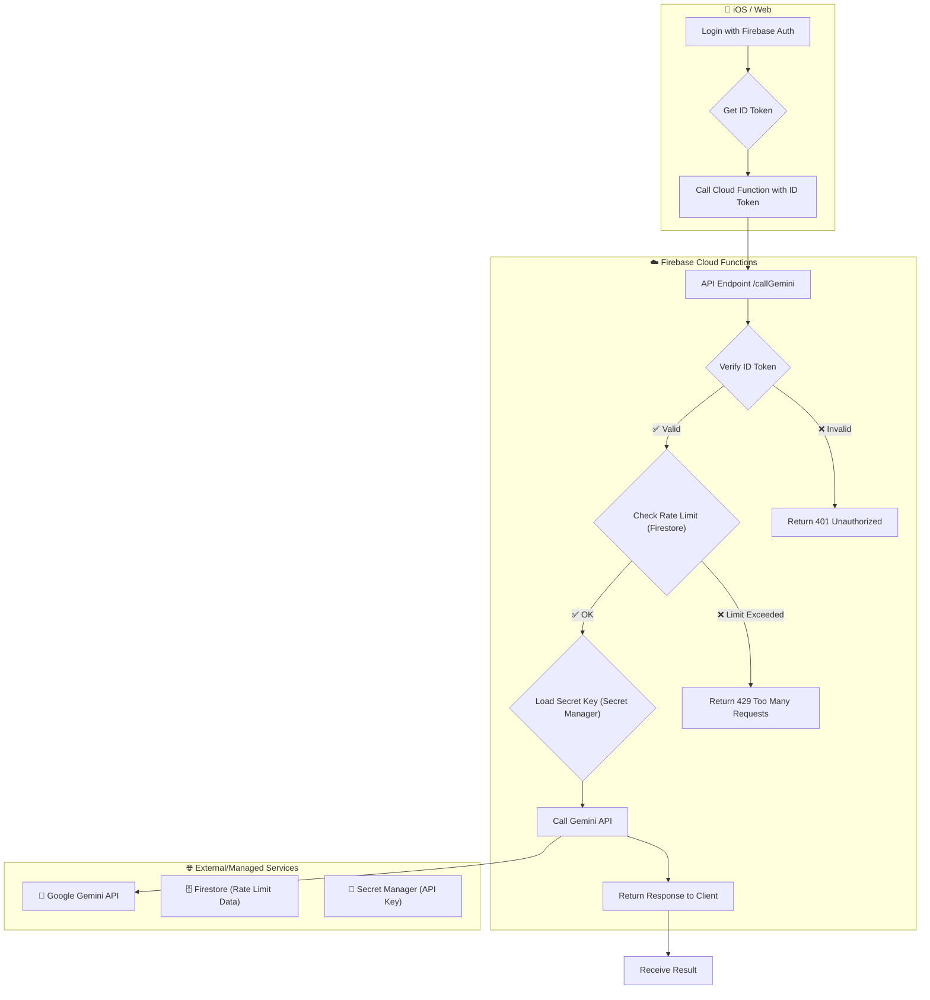

최근 긱뉴스에 공유된 한 개발자의 경험담은 많은 이들에게 경종을 울렸습니다. Firebase의 브라우저 키(Browser Key)를 사용해 서버 전용인 Gemini API를 호출하도록 방치한 결과, 단 13시간 만에 €54,000(약 8천만 원)의 요금이 발생한 사건입니다. 이 사건은 특히 AI 기능을 클라이언트(iOS, 웹 프론트엔드)에 직접 통합하려는 개발자들에게 중요한 교훈을 줍니다. 클라이언트의 편의성과 강력한 백엔드 API가 만나는 지점에서 보안을 간과하면 어떤 재앙이 발생하는지 명확히 보여주기 때문입니다.

이 글에서는 해당 사건을 분석하며, 프론트엔드 개발자가 AI API를 안전하게 연동하기 위해 반드시 구축해야 할 3단계 방어선 아키텍처를 제시합니다.

## 왜 클라이언트에서 직접 AI API를 호출하면 안 되는가?

사건의 핵심은 **API 키의 종류와 용도를 혼동**한 데 있습니다.

-   **Public/Browser Key (공개 키):** Firebase의 `apiKey`처럼 클라이언트 앱(웹, iOS, Android)에 포함되어도 안전하도록 설계된 키입니다. 이 키는 보통 Firebase Authentication, Firestore 보안 규칙 등 해당 프로젝트를 '식별'하는 용도로 사용됩니다. 이 키만으로는 과금을 유발하는 민감한 작업을 수행할 수 없습니다.
-   **Secret/Server Key (비밀 키):** OpenAI, Anthropic, Gemini API 키처럼 서버 환경에서만 사용되어야 하는 절대 노출되어서는 안 되는 키입니다. 이 키가 노출되면 누구나 내 계정으로 유료 API를 무제한 호출하여 막대한 요금을 발생시킬 수 있습니다.

iOS 앱의 소스코드나 웹 애플리케이션의 JavaScript 번들은 최종적으로 사용자의 기기에서 실행되므로, 여기에 포함된 모든 정보는 마음만 먹으면 누구나 추출할 수 있습니다. 즉, **클라이언트 앱에 저장된 모든 키는 공개 키**라고 간주해야 합니다.

사고는 바로 이 지점에서 발생했습니다. 개발자는 서버에서만 사용해야 할 Gemini API(비밀 키 필요)를 호출할 때, 클라이언트용 Firebase 프로젝트 설정에서 사용하는 공개 키로도 인증이 가능하다고 착각(혹은 구글 클라우드 프로젝트의 허술한 API 설정)했고, 이 키가 노출되자 악의적인 사용자가 이를 탈취해 무한 호출을 날린 것입니다.



이러한 재앙을 막기 위해 우리는 클라이언트와 실제 AI API 사이에 견고한 방어선을 구축해야 합니다.

## 3단계 방어선: Proxy, Auth, Rate Limiting

안전한 AI API 연동을 위한 핵심은 **클라이언트가 절대 비밀 키에 직접 접근하지 못하게 하는 것**입니다. 이를 위해 3단계의 방어선으로 구성된 백엔드 중계 서버(Proxy)를 구축합니다. 서버리스 함수(Firebase Cloud Functions, AWS Lambda 등)를 사용하면 인프라 관리 부담 없이 쉽게 구현할 수 있습니다.

### 1단계: 프록시 서버 (Proxy Backend) - 비밀 키 격리

가장 기본적인 방어선은 모든 AI API 요청을 중계하는 프록시 함수를 만드는 것입니다.

1.  **클라이언트**는 AI API에 보낼 데이터(예: 프롬프트)를 프록시 함수에 요청합니다.
2.  **프록시 함수**는 서버 환경에서만 접근 가능한 Secret Manager 등에서 안전하게 비밀 API 키를 불러옵니다.
3.  프록시 함수는 클라이언트로부터 받은 데이터와 비밀 키를 사용해 실제 AI API를 호출합니다.
4.  AI API의 응답을 받아 다시 클라이언트에게 전달합니다.

이 구조를 통해 비밀 키는 클라이언트에 절대 노출되지 않고, 오직 제어 가능한 서버 환경에만 머무르게 됩니다.



**Firebase Cloud Functions (TypeScript) 예제:**

```typescript
// index.ts
import { onRequest } from "firebase-functions/v2/https";
import * as logger from "firebase-functions/logger";
import { GoogleAuth } from "google-auth-library";
import { defineString } from "firebase-functions/params";

// Secret Manager에 저장된 API 키를 참조
const GEMINI_API_KEY = defineString("GEMINI_API_KEY");

export const callGemini = onRequest(
  { secrets: ["GEMINI_API_KEY"] }, // 함수에 Secret Manager 권한 부여
  async (req, res) => {
    if (req.method !== "POST") {
      res.status(405).send("Method Not Allowed");
      return;
    }

    const { prompt } = req.body;
    if (!prompt) {
      res.status(400).send("Bad Request: prompt is required.");
      return;
    }

    try {
      const auth = new GoogleAuth();
      const client = await auth.getClient();
      const accessToken = (await client.getAccessToken()).token;

      // 실제 Gemini API 엔드포인트와 프로젝트 정보
      const endpoint = "https://generativelanguage.googleapis.com/v1beta/models/gemini-pro:generateContent";
      
      const response = await fetch(`${endpoint}?key=${GEMINI_API_KEY.value()}`, {
        method: 'POST',
        headers: {
          'Content-Type': 'application/json',
        },
        body: JSON.stringify({
          contents: [{ parts: [{ text: prompt }] }],
        }),
      });

      if (!response.ok) {
        const error = await response.json();
        logger.error("Gemini API error:", error);
        res.status(response.status).send(error);
        return;
      }
      
      const data = await response.json();
      res.status(200).send(data);

    } catch (error) {
      logger.error("Internal server error:", error);
      res.status(500).send("Internal Server Error");
    }
  }
);
```

### 2단계: 사용자 인증 (Authentication) - 요청자 식별

프록시 서버만으로는 부족합니다. 익명의 사용자가 프록시 함수를 무한정 호출할 수 있기 때문입니다. 따라서 **오직 인증된 우리 앱 사용자만이 프록시를 호출**할 수 있도록 제한해야 합니다.

Firebase Authentication을 사용하면 간단하게 구현할 수 있습니다.

1.  클라이언트(iOS/Web)는 Firebase SDK로 로그인하고 **ID 토큰(ID Token)**을 발급받습니다.
2.  프록시 함수를 호출할 때, 이 ID 토큰을 `Authorization: Bearer <ID_TOKEN>` 헤더에 담아 전송합니다.
3.  프록시 함수는 수신한 ID 토큰이 유효한지 Firebase Admin SDK를 통해 검증합니다.
4.  검증에 성공한 경우에만 AI API를 호출하고, 실패하면 `401 Unauthorized` 오류를 반환합니다.

**Firebase Cloud Functions 코드에 인증 로직 추가:**

```typescript
// ... 이전 코드에 이어서
import * as admin from "firebase-admin";

admin.initializeApp();

export const callGeminiWithAuth = onRequest(
  { secrets: ["GEMINI_API_KEY"] },
  async (req, res) => {
    // 1. Authorization 헤더에서 ID 토큰 추출
    const authHeader = req.headers.authorization;
    if (!authHeader || !authHeader.startsWith('Bearer ')) {
      res.status(401).send('Unauthorized: No token provided.');
      return;
    }
    const idToken = authHeader.split('Bearer ')[1];

    try {
      // 2. ID 토큰 검증
      const decodedToken = await admin.auth().verifyIdToken(idToken);
      const uid = decodedToken.uid;
      logger.info(`Request from authenticated user: ${uid}`);

      // ... (3. 이후 로직은 이전과 동일: prompt 처리 및 Gemini API 호출)

    } catch (error) {
      logger.error("Authentication error:", error);
      res.status(401).send("Unauthorized: Invalid token.");
    }
  }
);
```

이제 악의적인 사용자는 유효한 사용자 계정 없이는 우리의 API 프록시를 호출할 수 없게 되었습니다.

### 3단계: 사용량 제한 (Rate Limiting) - 과금 상한선 설정

인증된 사용자라도 버그나 악의적인 행동으로 인해 단시간에 수많은 요청을 보낼 수 있습니다. 이를 방지하기 위해 사용자별, 혹은 전역적으로 API 호출 횟수를 제한하는 'Rate Limiting'이 필요합니다.

Firestore나 Realtime Database를 활용해 사용자별 요청 기록을 저장하고, 이를 기반으로 호출을 제어할 수 있습니다.

| 전략 | 구현 방식 | 장점 | 단점 |
| :--- | :--- | :--- | :--- |
| **토큰 버킷 (Token Bucket)** | (추천) Firestore에 사용자별 `(토큰 수, 마지막 갱신 시간)` 저장. 요청 시 토큰 1개 차감, 시간이 지나면 토큰 충전. | 유연함. 단기적인 버스트(burst) 허용 가능. | 구현이 약간 더 복잡함. |
| **고정 윈도우 (Fixed Window)** | Firestore에 `(요청 횟수, 윈도우 시작 시간)` 저장. 1분/10분 등 고정된 시간 내 요청 횟수 카운트. | 구현이 간단함. | 윈도우 경계에서 요청이 몰릴 수 있음. |
| **비용 기반 제한 (Cost-Based)** | (2026년 트렌드) 요청 횟수가 아닌, AI API의 토큰 사용량 기반으로 제한. Firestore에 사용자별 `누적 사용 토큰 수` 기록. | 실제 비용과 직결된 정교한 제어 가능. | AI API 응답에서 토큰 사용량을 파싱해야 함. |

**Firestore를 이용한 간단한 고정 윈도우 Rate Limiting 구현 예시:**

```typescript
// ... 이전 코드에 이어서
const db = admin.firestore();

// 분당 5회 호출 제한
const RATE_LIMIT_COUNT = 5;
const RATE_LIMIT_MINUTES = 1;

// ... 함수 내부, 토큰 검증 성공 후 ...
try {
    const uid = decodedToken.uid;
    const now = admin.firestore.Timestamp.now();
    const windowStart = new admin.firestore.Timestamp(now.seconds - (RATE_LIMIT_MINUTES * 60), 0);

    const userRateLimitRef = db.collection('rateLimits').doc(uid);
    const userRequests = await userRateLimitRef.collection('requests')
        .where('timestamp', '>=', windowStart)
        .count()
        .get();

    if (userRequests.data().count >= RATE_LIMIT_COUNT) {
        res.status(429).send('Too Many Requests');
        return;
    }
    
    // 요청 기록
    await userRateLimitRef.collection('requests').add({ timestamp: now });

    // ... (Gemini API 호출 로직)
}
// ...
```

이 3단계 방어선을 모두 구축하면, 우리의 AI API 연동 아키텍처는 훨씬 더 안전해집니다.



## 자기 점검

이 글을 통해 AI API를 안전하게 연동하는 기본 패턴을 학습했습니다. 다음 질문들에 답하며 이해도를 점검해 보세요.

1.  모바일 앱 소스코드나 웹사이트 JavaScript에 OpenAI, Gemini 같은 AI API의 '비밀 키(Secret Key)'를 직접 포함하면 안 되는 이유는 무엇인가요?
2.  프록시 서버(예: Firebase Cloud Functions)를 사용하는 가장 주된 목적은 무엇인가요?
3.  사용자 인증(2단계)만으로는 부족하고 사용량 제한(3단계)이 추가로 필요한 이유는 무엇일까요?
4.  만약 우리 서비스가 유료 구독자에게 더 많은 API 호출 횟수를 제공해야 한다면, 위에서 제시된 3단계 방어선 아키텍처 중 어느 부분을 어떻게 수정해야 할까요?
5.  **동료에게 설명하기:** "프론트엔드 개발 동료가 '그냥 앱에서 바로 AI API 호출하면 편한데, 왜 굳이 복잡하게 Cloud Function을 만들어야 해?'라고 질문했습니다. 이 아키텍처의 필요성을 어떻게 비유를 들어 쉽게 설명해 주시겠어요?"

### 실습 과제

Firebase 프로젝트를 생성하고, 위 글의 예제 코드를 바탕으로 다음 기능을 모두 포함하는 Cloud Function을 직접 배포해 보세요.

-   **엔드포인트:** `/askAI` (POST 요청만 허용)
-   **보안 1 (프록시):** Secret Manager에 저장된 임의의 문자열(실제 API 키가 아니어도 됨)을 읽어와 로그에 출력합니다.
-   **보안 2 (인증):** Firebase Authentication ID 토큰을 검증하고, 검증된 사용자의 UID를 로그에 기록합니다.
-   **보안 3 (사용량 제한):** Firestore를 사용하여 사용자별로 **분당 3회**의 요청 제한을 구현하고, 제한을 초과하면 `429 Too Many Requests`를 반환합니다.