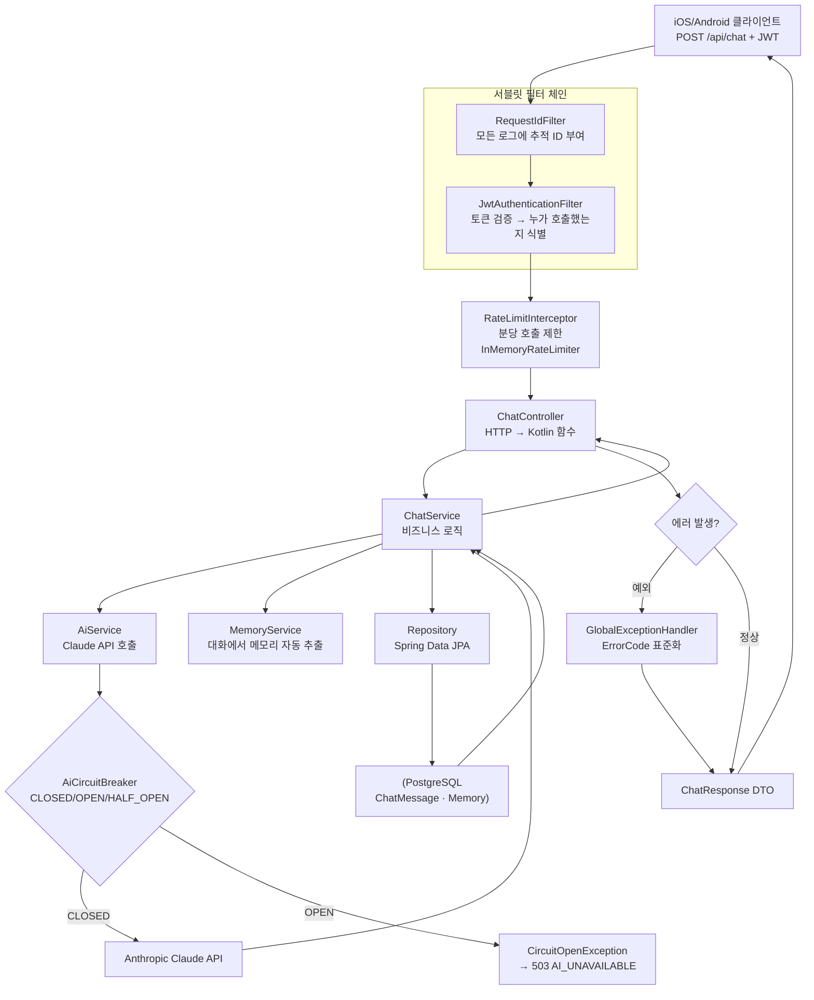

## 한 줄 요약

iOS 개발자가 `aidy-server`(Spring Boot + Kotlin) 레포로 백엔드 학습을 시작할 때, 파일별 코드 독해가 아니라 **"POST /api/chat 한 번의 여정"을 처음부터 끝까지 따라가는 방식**으로 큰 그림을 잡는다. aidy-server는 인증, DB, 외부 API, 에러 처리, 운영(Request-Id/Rate Limit/Circuit Breaker)이 작지만 **실무 핵심 요소를 모두 가진 미니어처**라 학습 재료로 적절하다.

---

## 갭 / 맥락

iOS 개발자가 백엔드 레포를 처음 열었을 때 흔한 실패 패턴:

| 증상 | 원인 |
|------|------|
| `Controller/`, `Service/`, `Repository/` 폴더를 하나씩 읽다가 지침 | 각 레이어가 "왜 필요한지"가 요청 흐름 없이는 설명 안 됨 |
| `application.yml`부터 보다가 포기 | 설정 파일은 실제 요청이 어떻게 흘러가는지 보여주지 않음 |
| 튜토리얼("Spring Boot 시작하기")만 반복 | 튜토리얼은 CRUD만 다루지, 인증/외부 API/장애 처리가 빠짐 |

**핵심 진단**: 조각을 먼저 보면 맥락이 없다. **한 요청이 시스템을 관통하는 한 줄기**를 먼저 따라가야 각 조각이 왜 필요한지 보인다.

---

## aidy-server가 학습 재료로 좋은 이유

`~/Develop/aidy-server` — Spring Boot 3.5 + Kotlin + PostgreSQL + Claude API. 작은 레포지만 실무 백엔드의 핵심 요소가 한 군데 모여 있다.

```
[인증]           JWT 로그인/회원가입
[DB]             PostgreSQL + Flyway migration (V1~V8)
[외부 API]       Claude API 호출 + Circuit Breaker로 보호
[에러 처리]      ErrorCode + GlobalExceptionHandler
[운영]           Request-Id 추적, Rate Limit, 헬스 체크
[계약 기반]      api-contract.md로 스펙 먼저, 코드는 계약 구현
```

이 정도 스택이 **하나의 레포에** 들어있고, ADR(아키텍처 결정 기록)까지 있는 학습용 레포는 드물다.

---

## 1단계: "한 요청의 여정" 따라가기

### POST /api/chat 한 번이 일으키는 일



### 각 단계가 하는 일 (한 줄씩)

| 단계 | 역할 | iOS 대응 |
|------|------|---------|
| **RequestIdFilter** | 요청마다 고유 ID 부여 → 로그 추적에 사용 | Alamofire `EventMonitor` + UUID |
| **JwtAuthenticationFilter** | `Authorization: Bearer ...` 헤더 검증 | `RequestInterceptor`에서 토큰 주입/검증 |
| **RateLimitInterceptor** | 사용자별 분당 호출 제한 | (서버 고유) — 클라이언트는 429 받아서 처리만 |
| **Controller** | HTTP 요청을 Kotlin 함수 파라미터로 변환 | `Router` / `URL → ViewController` 매핑 |
| **Service** | 비즈니스 로직 (트랜잭션 경계) | `UseCase` / `Interactor` |
| **AiService + CB** | 외부 API 호출 + 장애 격리 | `NetworkService` + 재시도 정책 |
| **Repository** | DB CRUD (ORM) | `CoreDataStack` / `RealmRepository` |
| **Entity** | DB 테이블 ↔ 객체 매핑 | `NSManagedObject` / Realm `Object` |
| **GlobalExceptionHandler** | 예외 → 표준 에러 응답 변환 | `NetworkError` enum + 전역 에러 매퍼 |
| **DTO** | API 계약 (request/response 스키마) | `Codable` 구조체 |

> 💡 **한 번 따라가 보면 70%가 보인다.** Controller/Service/Repository 폴더를 각각 10분씩 보는 것보다, `POST /api/chat` 한 줄기를 끝까지 읽는 30분이 훨씬 이득이다.

---

## 2단계: 관심사별로 훑기 (각각 "왜 필요한가?"에 답하기)

각 주제에 대해 **한 문장으로 "왜 필요한가"를 설명할 수 있으면 통과**. 코드 디테일은 필요할 때 돌아와서 파면 된다.

### 인증 / 보안
- **JWT**: 서버가 세션을 저장하지 않고도 "이 요청이 누구 요청인지" 확인하는 서명된 토큰. 모바일 앱처럼 수평 확장이 필요한 환경에서 유리.
- **bcrypt**: 비밀번호 원문을 저장하지 않고 단방향 해시 + salt로 저장. DB가 털려도 원문 복원이 어렵게.
- **Spring Security**: Controller에 도달하기 전 인증/인가 체크를 자동으로 수행. iOS의 navigation guard와 유사.

### DB 계층
- **Entity vs DTO 분리**: Entity는 DB 스키마, DTO는 API 계약. 섞으면 DB 변경이 API를 깨뜨린다.
- **JPA/Hibernate (ORM)**: 객체 ↔ 테이블 자동 매핑. SQL 직접 쓰는 수고를 줄이는 대신 N+1 같은 함정이 있다.
- **Flyway migration**: 스키마 변경을 파일(V1, V2, ...)로 버전 관리. iOS의 CoreData `NSMigrationManager`와 같은 취지, 훨씬 단순한 파일 기반.

### 외부 API 호출
- **Circuit Breaker**: Claude API가 일시 장애일 때 무한 재시도를 끊고 빠르게 503을 반환해 연쇄 장애를 방지.
  - [Spring Boot AI Circuit Breaker — 0 Dependency In-Memory 구현](/wiki/backend-ai/spring-boot-ai-circuit-breaker) — 3상태 머신 풀 구현 박제
- **OkHttp**: Kotlin/JVM에서 HTTP 클라이언트 역할. iOS의 `URLSession`과 같다.
- **타임아웃 / 재시도 정책**: 외부 의존성을 다루는 코드의 기본 위생.

### 에러 처리
- **ErrorCode 표준화**: `USER_NOT_FOUND`, `AI_UNAVAILABLE` 같은 코드를 서버-클라이언트 계약으로 고정. 문자열 메시지에 의존하면 다국어/UI 변경마다 깨진다.
- **GlobalExceptionHandler**: 예외가 발생한 곳마다 try/catch하지 않고, 전역에서 `ApiException → ErrorCode → HTTP 응답`으로 변환. iOS의 `AppError` enum + error mapper 패턴과 같음.

### 운영
- **Request-Id (MDC)**: 한 요청 안에서 발생한 모든 로그에 같은 ID가 찍히게 해서, 장애 디버깅 시 "이 유저의 이 요청" 단위로 로그를 추출할 수 있음. 서버 디버깅의 생명줄.
- **Rate Limit**: 특정 사용자/IP의 호출 빈도를 제한. `aidy-server`는 in-memory 슬라이딩 윈도우로 구현.
- **헬스 체크**: `GET /api/health`가 200을 반환하는지로 로드 밸런서가 트래픽 라우팅 결정. iOS의 "앱 실행 가능 여부" 판단과 비슷하지만 서버는 항상 떠있어야 함.

---

## 3단계: iOS 경험을 레버리지 — 비교 학습표

iOS에서 이미 익힌 개념에 Spring Boot가 쓰는 용어를 매핑하면 학습 속도가 빨라진다.

| iOS 개념 | Spring Boot 대응 | 한 줄 메모 |
|---------|----------------|-----------|
| Swinject / 수동 DI | Spring DI (`@Component`, `@Service`, `@Autowired`) | 프레임워크가 생성자에 의존성을 주입. 더 선언적 |
| Router / Deep Link | `@RestController` + `@RequestMapping` | URL 경로 → 함수 매핑 |
| `Codable` 구조체 | DTO (Data Transfer Object) | 직렬화 계층. Bean Validation으로 입력 검증까지 |
| CoreData / Realm | JPA Entity + Repository | ORM. `@Entity`가 테이블, `JpaRepository`가 CRUD |
| `NSMigrationManager` | Flyway migration (`V1__init.sql`) | 파일 기반 스키마 버전 관리 |
| `URLSession` | OkHttp / RestTemplate | HTTP 클라이언트 |
| Alamofire `RequestInterceptor` | Filter / Interceptor | 공통 전처리 (토큰, 로깅, Rate Limit) |
| `AppError` enum | `ErrorCode` + `ApiException` | 표준 에러 분류 |
| `Info.plist` + xcconfig | `application.yml` + 환경변수 | 환경별 설정 |
| `EventMonitor` 로깅 | Logback + MDC | 구조화 로그 + Request-Id |
| `XCTest` | JUnit 5 + `@SpringBootTest` | 단위 + 통합 테스트 |

> 🎯 이 표만 있어도 Spring Boot 레포를 열었을 때 "아 이건 iOS의 저거구나"라는 감각이 생긴다.

---

## 4단계: 실전 학습 로드맵

### Week 1 — 한 요청의 여정 완주
1. `docker compose up -d` → `./gradlew bootRun`으로 서버 띄우기
2. `POST /api/auth/signup` → `/api/auth/login` → `/api/chat` 순서로 curl 또는 iOS 앱에서 호출
3. 각 호출마다 **Request-Id를 로그에서 추적**해보기 (MDC로 찍힌 값이 모든 로그에 동일하게 찍힘)
4. 이 시점에서 파일을 열어야 할 순서:
   ```
   ChatController → ChatService → AiService → AiCircuitBreaker
   → MemoryService → Repository → Entity → application.yml
   ```

### Week 2 — 인증 플로우 해부
- `SecurityConfig`가 뭘 허용하고 뭘 막는지 (permitAll / authenticated)
- `JwtAuthenticationFilter`가 토큰을 어떻게 꺼내고 검증하는지
- `bcrypt`로 비밀번호가 어떻게 저장되는지 (DB에서 직접 확인)
- **iOS 대응 학습**: Keychain에 토큰 저장 + 자동 주입 로직 복습

### Week 3 — DB & 마이그레이션
- `src/main/resources/db/migration/V1~V8` 순서대로 읽기 → 스키마가 어떻게 진화해왔는지
- Entity ↔ Table 매핑 관찰
- N+1 문제 한 번 재현해보기 (`findAll()` 후 연관 객체 접근)

### Week 4 — 장애 시나리오
- Claude API 키를 잘못된 값으로 바꾸고 `/api/chat` 호출 → Circuit Breaker가 OPEN 되는 것 관찰
- Rate Limit 초과 호출 → 429 응답 확인
- Request-Id로 장애 전체 타임라인 추적

### (확장) Week 5+ — 계약 기반 개발 체험
- `aidy-architect/specs/api-contract.md`를 먼저 읽고, 코드가 그 계약을 어떻게 구현했는지 역추적
- 새 엔드포인트 추가해보기: **계약 수정 → 서버 구현 → iOS 호출**까지 한 사이클

---

## 자주 막히는 지점 (미리 공유)

| 증상 | 원인 / 해법 |
|------|------------|
| `./gradlew bootRun` 시 DB 연결 실패 | `docker compose up -d`가 먼저 떠있어야 함. `DB_PASSWORD` 환경변수 확인 |
| JWT 검증 계속 실패 | `JWT_SECRET` 환경변수 설정 필요 (`openssl rand -hex 32`) |
| Claude API 호출이 503으로만 오는 상황 | Circuit Breaker가 OPEN. 쿨다운(30초) 기다리거나 로그에서 실제 원인 확인 |
| Flyway "checksum mismatch" | 이미 적용된 migration 파일을 수정하면 안 됨. 새 V 파일로 변경사항 추가 |
| Entity 변경했는데 DB에 반영 안 됨 | JPA `ddl-auto: validate` 운영 시에는 반드시 Flyway로 migration 추가 |

---

## AI Agent Directive

### Trigger
- iOS/Frontend 개발자가 백엔드 학습을 시작할 때
- 백엔드 레포를 처음 열고 어디부터 봐야 할지 모를 때
- "코드는 있는데 구조가 눈에 안 들어오는" 증상이 있을 때

### Prerequisites
- [Spring Boot AI Circuit Breaker 0 Dependency 구현](/wiki/backend-ai/spring-boot-ai-circuit-breaker) — 외부 API 의존성 격리 패턴

### Actionable Steps
1. **한 요청의 여정을 먼저 그린다** — 파일 단위가 아닌 요청 단위 관점 고정
2. **각 레이어에 "왜 필요한가"를 한 줄로 답할 수 있을 때까지만 읽는다** — 디테일은 필요할 때 돌아와서 판다
3. **iOS 비교 매핑표를 만든다** — 새 개념을 기존 지식에 붙여야 오래 간다
4. **실제 호출로 Request-Id 추적 체험** — 로그 추적은 말로 설명해도 안 와닿음. 한 번 눈으로 봐야 감이 온다
5. **장애 시나리오 3개 재현** — Circuit Breaker OPEN / Rate Limit 429 / JWT 만료. 성공 경로만 보면 방어 로직의 존재 이유가 안 보인다

### Anti-patterns
- **파일별 독해** — Controller 10분, Service 10분… 맥락이 조립되지 않는다
- **application.yml부터 시작** — 설정만 보고 흐름이 안 보임
- **튜토리얼 무한 반복** — 실제 레포의 복잡성이 튜토리얼엔 없음
- **iOS 경험 무시** — 이미 아는 것에 새 용어를 매핑하지 않으면 처음부터 배우는 꼴

---

## 다음 학습 연결

- [Spring Boot AI Circuit Breaker](/wiki/backend-ai/spring-boot-ai-circuit-breaker) — 이 글의 "외부 API 호출" 파트를 깊게
- [Aidy Journal 000 — Architect/Worker Baseline](/wiki/harness-engineering/aidy-journal-000-architect-worker-baseline) — aidy 프로젝트의 계약 기반 개발 구조

---

## 출처 / 검증 메모

- 코드: `~/Develop/aidy-server` (README.md, CLAUDE.md)
- 구조: `src/main/kotlin/com/mino/aidy/{config, controller, service, repository, entity, exception, util}`
- ADR: `~/Develop/aidy-architect/decisions/ADR-006.md` (JWT), `ADR-007.md` (Circuit Breaker)
- API 계약: `~/Develop/aidy-architect/specs/api-contract.md`
