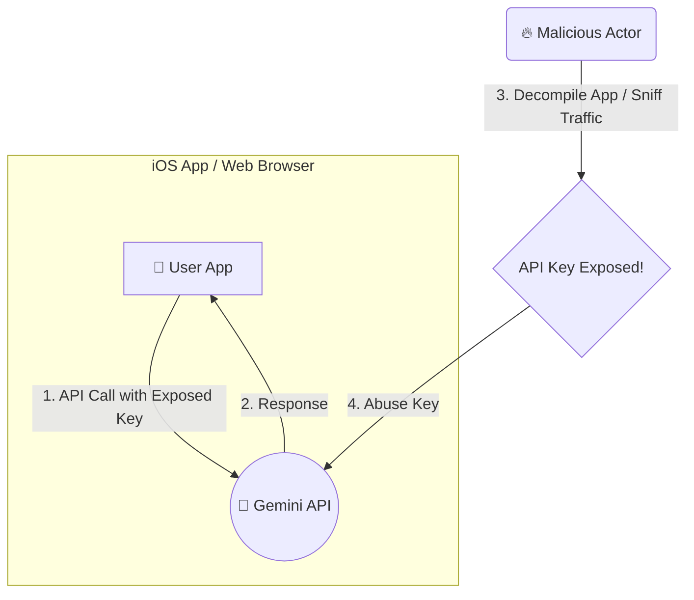
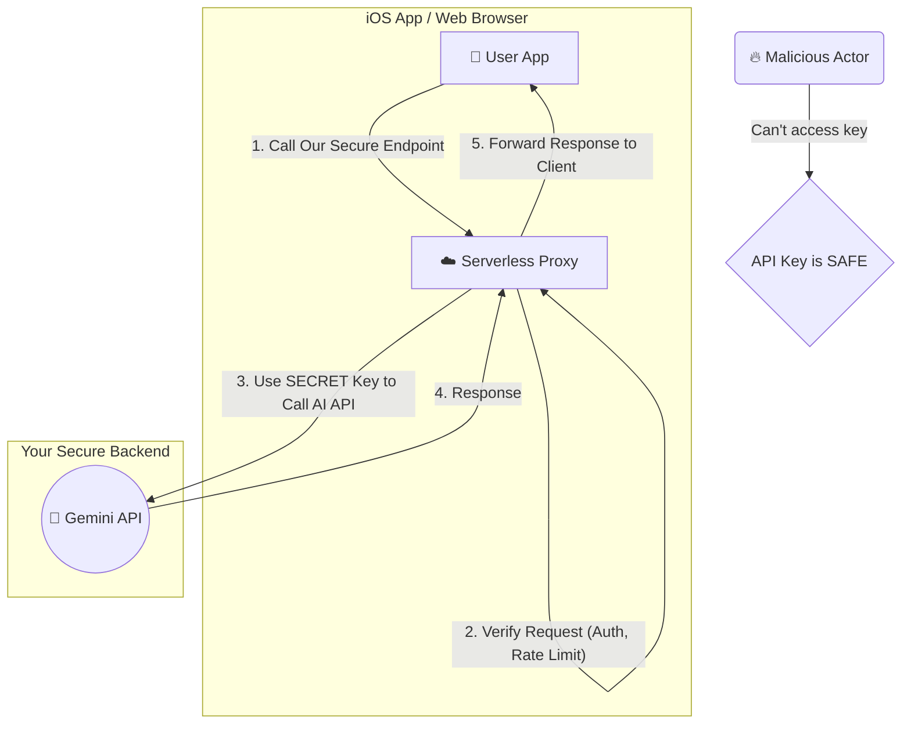

13시간 만에 €54,000(약 7,800만 원)의 요금이 부과된 사고는 클라이언트 측에서 직접 AI API를 호출하는 것의 위험성을 명확히 보여줍니다. 이 사고의 원인은 Firebase 브라우저 키를 통해 서버 측 API인 Gemini API를 호출했기 때문입니다. 클라이언트(iOS 앱, 웹 브라우저)에 포함된 API 키는 디컴파일이나 네트워크 트래픽 분석을 통해 쉽게 탈취될 수 있으며, 이는 곧바로 금전적 손실로 이어집니다.

이 글에서는 iOS/프론트엔드 개발자가 AI 기능을 안전하고 비용 효율적으로 앱에 통합하기 위해 반드시 알아야 할 '서버리스 프록시 패턴'을 소개합니다.

## 왜 클라이언트 직접 호출은 위험한가?

AI API를 연동하는 가장 간단한 방법은 클라이언트 코드에서 직접 API를 호출하는 것입니다. 하지만 이는 문을 열어두고 집을 비우는 것과 같습니다.

### 안티 패턴: 클라이언트 직접 호출 아키텍처



이 구조의 핵심적인 문제점은 다음과 같습니다.

1.  **API 키 노출**: iOS 앱의 바이너리 파일이나 웹의 JavaScript 코드는 누구나 분석할 수 있습니다. 여기에 API 키를 하드코딩하면, 악의적인 사용자가 손쉽게 키를 탈취할 수 있습니다.
2.  **비용 폭증 (Billing Abuse)**: 탈취된 API 키는 공격자의 서버나 봇넷에서 무차별적으로 사용될 수 있습니다. 여러분의 계정으로 수백, 수천만 건의 비싼 AI API 호출이 발생하여 순식간에 요금 폭탄을 맞게 됩니다.
3.  **쿼터 소진**: 악의적인 호출로 인해 API 사용량 쿼터가 소진되면, 정작 실제 사용자들은 서비스를 이용할 수 없는 장애 상황이 발생합니다.
4.  **중앙 제어 불가능**: 클라이언트에 로직이 흩어져 있으면, 모든 사용자의 API 호출을 중앙에서 통제하거나 모니터링하기 어렵습니다. 속도 제한(Rate Limiting), 로깅, 어뷰징 감지 등의 보안 정책을 적용할 수 없습니다.

## 해결책: 서버리스 프록시 패턴

이 모든 문제를 해결하는 표준적인 방법은 클라이언트와 AI API 사이에 신뢰할 수 있는 중간 계층, 즉 **프록시(Proxy) 서버**를 두는 것입니다. 특히, 서버를 직접 관리할 필요가 없는 서버리스(Serverless) 환경(예: AWS Lambda, Google Cloud Functions)을 활용하면 iOS/프론트엔드 개발자도 부담 없이 안전한 백엔드를 구축할 수 있습니다.

### 권장 패턴: 서버리스 프록시 아키텍처



이 패턴의 장점은 명확합니다.

| 특징 | 클라이언트 직접 호출 | 서버리스 프록시 패턴 |
| :--- | :--- | :--- |
| **API 키 저장소** | 클라이언트 코드 (위험) | 백엔드 환경 변수/Secret Manager (안전) |
| **보안 주체** | 클라이언트 앱 | 나의 백엔드 서버 |
| **비용 제어** | 불가능 | **가능** (속도 제한, 예산 알림) |
| **인증/인가** | 제한적 | **강력함** (Firebase Auth, JWT 등 연동) |
| **비즈니스 로직** | 클라이언트에 분산 | 백엔드에 중앙화 (유연성, 확장성) |
| **인프라 관리** | 없음 | 거의 없음 (서버리스) |

## 실전 구현: Cloud Functions for Firebase로 프록시 만들기

Firebase를 사용하는 iOS/프론트엔드 개발자에게 가장 친숙한 서버리스 환경은 Cloud Functions for Firebase일 것입니다. TypeScript를 사용하여 Gemini API를 호출하는 안전한 프록시 함수를 만들어 보겠습니다.

### 1. 프로젝트 설정 및 API 키 보안

먼저, Gemini API 키를 절대로 소스코드에 넣으면 안 됩니다. Firebase의 Secret Manager 기능을 사용합니다.

```bash
# Firebase 프로젝트에 Secret 설정
firebase functions:secrets:set GEMINI_API_KEY
# 프롬프트가 뜨면 나의 API 키를 붙여넣기
```

이렇게 설정된 키는 배포된 함수 내에서만 안전하게 접근할 수 있습니다.

### 2. 프록시 함수 작성 (index.ts)

사용자가 보낸 프롬프트를 받아 Gemini API에 전달하고, 결과를 다시 사용자에게 반환하는 `https.onCall` 타입의 함수를 작성합니다. 이 타입의 함수는 Firebase 인증 정보와 자동으로 연동되어 매우 편리합니다.

```typescript
// functions/src/index.ts
import { onCall, HttpsError } from "firebase-functions/v2/https";
import * as logger from "firebase-functions/logger";
import { GoogleGenerativeAI } from "@google/generative-ai";

// 함수가 초기화될 때 Secret Manager에서 API 키를 가져옵니다.
const GEMINI_API_KEY = process.env.GEMINI_API_KEY;
if (!GEMINI_API_KEY) {
  throw new Error("GEMINI_API_KEY is not set in environment variables");
}
const genAI = new GoogleGenerativeAI(GEMINI_API_KEY);

export const askGeminiProxy = onCall(async (request) => {
  // 1. 인증 확인: 로그인한 사용자만 호출 가능
  if (!request.auth) {
    throw new HttpsError(
      "unauthenticated",
      "You must be logged in to call this function."
    );
  }

  const prompt = request.data.prompt;

  // 2. 입력값 검증: 비어있거나 너무 긴 프롬프트는 거절
  if (!prompt || typeof prompt !== "string" || prompt.length > 1000) {
    throw new HttpsError(
      "invalid-argument",
      "The function must be called with a valid 'prompt' argument."
    );
  }

  // 3. (중요) 비용 제어를 위한 속도 제한 로직 추가
  // Firestore 등을 사용해 사용자별/IP별 호출 횟수를 추적하고 제한할 수 있습니다.
  // 이 예제에서는 생략하지만 실무에서는 필수적입니다.
  logger.info(`Request from UID: ${request.auth.uid}, Prompt: ${prompt}`);

  try {
    const model = genAI.getGenerativeModel({ model: "gemini-pro" });
    const result = await model.generateContent(prompt);
    const response = await result.response;
    const text = response.text();

    return { result: text };
  } catch (error) {
    logger.error("Error calling Gemini API:", error);
    throw new HttpsError(
      "internal",
      "An error occurred while communicating with the AI service."
    );
  }
});
```

### 3. 클라이언트(iOS/Swift) 연동

이제 iOS 앱에서는 방금 만든 Cloud Function을 호출하기만 하면 됩니다. API 키는 코드 어디에도 보이지 않습니다.

```swift
// AppDelegate.swift 또는 초기화 시점
import FirebaseCore
import FirebaseFunctions

// Firebase 설정
FirebaseApp.configure()
// 로컬 테스트 시 에뮬레이터 사용 설정 (선택사항)
// Functions.functions().useEmulator(withHost: "localhost", port: 5001)

// ViewModel 또는 Service Layer
class AIService {
    lazy var functions = Functions.functions()

    func askAI(prompt: String, completion: @escaping (Result<String, Error>) -> Void) {
        let data = ["prompt": prompt]
        
        functions.httpsCallable("askGeminiProxy").call(data) { result, error in
            if let error = error as NSError? {
                // Firebase Functions에서 던진 에러 처리
                if error.domain == FunctionsErrorDomain {
                    let code = FunctionsErrorCode(rawValue: error.code)
                    let message = error.localizedDescription
                    let details = error.userInfo[FunctionsErrorDetailsKey]
                    print("Error: \(String(describing: code)), \(message), \(String(describing: details))")
                }
                completion(.failure(error))
                return
            }

            if let responseData = (result?.data as? [String: Any])?["result"] as? String {
                completion(.success(responseData))
            } else {
                completion(.failure(NSError(domain: "AppError", code: -1, userInfo: [NSLocalizedDescriptionKey: "Invalid response format"])))
            }
        }
    }
}
```

이제 우리의 앱은 API 키를 노출하지 않고도 안전하게 AI 기능을 사용할 수 있게 되었습니다.

## 2026년 트렌드: 단순 프록시를 넘어서

2026년을 바라보는 지금, 서버리스 프록시는 단순한 키 보호 수단을 넘어 AI 애플리케이션의 핵심 두뇌 역할을 하게 될 것입니다.

*   **지능형 캐싱 (Intelligent Caching)**: 동일하거나 유사한 프롬프트에 대한 응답을 Redis나 Firestore에 캐싱하여 불필요한 AI API 호출을 줄이고 비용과 응답 시간을 최적화합니다.
*   **요청 오케스트레이션 (Request Orchestration)**: 프록시가 단순 전달자가 아니라, 사용자의 요청을 분석하여 여러 AI 모델(예: 텍스트 생성, 이미지 분석)을 조합하거나, 데이터베이스 조회 결과를 프롬프트에 추가하여 RAG(Retrieval-Augmented Generation) 패턴을 구현하는 컨트롤 타워가 됩니다.
*   **가드레일 및 콘텐츠 중재 (Guardrails & Moderation)**: AI API로 데이터를 보내기 전에 프록시 단에서 개인정보(PII)를 마스킹하거나, 유해 콘텐츠를 필터링하는 전처리 계층을 추가하여 서비스의 안정성과 규정 준수를 강화합니다.
*   **A/B 테스팅 및 회로 차단기 (A/B Testing & Circuit Breaker)**: 프록시에서 트래픽을 분산시켜 여러 AI 모델의 성능을 비교(A/B 테스트)하거나, 특정 AI 모델에 장애가 발생했을 때 자동으로 다른 모델로 전환하는 회로 차단기(Circuit Breaker) 패턴을 적용하여 서비스의 회복탄력성을 높입니다.

## 자기 점검

1.  API 키를 iOS 앱 바이너리나 웹 프론트엔드 코드에 포함시키는 것이 위험한 가장 큰 이유 두 가지는 무엇인가요?
2.  서버리스 프록시 패턴이 제공하는 핵심적인 이점 3가지는 무엇인가요? (힌트: 보안, 비용, 제어)
3.  위 예제 코드(`index.ts`)에서 `if (!request.auth)` 체크가 중요한 이유는 무엇이며, 이것이 어떻게 무단 사용을 막아주나요?
4.  인증된 사용자라도 속도 제한(Rate Limiting)이 필요한 이유는 무엇일까요?
5.  **동료에게 설명하기**: 이 서버리스 프록시 패턴을 백엔드 경험이 없는 동료 프론트엔드 개발자에게 어떻게 설명하시겠습니까? "우리가 직접 서버를 관리하지 않으면서도 얻을 수 있는 핵심 이점"에 초점을 맞춰 설명해보세요.
6.  **실습 과제**: 새로운 Firebase 프로젝트를 생성하고, 오늘 배운 내용을 바탕으로 사용자 입력을 받아 Gemini API(또는 무료로 사용할 수 있는 다른 AI API)를 호출하고 응답을 반환하는 HTTPS Callable Function을 직접 배포해보세요. 함수에 '요청은 100자를 넘을 수 없음'이라는 간단한 유효성 검사 로직을 추가하여 테스트해보세요.