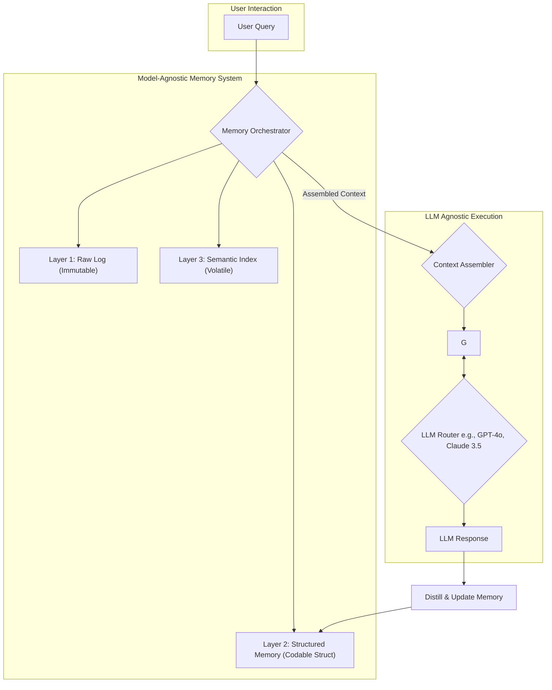

최근 Claude 3.5 Sonnet과 같이 비용 효율적인 고성능 모델이 등장하면서, 특정 LLM에 종속되는 것은 심각한 기술 부채가 되었습니다. 개발팀은 더 빠르고 저렴한 모델로 유연하게 전환하며 최적의 비용-성능 곡선을 찾아야 합니다. 하지만 이 과정에서 심각한 문제가 발생합니다. 바로 모델을 교체하는 순간, 기존 AI 에이전트가 쌓아온 모든 '프로젝트 기억'이 사실상 무력화되는 '컨텍스트 단절' 현상입니다. 기존 모델의 임베딩 벡터에 강하게 결합된 기억은 새로운 모델에게는 의미 없는 노이즈에 가깝기 때문입니다. 이 글은 이러한 모델 종속성의 함정을 피하고, 여러 LLM을 오가면서도 프로젝트의 핵심 기억을 연속적으로 유지하는 '기억 공유 패턴'을 제안합니다.

## 모델 종속적 기억의 함정과 그 비용

대부분의 AI 에이전트의 장기 기억은 대화 기록과 벡터 데이터베이스(Vector DB)에 저장된 임베딩의 조합으로 구현됩니다. 문제는 이 임베딩이 특정 모델(예: OpenAI의 `text-embedding-3-large`)에 의해 생성되었다는 점입니다. 이 벡터들은 해당 모델의 '의미 공간' 내에서만 유효합니다.

만약 에이전트의 LLM을 GPT-4o에서 Claude 3.5 Sonnet으로 교체한다면, 새로운 모델은 기존 OpenAI 임베딩 벡터를 제대로 해석하지 못합니다. 이는 마치 영어로 작성된 도서관의 색인 카드를 프랑스어만 구사하는 사서에게 주는 것과 같습니다. 결과적으로 에이전트는 과거의 학습 내용, 사용자 선호도, 프로젝트의 미묘한 맥락을 모두 잃어버리고 처음부터 다시 학습해야 합니다. 이는 곧 비용 상승과 사용자 경험 저하로 직결됩니다.

이 문제의 근본 원인은 **기억의 '내용'과 '해석 방식(임베딩)'이 분리되지 않고 강하게 결합**되어 있기 때문입니다.

## 프로젝트 기억 공유 패턴: 3-레이어 추상화

모델 교체에 따른 컨텍스트 유실을 방지하기 위해, 기억을 세 개의 레이어로 추상화하여 모델 비종속성을 확보하는 패턴을 적용할 수 있습니다. GeekNews에서 소개된 'memorize'와 같은 프로젝트 아이디어는 이러한 방향성을 제시합니다. 이 패턴의 핵심은 임베딩 자체를 영구적인 기억으로 삼는 것이 아니라, 필요할 때마다 새로운 모델에 맞춰 임베딩을 '재생성'할 수 있는 원본 데이터를 유지하는 것입니다.



### Layer 1: 원본 로그 (Immutable Source of Truth)

모든 상호작용(사용자 입력, 에이전트 응답, 사용된 도구 등)을 가공하지 않은 원본 형태 그대로 저장합니다. 이 레이어는 감사(audit)나 재해 복구, 혹은 미래에 더 발전된 기억 추출 알고리즘을 적용하기 위한 '원천 데이터' 역할을 합니다. 직접적인 컨텍스트 구성에는 거의 사용되지 않지만, 모든 기억의 최종적인 진실 공급원(Source of Truth)이 됩니다.

### Layer 2: 구조화된 기억 (Model-Interpretable Memory)

이것이 패턴의 핵심입니다. LLM과의 상호작용을 통해 얻은 핵심 정보들을 단순 텍스트가 아닌, **구조화된 데이터(JSON, YAML 등)**로 정제하여 저장합니다. 예를 들어, 사용자가 "결제 모듈은 Stripe를 사용하고, API 키는 `sk_test_...`로 설정해줘"라고 말했다면, 이를 다음과 같은 Swift `struct`로 변환하여 저장하는 식입니다.

이 구조화된 데이터는 특정 모델의 임베딩에 종속되지 않으므로, 어떤 LLM이라도 이 정보를 파싱하여 자신의 지식으로 활용할 수 있습니다.

### Layer 3: 의미론적 인덱스 (Re-indexable Semantic Layer)

벡터 DB가 위치하는 곳입니다. 중요한 차이점은 이 레이어를 **휘발성 캐시(volatile cache)**로 취급한다는 점입니다. Layer 2의 구조화된 기억을 바탕으로 현재 활성화된 모델(예: Claude 3.5 Sonnet)의 임베딩 API를 사용하여 벡터를 생성하고 인덱싱합니다. 만약 다른 모델(예: GPT-5)로 교체하기로 결정하면, 이 레이어의 모든 인덱스를 버리고 Layer 2의 원본 데이터를 가져와 새로운 모델의 임베딩 API로 다시 인덱싱하면 됩니다. 이 과정은 비용이 발생하지만, 전체 프로젝트 기억을 잃는 것보다 훨씬 저렴합니다.

## Swift를 활용한 구조화된 기억 구현

iOS 개발자에게 이 패턴은 익숙한 `Codable` 프로토콜을 활용하여 명확하게 구현할 수 있습니다. 에이전트가 파악해야 할 프로젝트의 핵심 요소들을 `struct`로 정의하는 것입니다.

```swift
import Foundation

// 프로젝트의 핵심 설정 및 상태를 정의하는 구조체
struct ProjectMemory: Codable {
    var projectId: String
    var userPreferences: UserPreferences
    var technicalStack: [String: String]
    var apiKeys: [String: String]
    var keyDecisions: [DecisionLog]
    var lastUpdatedAt: Date

    struct UserPreferences: Codable {
        var preferredLanguage: String
        var notificationLevel: String // "verbose" or "silent"
    }

    struct DecisionLog: Codable {
        var date: Date
        var decision: String
        var rationale: String // 왜 그런 결정을 내렸는가
    }
}

// LLM과의 대화 후, 핵심 내용을 추출하여 구조체 인스턴스를 생성/업데이트
func distillMemoryFromInteraction(interactionText: String) -> ProjectMemory? {
    // 이 부분에서 LLM을 호출하여 텍스트로부터 JSON을 추출하거나,
    // 정규 표현식 등을 사용하여 구조화된 데이터를 파싱합니다.
    // 예를 들어, LLM에게 다음 텍스트를 ProjectMemory JSON 형식으로 요약해달라고 요청할 수 있습니다.

    // ... (LLM Function Calling 또는 JSON mode 사용) ...

    // 가상의 JSON 응답
    let jsonResponse = """
    {
        "projectId": "moneyflow-ios",
        "userPreferences": { "preferredLanguage": "Swift", "notificationLevel": "verbose" },
        "technicalStack": { "payment": "Stripe", "analytics": "Firebase" },
        "apiKeys": { "stripe": "sk_test_12345..." },
        "keyDecisions": [
            {
                "date": "2026-06-10T10:00:00Z",
                "decision": "Use Stripe for payment processing",
                "rationale": "User explicitly requested it for its robust API and documentation."
            }
        ],
        "lastUpdatedAt": "2026-06-11T02:00:00Z"
    }
    """
    
    let decoder = JSONDecoder()
    decoder.dateDecodingStrategy = .iso8601
    guard let data = jsonResponse.data(using: .utf8),
          let memory = try? decoder.decode(ProjectMemory.self, from: data) else {
        return nil
    }
    
    return memory
}

// 업데이트된 메모리는 파일(JSON), DB 등에 직렬화하여 저장합니다.
```

이렇게 `Codable`을 통해 직렬화된 JSON 데이터는 Layer 2의 기억 저장소에 보관됩니다. 어떤 LLM 에이전트가 작업을 이어받든, 이 JSON을 파싱하여 즉시 프로젝트의 핵심 상태를 파악할 수 있습니다.

## 트레이드오프 및 대안 분석

이 패턴이 모든 상황에 맞는 해결책은 아닙니다. 장단점을 명확히 이해해야 합니다.

| 평가 기준 | 모델 종속적 기억 (기본 RAG) | 프로젝트 기억 공유 패턴 |
| :--- | :--- | :--- |
| **모델 민첩성** | 매우 낮음. 모델 교체 시 기억 대부분 유실. | **매우 높음**. 모델 교체 시 Layer 3만 재구축하면 됨. |
| **구현 복잡도** | 낮음. 일반적인 RAG 파이프라인. | 높음. 3-레이어 아키텍처 및 기억 정제 로직 필요. |
| **운영 비용** | 낮음. 추가적인 기억 정제/변환 과정 없음. | 중간. LLM을 사용하여 비정형 데이터를 구조화하는 비용 발생. |
| **기억의 정확성** | 중간. 벡터 검색의 확률적 특성에 의존. | **높음**. 구조화된 데이터는 명확하고 모호성이 적음. |

**언제 이 패턴을 사용하지 말아야 하는가?**
- **단순하고 상태가 없는(stateless) 봇:** 짧은 대화나 단일 작업만 처리하는 경우, 이러한 복잡성은 과잉입니다.
- **단일 LLM 생태계에 완전히 종속된 경우:** 앞으로도 계속 OpenAI 모델만 사용할 것이 확실하다면, 추가적인 추상화 계층의 이점이 적습니다. (하지만 이는 위험한 전략일 수 있습니다.)

## `ai-study` 프로젝트에 적용하기

`ai-study`와 같은 위키 기반 프로젝트에 이 패턴을 적용하면, 단순히 문서 내용을 벡터 검색하는 것을 넘어 훨씬 지능적인 에이전트를 구축할 수 있습니다.

예를 들어, 사용자가 "Bitemporal Knowledge Graph 글의 핵심 주장과 Karpathy LLM Wiki 패턴의 차이점을 비교해줘"라고 요청했다고 가정해봅시다.

- **기존 방식:** 두 문서의 내용을 벡터 검색하여 찾은 청크(chunk)들을 LLM 컨텍스트에 넣고 답변을 생성합니다. 모델이 바뀌면 검색 품질이 달라져 답변의 질이 요동칠 수 있습니다.
- **기억 공유 패턴 적용:**
    1. 에이전트는 먼저 Layer 2의 구조화된 기억에서 두 패턴에 대한 `ArticleSummary` 구조체를 찾습니다.
    2. 각 구조체에는 `keyArguments: [String]`, `tradeoffs: { "pros": [], "cons": [] }`, `relatedPatterns: [String]`와 같은 필드가 명확하게 정의되어 있습니다.
    3. 이 구조화된 데이터를 현재 활성화된 LLM(예: Claude 3.5 Sonnet)에 컨텍스트로 제공합니다.
    4. LLM은 이 명확한 정보를 바탕으로 훨씬 더 정확하고 깊이 있는 비교 분석을 생성할 수 있습니다.

모델을 GPT-5로 교체할 경우, 이 `ArticleSummary` 구조체들은 그대로 유지된 채 Layer 3의 벡터 인덱스만 새로 생성하면 되므로, 에이전트의 '문서에 대한 이해도'는 그대로 보존됩니다.

## 자기 점검

- 모델에 종속적인 임베딩을 장기 기억의 핵심으로 사용하는 것의 가장 큰 위험은 무엇이며, 이는 어떤 기술적 부채를 발생시키는가?
- '프로젝트 기억 공유 패턴'에서 Layer 2(구조화된 기억)가 모델 비종속성을 확보하는 데 가장 중요한 역할을 하는 이유는 무엇인가?
- Layer 3(의미론적 인덱스)를 '영구 저장소'가 아닌 '휘발성 캐시'로 취급하는 설계의 장점은 무엇인가?
- 현재 진행 중인 프로젝트(혹은 구상 중인 AI 기능)에 이 3-레이어 기억 아키텍처를 적용한다면, Layer 2의 '구조화된 기억'은 어떤 Swift `struct`로 모델링할 수 있을까?