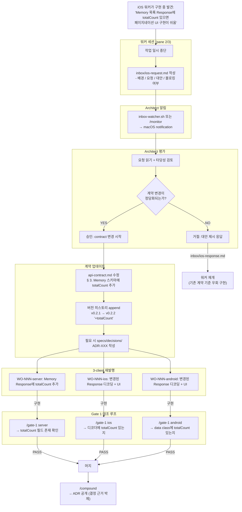

## 한 줄 요약

Flow Map 시리즈 **6편**. iOS 개발자가 회사에서 몸에 익은 "코드가 source of truth" 관성을 벗어나, **마크다운 한 장 (`api-contract.md`) 이 Server · iOS · Android 3-client 를 실시간 동기화하는 구조** 를 "계약 변경 한 건의 여정" 으로 관통한다. Swagger/OpenAPI 없이도 일관성이 유지되는 원리 · Gate 1 의 line-by-line 대조 프로토콜 · 워커가 스펙 변경을 요청하는 inbox 흐름 · iOS 팀에서 쌓은 API 감각과의 매핑을 다룬다.

---

## 갭 / 맥락 — iOS 개발자의 흔한 실패 패턴

3-client 프로젝트(회사에서 흔히 "앱-서버 한 세트") 를 혼자 풀스택으로 할 때 반복되는 실패:

- **"코드가 먼저, 문서가 나중"** → 서버 구현에서 필드명을 바꾸면 iOS·Android 가 각자 추론해서 다르게 구현. 통합 버그는 스테이징에서야 발견
- **OpenAPI/Swagger 에 의존** → 자동 생성 도구가 "있긴 한데" 실제로 동기화 안 됨. 서버 코드 · OpenAPI · 문서 3중 불일치
- **"일단 만들고 보자" iOS 코드** → "Response 에 `createdAt` 있겠지" 추측으로 디코더 작성 → 실제로는 `created_at` → 런타임 디코드 실패
- **필드명 자의적 변경** → "`userId` 가 맞는데 내가 바꾸자" — Server 가 바꾸면 iOS/Android 가 다 깨짐. 연쇄 반응
- **스펙 논의가 대화 로그에만** → 슬랙 DM · Claude 세션 이력 · 로컬 메모 에 흩어진 결정이 코드와 불일치. 2주 후 "왜 이렇게 정했지?" 아무도 모름

**공통 원인**: 계약의 *물리적 위치* 가 불분명. "어디 보면 진짜 스펙이 있지?" 에 바로 답할 수 있는 단일 문서 파일이 없다.

---

## aidy-architect 의 `api-contract.md` 가 학습 재료로 좋은 이유

### 스택 개요

| 요소 | 역할 | iOS 대응 |
|------|------|---------|
| `~/Develop/aidy-architect/specs/api-contract.md` | 3-client 절대 계약 · 270줄 마크다운 | 팀의 "API 스펙 Confluence 페이지" + OpenAPI + `APIProtocol.swift` 를 **한 파일로 통합** |
| `~/Develop/aidy-architect/specs/conventions.md` | 네이밍 · 포맷 규칙 (camelCase · ISO 8601 · 한글 에러 메시지) | swiftlint + 팀 코드 컨벤션 문서 |
| Gate 1 slash command | 워커 코드를 api-contract 와 line-by-line 대조 | PR 리뷰 중 "스펙 확인" 단계 |
| `inbox/{worker}-request.md` | 워커가 스펙 변경 요청하는 비동기 채널 | 슬랙 스레드로 API 변경 논의 — 단, **파일 기반이라 흔적 남음** |

### 왜 이 레포인가

1. **진짜로 동기화가 작동하는 중** — 서버(Kotlin) · iOS(Swift/TCA) · Android(Kotlin/Compose) 세 구현이 한 마크다운을 기준으로 정렬
2. **270줄 수준의 단일 문서** — LLM 컨텍스트 한 번에 흡수 가능. OpenAPI 3000줄 YAML 과 대비됨
3. **변경 이력 + 버전** — 파일 하단에 v0.1 → v0.2.1 히스토리 명시. 한 줄 히스토리가 왜 그 시점에 그렇게 바뀌었는지 추적 가능
4. **실제 Gate 리뷰 기록** — `gates/reviews/gate-1-WO-004-server.md` 같은 실측 로그로 "어떻게 대조했는지" 를 볼 수 있음
5. **워커 스펙 변경 요청 사례** — inbox 메시징으로 계약이 진화해온 실제 궤적이 남아 있음

---

## 1단계: "계약 변경 한 건의 여정" 따라가기

### iOS 워커가 'Response에 totalCount 필드 필요합니다' 라고 제안했을 때 일어나는 일



### 각 단계가 하는 일 (한 줄씩)

| 단계 | 역할 | iOS 팀 대응 |
|------|------|-----------|
| **iOS 워커가 중단 + inbox 작성** | 임의 스펙 변경 금지 — 요청 경로 사용 | 팀에서 "API 변경 필요" 슬랙 → PM/Tech Lead 컨펌 |
| **Architect 평가** | "정말 필요한가 / 대안은 / 3-client 영향" 종합 판단 | Tech Lead + PM 이 스펙 변경 허가 여부 결정 |
| **api-contract.md 수정 + 버전 bump** | 계약 자체가 업데이트. 파일 히스토리에 기록 | Confluence API 페이지 업데이트 + 히스토리 작성 |
| **3 WO 재발행** | server/ios/android 에 각각 WO 생성 | PM 이 iOS/Android/Server 티켓 3장 발행 |
| **Gate 1 line-by-line** | 각 구현이 "새 계약" 과 필드 · 타입 · 에러 코드 일치하는지 확인 | 시니어 PR 리뷰어가 "스펙대로 구현됐는지" 대조 |
| **3 머지 + Compound** | 머지 후 결정 근거 ADR 로 박제 | 스프린트 후 아키텍처 결정 Confluence 박제 |

> 💡 **핵심 관찰**: 이 흐름은 얼핏 느려 보이지만 실측상 **10분 이내** 종료. 그 대신 3-client 가 **항상 같은 계약을 구현한다는 보장** 이 얻어진다. "빠르게 서버만 바꾸고 iOS 가 알아서 맞추기" 는 당장은 빠르지만 통합 버그 · 스테이징 수정 비용이 훨씬 큼.

---

## 2단계: 관심사별 훑기

### `api-contract.md` 의 구조 (실제 270줄 기준)

| 섹션 | 내용 | iOS 팀 대응 |
|------|------|-----------|
| **Base** | Base URL · Content-Type · Auth Header 규약 | `APIClient.baseURL` · default headers |
| **§ 1. Auth** | signup/login Request·Response + 에러 코드 | `AuthAPI.swift` + 에러 매핑 |
| **§ 2. Chat** | chat 전송 + history. `memoriesExtracted` 추출 스펙 | `ChatAPI.swift` + `ChatResponse` 디코더 |
| **§ 3. Memory** | CRUD + 카테고리 요약 · 검색 | `MemoryAPI.swift` · `MemoryItem` 구조체 |
| **§ 4. People** | 관계 메모리 + feedback 엔드포인트 + `personDetail` 확장 | `PeopleAPI.swift` + rich response 타입 |
| **§ 5. Health** | `/api/health` 단순 조회 | `HealthAPI.swift` |
| **Memory Categories** | enum 목록 (schedule/finance/work/…) — 절대 고정 | `enum MemoryCategory` Swift |
| **Error Codes** | 전체 에러 코드 + HTTP + retryable 플래그 | `APIError` + 재시도 UI 매핑 |
| **버전 히스토리** | v0.1 → v0.2.1 각 변경 이유 | 팀 CHANGELOG 수준 |

### 계약 문서의 *품질 기준*

단순히 있다 없다가 아니라, 다음 항목을 모두 충족해야 "작동하는" 계약:

1. **Request 예시 실제 값** — 스키마만 쓰지 말고 `{"message": "오늘 점심 12000원 썼어"}` 같은 *완전한 예시 JSON* 포함
2. **Response 예시 실제 값** — 빈 배열, null 케이스, 여러 항목 케이스 전부
3. **Error 응답 완전 명세** — 각 에러의 *정확한 문구* + 코드 (한글 메시지 포함)
4. **Enum 값의 완전한 목록** — "카테고리" 같은 필드는 모든 가능한 값이 표로
5. **Retryable 플래그** — 클라이언트가 "이거 재시도 버튼 보여줄지" 를 판단할 단일 진실
6. **Auth 요구 여부** — 엔드포인트별 JWT 필수 · 선택 명시
7. **버전 히스토리** — 변경이 언제 · 왜 일어났는지 한 줄씩

### Swagger/OpenAPI 와의 비교

| 항목 | api-contract.md | OpenAPI 3.x |
|------|----------------|------------|
| 파일 크기 | ~270 줄 | ~3000 줄 (대부분 boilerplate) |
| LLM 컨텍스트 부담 | 한 번에 흡수 가능 | 통째 넣기 과잉 |
| 사람 읽기 편의 | 높음 (마크다운 렌더) | 낮음 (YAML raw) |
| 머신 파싱 | 약함 (정규식) | 강함 (도구 지원) |
| 코드 자동 생성 | 안 됨 | Swagger Codegen |
| 변경 추적 | git diff | git diff + UI |
| **LLM 워커 친화도** | **최고** | 낮음 |

**핵심 통찰**: AI 에이전트 시대에는 **LLM 친화적 포맷** 이 최상위 제약. OpenAPI 의 머신 파싱 이점은 LLM 이 그 파싱을 대신 해주는 순간 약해지고, 반대로 OpenAPI 의 장황함은 매 세션 프리픽스 로드 시점에 토큰 비용으로 환산된다.

### 변경 게이트

`api-contract.md` 에 누가 · 언제 · 어떻게 쓸 수 있는지:

```
쓸 수 있는 사람: Architect 단 하나
쓸 수 있는 시점: 워커가 작업 시작 전 (세션 경계)
                  또는 inbox 요청 처리 중
쓸 수 없는 시점: 활성 WO 진행 중 (캐시 무효화 · 3-client 동시 혼란)
쓸 수 없는 사람: 모든 워커 (read-only)
```

### Conventions 문서의 역할

`specs/conventions.md` 는 api-contract 가 *말하지 않는* 수준의 규약:
- 필드명 케이스 (camelCase 고정)
- 날짜 포맷 (ISO 8601 UTC)
- 에러 메시지 언어 (한글)
- ID 타입 (Long 기본)
- 페이지네이션 파라미터 이름 (cursor vs page+size)

api-contract 는 각 엔드포인트의 *구체*, conventions 는 *전체 관통 규칙*. 이 둘이 같이 있어야 워커가 새 필드를 추가할 때도 기존 규약을 자동 따름.

---

## 3단계: iOS 경험을 레버리지 — 비교 매핑표

### 계약 · 구현 · 검증 매핑 (18개)

| aidy 개념 | iOS 팀 경험 | 차이 / 포인트 |
|----------|-----------|-------------|
| **api-contract.md (마크다운)** | OpenAPI YAML + Confluence | LLM 친화 포맷 + 단일 파일 |
| **§ 섹션 구조** | API 엔드포인트별 Confluence 페이지 | 한 파일에 모두 |
| **Request/Response 예시 JSON** | Postman collection + Swagger example | 마크다운 코드블록에 직접 포함 |
| **Error Codes 전체 표** | 에러 핸들링 문서 + enum 정의 | retryable 플래그까지 포함 |
| **Memory Categories 고정 enum** | Swift `enum MemoryCategory` 와 1:1 | 문서가 source, enum 이 구현 |
| **버전 히스토리 섹션** | 팀 API CHANGELOG | 한 파일 하단에 집약 |
| **`conventions.md`** | swiftlint + 팀 코드 컨벤션 문서 | 별도 파일, 전 관통 규칙 |
| **Gate 1 / API contract 대조** | 시니어 PR 리뷰 (스펙 준수 전담) | Architect 가 코드 line-by-line |
| **Gate 2 / 통합** | QA + Staging 통합 테스트 | 빌드 + 크로스 프로젝트 스키마 호환 |
| **`inbox/{worker}-request.md`** | 슬랙 스레드 API 변경 논의 | 파일 기반 · 흔적 남음 · 컨텍스트 격리 |
| **Architect 스펙 승인** | PM/Tech Lead 의 API 변경 재가 | 1인이 3 역할 겸임 |
| **ADR-XXX 박제** | 아키텍처 결정 Confluence 페이지 | 이미 익숙한 패턴 |
| **WO 3장 동시 재발행** | 백엔드/iOS/Android 팀에 티켓 3장 | 한 사람이 다 발행 |
| **워커 자가 검증 grep** | swiftlint 빌드 phase | CLAUDE.md 에 내장된 grep 명령 |
| **스펙 변경 = contract 먼저** | "API 변경 시 Confluence 먼저 수정" 사내 규약 | 강제됨 (워커가 contract 수정 불가) |
| **JWT Bearer 규약** | `AuthClient.swift` 의 토큰 주입 인터셉터 | 동일 패턴 |
| **retryable 에러 코드 플래그** | 에러 → "재시도 버튼 표시" UI 매핑 | 계약 문서에 플래그 포함이 핵심 |
| **Enum 고정 목록** | Swift `enum` 선언 | 문서가 선행, 코드 follow |

### '단방향 계약 흐름' 관점

iOS 에서 TCA/Redux 를 쓰는 이유가 "상태 변경의 단방향화" 라면, aidy 의 계약 흐름도 단방향이다:

```
api-contract 변경 → 3-client 구현 → Gate 1 통과 → 머지
   (역방향 금지)
```

역방향 흐름은 시스템을 무너뜨린다:
- iOS 코드에서 필드를 먼저 바꾸고 api-contract 를 뒤따라 수정 → 서버 · Android 불일치
- 서버 구현을 관찰해서 iOS 가 "추론" 으로 디코딩 → 필드명 하나 바뀌면 전체 깨짐

**단방향성의 본질**: 계약이 먼저 · 구현이 나중. 이 순서가 강제되지 않으면 3-client 독립성이 붕괴.

---

## 4단계: 실전 학습 로드맵 (Week 1~5)

### Week 1: aidy-architect/specs 읽기
- [ ] `api-contract.md` 1회독 (270줄, 20분) — 섹션별 훑기. 세부 디코딩은 안 함
- [ ] `conventions.md` 읽기 (13줄) — 전 관통 규칙 파악
- [ ] 버전 히스토리 섹션 — v0.1 → v0.2.1 각 변경이 무엇이었는지 추적
- [ ] `gates/reviews/gate-1-WO-004-server.md` 읽기 — 실제 Gate 1 이 어떻게 라인별 대조하는지
- [ ] `specs/decisions/005-relationship-memory-architecture.md` 읽기 — ADR 이 어떤 수준의 디테일을 담는지

### Week 2: 본인 프로젝트용 `api-contract.md` 작성 실험
- [ ] 기존 사이드 프로젝트 (예: TODO 앱) 의 API 를 aidy 포맷으로 재작성
- [ ] Base · Auth · Resources · Error Codes · Conventions 5 섹션 완성
- [ ] Request/Response 예시 JSON 에 실제 값 포함
- [ ] Error Codes 표에 retryable 플래그 추가
- [ ] 버전 히스토리 섹션 초기화 (v0.1)

### Week 3: Gate 1 대조 프로토콜 이식
- [ ] aidy-architect `/gate-1` 슬래시 커맨드 파일 읽기 (`.claude/commands/gate-1.md`)
- [ ] 본인 프로젝트의 `.claude/commands/gate-1.md` 초안 작성
- [ ] 서버 코드와 api-contract 를 line-by-line 대조 시험 (1 엔드포인트)
- [ ] FAIL 케이스 연출: 일부러 필드명 다르게 구현 → Gate 1 검출 확인

### Week 4: 워커 자가 검증 grep 내장
- [ ] 각 워커 레포 CLAUDE.md 에 "커밋 전 스펙 대조 grep" 명령 박기
- [ ] 예시: `grep -E "MemoryResponse|MemoryItem" api-contract.md` 로 필드명 존재 확인
- [ ] Pre-commit hook 에 자가 검증 묶기 (행동 레벨 가드)

### Week 5: inbox 메시징 흐름 1회 실전
- [ ] 일부러 "계약이 모호한 WO" 발행 (예: `totalCount` 같은 추가 필드 필요 여부)
- [ ] 워커 세션이 `inbox/{worker}-request.md` 작성하는 흐름 체험
- [ ] Architect 가 `response.md` 작성 → 스펙 수정 → 재발행까지의 루프 1회 실행
- [ ] 총 소요 시간 측정 (목표: 10분 이내)

---

## 자주 막히는 지점

| 증상 | 원인 / 해법 |
|------|-----------|
| api-contract.md 를 자주 읽지 않음 | 워커 CLAUDE.md 에 "시작 전 필수 로딩" 목록에 포함 + 커밋 전 grep 강제 |
| 계약과 코드 불일치 발견 후 "내가 고칠게" 식 습관 | Architect 만 수정 가능 규칙을 **파일 권한 · CLAUDE.md 규약** 양쪽으로 박음 |
| 필드명이 서버/iOS/Android 제각각 | conventions.md 에 case 규칙 명시 (camelCase 고정) + Gate 1 에서 필드명 비교 필수 |
| 에러 코드가 서버와 클라이언트 사이 불일치 | api-contract 의 Error Codes 표가 단일 진실. 코드 string 값까지 대조 |
| `memoriesExtracted` 같은 복잡 필드 누락 | JSON 예시를 "모든 필드 포함" 으로 유지 — partial example 금지 |
| 버전 히스토리 섹션 관리 지침 부재 | 각 contract 변경 시점에 히스토리 한 줄 추가 규칙 (커밋 전 체크) |
| inbox 요청 후 워커가 마냥 대기 | `inbox-watcher.sh` 백그라운드 실행 + 워커 CLAUDE.md 에 "요청 후 응답까지 작업 중단 규약" 명시 |
| 계약 변경 후 워커가 기존 코드 계속 사용 | WO 재발행이 *필수* — 계약만 바뀌고 워커는 알림 없이 지나가면 구현 누락 |
| OpenAPI 나 Swagger 로 자동 생성 유혹 | aidy 모델에선 LLM 이 "자동 생성기" 역할. OpenAPI 없이 마크다운 + Gate 로 충분 |
| 3-client 가 다른 시점에 계약 v1.1 / v1.2 공존 | 버전 bump 시 "모든 WO 완료 후에만" 공개. staging 에서 v 일관성 체크 |
| Auth 헤더가 일부 엔드포인트에 누락 | 엔드포인트별 "Auth 요구 여부" 를 api-contract 표에 명시 (§ 5. Health 외 모두 JWT) |
| 한글 에러 메시지가 섞여 나옴 | conventions.md 에 "에러 메시지 = 한글, 코드 = 영문 SCREAMING_SNAKE" 고정 |

---

## AI Agent Directive

### Trigger
- 3-client (웹/iOS/Android) 프로젝트를 시작할 때
- 팀 규모가 작아서 OpenAPI 파이프라인 도입이 과잉일 때
- "API 스펙을 어디에 쓰지?" 결정 단계
- LLM 워커 (Claude Code 세션) 를 여러 플랫폼에 동시 투입할 때
- "계약과 코드가 자꾸 어긋난다" 증상이 반복될 때

### Prerequisites
- [Flow Map 4편 — aidy-architect 멀티 세션 오케스트레이션](/wiki/harness-engineering/architect-flow-map-via-aidy-architect) — Architect-Worker 모델 이해
- [Aidy Journal 000 — Spec-Driven Multi-Agent Orchestration 베이스라인](/wiki/harness-engineering/aidy-journal-000-architect-worker-baseline) — 방법론 박제
- [Context Engineering 기초](/wiki/context-engineering/context-engineering-fundamentals)
- [CLAUDE.md Design Patterns](/wiki/context-engineering/claude-md-design-patterns) — 워커 CLAUDE.md 의 "시작 전 로딩" 섹션 패턴

### Actionable Steps
1. **마크다운 계약 초안 작성** — OpenAPI 를 역으로 간략화하지 말고, 처음부터 마크다운 섹션 · JSON 예시 · 에러 표로 시작
2. **버전 히스토리 섹션 초기화** — v0.1 날짜 + "초기 스펙" 한 줄. 앞으로 모든 변경을 여기에 append
3. **Error Codes 표에 retryable 플래그** — 클라이언트 UI 매핑의 단일 진실
4. **conventions.md 별도 분리** — case · 날짜 포맷 · 에러 언어 · ID 타입 · 페이지네이션 네이밍
5. **워커 CLAUDE.md 에 "시작 전 필수 로딩"** — api-contract · conventions · WO 순서 고정
6. **워커 CLAUDE.md 에 자가 검증 grep** — 커밋 전 스펙 필드 존재 확인
7. **Gate 1 슬래시 커맨드 작성** — "line-by-line 대조" 프로시저 명시 (요약 금지 · 모든 필드 · 에러 코드)
8. **inbox 메시징 루트 셋업** — `inbox/{worker}-request.md` + `inbox-watcher.sh` 백그라운드
9. **첫 스펙 변경 루프 1회 dry-run** — 실제로 inbox → Architect 평가 → contract 수정 → WO 재발행 1회 체험

### Anti-patterns
- **서버 구현 먼저 → 계약 따라감** — 계약 단방향성 붕괴. 반드시 contract 가 선행
- **워커가 직접 api-contract 수정** — 계약 권한 분산 → 3-client 독립 관제 불가
- **JSON 예시에 partial 값** — "...생략" 같은 표기는 구현 모호성 유발. 완전한 예시만
- **Error Codes 표 누락 · 불완전** — 클라이언트 에러 UI 매핑의 기준 잃음
- **OpenAPI 생성 파이프라인 도입** (소규모에서) — 과잉. 마크다운 + Gate 로 충분
- **스펙 변경 후 WO 재발행 누락** — 3-client 중 일부만 업데이트됨
- **retryable 플래그 누락** — 재시도 UI 와 스펙 분리 → 에러 처리 불일치
- **활성 WO 중 api-contract 수정** — 캐시 무효화 + 3-client 혼란. 세션 경계에서만

---

## 다음 학습 연결

- [Flow Map 4편 — Architect 멀티 세션 오케스트레이션](/wiki/harness-engineering/architect-flow-map-via-aidy-architect) — 계약이 사용되는 WO 라이프사이클
- [Aidy Journal 000 — Baseline](/wiki/harness-engineering/aidy-journal-000-architect-worker-baseline) — Gate 검증 의 전체 상위 맥락
- [Backend Flow Map](/wiki/backend-ai/backend-flow-map-via-aidy-server) · [iOS Flow Map](/wiki/ios-ai/ios-flow-map-via-aidy-ios) · [Android Flow Map](/wiki/android-ai/android-flow-map-via-aidy-android) — 계약이 3-client 구현에서 어떻게 변환되는지
- [Context Engineering 기초](/wiki/context-engineering/context-engineering-fundamentals) — 왜 LLM 친화적 포맷이 source-of-truth 로 유리한가
- [Context Scaling 3-레이어 아키텍처](/wiki/context-engineering/context-scaling-3-layer-architecture) — api-contract.md 는 Layer 1 의 전형 · cache_control 1순위
- (예정) Flow Map 7편 — 테스트 전략: 계약을 어떻게 테스트로 바꾸는가

---

## 출처 / 검증 메모

- 스펙: `~/Develop/aidy-architect/specs/api-contract.md` (270줄, v0.2.1)
- 네이밍: `~/Develop/aidy-architect/specs/conventions.md` (13줄)
- Gate 예시: `~/Develop/aidy-architect/gates/reviews/gate-1-WO-004-server.md`
- ADR 샘플: `~/Develop/aidy-architect/specs/decisions/005-relationship-memory-architecture.md`
- Architect 규약: `~/Develop/aidy-architect/CLAUDE.md` — "이 세션은 설계자다" 규칙
- 시리즈 기획: `~/Develop/ai-study/docs/series-flow-map-for-ios-devs.md`
