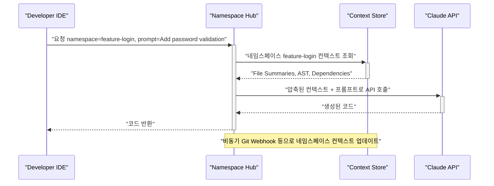

slug: claude-ns-hub-stateful-context-optimization

> **이름에 대한 노트**: 이 글의 `ns-hub`(namespace hub)는 특정 상용 제품이 아니라, 컨텍스트를 네임스페이스 단위로 영속화하는 *설계 패턴*을 가리키는 가칭이다. 같은 발상의 실제 사례로는 Andrew Ng 팀의 [Context Hub](https://github.com/andrewyng/context-hub)(코딩 에이전트에 최신 API 문서를 on-demand로 주입), Anthropic의 [프롬프트 캐싱](https://platform.claude.com/docs/en/build-with-claude/prompt-caching)이 있다. 코드 예시의 모델 ID(`claude-3-opus-20240229` 등)도 패턴 설명용 플레이스홀더이며, 실제 적용 시에는 현재 사용 중인 최신 모델 ID로 교체해야 한다.

AI 코딩 에이전트의 반복적인 API 호출 비용은 프로젝트의 숨겨진 기술 부채가 되고 있습니다. 개발자가 새로운 작업을 지시할 때마다 에이전트는 프로젝트의 전체 구조, 코딩 컨벤션, 핵심 의존성을 '처음부터 다시' 학습합니다. 이는 매일 아침 프로젝트 전체를 새로 브리핑받는 신입 개발자와 일하는 것과 같으며, 이 과정에서 소모되는 토큰은 고스란히 비용으로 청구됩니다. Opus 급 고성능 모델의 경우, 이 '컨텍스트 재설정' 비용은 무시할 수 없는 수준에 이릅니다.

네임스페이스 허브 패턴은 이러한 문제를 해결하기 위한 아키텍처 접근법입니다. 매 요청마다 컨텍스트를 일회성 페이로드(payload)로 취급하는 대신, 프로젝트의 특정 상태를 '네임스페이스(namespace)'라는 논리적 단위로 묶어 영속화하고 중앙에서 관리하는 상태 저장(Stateful) 접근법을 제안합니다. 이는 AI 에이전트와의 상호작용 패러다임을 바꾸어, 컨텍스트를 일회용품이 아닌 재사용 가능한 자산으로 전환하는 전략입니다.

## 핵심 아이디어: 상태 비저장(Stateless)에서 상태 저장(Stateful)으로

기존의 AI 에이전트 연동 방식은 대부분 상태 비저장(Stateless)입니다. 클라이언트(IDE 플러그인 등)가 사용자의 요청과 함께 관련 파일들의 내용을 조합하여 거대한 프롬프트를 만들어 API를 호출하면, LLM은 이 정보를 바탕으로 응답을 생성합니다. 이 방식은 구현이 간단하지만, 다음과 같은 구조적 비효율을 가집니다.

-   **매번 반복되는 컨텍스트 전송**: 파일 A, B, C가 필요한 작업을 10번 수행하면, A, B, C의 내용은 10번 전송되어 매번 토큰 비용이 발생합니다.
-   **클라이언트의 과도한 책임**: 어떤 파일이 관련 있는지 판단하고 조합하는 책임이 전적으로 클라이언트에 있어, 컨텍스트 관리 로직이 복잡해집니다.

네임스페이스 허브 패턴은 이 구조를 뒤집습니다. '허브'라는 중앙 관리형 서비스를 도입하여 컨텍스트를 상태 저장(Stateful) 방식으로 관리합니다.

-   **네임스페이스(Namespace)**: 특정 작업 단위(예: 피처 개발, 버그 수정)에 필요한 컨텍스트의 집합. 여기에는 파일 경로, 요약된 내용, 의존성 그래프, 아키텍처 문서 등이 포함될 수 있습니다.
-   **허브(Hub)**: 이 네임스페이스들을 생성, 관리, 업데이트하고, 요청이 들어오면 적절한 네임스페이스의 컨텍스트를 LLM에 주입하는 중앙 서비스입니다.

클라이언트는 더 이상 방대한 파일 내용을 보내는 대신, `namespace-id`와 간단한 지시사항만 허브에 전달합니다.



이 아키텍처는 LLM을 매 요청 독립적인 텍스트 생성기로 다루던 방식에서, 누적된 상태를 유지하는 장기 실행 컴포넌트로 다루는 방향으로 옮겨갑니다.

## 비용 절감의 3가지 핵심 원리

이 패턴이 토큰 비용을 줄이는 원리는 크게 세 가지입니다.

### 1. 컨텍스트 중복 제거 (Context Deduplication)
가장 직접적인 비용 절감 요소입니다. `feature-login` 네임스페이스가 한번 생성되면, 클라이언트는 해당 기능과 관련된 10개의 파일을 매번 전송할 필요 없이 `namespace: "feature-login"`이라는 참조자만 보내면 됩니다. 허브가 이전에 저장된 컨텍스트를 재사용하므로, 반복적인 입력 토큰 비용이 줄어듭니다.

여기서 핵심은 "허브가 재사용한다"는 말의 실제 메커니즘입니다. 단순히 서버 메모리에 컨텍스트 문자열을 들고 있다가 매번 프롬프트 앞에 붙여 보내는 것만으로는 **API 입력 토큰 비용이 그대로 발생**합니다. 진짜 절감은 동일한 컨텍스트 접두부에 Anthropic 프롬프트 캐싱을 거는 순간 일어납니다(아래 2번 참조). 즉 "중복 제거"는 (a) 클라이언트→허브 네트워크 전송량 감소와 (b) 허브→Claude 캐시 적중에 의한 입력 토큰 과금 감소, 두 층위로 나눠 봐야 정확합니다.

### 2. 사전 연산 및 캐싱 (Pre-computation & Caching)
허브는 네임스페이스가 생성되거나 업데이트될 때, 비용이 많이 드는 컨텍스트 처리 작업을 미리 수행할 수 있습니다.
-   **파일 요약**: 전체 소스 코드를 보내는 대신, 각 파일의 역할과 주요 함수를 요약한 내용을 미리 생성해 둡니다.
-   **임베딩 및 인덱싱**: RAG(Retrieval-Augmented Generation)를 위해 코드베이스를 벡터 임베딩하여 로컬 벡터 스토어에 저장해 둡니다.
-   **의존성 그래프 생성**: 심볼 간의 호출 관계를 분석하여 그래프를 만들어 두면, 특정 함수 변경 시 영향 범위를 파악하는 데 필요한 토큰을 최소화할 수 있습니다.

이 사전 연산 캐싱은 두 층위로 작동합니다.

- **애플리케이션 캐시(허브 자체)**: 파일 요약, 임베딩, 의존성 그래프 같은 *재료*를 Redis 등에 저장해 두는 것. 컨텍스트를 "다시 만드는" 연산을 생략합니다.
- **모델 입력 캐시(Anthropic 프롬프트 캐싱)**: 만들어진 컨텍스트를 실제 API 호출에 태울 때 `cache_control` 브레이크포인트를 걸어, *동일한 토큰 접두부에 대한 모델 입력 과금*을 줄이는 것.

Anthropic 프롬프트 캐싱의 구체적 수치(2026-06 기준, 공식 문서 확인):

- **캐시 읽기(cache read)**: 기본 입력 토큰가의 **0.1배** — 캐시가 적중하면 그 구간 입력 비용이 약 90% 절감.
- **캐시 쓰기(cache write)**: 5분 TTL은 기본가의 **1.25배**, 1시간 TTL은 **2배**.
- **최소 캐시 길이**: Sonnet은 **1,024 토큰**, Opus·Haiku는 **4,096 토큰** 이상이어야 캐시 대상이 됨.
- **검증법**: 응답 `usage`의 `cache_creation_input_tokens`와 `cache_read_input_tokens`가 둘 다 0이면 캐시가 걸리지 않은 것.

허브 패턴이 매력적인 이유가 여기 있습니다. 네임스페이스 컨텍스트는 (a) 길이가 길고(최소 캐시 길이 충족 쉬움) (b) 요청 간 안정적(접두부 바이트가 변하지 않아 적중률 높음)이라, 프롬프트 캐싱이 가장 잘 먹는 형태입니다. 다만 캐시 쓰기는 기본가보다 비싸므로, **재사용 횟수가 캐시 쓰기 프리미엄을 상쇄할 만큼 많아야** 순이익이 납니다. 단발성 네임스페이스는 오히려 손해입니다(트레이드오프 섹션 참조).

### 3. 지능적 컨텍스트 압축 (Intelligent Context Compression)
허브는 네임스페이스의 모든 컨텍스트를 무조건 주입하는 대신, 현재 요청에 가장 관련성이 높은 정보만 선별하여 LLM에 전달할 수 있습니다. 예를 들어, "UI 레이아웃을 수정해줘"라는 요청에는 SwiftUI 관련 파일들의 요약본을 우선적으로 포함하고, 데이터베이스 스키마 정보의 우선순위는 낮추는 식입니다. 이 선별 과정 자체를 Claude Haiku와 같은 저렴한 모델에게 위임하여 비용 효율을 극대화할 수도 있습니다.

## 기술적 구현 전략 및 트레이드오프

### API 설계 (Swift & Python)
iOS 개발자(클라이언트)와 허브(서버) 간의 상호작용은 다음과 같이 설계할 수 있습니다. Swift 클라이언트는 간단한 요청 모델을 정의하고, Python 기반의 허브는 이를 받아 처리합니다.

**Swift (Client-side Request)**
```swift
// iOS 개발 환경(Xcode 플러그인 등)에서 허브로 보낼 요청 구조체
struct AIHubRequest: Encodable {
    let namespace: String // 예: "feature/onboarding-ui"
    let prompt: String
    let model: String? // "claude-3-opus-20240229" 등. nil이면 허브 기본값 사용
    let maxTokens: Int?

    enum CodingKeys: String, CodingKey {
        case namespace, prompt, model
        case maxTokens = "max_tokens"
    }
}

// 사용 예시
let request = AIHubRequest(
    namespace: "feature/onboarding-ui",
    prompt: "Add a progress indicator to the main view.",
    model: "claude-3-sonnet-20240229", // 비용 절약을 위해 Sonnet 사용
    maxTokens: 2048
)

// 이 request 객체를 JSON으로 인코딩하여 Hub의 API 엔드포인트로 전송
```

**Python (FastAPI Hub Endpoint)**
```python
# 네임스페이스 허브 서버의 API 엔드포인트 예시
import os
from fastapi import FastAPI
from pydantic import BaseModel
import anthropic
import redis

app = FastAPI()
# Redis를 사용하여 네임스페이스별 컨텍스트 캐시
redis_client = redis.Redis(decode_responses=True)
# API 키는 하드코딩 금지 — 환경변수/시크릿 매니저에서 로드
client = anthropic.Anthropic(api_key=os.environ["ANTHROPIC_API_KEY"])

class AIHubRequest(BaseModel):
    namespace: str
    prompt: str
    model: str = "claude-haiku-4-5"  # 기본 모델은 저비용 Haiku (실제 ID로 교체)
    max_tokens: int = 2048

@app.post("/v1/chat")
async def handle_chat(request: AIHubRequest):
    # 1. 네임스페이스 ID로 캐시된 컨텍스트 조회
    cached_context = redis_client.get(f"namespace:{request.namespace}")
    if not cached_context:
        # 캐시가 없으면 컨텍스트를 빌드 (예: git clone, 파일 요약, 의존성 그래프)
        # 이 예시에서는 간단한 문자열로 대체
        cached_context = f"Project Context for {request.namespace}..."
        redis_client.set(f"namespace:{request.namespace}", cached_context)

    # 2. Claude API 호출 — 안정적 컨텍스트 접두부에 cache_control 브레이크포인트.
    #    동일 네임스페이스 재요청 시 이 블록은 캐시 read(기본가 0.1배)로 과금.
    resp = client.messages.create(
        model=request.model,
        max_tokens=request.max_tokens,
        system=[{
            "type": "text",
            "text": cached_context,
            "cache_control": {"type": "ephemeral"},  # 캐시 브레이크포인트
        }],
        messages=[{"role": "user", "content": request.prompt}],
    )
    # usage.cache_read_input_tokens 로 캐시 적중 여부 검증 가능
    return {"response": resp.content, "usage": resp.usage.model_dump()}
```

### 비교: 요청별 컨텍스트 vs. 네임스페이스 허브

| 특징 | 요청별 컨텍스트 (Stateless) | 네임스페이스 허브 (Stateful) |
| :--- | :--- | :--- |
| **컨텍스트 조립** | 클라이언트 측에서 매 요청 시 수행 | 서버(허브) 측에서 네임스페이스 업데이트 시 1회 수행 |
| **토큰 비용** | 높음 (전체 컨텍스트 반복 전송) | 낮음 (컨텍스트 참조 및 델타(delta)만 전송) |
| **응답 지연 시간** | 높음 (컨텍스트 수집 시간 + LLM 추론 시간) | 낮음 (사전 연산된 컨텍스트 사용) |
| **상태 관리 주체** | 클라이언트 (또는 상태 없음) | 서버 (허브) |
| **적합한 사용 사례** | 단발성 질문, 간단한 스크립트 수정 | 복잡한 프로젝트 내 연속적인 코딩 세션 |
| **인프라 복잡성** | 낮음 (직접 API 호출) | 높음 (허브 서비스 구축 및 유지보수 필요) |

### 트레이드오프: 언제 이 패턴을 사용하면 안 되는가?

이 패턴은 강력하지만 만병통치약은 아닙니다.

1.  **인프라 복잡성 증가**: 상태 저장 서비스를 구축하고 운영하는 것은 직접 API를 호출하는 것보다 훨씬 복잡합니다. 배포, 모니터링, 장애 대응에 대한 추가 비용이 발생합니다.
2.  **컨텍스트 동기화 문제**: 허브에 캐시된 컨텍스트는 실제 소스 코드의 최신 상태를 반영하지 못할 수 있습니다(Stale Cache). Git 커밋에 대한 웹훅(webhook), 파일 시스템 감시(watching) 등 컨텍스트를 최신으로 유지하기 위한 동기화 메커니즘을 정교하게 설계해야 합니다.
3.  **단순 작업의 오버헤드**: 프로젝트와 무관한 간단한 질문이나 코드 조각 생성을 위해서는 네임스페이스를 생성하고 관리하는 비용이 더 큽니다. 이런 경우에는 기존의 Stateless 방식이 더 효율적입니다.

## 적용 사례: iOS 프로젝트의 네임스페이스 설계

iOS 앱 `aidy-ios` 프로젝트에 이 패턴을 적용한다면 다음과 같은 네임스페이스를 설계해 볼 수 있습니다.

-   `namespace: feature/swiftui-refactor`:
    -   **포함된 컨텍스트**: 모든 SwiftUI `View` 파일, 관련 `ViewModel`들, 디자인 시스템 가이드 문서 요약, `Human Interface Guidelines`의 관련 부분.
    -   **작업 예시**: "기존 UIKit 뷰를 SwiftUI로 마이그레이션해줘." 클라이언트는 이 한 줄과 네임스페이스 ID만 보내면, 허브가 필요한 모든 UI 컨텍스트를 주입합니다.

-   `namespace: bugfix/coredata-concurrency`:
    -   **포함된 컨텍스트**: Core Data 스키마(`xcdatamodeld`), 데이터 모델 클래스, Repository 패턴 구현체, Apple의 Core Data 동시성 관련 공식 문서 요약.
    -   **작업 예시**: "백그라운드 스레드에서 데이터 저장 시 발생하는 크래시를 수정해줘." 에이전트는 동시성 문제 해결에 특화된 컨텍스트를 즉시 제공받아 정확도를 높일 수 있습니다.

개발자는 두 작업 사이를 전환할 때, 로컬에서 수십 개의 파일을 열어보거나 에이전트에게 처음부터 다시 설명할 필요 없이, 단순히 요청에 포함된 네임스페이스 ID만 변경하면 됩니다. 이는 컨텍스트 스위칭 비용을 획기적으로 줄여줍니다.

## 자기 점검

- 네임스페이스 허브와 같은 상태 저장(Stateful) 접근법이 기존의 상태 비저장(Stateless) 방식에 비해 비용을 절감하는 가장 큰 이유는 무엇인가요? (힌트: 프롬프트 캐싱 캐시 read = 기본가 0.1배)
- 상태 저장 컨텍스트 관리의 가장 큰 기술적 난제인 'Stale Cache' 문제를 해결하기 위해 어떤 방법을 고려할 수 있나요?
- 모든 AI 에이전트 작업에 네임스페이스 허브 패턴을 적용하는 것이 항상 효율적일까요? 그렇지 않다면 어떤 경우에 기존 방식이 더 나을 수 있나요?
- 현재 참여하고 있는 iOS 프로젝트가 있다면, 어떤 기준으로 작업을 나누어 '네임스페이스'를 설계하시겠습니까? (예: 기능 단위, 아키텍처 레이어 단위 등)