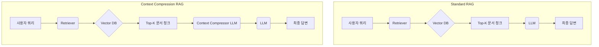

## 서론: 왜 Context Compression이 중요한가?

대규모 언어 모델(LLM)은 현대 AI 시스템의 핵심 구성 요소로 자리 잡았지만, 그 강력함 뒤에는 항상 고려해야 할 한계점이 존재합니다. 바로 '컨텍스트 윈도우(Context Window)'의 제약, 이로 인한 '비용'과 '지연 시간(Latency)' 문제입니다. 아무리 긴 컨텍스트 윈도우를 가진 최신 모델이라 할지라도, 실제 서비스에서는 다음과 같은 문제에 직면하게 됩니다.

*   **토큰 한계:** 모든 LLM은 한 번에 처리할 수 있는 최대 토큰 수에 제한이 있습니다. 이 한계를 넘어서면 모델은 오류를 반환하거나, 중요한 정보를 누락할 수 있습니다.
*   **비용:** 대부분의 LLM API는 입력 및 출력 토큰 수에 따라 요금이 부과됩니다. 컨텍스트가 길어질수록 비용은 비례하여 증가합니다.
*   **지연 시간:** 컨텍스트가 길수록 LLM이 정보를 처리하고 응답을 생성하는 데 더 많은 시간이 소요됩니다. 이는 실시간 사용자 경험이 중요한 iOS/프론트엔드 애플리케이션에서 치명적일 수 있습니다.
*   **노이즈와 정확도:** 너무 많은 정보를 컨텍스트로 제공하면 LLM이 핵심 정보를 파악하지 못하고 '탈선'하거나 관련 없는 정보에 집중하여 응답의 정확도가 떨어질 수 있습니다.

특히 iOS 및 프론트엔드 개발자들이 AI를 실무에 적용하려는 경우, 이러한 문제는 더욱 두드러집니다. 사용자 인터페이스의 반응성, 모바일 환경의 네트워크 제약, 그리고 예산 효율성은 늘 핵심 고려사항이기 때문입니다. 이러한 문제들을 해결하기 위한 핵심 전략 중 하나가 바로 **Context Compression**입니다. Context Compression은 LLM에 전달되는 컨텍스트를 효율적으로 축소하여 위에서 언급한 한계점들을 극복하고, 더욱 견고하고 효율적인 AI 시스템을 구축하는 기술입니다.

## Context Compression의 핵심 개념

Context Compression은 LLM에 전달되는 입력 컨텍스트(프롬프트, 문서, 대화 기록 등)의 양을 줄이면서도, 추론에 필요한 핵심 정보를 최대한 보존하는 과정을 의미합니다. 그 목표는 다음과 같습니다.

*   **비용 절감:** 불필요한 토큰 전송을 줄여 API 호출 비용을 최소화합니다.
*   **추론 속도 향상:** LLM이 처리해야 할 정보의 양이 줄어들어 응답 생성 시간이 단축됩니다. 이는 사용자 경험에 직접적인 영향을 미칩니다.
*   **토큰 한계 극복:** 긴 문서나 대화 기록도 LLM의 컨텍스트 윈도우 내로 효율적으로 압축하여 처리할 수 있게 합니다.
*   **정확도 개선:** 관련 없는 정보(노이즈)를 제거하여 LLM이 핵심 질문에 더 집중하고 정확한 답변을 생성하도록 돕습니다.

Context Compression은 단순히 텍스트를 줄이는 것을 넘어, 주어진 태스크와 사용자 의도에 맞춰 정보를 선별하고 재구성하는 지능적인 과정입니다.

## 주요 Context Compression 기법 및 패턴

Context Compression은 다양한 기법을 통해 구현될 수 있으며, 시스템의 목적과 데이터 특성에 따라 적절한 방법을 선택해야 합니다.

### 1. 텍스트 요약 (Summarization)

가장 직관적인 Context Compression 기법입니다. 긴 문서, 대화 기록, 기사 등을 핵심 내용으로 요약하여 컨텍스트 길이를 줄입니다.

*   **LLM 기반 재귀 요약 (Recursive Summarization):** LLM 자체를 사용하여 텍스트 청크를 요약하고, 그 요약본들을 다시 요약하는 방식으로 긴 텍스트 전체를 압축합니다. 긴 대화 기록이나 보고서 요약에 유용합니다.
*   **추출 요약 (Extractive Summarization):** 원문에서 가장 중요하다고 판단되는 문장이나 구절을 그대로 추출하여 요약합니다. 핵심 정보의 손실을 최소화할 수 있습니다.
*   **사례:** 복잡한 고객 서비스 챗봇에서 이전 대화 기록이 너무 길어질 경우, LLM이 최근 10턴의 대화와 이전 대화의 '압축 요약본'을 함께 보고 응답을 생성하도록 할 수 있습니다.

### 2. 불필요 정보 필터링 및 가지치기 (Filtering & Pruning)

컨텍스트 내에서 현재 태스크와 관련 없는 정보를 제거하여 노이즈를 줄이고 길이를 단축하는 기법입니다.

*   **정적 프롬프트 최적화:** 'You are a helpful assistant'와 같은 고정 프롬프트 템플릿 내에서도 불필요한 수식어나 반복 문구를 제거하여 토큰을 절약합니다.
*   **채팅 기록의 관련성 기반 필터링:** 특정 세션의 대화 기록이 많을 때, 현재 사용자의 질문과 의미론적으로 가장 유사한 이전 대화 턴(turn)만 선별하여 LLM에 제공합니다.
*   **사례:** 제품 리뷰 요약 시, '이 제품은 포장이 깔끔해요'와 같이 제품 기능과 무관한 리뷰는 필터링하거나, 동일한 내용의 반복적인 문구는 제거하여 핵심 피드백만 남깁니다.

### 3. 검색 증강 생성(RAG)에서의 Context Compression

RAG(Retrieval-Augmented Generation) 시스템은 외부 지식 베이스에서 관련 정보를 검색하여 LLM에 제공하는 강력한 패턴입니다. Context Compression은 RAG 시스템의 효율성과 정확도를 극대화하는 데 필수적인 역할을 합니다.

일반적인 RAG 파이프라인은 사용자 쿼리를 기반으로 외부 지식 베이스(예: 벡터 데이터베이스)에서 관련 문서 청크(chunk)를 검색합니다. 하지만 검색된 모든 청크가 LLM의 컨텍스트 윈도우에 적합하거나, 모두가 사용자 질문에 동일하게 관련성이 높은 것은 아닙니다. 여기서 Context Compression이 빛을 발합니다.

**Retrieve 후 압축 (Post-Retrieval Compression):**
검색된 문서 청크들을 LLM에 전달하기 전에 한 번 더 압축하는 단계입니다. 이 방법은 RAG 시스템에서 가장 강력하고 실용적인 Context Compression 패턴 중 하나입니다.

*   **원리:** 검색된 여러 문서 청크들을 하나의 LLM에 입력하여 사용자 질문과 가장 관련성이 높은 부분만 추출하거나, 핵심 내용을 요약하도록 지시합니다. 이 "압축기(Compressor)" LLM은 최종 답변을 생성할 LLM에게 최적화된 컨텍스트를 제공합니다.
*   **장점:**
    *   **정확도 향상:** 불필요한 정보를 제거하여 최종 LLM이 핵심에 집중하도록 돕습니다.
    *   **비용 및 속도 최적화:** 최종 LLM으로 가는 컨텍스트가 크게 줄어듭니다.
    *   **토큰 한계 회피:** 많은 수의 검색된 문서를 효율적으로 처리할 수 있게 합니다.

| 특징               | 일반 RAG                                        | Context Compression RAG (Post-Retrieval)                 |
| :----------------- | :---------------------------------------------- | :------------------------------------------------------- |
| **컨텍스트 구성**  | 검색된 Top-K 문서 청크를 그대로 LLM에 전달      | 검색된 Top-K 문서 청크를 `Compressor` LLM으로 압축 후 전달 |
| **LLM 입력 크기**  | 클 수 있음 (Top-K * 청크 크기)                  | 작아짐 (압축된 내용 + 사용자 쿼리)                       |
| **비용 효율성**    | 검색된 청크 수에 따라 비용 증가 가능            | 압축을 통해 최종 LLM 비용 절감                           |
| **응답 속도**      | 컨텍스트 길이에 비례하여 느려질 수 있음         | 압축을 통해 최종 LLM 응답 속도 향상                      |
| **정보 노이즈**    | 관련성 낮은 청크가 포함될 가능성 있음           | 압축기가 노이즈를 걸러내어 최종 LLM에 전달되는 노이즈 감소 |
| **적용 시나리오**   | 비교적 간단한 질의응답, 컨텍스트 양이 많지 않을 때 | 복잡한 질문, 많은 수의 문서 검색, 긴 컨텍스트 윈도우 필요 시 |

### Mermaid 다이어그램: 일반 RAG vs Context Compression RAG



위 다이어그램에서 보듯이, Context Compression RAG는 검색된 Top-K 문서 청크가 최종 LLM으로 직접 가는 대신, Context Compressor LLM을 한 번 거쳐 핵심 정보만 추출/요약된 후 최종 LLM으로 전달됩니다.

## 실전 코드 예제: LangChain을 활용한 RAG Context Compression (Python)

LangChain은 LLM 기반 애플리케이션 개발을 위한 강력한 프레임워크이며, Context Compression 기능을 효과적으로 제공합니다. 여기서는 RAG 시스템에서 `ContextualCompressionRetriever`를 사용하는 예제를 Python으로 살펴보겠습니다.

이 예제에서는 OpenAI 모델과 Chroma 벡터 데이터베이스를 사용하지만, 다른 LLM이나 벡터 데이터베이스로 쉽게 대체할 수 있습니다.

```python
import os
from langchain_openai import OpenAIEmbeddings, ChatOpenAI
from langchain_community.vectorstores import Chroma
from langchain.text_splitter import RecursiveCharacterTextSplitter
from langchain.chains import RetrievalQA
from langchain.retrievers import ContextualCompressionRetriever
from langchain.retrievers.document_compressors import LLMChainExtractor
from langchain.docstore.document import Document

# 1. 환경 설정 (OpenAI API Key 설정 필요)
# os.environ["OPENAI_API_KEY"] = "YOUR_OPENAI_API_KEY"

# 2. LLM 및 임베딩 모델 초기화
llm = ChatOpenAI(temperature=0, model="gpt-4o-mini") # 압축 및 답변 생성용
embeddings = OpenAIEmbeddings()

# 3. 문서 준비 및 VectorDB 생성 (실제 시나리오에서는 외부 문서 로드)
# 간단한 가상의 문서 데이터
raw_documents = [
    "Context Compression은 LLM의 토큰 사용량을 줄여 비용을 절감하는 중요한 기술입니다. 특히 실시간 애플리케이션에서 응답 속도를 향상시킵니다.",
    "RAG 시스템에서 Context Compression은 검색된 문서의 노이즈를 제거하고 핵심 정보만 전달하여 LLM의 정확도를 높일 수 있습니다.",
    "프론트엔드 개발자에게 LLM을 활용한 AI 서비스 구현 시 Context Compression은 사용자 경험 최적화에 필수적입니다.",
    "iOS 앱에서 온디바이스 AI를 고려할 때, Context Compression은 모델의 처리 부담을 줄여 배터리 소모를 최소화하는 데 기여합니다.",
    "LangChain의 ContextualCompressionRetriever는 LLMChainExtractor와 같은 압축기를 사용하여 RAG 파이프라인에 쉽게 통합될 수 있습니다.",
    "Multi-Agent Pipeline 설계는 복잡한 작업을 여러 AI 에이전트가 협력하여 수행하는 방식입니다. 각 에이전트는 특정 역할을 담당합니다.",
    "Tool Use와 Function Calling은 LLM이 외부 도구를 사용하거나 API를 호출하여 능력을 확장하는 기술입니다. 이는 LLM의 실용성을 크게 높입니다.",
    "LLM Evaluation은 AI 시스템의 품질을 측정하고 개선하는 과정입니다. 다양한 지표와 프레임워크가 사용됩니다.",
    "Fine-tuning은 사전 학습된 LLM을 특정 데이터셋에 맞춰 추가 학습시키는 기술로, 도메인 특화된 성능을 얻을 수 있습니다.",
    "Structured Output은 LLM이 JSON이나 XML과 같은 구조화된 형식으로 결과를 출력하도록 유도하는 프롬프트 엔지니어링 기법입니다.",
]

# 문서를 청크로 분할
text_splitter = RecursiveCharacterTextSplitter(chunk_size=1000, chunk_overlap=0)
documents = [Document(page_content=doc) for doc in raw_documents]
texts = text_splitter.split_documents(documents)

# Chroma 벡터 데이터베이스 생성 및 임베딩
vectorstore = Chroma.from_documents(texts, embeddings, persist_directory="./chroma_db")
vectorstore.persist()

# 4. 기본 Retriever 준비
base_retriever = vectorstore.as_retriever(search_kwargs={"k": 5}) # Top 5개 문서 검색

# 5. Context Compression Retriever 설정
# LLMChainExtractor: LLM을 사용하여 검색된 문서에서 질문과 관련된 핵심 정보를 추출/요약
compressor = LLMChainExtractor(llm=llm)
compression_retriever = ContextualCompressionRetriever(
    base_compressor=compressor,
    base_retriever=base_retriever
)

# 6. 질문 및 RAG 체인 실행
query = "프론트엔드 개발자가 LLM을 활용한 AI 서비스 구현 시, 컨텍스트 압축은 왜 중요한가요?"

print("--- 일반 Retriever 결과 ---")
retrieved_docs_without_compression = base_retriever.get_relevant_documents(query)
for i, doc in enumerate(retrieved_docs_without_compression):
    print(f"문서 {i+1} (길이: {len(doc.page_content)}):\n{doc.page_content}\n")

print("\n--- Context Compression Retriever 결과 ---")
compressed_docs = compression_retriever.get_relevant_documents(query)
for i, doc in enumerate(compressed_docs):
    print(f"압축 문서 {i+1} (길이: {len(doc.page_content)}):\n{doc.page_content}\n")

# 7. RAG 체인으로 답변 생성 비교
qa_chain_without_compression = RetrievalQA.from_chain_type(
    llm=llm,
    chain_type="stuff", # 모든 문서를 하나의 프롬프트에 넣음
    retriever=base_retriever
)

qa_chain_with_compression = RetrievalQA.from_chain_type(
    llm=llm,
    chain_type="stuff",
    retriever=compression_retriever
)

print("\n--- 일반 RAG 체인 답변 ---")
answer_without_compression = qa_chain_without_compression.run(query)
print(answer_without_compression)

print("\n--- Context Compression RAG 체인 답변 ---")
answer_with_compression = qa_chain_with_compression.run(query)
print(answer_with_compression)

# Chroma DB 파일 삭제 (예제 실행 후 정리)
# import shutil
# if os.path.exists("./chroma_db"):
#     shutil.rmtree("./chroma_db")
```

이 코드 예제를 실행하면, `base_retriever`가 단순히 벡터 유사성을 기반으로 여러 문서를 검색하는 반면, `ContextualCompressionRetriever`는 검색된 문서들 중 질문과 가장 관련성이 높은 부분만 `LLMChainExtractor`를 통해 추출하여 컨텍스트를 압축하는 것을 확인할 수 있습니다. 결과적으로, 압축된 컨텍스트가 최종 LLM으로 전달되어 더 효율적인 추론이 가능해집니다.

## iOS/프론트엔드 개발자를 위한 Context Compression 활용 시나리오 (2026년 트렌드 반영)

Context Compression은 단순히 백엔드 AI 시스템만의 영역이 아닙니다. 2026년에는 iOS 및 프론트엔드 개발 환경에서 AI가 더욱 깊숙이 통합될 것이며, 이때 Context Compression은 사용자 경험과 효율성을 극대화하는 핵심 기술이 될 것입니다.

### 1. 온디바이스/엣지 AI와의 결합 (Apple Intelligence API 및 유사 기술)

Apple Intelligence API와 같은 온디바이스 AI 솔루션의 등장은 모바일 환경에서의 AI 활용을 더욱 가속화할 것입니다. 하지만 온디바이스 모델은 서버 모델에 비해 리소스(CPU, GPU, 메모리, 배터리) 제약이 더 큽니다.

*   **시나리오:** iOS 앱에서 사용자의 음성 명령이나 화면 콘텐츠를 기반으로 복잡한 작업을 수행하는 경우, 서버로 보내기 전에 Context Compression을 통해 불필요한 정보를 제거하고 핵심 의도만 추출하여 온디바이스 LLM이나 Edge LLM으로 전달합니다. 이를 통해 모델의 처리 부담을 줄이고 배터리 소모를 최소화하며, 개인 정보 보호를 강화할 수 있습니다.
*   **트렌드:** 데이터 전송량을 줄이고, 응답 지연 시간을 단축하며, 민감한 정보를 로컬에서 처리하는 데 Context Compression이 필수적인 기술로 부상할 것입니다.

### 2. 실시간 대화형 AI 및 가상 비서

프론트엔드 웹 앱이나 모바일 앱의 챗봇, 가상 비서는 사용자와 끊임없이 대화하며 맥락을 유지해야 합니다. 대화가 길어질수록 컨텍스트 윈도우 한계와 비용 문제는 불가피합니다.

*   **시나리오:** 챗봇 대화 기록이 일정 길이를 넘어서면, 이전 대화 기록을 Context Compression 기법(예: 재귀 요약)으로 압축하여 현재 대화와 함께 LLM에 전달합니다. 이를 통해 챗봇이 긴 대화의 맥락을 이해하면서도, 비용과 지연 시간을 효율적으로 관리할 수 있습니다.
*   **트렌드:** 실시간 상호작용의 중요성이 커지면서, 대화 기록 압축은 사용자에게 끊김 없는 경험을 제공하기 위한 표준 패턴이 될 것입니다.

### 3. 동적 UI 생성 및 콘텐츠 요약

사용자 요구에 맞춰 UI를 동적으로 생성하거나, 복잡한 콘텐츠를 간결하게 요약하여 제공하는 기능은 사용자 편의성을 크게 높입니다.

*   **시나리오:** 사용자가 웹사이트의 복잡한 데이터를 보고 '이 데이터에서 가장 중요한 인사이트 3가지를 보여줘'라고 입력하면, 해당 데이터를 Context Compression을 통해 핵심 내용만 추출하여 LLM에 전달하고, LLM은 이를 기반으로 사용자에게 최적화된 UI(예: 요약 카드, 차트)를 생성합니다.
*   **트렌드:** 정보 과부하 시대에 사용자는 핵심 정보에 빠르게 접근하길 원합니다. 복잡한 데이터를 효율적으로 요약하고 이를 바탕으로 개인화된 UI를 제공하는 데 Context Compression이 활용됩니다.

### 4. 개인화된 AI 서비스

사용자 데이터를 기반으로 개인화된 추천이나 정보 제공은 AI 서비스의 핵심 가치입니다.

*   **시나리오:** 사용자의 과거 상호작용 기록, 선호도, 구매 이력 등 방대한 개인 데이터를 Context Compression으로 압축하여 LLM에 제공함으로써, LLM이 사용자의 특성을 더 정확하게 이해하고 개인화된 응답을 생성하도록 합니다. 이때 개인 정보 보호를 위해 민감 정보는 압축 과정에서 익명화하거나 제거하는 추가적인 보안 로직이 필요할 수 있습니다.
*   **트렌드:** 강력한 개인화는 곧 충성도 높은 사용자 경험으로 이어집니다. 효율적인 컨텍스트 관리는 방대한 개인 데이터를 효과적으로 활용하는 열쇠가 됩니다.

### 5. 멀티모달 컨텍스트 압축 (Emerging Trend)

2026년에는 텍스트뿐만 아니라 이미지, 비디오, 오디오 등 다양한 모달리티를 이해하고 처리하는 멀티모달 LLM이 더욱 보편화될 것입니다.

*   **시나리오:** 사용자가 사진을 업로드하고 '이 사진에서 주요 특징을 설명해줘'라고 요청할 때, 사진에서 추출된 시각적 특징(캡션, 객체 감지 결과 등)이 텍스트 컨텍스트로 변환된 후, LLM으로 전달되기 전에 핵심 정보만 압축될 수 있습니다. 비디오나 오디오의 경우에도 유사하게 핵심 정보를 요약하여 LLM에 전달하는 방식으로 확장될 것입니다.
*   **트렌드:** 멀티모달 데이터는 텍스트보다 훨씬 방대하므로, 멀티모달 컨텍스트 압축 기술은 추론 효율성을 위해 필수적인 연구 및 개발 분야가 될 것입니다.

## 주의사항 및 고려사항

Context Compression은 강력한 기술이지만, 몇 가지 주의할 점이 있습니다.

*   **정보 손실 (Lossy Nature):** 압축 과정은 본질적으로 정보를 줄이는 것이므로, 중요한 정보가 손실될 위험이 있습니다. 압축률과 정보 유지율 사이의 균형을 잘 찾아야 합니다.
*   **임계점 및 휴리스틱:** 어떤 정보를 압축하고, 어떤 정보를 유지할지 결정하는 임계점(threshold)이나 휴리스틱(heuristic)은 시스템의 목적과 데이터 특성에 따라 신중하게 설계되어야 합니다.
*   **평가 (Evaluation):** Context Compression의 효과를 정량적으로 평가하는 것이 중요합니다. LLM의 최종 답변 품질, 비용 절감, 응답 속도 향상 등을 측정하여 최적의 압축 전략을 찾아야 합니다.

## AI Agent Directive

**Trigger**: LLM 입력 토큰 비용이 높거나 응답 지연이 발생할 때, RAG 시스템에서 검색된 문서가 과다할 때, 또는 장기 대화 관리가 필요할 때

**Prerequisites**: 
- `/wiki/context-engineering/context-engineering-fundamentals` — 컨텍스트 설계의 기초 4원칙 (관련성, 순서, 압축, 신선도)
- `/wiki/context-engineering/multi-turn-context-management` — 멀티턴 대화에서 컨텍스트 유지 패턴

### Actionable Steps

1. 현재 LLM 호출의 평균 입력 토큰 크기 측정 및 비용 기준선 설정
2. 압축이 필요한 부분 식별: RAG 검색 결과, 대화 기록, 참조 문서 중 어디인지 파악
3. 상황에 맞는 기법 선택: 텍스트 요약 (Recursive/Extractive) → 필터링 (노이즈 제거) → RAG Post-Retrieval 압축
4. 선택한 기법 구현 및 압축 전후 메트릭 측정: 토큰 수, 응답 속도(latency), 답변 정확도(accuracy)
5. 특히 RAG 시스템에서는 `Compressor` LLM을 한 단계 추가하여 최종 LLM으로 가는 컨텍스트 축소
6. iOS/프론트엔드: 온디바이스 LLM 사용 시 Context Compression을 로컬에서 수행하여 네트워크 비용 절감

### Anti-patterns

- 압축 과정에서 정보 손실이 발생하는데 평가 없이 그냥 넘어가기
- 모든 경우에 동일한 압축률을 강제하여 중요한 정보까지 제거하기
- RAG에서 검색된 모든 문서를 LLM에 전달한 후 "나중에 압축"하는 사후 방식 (사전에 Compressor 추가 권장)
- 압축 전략 적용 후 메트릭(토큰 수, 속도, 정확도)을 측정하지 않아 효과 검증 불가

## 자기 점검

### 이해도 확인 질문

1.  Context Compression이 필요한 주요 세 가지 이유(LLM의 한계점)는 무엇인가요?
2.  RAG(검색 증강 생성) 시스템에서 Context Compression이 특히 중요한 이유는 무엇이며, 어떤 방식으로 적용될 수 있나요?
3.  `LLMChainExtractor`와 같은 컴프레서가 `ContextualCompressionRetriever`에서 어떤 역할을 하는지 설명하세요.
4.  Context Compression 적용 시 발생할 수 있는 주요 단점 또는 주의사항은 무엇인가요?
5.  iOS/프론트엔드 개발 맥락에서 Context Compression이 사용자 경험 개선에 기여할 수 있는 구체적인 시나리오를 한 가지 들어보세요.

### 이 개념을 동료에게 설명한다면?

"우리가 지금 개발하는 AI 챗봇이 사용자 대화가 길어지면 토큰 비용이 너무 많이 들고 응답이 느려지는 문제가 있잖아. 이럴 때 'Context Compression'이라는 기술을 써서 해결할 수 있어. 이건 LLM에 보내는 대화 내용을 마법처럼 핵심만 남기고 줄여주는 건데, 예를 들어 지난 대화 기록이 너무 많으면 LLM이 요약해서 중요한 부분만 추려내도록 하는 거지. 이렇게 하면 비용도 줄고, 챗봇이 더 빨리 대답하고, 심지어 노이즈가 없어져서 더 정확한 답변을 줄 수도 있어. 특히 RAG 시스템처럼 외부 문서를 많이 가져올 때, 모든 문서를 다 보내는 게 아니라 질문에 가장 관련된 부분만 압축해서 보내면 엄청 효율적이야. 이걸 안 하면 사용자가 '느리다', '비싸다'고 불평할 거야. 우리 프로젝트에도 꼭 적용해봐야 할 것 같아!"

### 실습 과제

주어진 코드 예제를 바탕으로, 실제 사용자 시나리오를 하나 정의하고 해당 시나리오에 맞는 짧은 `raw_documents` (예: 특정 제품의 FAQ, 특정 기능의 사용 설명서 등)를 직접 작성하여 `Chroma` 벡터 데이터베이스를 구축하세요.

1.  **사용자 시나리오 정의:** 특정 iOS/웹 앱의 가상 챗봇이 답변해야 할 질문 유형 (예: "우리 앱의 알림 설정은 어떻게 하나요?", "결제 오류가 발생했을 때 해결 방법은 무엇인가요?")을 하나 설정합니다.
2.  **문서 작성:** 정의된 시나리오에 맞춰 챗봇이 참고할 수 있는 4~5개의 짧은 문서를 작성합니다. 이 문서들에는 질문과 직접적으로 관련된 내용뿐만 아니라, 약간 관련성이 떨어지는 내용도 포함하여 Context Compression의 효과를 확인할 수 있도록 합니다.
3.  **코드 실행 및 결과 분석:** 제공된 Python 코드를 수정하여 새로운 문서와 시나리오 질문으로 실행하고, 일반 `Retriever`와 `ContextualCompressionRetriever`가 각각 어떤 문서를 검색하고 압축하는지, 그리고 최종 답변의 품질과 길이에 어떤 차이가 있는지 비교 분석한 결과를 짧게 기록해보세요.
