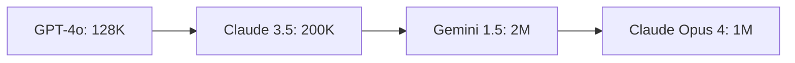

## 핵심 개념

Prompt Engineering이 "무엇을 물어볼까"라면, Context Engineering은 **"LLM이 답하기 전에 무엇을 알고 있어야 하는가"**를 설계하는 기술이다.

LLM은 컨텍스트 윈도우에 들어간 정보만으로 추론한다. 모델 외부의 지식, 사용자 히스토리, 도메인 규칙은 컨텍스트로 주입하지 않으면 존재하지 않는 것과 같다.

```
┌──────────────────────────────────────────┐
│           Context Window                  │
│                                          │
│  System Prompt   ← 역할, 규칙, 제약조건   │
│  Retrieved Docs  ← RAG로 가져온 문서      │
│  User History    ← 이전 대화, 선호도      │
│  Current Query   ← 지금 사용자의 질문      │
│                                          │
│  → LLM은 이 안의 정보만으로 답변 생성     │
└──────────────────────────────────────────┘
```

## 왜 프롬프트만으로는 부족한가

| 문제 | 프롬프트만 | Context Engineering |
|------|-----------|-------------------|
| 최신 정보 부족 | 학습 데이터 한계 | RAG로 실시간 문서 주입 |
| 할루시네이션 | "정확히 답해" 지시 | 근거 문서를 직접 제공 |
| 사용자 맞춤 부족 | 매번 설명 반복 | 사용자 프로필/히스토리 주입 |
| 도메인 규칙 무시 | 프롬프트에 규칙 나열 | 규칙 문서를 체계적으로 구조화 |

## Context 설계의 4가지 원칙

### 1. 관련성 (Relevance)
불필요한 정보는 노이즈다. 질문과 직접 관련된 맥락만 선별한다.

```typescript
// Bad: 전체 문서를 다 넣기
const context = await fetchAllDocs(); // 100개 문서, 50만 토큰

// Good: 질문과 관련된 문서만 검색
const context = await vectorSearch(query, { topK: 5 }); // 5개 문서, 3000 토큰
```

### 2. 순서 (Ordering)
LLM은 컨텍스트의 처음과 끝에 더 주의를 기울인다 (Lost in the Middle 현상).

```
가장 중요한 정보 → 맨 앞 또는 맨 뒤
보조 정보 → 중간
```

### 3. 압축 (Compression)
컨텍스트 윈도우는 유한하다. 같은 정보를 더 적은 토큰으로 전달하는 것이 핵심.

```typescript
// 원본: 2000 토큰
const rawDoc = "제1조 (목적) 이 약관은 주식회사 ... (생략) ... 제50조";

// 압축: 200 토큰
const summary = await summarize(rawDoc, { maxTokens: 200 });
```

### 4. 신선도 (Freshness)
오래된 정보는 LLM을 혼란시킨다. 항상 최신 상태의 맥락을 제공한다.

```typescript
// 캐시된 문서가 오래되었으면 갱신
const doc = await getDoc(id);
if (isStale(doc, { maxAge: '1h' })) {
  doc = await refreshDoc(id);
}
```

## 실전 패턴: System Prompt 구조화

```
[역할 정의]
당신은 금융 분석 어시스턴트입니다.

[규칙]
- 수치 데이터를 인용할 때는 반드시 출처를 명시하세요
- 투자 조언은 하지 마세요 (법적 제한)
- 확실하지 않은 정보는 "확인이 필요합니다"라고 표시하세요

[참조 문서]
{retrieved_documents}

[사용자 컨텍스트]
이름: {user_name}
관심 종목: {watchlist}
위험 성향: {risk_profile}
```

## Context Window 크기 비교



윈도우가 크다고 다 채우면 안 된다. **정밀하게 선별된 8K 토큰이 무작위 100K 토큰보다 좋은 답변을 만든다.**

## AI Agent Directive

**Trigger**: 새로운 LLM 기반 기능을 설계할 때, 프롬프트 엔지니어링으로 성능 개선이 정체할 때, 또는 LLM의 할루시네이션이 발생할 때

**Prerequisites**: 
- `/wiki/prompt-engineering/structured-output` — 구조화된 출력으로 LLM 제어
- `/wiki/rag/vector-search-basics` — 외부 문서 검색 기초

### Actionable Steps

1. 현재 LLM 애플리케이션에서 필요한 맥락의 종류 나열: 시스템 프롬프트, 사용자 히스토리, 도메인 규칙, 외부 문서, 사용자 프로필 등
2. 컨텍스트 윈도우 크기와 현재 사용 중인 평균 토큰 크기 파악
3. 관련성 (Relevance) 원칙 적용: 불필요한 정보 제거, 질문과 직접 관련된 맥락만 선별
4. 순서 (Ordering) 원칙 적용: 가장 중요한 정보를 System Prompt 맨 앞 또는 맨 뒤에 배치 (Lost in the Middle 회피)
5. 압축 (Compression) 원칙: 같은 정보를 더 적은 토큰으로 전달할 수 있는지 검토 (요약, 구조화, 핵심 추출)
6. 신선도 (Freshness) 원칙: 캐시된 맥락이 오래되지 않았는지 확인, 주기적으로 갱신

### Anti-patterns

- 프롬프트 엔지니어링으로만 LLM 성능을 끌어올리려고 시도 (맥락 설계가 근본)
- 컨텍스트 윈도우가 크다고 해서 불필요한 정보까지 무작정 포함하기
- System Prompt에서 "정확히 답해"라고만 지시하고 근거 문서나 도메인 규칙 제공 없이 할루시네이션 기대하기
- 한 번 설계한 System Prompt를 고정으로 유지하면서 성능 저하를 프롬프트 튜닝으로만 해결하려고 하기

## 자기 점검

1. 내 애플리케이션에서 LLM이 참조해야 하는 맥락의 종류를 나열할 수 있는가?
2. 컨텍스트 윈도우 한계에 부딪혔을 때 어떤 정보를 우선 제거할지 기준이 있는가?
3. RAG와 Context Engineering의 관계를 설명할 수 있는가?

## 다음 단계

- **RAG**: Context Engineering의 핵심 실행 도구. 외부 문서를 검색해서 컨텍스트에 주입하는 파이프라인.
- **Harness Engineering**: 컨텍스트 구성을 자동화하는 AI 하네스 설계.
- **Prompt Engineering**: 컨텍스트 위에서 실제 질문/지시를 설계하는 기술.
