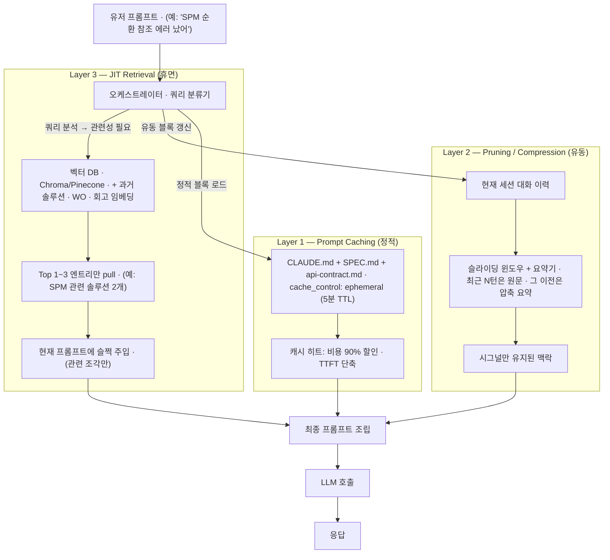
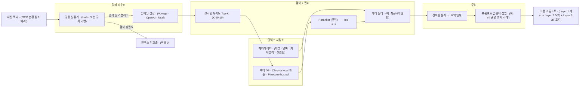

## 한 줄 요약

AI 하네스에 MD 저널 · 스펙 · 솔루션 · 회고가 누적되면 **"지식 = 컨텍스트 양 = 토큰 비용 / 레이턴시 / 500·529 에러 위험"** 이라는 잔인한 선형 관계에 갇힌 것처럼 보인다. 이는 *구조적 숙명이 아니라 아키텍처 선택*이다. **Layer 1 (Prompt Caching — 정적 블록 · 90% 할인)**, **Layer 2 (Pruning / Compression — 유동 블록 · 시그널만 유지)**, **Layer 3 (JIT Retrieval — 휴면 블록 · 쿼리 시점에만 벡터 DB에서 1~2개 pull)** 로 분리하면 지식이 N배 늘어도 실 토큰은 대략 log N 수준으로 눌러진다. 이 글은 각 레이어의 본질 · 도입 순서 · 실패 패턴을 정리하고, ai-study/moneyflow/tarosaju/aidy 4개 프로덕트에의 적용 경로를 설계한다.

---

## 1. 문제 구조 — 왜 '그냥 다 읽힘' 이 결국 터지는가

### 선형 트레이드오프의 정체

하네스가 성숙할수록 유혹적인 루틴이 생긴다:

> "새 패턴 박제됐으니 세션 프리픽스에 추가하자. CLAUDE.md에 한 줄, SPEC.md에 한 절, 솔루션 링크 하나…"

한 번의 세션이 읽어야 할 맥락은 이렇게 쌓인다:
- 프로젝트 CLAUDE.md
- 글로벌 CLAUDE.md (gstack 스킬 등록)
- RTK.md
- SPEC.md / api-contract.md
- 과거 회고 N건 링크
- 솔루션 카테고리 N개

**한 번은 괜찮다.** 100 세션 × 15K 토큰 프리픽스 × 평균 3 호출 = 4.5M 토큰. 전부 "프리픽스 읽기" 라는 *안 움직이는 부분* 에 쓰인다. 한 달 후에 ccusage 로 찍어보면 "어제 썼던 것 다시 읽는 데" 가장 큰 비용 덩어리로 뜬다.

### 왜 이게 한계에 부딪히나

1. **토큰 선형성**: 컨텍스트가 N배면 비용도 N배. Opus 기준 $15/1M 입력. 200K 윈도우 꽉 채우면 호출당 $3.
2. **레이턴시**: 프리픽스가 길어질수록 TTFT(첫 토큰 시간) 선형 증가. 워커 세션 20개 동시 돌릴 때 체감 급격히 악화.
3. **5xx 리스크**: 대용량 프롬프트는 500 / 529 (Anthropic overloaded) 확률 증가. 장시간 작업 중 한 번 터지면 전체 컨텍스트 유실.
4. **지능 오히려 저하**: 실증적으로 *너무 긴 프롬프트는 중간 부분을 LLM이 덜 활용* (lost-in-the-middle). 다 넣으면 오히려 품질이 떨어질 수 있음.

> 💡 **핵심 관찰**: "지식이 많을수록 좋다" 가 맞지만, "지식을 매 호출마다 다 읽힌다" 는 틀리다. 아키텍처가 이 둘을 분리한다.

---

## 2. 3-레이어 아키텍처 개관

### 분류 기준 — 지식의 '사용 패턴'

지식을 *내용*이 아니라 *쓰임새*로 분류한다:

| 분류 | 특징 | 예시 | 어느 레이어 |
|------|------|------|-------------|
| **정적 (Static)** | 매 세션 프리픽스에 들어감. 드물게 업데이트. | CLAUDE.md · SPEC.md · api-contract.md · RTK.md | Layer 1 — Prompt Caching |
| **유동 (Working)** | 자주 참조되나 매번 전체는 아님. 요약이 통함. | 최근 대화 이력 · 현재 세션 작업 로그 · 진행 중 WO | Layer 2 — Pruning / Compression |
| **휴면 (Dormant)** | 평소엔 안 쓰임. 특정 트리거에서만 필요. | 과거 솔루션 100건 · 완료된 WO 아카이브 · 다른 프로덕트 패턴 박제 | Layer 3 — JIT Retrieval (Vector DB) |

### 아키텍처 다이어그램



### 한 문장 요약
- Layer 1: **한 번만 비용 지불하고 재사용** (매 호출 90% 할인)
- Layer 2: **정보 밀도 유지하면서 부피는 줄임** (요약 + 원문 링크)
- Layer 3: **안 쓰는 것엔 0원** (쿼리 시점에만 로드)

---

## 3. Layer 1 — Prompt Caching (정적 블록의 재사용)

### 본질
Anthropic Claude API의 `cache_control: {"type": "ephemeral"}` (5분 TTL, v1) / 1시간 TTL (v2 beta). 동일 프리픽스가 5분 내 다시 오면 **캐시 히트 → 입력 토큰 비용 90% 할인 + TTFT 대폭 단축**.

### 대상 — 무엇을 캐시 레이어에 둘 것인가

| 후보 | 캐시 적격성 | 이유 |
|------|-----------|------|
| CLAUDE.md · SPEC.md · RTK.md | ✅ 최우선 | 매 세션 프리픽스 고정. 드물게 업데이트 |
| api-contract.md (aidy) | ✅ | 워커 세션이 매 WO마다 로드 |
| 오픈소스 라이브러리 주요 문서 링크 | ✅ 중요도 중 | 참조 빈도 높으나 품질 검증 필요 |
| 현재 진행 중 WO 파일 | ❌ | 자주 변함. Layer 2 영역 |
| 최근 대화 이력 | ❌ | 매 턴 바뀜. Layer 2 |
| 과거 솔루션 100건 | ❌ | 대부분 안 쓰임. Layer 3 |

### 핵심 제약 — 캐시가 *깨지는* 상황

1. **프리픽스 변경**: CLAUDE.md 한 줄만 바꿔도 그 세션의 캐시 전체 무효화. 활성 세션 중 문서 수정 금지 (aidy CLAUDE.md에도 명시).
2. **5분 TTL**: 휴식 후 세션 복귀 시 콜드. 휴식 직전에 세션 종료 권장.
3. **최소 토큰**: 1024 토큰 이상이어야 캐시 자격 (너무 작으면 거부).
4. **순서 의존**: cache breakpoint 이전의 모든 메시지가 일치해야 히트. 시스템 프롬프트 → 문서 → 실제 쿼리 순서 고정.

### 상세 구현
기존 상세: [Prompt Caching으로 입력 토큰 비용 90% 절감](/wiki/tokenomics/prompt-caching-cost-reduction) — cache_control 예시 코드 · 베이스라인 측정 · tarosaju/moneyflow 실적용 사례 포함.

### 4 조건 게이트 통과 여부
- ✅ 공식 문서 + 다수 독립 사례 검증 (Anthropic blog, 다수 프로덕션 적용)
- ✅ ccusage로 실측 가능 (cache_read_input_tokens 지표)
- ✅ 품질 저하 없음 (동일 프리픽스 재전송)
- ✅ 롤백 비용 낮음 (cache_control 제거 한 줄)

→ **즉시 적용 가능**. ai-study / moneyflow / tarosaju 는 이미 적용 또는 권장 즉시 적용 상태.

---

## 4. Layer 2 — Pruning & Compression (유동 블록의 부피 축소)

### 본질
대화가 길어지면서 쌓이는 "최근 N턴" · 현재 세션 작업 로그 · 진행 WO 메모를 *정보 밀도는 유지하면서 부피는 줄인다*. 두 가지 축:

- **Pruning (선별 버림)**: 관련성 없는 조각 제거 (예: 디버깅 중 실패한 시도 로그)
- **Compression (압축)**: 긴 조각을 요약으로 대체 (예: 10턴 대화 → 3줄 요약)

### 구체 패턴

#### (A) 슬라이딩 윈도우 + 요약 꼬리
```
[시스템 프롬프트]
[요약 꼬리: 이전 30턴의 핵심 결정만 압축 — 500 토큰]
[최근 10턴 원문]
[현재 쿼리]
```
- 요약 꼬리는 주기적으로 배치 업데이트 (예: 20턴마다 과거 10턴 추가 압축)
- 원문 윈도우 크기는 도메인에 따라 조절 (코딩 세션은 좁게, 아이데이션은 넓게)

#### (B) Extractive Summarization (선택적 인용)
- LLM이 대화 로그를 훑어 **"결정이 일어난 문장만"** 뽑아 붙임
- 장점: 원문 인용이라 맥락 보존도 높음
- 단점: 추가 LLM 호출 비용

#### (C) Structured Journal (구조화된 현재 상태)
- 현재 세션의 "목표 / 진행 / 블로커 / 다음 액션" 을 JSON 또는 MD 표로 관리
- 매 주요 결정 후 이 구조만 업데이트
- 대화 이력 대신 이 JSON 을 Layer 2 로 사용

### Post-Retrieval Compression (RAG와의 결합)
[Context Compression](/wiki/context-engineering/context-compression) 의 핵심: 검색된 RAG 문서를 LLM 에 직접 넣지 않고, **Compressor LLM 이 쿼리와 무관한 부분을 걸러낸 후** 최종 LLM 에 전달. Layer 2 와 Layer 3 가 맞물리는 지점.

### 트레이드오프
- **정보 손실 위험**: 요약이 핵심을 누락할 수 있음. "무엇을 살리고 버릴지" 를 결정하는 요약 프롬프트의 품질이 생명
- **추가 비용**: 요약 호출 자체가 비용. Haiku 4.5 같은 저렴한 모델로 돌려야 손익이 맞음
- **신선도 vs 압축률 트레이드오프**: 너무 공격적 압축 = 맥락 잃음 / 너무 느슨 = 의미 없음

### 4 조건 게이트 통과 여부
- ⚠️ 공식 문서 검증은 되나 **품질 저하 가능성** 존재 (요약 품질에 의존)
- ✅ 실측 가능
- ⚠️ 롤백 비용은 mid (요약 로직 제거 필요)

→ **단계적 POC 후 적용**. 슬라이딩 윈도우는 바로 가능, extractive 요약은 품질 검증 후.

---

## 5. Layer 3 — JIT Retrieval (휴면 블록의 쿼리-시점 주입)

### 본질 — 이 글의 핵심 제안

> **과거 솔루션 · 완료 WO · 회고 · 다른 프로덕트 패턴** 같은 **"평소엔 안 쓰는데 특정 순간에 꼭 필요한"** 지식을 **전체 로드하지 말고 인덱스만 유지**. 쿼리 시점에 관련 Top 1~3 조각만 뽑아서 동적으로 주입.

### 아키텍처



### 인덱싱 파이프라인

```
MDX/MD 저널/솔루션
    ↓ (chunking)
청크 단위 (e.g. 섹션 또는 500 토큰 블록)
    ↓ (embedding)
벡터 + 원문 + 메타(slug/tag/date/confidence)
    ↓ (upsert)
Vector DB
```

- **청킹 단위**: 한 .mdx 가 하나의 벡터면 너무 거침. 섹션 단위 (H2) 가 실용적 절충점
- **메타데이터 필수**: 최소 `slug` · `category` · `tags` · `date` · `confidence` — 검색 후 필터링 용
- **증분 업데이트**: 새 엔트리 추가 시 해당 파일만 재임베딩 (전체 재인덱싱 금지)

### 핵심 세부 — 라우터가 먼저

*모든 쿼리에 RAG를 돌리면* Layer 3 가 다시 선형 비용이 된다. 쿼리 라우터가 필요:

```
쿼리 → 분류기 → {
  "specific_error": 벡터 DB 검색,
  "general_discussion": 검색 skip,
  "meta_question": Layer 1 (CLAUDE.md) 만으로 답변 가능,
}
```

분류기는 Haiku 같은 저렴한 모델이나 규칙 기반으로. "에러 메시지 · 스택 트레이스 · SPM·MDX·Mermaid 같은 기술 키워드" 포함 시 검색 플래그 ON.

### 도구 선택

| 도구 | 특징 | 적합 시나리오 |
|------|------|--------------|
| **Chroma (local)** | 로컬 SQLite 기반. npm/pip 설치. 인프라 무 | 단일 프로덕트 · 개인 프로젝트 · 실험 단계 |
| **Pinecone** | managed. API 호출. 고가용성 | 팀 공유 · 여러 프로덕트 공통 인덱스 |
| **Weaviate** | self-hosted 옵션 포함 · 강력한 필터링 | 복잡한 메타 쿼리 필요 · 데이터 프라이버시 중요 |
| **SQLite + sqlite-vec** | SQLite 확장으로 벡터 | 경량. Chroma 대체 |

**ai-study/moneyflow/tarosaju 수준 (단일 운영자 · 수백 문서) 에서는 Chroma 로컬 충분.** 스케일 상승 후 Pinecone/Weaviate 전환.

### 트레이드오프
- **비용 구조 변화**: 입력 토큰은 줄지만 임베딩 비용 + 벡터 DB 호스팅 추가. 1000 문서 · Voyage 임베딩 기준 ~$0.01 일회성 + 검색은 거의 무료
- **검색 품질 = 시스템 지능**: 관련성 낮은 조각 주입 시 오히려 혼란. Reranker 없이 Top-K 만 쓰면 후회 가능성 있음
- **인덱싱 운영**: 새 엔트리 쓸 때마다 재임베딩 자동화 필요 (pre-commit hook 또는 CI)

### 4 조건 게이트 통과 여부
- ✅ 공식/다수 독립 사례 검증 (RAG 는 주류 패턴)
- ⚠️ 실측 가능하지만 품질 지표가 토큰만으론 안 됨 (검색 적중률 + 응답 품질 병행)
- ⚠️ 품질 저하 가능 (관련성 낮은 주입 = 소음)
- ❌ **롤백 비용 높음** — 외부 서비스 의존 · 임베딩 파이프라인 · 쿼리 라우팅 코드가 얽힘

→ **즉시 적용 X. 단계적 POC 필수.** 로드맵 §7 참조.

---

## 6. 특별 사례 — 핸드오프 문서의 함정 ("단순 핸드오프는 삭제가 정답")

### 왜 별도로 다루는가

HANDOFF.md · SESSION-SUMMARY.md · NEXT.md 같은 **핸드오프 문서** 는 3-레이어 프레임워크에서 가장 잘못 배치되는 자산이다. 형태(.md 파일 · 프로젝트 루트 배치)는 **Layer 1 (정적 · 영구 캐시 대상)** 처럼 생겼지만, 내용의 성격은 **Layer 2 (유동 · 세션 단위 휘발성)** 다. 이 불일치가 방치되면 "세션 시작 시 읽을 문서" 목록에 편승해서 *영구 프리픽스 오버헤드* 로 고착된다.

### 증상 — 실제 관측된 예시

| 저장소 | 핸드오프 파일 | 크기 | 마지막 업데이트 | 문제 |
|--------|-------------|------|--------------|------|
| **ai-study** | `NEXT.md` | **60KB · 1,032 줄** | 2026-04-12 | 4일 stale · 완료된 Journal 큐 상당수 포함 · CLAUDE.md 가 *매 세션 로드 필수* 로 못박음 |
| **aidy-architect** | `HANDOFF.md` | 5.5KB · 137 줄 | 2026-04-16 (세션 4) | 세션별 교체 운영 — 상대적으로 건강 |

ai-study `NEXT.md` 는 CLAUDE.md 13줄의 "세션 시작 4 파일 로드 순서" 에 포함돼 있어서, *아무도 안 읽는데 매번 로드* 되는 상태에 근접. Layer 1 으로 잘못 분류된 Layer 2 자산의 전형.

### 왜 이렇게 되는가

핸드오프 문서는 본질적으로 **시간 축 휘발성이 있는 정보** 를 담는다:
- "현재 진행 중 블로커" — 다음 세션 완료되면 무가치
- "직전 세션 주요 결정" — 영구 가치 있으면 회고/솔루션으로 **이동** 해야
- "다음 세션 큐" — 실행되면 무가치

그런데 이걸 **영구 문서 포맷(.md)** 에 **영구 위치(프로젝트 루트)** 에 두면 시각적 · 관습적으로 Layer 1(CLAUDE.md, SPEC.md 와 동급) 처럼 취급된다. append-only 운영 규칙이 붙으면 붕괴 가속.

### 원칙 — "단순한 핸드오프는 삭제가 정답"

세션이 끝났을 때 핸드오프 문서가 남아있으면 세 갈래로 분해:

1. **재사용 가치 있는 학습** → **Layer 1 으로 승격** (distill)
   - 규약 · 패턴 · 반복 발생 위험 → `CLAUDE.md` 업데이트
   - 재발 가능 문제 → `docs/solutions/{category}/` 박제
   - 세션 레벨 교훈 → `docs/retros/` 박제
   - 행동 규약 → memory rule (`.claude/memory/feedback_*.md`)
2. **현재 상태 스냅샷** → **다음 세션이 직접 재수집**
   - `git status` · `rtk git log --oneline -10` · `ls -la`
   - Compound Engineering 의 "메타데이터 신뢰 금지" 원칙과 일치 — **핸드오프의 자기 보고는 이미 과거**
3. **나머지** → **삭제**. 굳이 보존해야 한다면 `docs/handoffs/YYYY-MM-DD.md` 처럼 **날짜별 격리 디렉토리** 로 옮겨서 기본 프리픽스에서 제외

### 판별 기준 (한 질문)

> 다음 세션 시작 시 이 파일이 **없어도** 10분 내에 동일 작업 재개 가능한가?

- **YES** → 삭제 안전. 파일의 존재 의의는 "에이전트 편의" 가 아니라 "기억 위임" 이어야 함
- **NO** → 진짜 필요한 1~2 문단을 Layer 1 문서에 **승격 후** 원본 삭제. 여전히 남아있다면 그 1~2 문단이 재사용 가치 있는지 재검증

### aidy-architect 의 HANDOFF.md 가 작동하는 이유

5.5KB 수준 유지 + 세션별 *교체* 운영이 핵심. 핸드오프는 "직전 세션 요약" 이지 "누적 로그" 가 아니다. 다음 세션 시작 시점에는:
- 이전 HANDOFF 의 결정은 이미 ADR / CLAUDE.md / retro 로 승격됐거나
- 블로커는 inbox 메시징 (파일 기반 비동기) 으로 이관됐거나
- 큐는 완료되어 새 HANDOFF 로 대체됨

→ 핸드오프 파일 자체는 *일회용 스크래치* 로 취급. 영구 자산은 별도 위치.

### 대체 구조 — 핸드오프 우산 문서 없이 운영하는 법

핸드오프의 각 정보 타입을 *휘발성에 맞는 위치* 에 배치하면 우산 문서가 필요 없어진다:

| 정보 유형 | 휘발성 | 올바른 위치 |
|---------|--------|-----------|
| 현재 상태 스냅샷 | 초단기 | **코드 자체** — `git status`, `git log`, `ls` 로 재수집. 문서화 금지 |
| 블로커 / 질문 | 단기 | aidy 스타일 **inbox 메시징** (`inbox/{worker}-request.md` → response) |
| 세션 학습 | 중기 → 장기 | **retro 박제** (`docs/retros/`) — 재발 가능성 평가 후 일부만 |
| 재발 가능 문제 | 장기 | **solution 박제** (`docs/solutions/`) — 카테고리별 |
| 규약 · 패턴 | 영구 | **CLAUDE.md / SPEC.md** 업데이트 — Layer 1 정적 캐시 |
| 다음 작업 큐 | 단기 | **TODOS.md** — 완료 항목 즉시 삭제. append-only 금지 |

### Compound Engineering 성숙도와의 관계

핸드오프 운영은 Compound Stage 판별 지표 중 하나:
- **Stage 1 (수동)**: HANDOFF 없음. 매번 "어디까지 했지?" 머리로 복기
- **Stage 2 (리마인드)**: HANDOFF 작성 시작. 자주 누락
- **Stage 3 (슬래시 커맨드)**: `/compound` 가 HANDOFF 대신 retro/solution 으로 자동 승격 → **핸드오프 자체는 불필요해짐**
- **Stage 4~5 (자동 루프 / 완전 자율)**: 핸드오프 개념 사실상 소멸. 모든 지식이 적절 레이어에 자동 배치됨

**역설**: HANDOFF 를 열심히 쓸수록 Stage 3 에 도달하지 못한다. `/compound` 로 자동 승격 파이프라인을 깔면 HANDOFF 는 자연 소멸.

### 실전 액션 아이템 — ai-study NEXT.md 정리

(이 글에서 스스로에게 하는 제안)

- [ ] `NEXT.md` 60KB 를 읽고 **완료된 큐 항목 제거** → 20KB 미만으로 축소
- [ ] 완료된 Journal 큐에서 **재사용 가치 있는 학습** 을 retro/solution 으로 이관
- [ ] "세션 시작 4 파일 로드" 중 NEXT.md 를 **선택적 로드** 로 격하 (CLAUDE.md 규약 재검토)
- [ ] 향후 `/compound` 가 NEXT.md 자동 정리 책임을 가지도록 스킬 확장
- [ ] 이관 후에도 남는 "진짜 시간 경계" 정보만 `NEXT.md` 유지

### 안티패턴 요약

| 안티패턴 | 왜 실패 | 대안 |
|---------|--------|------|
| append-only 핸드오프 | 무한 증가 · stale 누적 | 세션별 교체 (aidy HANDOFF 스타일) |
| HANDOFF 를 CLAUDE.md 에 "필수 로드" 로 박음 | Layer 2 정보가 Layer 1 로 오분류 → 영구 프리픽스 오버헤드 | 선택적 로드 (필요 시만) |
| 세션 요약을 영구 문서로 | 한 번 쓰고 안 읽음 · 토큰 비용만 지불 | 요약 자체는 삭제, 학습만 박제 |
| "다음 세션이 보면 좋은 정보" 에 미련 | 이미 *다음 세션* 은 코드/로그에서 재수집 가능 | 메타 신뢰 금지 · 재수집 정상 |
| HANDOFF 에 과거 N 세션 요약 축적 | 한 세션 읽을 때 N 세션 분량 로드 | 직전 1 세션만. 나머지는 retro 로 |

> 💡 **핵심**: 핸드오프 문서는 **접착제(scaffold)** 지 **뼈대(skeleton)** 가 아니다. 접착제가 굳어서 뼈대가 되기 시작하면 문제다. 매 세션 종료 시 "이 핸드오프가 접착제인가 뼈대인가" 를 자문 — 뼈대처럼 보이면 분해해서 올바른 레이어로 이동.

---

## 7. 통합 의사결정 프레임워크 — '어느 지식을 어느 레이어에?'

### 결정 트리

```
이 지식 조각(파일 또는 청크)은 …

Q1. 매 세션/매 호출에 쓰이는가?
  YES → Layer 1 (캐시). cache_control 적용.
  NO  → Q2

Q2. 현재 진행 중인 작업과 관련되어 자주 참조되는가?
  YES → Layer 2 (유동). 슬라이딩 + 요약.
  NO  → Q3

Q3. 특정 트리거(에러/키워드/카테고리)에서만 쓰이는가?
  YES → Layer 3 (JIT). 벡터 DB 인덱싱.
  NO  → 재검토: 진짜 필요한 지식인가? 정리 대상일 수 있음.
```

### 하이브리드 원칙
한 *파일*이 한 레이어에 고정될 필요 없음. **섹션 단위로 쪼개서 다른 레이어에 배치 가능**:

예 — `CLAUDE.md` 는 이론적으로 Layer 1 이지만:
- "프로젝트 규약 + 기술 스택" (정적 · 매번 필요) → Layer 1
- "최근 회고 링크 20개" (증가 추세 · 참조 빈도 다름) → 일부만 Layer 1, 나머지는 Layer 3 로 이동 고려

### 안티패턴
- **"큰 문서 = 큰 오버헤드" 에 대한 과잉 반응** — 작은 CLAUDE.md 가 무조건 좋지 않음. 프로젝트 규약 희박화는 행동 레벨 가드 약화로 이어짐
- **Layer 3 만능주의** — RAG 가 멋있어 보여서 캐시 적용 전에 벡터 DB부터 붙이기. 4 조건상 반대 순서
- **캐시 의존 후 문서 수정** — 활성 세션 중 Layer 1 문서 편집은 그 세션 내 모든 이점 무효화. 수정은 세션 경계에서만

---

## 8. 실전 적용 경로 — 4 프로덕트 매핑

### ai-study 허브

현재 상태 (2026-04-16):
- 101 엔트리 · 다수 저널 · 100+ 솔루션 + 회고 누적
- 이미 적용: `.claudeignore`, search-index.json lazy fetch, SearchDialog 리팩터

| 레이어 | 현황 | 다음 스텝 |
|--------|------|----------|
| L1 (Cache) | CLAUDE.md 명확 · RTK.md 글로벌 | 세션 시작 시 cache_control 명시적 사용 확인. 활성 세션 중 문서 수정 금지 규약 재주입 |
| L2 (Prune) | 현재 세션 대화는 harness 기본값 의존 | 특별 조치 없음 — 자연스러움 |
| L3 (JIT) | **공백** | POC: Chroma 로컬 + 섹션 단위 청킹 + Haiku 라우터. 첫 목표: "에러 메시지 쿼리 시 과거 솔루션 자동 주입" |

### moneyflow / tarosaju

| 레이어 | 현황 | 다음 스텝 |
|--------|------|----------|
| L1 | 이미 [Prompt Caching 90% 절감](/wiki/tokenomics/prompt-caching-cost-reduction) 적용 중 | 유지 |
| L2 | 대화 이력 슬라이딩 적용 여부 확인 필요 | 구조화 Journal 패턴 적용 검토 |
| L3 | 사용자 대화 이력 검색에 RAG 사용 가능성 (도메인 특화) | 하네스 지식(솔루션/회고)에도 동일 패턴 이식 |

### aidy (멀티 세션 오케스트레이션)

가장 큰 잠재적 수혜자. 4 레포 × 세션 × WO 반복.

| 레이어 | 현황 | 다음 스텝 |
|--------|------|----------|
| L1 | 4 레포 CLAUDE.md + api-contract.md + conventions.md | cache_control 명시. 활성 중 수정 금지 규약은 이미 있음 |
| L2 | 현재 WO 파일이 사실상 Layer 2 역할 (구조화 Journal) | 유지 + 개선: WO 완료 후 요약 섹션 의무화 |
| L3 | **강력 후보** | 인덱싱 대상: `work-orders/done/` + `gates/reviews/` + `docs/retros/` + `docs/solutions/`. 워커가 막히면 자동으로 관련 과거 솔루션 주입 (inbox 대안) |

**aidy 의 JIT Retrieval 이 성공하면 "워커가 스스로 과거 경험을 참조"하는 구조가 완성** — Compound Engineering 성숙도 Stage 4~5 로 가는 핵심 링크.

---

## 9. 도입 순서 — 4 조건 게이트 + 단계적 POC

### 단계 1: Layer 1 전면 적용 (즉시 · 1~2일)
- [ ] 3 프로덕트의 cache_control 사용 현황 감사 (`ccusage` 로 cache_read 비율 확인)
- [ ] 미적용 프로덕트가 있으면 [Prompt Caching 레퍼런스](/wiki/tokenomics/prompt-caching-cost-reduction) 기준으로 즉시 적용
- [ ] ["활성 세션 중 문서 수정 금지"](/wiki/context-engineering/claude-md-design-patterns) 규약을 settings.json hook 으로 강제화 (편집 시 세션 재시작 권고 알림)
- 성공 지표: cache_read_input_tokens / input_tokens ≥ 0.5

### 단계 2: Layer 2 구조화 (1~2주)
- [ ] 긴 세션(> 20턴) 에서 슬라이딩 윈도우 요약 패턴 실험
- [ ] 구조화 Journal (목표/진행/블로커/다음) 을 메인 대화 로그 대신 쓰는 실험 (aidy WO 에 가장 자연스러움)
- [ ] Compressor 호출은 Haiku 로 고정
- 성공 지표: 20+ 턴 세션의 평균 입력 토큰 30% 감소

### 단계 3: Layer 3 POC (2~6주, 단일 프로덕트 한정)
- [ ] **ai-study 에서만** POC 시작 (롤백 용이)
- [ ] Chroma 로컬 + 섹션 청킹 + Voyage 임베딩
- [ ] 쿼리 라우터 규칙 기반 v0 (에러 키워드 목록)
- [ ] 섀도우 모드: 기존 전체 로드 + JIT 주입 병행 → 출력 차이 비교
- [ ] Reranker 도입 검토 (Cohere rerank · 자체 Haiku 재랭킹)
- [ ] 품질 지표: 관련 솔루션 주입 적중률 · 환각 증가 여부
- 통과 기준: 섀도우 1주 기준 JIT 응답 품질 ≥ 기존 · 토큰 20% 이상 감소

### 단계 4: 이식 (POC 성공 후)
- [ ] [Journal 011 모델](/wiki/harness-engineering/harness-journal-011-concurrent-session-safety) 이식 패턴 적용
- [ ] moneyflow → tarosaju → aidy 순으로 (aidy 가 가장 복잡 · 마지막에)
- [ ] 인덱싱 자동화 CI 세팅 (새 .mdx 커밋 시 재임베딩 워크플로)

---

## 10. 실패 패턴 / 안티패턴

| 안티패턴 | 왜 실패하는가 | 대안 |
|---------|-------------|------|
| **캐시 없이 RAG 부터** | 가장 큰 덩어리(정적 프리픽스) 를 안 잡고 작은 덩어리 최적화 | 4 조건 순서대로 Layer 1 먼저 |
| **모든 쿼리에 RAG** | Layer 3 가 선형 비용으로 회귀 | 쿼리 라우터 필수. 검색 필요 여부 분류 |
| **단일 전체 .mdx 임베딩** | 청크가 너무 거칠어 검색 정확도 하락 | 섹션 단위(H2) 청킹 + 메타데이터 |
| **메타 없이 벡터만** | 최신성 · 신뢰도 필터링 불가 | `slug` · `date` · `confidence` · `tags` 필수 첨부 |
| **Reranker 없이 Top-K 그대로 주입** | 관련성 낮은 조각이 프롬프트 오염 | 최소한 Top-3 로 좁히고 필터 |
| **활성 세션 중 Layer 1 문서 수정** | 캐시 전체 무효화 + 1.25x 오버헤드 | 세션 경계에서만 편집 |
| **요약 품질 점검 없이 공격적 압축** | 중요 맥락 유실 | 요약 전/후 샘플 수동 검증 필수 |
| **벡터 DB 인덱싱 수동 유지** | 새 문서 추가 시 재임베딩 누락 → 검색 누락 | CI / pre-commit 자동화 |
| **"더 큰 컨텍스트 윈도우" 에 의존** | 비용 · 레이턴시 · lost-in-the-middle 모두 악화 | 레이어 분리가 정답 |
| **여러 레이어 병렬 도입** | 롤백 지점 불명확. 원인 파악 어려움 | 한 번에 하나씩. 단계 사이 측정 |

---

## 11. 측정 방법

### Layer 1 (Cache)
```
# ccusage 세션 데이터
cache_read_input_tokens / input_tokens 비율
→ 목표: 0.5 이상 (짧은 세션 제외)
```

### Layer 2 (Compression)
```
긴 세션(20+턴) 평균 입력 토큰
압축 전/후 비교
응답 품질 체크리스트: 핵심 결정 기억 여부 · 사용자 이름/약속 기억 여부
```

### Layer 3 (JIT Retrieval)
```
적중률: 쿼리별 관련 문서가 실제 Top-3 에 포함됐는가 (수동 샘플링)
토큰 절감: (기존 전체 로드) - (JIT 주입된 조각) / 기존
응답 품질: 섀도우 모드 A/B 비교 (LLM-as-Judge)
환각 증가 여부: 부정확 인용 빈도
```

### 전체
```
ccusage 일별 총 토큰 · 총 비용
TTFT (첫 토큰 시간) · p50 / p95
5xx 에러 비율
```

---

## 12. 다음 연구 과제 (열린 질문)

1. **청크 크기 최적값** — H2 단위가 정답인가? 토큰 200/500/1000 중 최적 지점은 도메인별로 다름. 실험 필요
2. **라우터 정밀도** — 규칙 기반 v0 의 오분류 수준. Haiku 기반으로 올리면 추가 비용 vs 정확도 트레이드오프
3. **Reranker 경제성** — Cohere rerank · 자체 Haiku 재랭킹 · 두 번째 임베딩 중 비용/품질 최적 조합
4. **캐시 + JIT 결합** — JIT 으로 가져온 조각을 이후 세션에서도 캐시로 유지하는 "웜 JIT" 가능한가
5. **장기 기억 vs 단기 기억 경계** — 얼마나 오래된 솔루션부터 L3 로 이동할 것인가 (6개월 · 1년 · 신뢰도 기준?)
6. **멀티 에이전트 공유 인덱스** — aidy 4 세션이 같은 벡터 DB 를 공유할 때 동시성/일관성 이슈
7. **실패 전파 차단** — 관련성 낮은 조각 주입이 일으키는 환각을 어떻게 탐지/복구할 것인가

---

## AI Agent Directive

### Trigger
- 사용자가 "MD 저널/솔루션/회고가 쌓일수록 토큰 비용/레이턴시가 걱정된다" 는 맥락을 꺼낼 때
- "컨텍스트 윈도우를 키우면 되지 않나" 라는 질문이 나올 때
- 프로젝트에 100+ 엔트리 · 수십 회고 · 솔루션이 누적된 상태
- 500/529 에러 · 긴 TTFT 문제 보고

### Prerequisites
- [Prompt Caching 90% 절감](/wiki/tokenomics/prompt-caching-cost-reduction)
- [Context Engineering 기초](/wiki/context-engineering/context-engineering-fundamentals)
- [Token Levers Catalog · Applied Log](/wiki/tokenomics/claude-code-token-levers-catalog) — **4 조건 게이트** 숙지 필수
- [RAG Overview](/wiki/rag/rag-overview)

### Actionable Steps
1. **현재 상태 진단** — `ccusage` 로 cache 비율 · 평균 입력 토큰 측정. 어느 레이어가 가장 취약한지 판단
2. **Layer 1 우선 완결** — 모든 프로덕트에 cache_control 적용 + 활성 세션 중 문서 수정 금지 규약 강제화
3. **Layer 2 구조화** — 긴 세션 패턴 있는 곳부터 슬라이딩 윈도우 + 요약 꼬리 도입
4. **Layer 3 POC 단일 프로덕트** — ai-study 에서 Chroma 로컬로 실험. 섀도우 모드 1주 검증 후 전환
5. **인덱싱 자동화** — 새 .mdx 커밋 시 재임베딩 파이프라인. 수동 유지 금지
6. **이식 순서 준수** — POC 검증 후 moneyflow → tarosaju → aidy
7. **측정 지표 대시보드** — ccusage + 캐시 비율 + 검색 적중률 병행 관찰

### Anti-patterns
- **Layer 1 없이 Layer 3 먼저** — 가장 큰 덩어리를 안 잡고 복잡한 걸 먼저
- **즉시 프로덕션 전면 도입** — 4 조건의 "롤백 비용 낮음" 위배. POC · 섀도우 필수
- **라우터 없이 모든 쿼리 RAG** — Layer 3 선형 비용 회귀
- **"더 큰 컨텍스트 윈도우" 회피 전략** — 문제 회피지 해결 아님. 비용 · 레이턴시 · 품질 모두 악화
- **캐시·압축 생략하고 RAG만** — 반드시 세 레이어가 같이 있어야 함. 하나만으론 선형성 못 깸

---

## 다음 학습 연결

- [Prompt Caching 90% 절감](/wiki/tokenomics/prompt-caching-cost-reduction) — Layer 1 구체 구현
- [Context Compression](/wiki/context-engineering/context-compression) — Layer 2 의 Post-Retrieval Compressor
- [Multi-turn Context Management](/wiki/context-engineering/multi-turn-context-management) — Layer 2 슬라이딩 패턴 상세
- [RAG Overview](/wiki/rag/rag-overview) — Layer 3 검색 기초
- [Token Levers Catalog · Applied Log](/wiki/tokenomics/claude-code-token-levers-catalog) — 4 조건 게이트 원전
- [Five Levers of Harness Engineering](/wiki/harness-engineering/five-levers-of-harness-engineering) — 상위 관점의 하네스 레버 계층
- [CLAUDE.md Design Patterns](/wiki/context-engineering/claude-md-design-patterns) — Layer 1 문서 구조화
- [`.claudeignore` Context Hygiene](/wiki/context-engineering/claudeignore-context-hygiene) — Layer 0 (컨텍스트에 애초에 안 들어가게 차단)

---

## 출처 / 검증 메모

- 실측 경험: ai-study 100+ 엔트리 누적, 이번 세션에 RSC payload 측정·감축(-30~70% gzipped) 으로 "선형 오버헤드 = 아키텍처 선택" 원리 체감
- Anthropic Prompt Caching 공식 문서: 5분 TTL ephemeral / 1시간 beta / 90% 입력 토큰 할인 / 1024+ 토큰 최소
- Chroma · Pinecone · Weaviate 공개 문서 (도구 비교)
- Lost-in-the-middle 현상: Liu et al. 2023 등 다수 연구
- 4 조건 게이트: `content/tokenomics/claude-code-token-levers-applied-log.mdx` § "즉시 적용 가능 4 조건"
- 관련 박제:
  - [Prompt Caching 90% 절감](/wiki/tokenomics/prompt-caching-cost-reduction) (Layer 1 상세)
  - [Context Compression](/wiki/context-engineering/context-compression) (Layer 2-3 경계)
  - [Multi-turn Context Management](/wiki/context-engineering/multi-turn-context-management) (Layer 2 패턴 카탈로그)
  - [RAG Overview](/wiki/rag/rag-overview) (Layer 3 기초)
- 하네스 실측: `aidy-architect` 의 CLAUDE.md · api-contract.md 프리픽스 캐싱은 워커 병렬 실행 시 효율의 1차 조건
