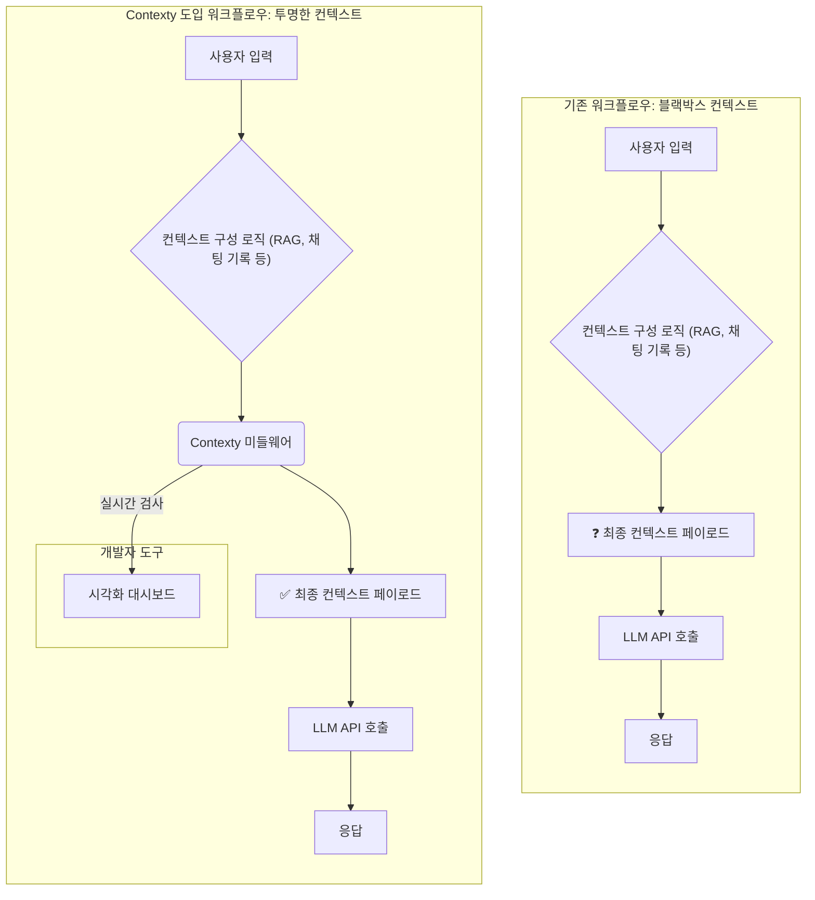

LLM 기반 애플리케이션 개발의 가장 큰 어려움 중 하나는 최종적으로 LLM에 전달되는 컨텍스트(Context)가 '블랙박스'라는 점입니다. 우리는 RAG(Retrieval-Augmented Generation), 채팅 기록, 시스템 프롬프트 등 다양한 소스에서 정보를 조합하여 컨텍스트를 구성하지만, `llm.chat()`를 호출하는 마지막 순간에 이 모든 것이 어떻게 합쳐져 어떤 모습으로 전달되는지 직접 확인하기는 어렵습니다.

이러한 가시성 부족은 디버깅을 악몽으로 만듭니다.
- 왜 LLM이 환각(Hallucination)을 일으켰을까? (혹시 관련 없는 정보가 RAG를 통해 주입되었나?)
- 왜 API 응답이 갑자기 느려졌을까? (불필요한 채팅 기록이 컨텍스트를 비대하게 만들었나?)
- 왜 특정 질문에만 동문서답을 할까? (시스템 프롬프트와 사용자 질문이 충돌했나?)

iOS, 프론트엔드 개발자들은 Xcode나 Chrome DevTools 같은 강력한 디버깅 도구에 익숙합니다. 네트워크 요청의 헤더와 페이로드를 검사하고, 뷰 계층 구조를 뜯어보는 것은 당연한 일입니다. 하지만 LLM 개발에서는 이와 같은 기본적인 관찰 가능성(Observability)이 부족했습니다. Contexty와 같은 컨텍스트 시각화 및 제어 도구는 바로 이 문제를 해결하여, LLM 개발 워크플로우에 개발자에게 익숙한 수준의 통제권을 되돌려줍니다.

## 컨텍스트 파이프라인의 변화

기존의 LLM 애플리케이션 개발 워크플로우와 Contexty를 도입했을 때의 워크플로우를 비교하면 그 차이를 명확히 알 수 있습니다.



위 다이어그램처럼 Contexty는 컨텍스트 구성 로직과 실제 LLM API 호출 사이에 위치하는 '미들웨어' 또는 '프록시' 역할을 합니다. 이를 통해 개발자는 최종 페이로드를 눈으로 직접 확인하고, 각 구성 요소(소스)가 전체 컨텍스트에서 차지하는 비중과 내용을 분석할 수 있게 됩니다.

## 코드 레벨에서의 구현 예시

TypeScript를 사용하여 간단한 RAG 기반 챗봇의 컨텍스트를 구성하는 시나리오를 생각해 보겠습니다. Contexty가 없다면, 우리는 그저 `constructFinalContext` 함수가 잘 동작하기를 바랄 뿐입니다.

```typescript
// Before: Contexty가 없는 경우
async function getLLMResponse(query: string, history: ChatMessage[]): Promise<string> {
  const systemPrompt = "You are a helpful assistant.";
  const relevantDocs = await retrieveFromVectorDB(query); // RAG
  
  // 최종 컨텍스트가 어떻게 생겼을지 추측만 가능
  const finalContext = constructFinalContext(systemPrompt, relevantDocs, history, query);
  
  const response = await llm.chat(finalContext);
  return response;
}
```

이제 Contexty의 가상 SDK를 적용해 보겠습니다. `llm.chat`을 호출하기 전에 컨텍스트를 '검사'하는 단계를 추가합니다.

```typescript
import { contexty } from '@contexty/sdk'; // 가상의 SDK

// After: Contexty를 적용한 경우
async function getLLMResponseWithContexty(query: string, history: ChatMessage[]): Promise<string> {
  const systemPrompt = "You are a helpful assistant.";
  const relevantDocs = await retrieveFromVectorDB(query);

  const contextSources = {
    system: { content: systemPrompt, source: 'static' },
    rag_docs: { content: relevantDocs, source: 'vector_db' },
    history: { content: history, source: 'chat_session' },
    query: { content: query, source: 'user_input' }
  };

  // Contexty가 컨텍스트를 시각화하고 분석할 수 있도록 전달
  // 이 단계에서 개발자 대시보드로 데이터가 전송됨
  const finalContext = await contexty.inspectAndBuild(contextSources);

  const response = await llm.chat(finalContext);
  return response;
}
```

`contexty.inspectAndBuild`는 단순히 문자열을 합치는 것을 넘어, 각 소스별 토큰 수, 내용, 메타데이터를 포함한 구조화된 데이터를 개발자 대시보드로 전송합니다. 개발자는 대시보드에서 다음과 같은 화면을 보게 될 것입니다.

| Context Source | Tokens | Content Snippet                  | Metadata              |
| :------------- | :----- | :------------------------------- | :-------------------- |
| `system`       | 12     | "You are a helpful assistant."   | `source: 'static'`      |
| `rag_docs`     | 1852   | "Contexty is a tool for..."      | `doc_ids: [a, b, c]`  |
| `history`      | 573    | "User: Hi<br/>AI: Hello..."      | `turns: 5`            |
| `query`        | 8      | "What is Contexty?"              | `source: 'user_input'` |
| **Total**      | **2445** | ...                              |                       |

이 테이블만으로도 "RAG 문서가 컨텍스트의 대부분(약 75%)을 차지하는구나"라는 사실을 즉시 파악할 수 있습니다. 만약 응답이 느리다면, RAG 결과물을 줄이는 것부터 시도해 볼 수 있습니다.

## 실무 적용 패턴 (2026년 트렌드 반영)

Contexty와 같은 도구는 단순히 디버깅을 넘어 AI 개발의 품질 보증(QA) 및 운영(Ops) 패러다임을 바꾸고 있습니다.

### 1. 컨텍스트 예산 초과 디버깅 (Context Budget Debugging)
- **문제**: 컨텍스트 창(Context Window) 한계에 부딪히거나, 비용 최적화를 위해 의도적으로 설정한 토큰 예산을 초과하는 경우.
- **해결**: Contexty 대시보드에서 어떤 소스가 예산을 가장 많이 소모하는지 즉시 식별합니다. 긴 채팅 기록 때문이라면 `Multi-turn Context Management` 패턴을 적용하여 요약본을 삽입하고, RAG 문서 때문이라면 `Context Compression` 패턴을 적용하여 청크 크기를 조절하거나 관련성이 높은 부분만 추출합니다.

### 2. RAG 품질 실시간 검사 (Live RAG Quality Inspection)
- **문제**: LLM이 엉뚱한 대답을 할 때, 원인이 LLM의 추론 능력 부족인지, RAG가 가져온 정보의 품질 문제인지 알기 어렵습니다.
- **해결**: 사용자가 "결과가 이상해요"라고 보고했을 때, 해당 세션의 Contexty 로그를 확인합니다. RAG로 삽입된 문서 조각(`rag_docs`)을 직접 읽어보고, 내용이 질문과 전혀 관련이 없다면 LLM이 아니라 벡터DB의 검색 알고리즘이나 임베딩 모델을 튜닝해야 한다는 결론을 내릴 수 있습니다. 이는 문제 해결의 방향을 완전히 바꿔놓습니다.

### 3. 컨텍스트 오염 탐지 (Context Contamination Detection)
- **문제**: `.claudeignore`에서 다루듯, 개인정보(PII), 부적절한 언어, 또는 이전 대화의 잘못된 정보가 현재 컨텍스트에 '오염'되어 응답 품질을 저하하거나 보안 문제를 야기할 수 있습니다.
- **해결**: Contexty에 특정 키워드나 정규식 패턴을 감시하는 규칙을 설정합니다. 예를 들어, 주민등록번호 패턴이 컨텍스트에 포함되면 알림을 보내거나 해당 요청을 자동으로 차단하는 '컨텍스트 방화벽(Context Firewall)'을 구현할 수 있습니다.

### 4. CI/CD 파이프라인 연동 (CI/CD Integration for Context Stability)
- **2026년 트렌드**: AI 모델의 성능을 테스트하듯, 컨텍스트 구성 로직의 안정성도 CI/CD 파이프라인에서 검증하는 것이 표준이 될 것입니다.
- **적용**: 주요 유스케이스에 대한 '골든 테스트 케이스' 세트를 만듭니다. CI 파이프라인이 실행될 때마다 이 테스트 케이스들로 컨텍스트를 생성하고, Contexty를 통해 생성된 컨텍스트의 스냅샷을 검사합니다.
  - **단언(Assertion) 예시**: "로그인 유저의 개인정보 질의에 대한 컨텍스트에는 `rag_docs` 소스가 절대 포함되어서는 안 된다."
  - **단언 예시**: "결제 관련 질의에 대한 컨텍스트의 총 토큰 수는 2000개를 넘지 않아야 한다."
  이러한 자동화된 검증을 통해 컨텍스트 구성 로직 변경으로 인한 예기치 않은 부작용을 사전에 방지할 수 있습니다.

Contexty와 같은 도구들은 Prompt Engineering을 넘어 Context Engineering 시대로 나아가는 개발자들에게 필수적인 나침반이자 현미경입니다. '감'에 의존하던 LLM 디버깅을 데이터 기반의 공학적 문제 해결로 전환시켜, 더 안정적이고 예측 가능한 AI 애플리케이션을 만들 수 있게 해줄 것입니다.

## 자기 점검

1. LLM 개발에서 컨텍스트가 '블랙박스'일 때 발생하는 주요 문제점 3가지를 설명해 보세요.
2. Contexty는 RAG 시스템과 어떻게 상호 보완적으로 사용될 수 있나요? LLM의 응답이 아닌, RAG 자체의 문제를 진단하는 데 어떻게 도움이 되나요?
3. 위에서 설명한 '컨텍스트 방화벽(Context Firewall)' 패턴을 여러분의 서비스에 적용한다면, 어떤 종류의 정보를 감지하고 차단하도록 설정하시겠습니까?
4. "2026년에는 컨텍스트 구성 로직도 CI/CD 파이프라인에서 테스트하는 것이 표준이 될 것이다"라는 주장에 동의하시나요? 그 이유는 무엇인가요?

---

- **이 개념을 동료에게 설명한다면?**: "우리가 만든 챗봇이 왜 가끔 이상한 말을 하는지 디버깅하기 힘들었잖아. 그게 우리가 LLM한테 최종적으로 무슨 말을 건네는지 정확히 못 봐서 그래. Contexty는 LLM API 쏘기 직전에 최종 프롬프트를 딱 잡아서 '시스템 프롬프트 n토큰, RAG 문서 n토큰, 채팅 기록 n토큰' 이런 식으로 다 분해해서 보여주는 개발자 도구야. 이제 문제 생기면 RAG가 쓰레기 문서를 가져온 건지, 채팅 기록이 너무 길어서 그런 건지 바로 알 수 있어."

- **실습 과제**: 현재 개발 중인 (또는 상상 속의) AI 기능에 대해 사용자의 특정 질문(`query`)이 들어왔을 때, 최종 컨텍스트를 구성하는 TypeScript/Swift 의사 코드를 작성해 보세요. 그런 다음, 각 컨텍스트 컴포넌트(시스템 프롬프트, 몇 개의 RAG 결과, 채팅 기록 등)에 예상 토큰 수를 주석으로 달아보세요. 만약 이 컨텍스트로 생성된 LLM의 답변이 만족스럽지 않다면, Contexty 대시보드를 통해 가장 먼저 어떤 가설을 검증하고 싶은지 2가지 이상 서술해 보세요.