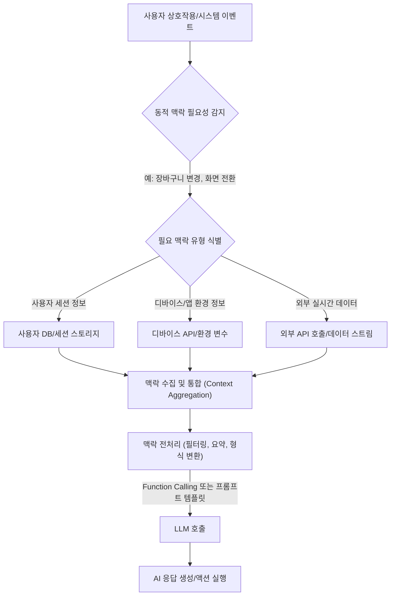

---
title: "Dynamic Context Injection — AI 에이전트의 실시간 반응성 극대화 전략"
category: context-engineering
date: "2026-04-13"
tags: [dynamic, context, injection, context-engineering]
confidence: 1
connections: [context-engineering/context-compression, context-engineering/context-engineering-fundamentals, context-engineering/multi-turn-context-management]
status: draft
description: "실시간으로 변화하는 사용자 맥락과 환경 정보를 AI 에이전트에 동적으로 주입하여 지능과 반응성을 높이는 고급 Context Engineering 패턴."
type: entry
quiz:
  - question: 동적 맥락 주입(Dynamic Context Injection)이 AI 에이전트에게 필수적인 가장 주된 이유는 무엇입니까?
    choices:
      - AI 시스템의 토큰 사용량을 최적화하여 운영 비용을 절감하기 위함입니다.
      - LLM이 과거 대화 기록에만 의존하도록 하여 예측 가능성을 높이기 위함입니다.
      - AI가 실시간으로 변화하는 사용자의 상태, 환경, 외부 데이터를 이해하고 활용할 수 있도록 하기 위함입니다.
      - AI 에이전트가 자체적으로 새로운 지식을 학습하고 내부 모델을 업데이트하도록 돕기 위함입니다.
    answer: 2
    explanation: 본문에 따르면, 대부분의 LLM은 요청 시점의 '정적' 프롬프트에 의존하여 실시간으로 변화하는 정보를 파악하기 어렵습니다. 동적 맥락 주입은 AI가 고정된 정보의 한계를 넘어, '바로 지금' 필요한 정보를 학습하고 활용하여 더욱 지능적이고 반응성이 뛰어난 시스템으로 진화하도록 돕는 핵심 전략이라고 명시되어 있습니다. 따라서, 실시간으로 변화하는 정보를 이해하고 활용하는 것이 가장 주된 이유입니다. 다른 선택지들은 동적 맥락 주입의 직접적인 필요성이나 주요 목표와는 거리가 있습니다. 토큰 사용량 최적화는 맥락 전처리 단계에서 고려될 수 있지만 주된 목적은 아니며, LLM이 과거 대화 기록에만 의존하는 것은 동적 맥락 주입의 필요성을 대두시킨 문제점입니다. AI의 내부 모델 업데이트는 동적 맥락 주입의 역할이 아닙니다.
  - question: 동적 맥락 주입이 AI 에이전트의 능력을 향상시키고자 하는 핵심 목표 세 가지는 무엇입니까?
    choices:
      - 토큰 효율성, 응답 속도, 멀티턴 대화 관리
      - 관련성, 정확성, 반응성
      - 사용자 인터페이스 개인화, 디바이스 자원 관리, 외부 API 의존성 감소
      - 환각(hallucination) 방지, 내부 지식 기반 확장, AI 모델 업데이트
    answer: 1
    explanation: 본문 '동적 맥락 주입의 핵심 개념과 목표' 섹션에 명확히 '그 목표는 AI의 다음 세 가지 능력을 비약적으로 향상시키는 데 있습니다. 1. 관련성(Relevance) 2. 정확성(Accuracy) 3. 반응성(Responsiveness)'라고 기재되어 있습니다. 다른 선택지들은 동적 맥락 주입의 부수적인 결과이거나 관련 없는 개념, 또는 부분적으로만 맞는 설명입니다. 예를 들어, 환각 방지는 정확성 목표에 포함되지만, '내부 지식 기반 확장'이나 'AI 모델 업데이트'는 동적 맥락 주입의 직접적인 목표가 아닙니다.
  - question: 다음 중 기술 블로그 본문에서 '동적 맥락의 주요 유형'으로 언급되지 않은 것은 무엇입니까?
    choices:
      - 사용자의 현재 장바구니에 담긴 상품 목록
      - AI 에이전트의 내부 모델 학습 데이터 셋
      - 현재 접속한 디바이스의 운영체제 버전
      - 외부 API 호출을 통해 실시간으로 가져온 날씨 정보
    answer: 1
    ex```mermaid
graph TD
    A[사용자 상호작용/시스템 이벤트] --> B{동적 맥락 필요성 감지};
    B -- 예: 장바구니 변경, 화면 전환 --> C{필요 맥락 유형 식별};
    C -- 사용자 세션 정보 --> D1[사용자 DB/세션 스토리지];
    C -- 디바이스/앱 환경 정보 --> D2[디바이스 API/환경 변수];
    C -- 외부 실시간 데이터 --> D3[외부 API 호출/데이터 스트림];
    D1 & D2 & D3 --> E[""맥락 수집 및 통합 (Context Aggregation)""];
    E --> F[""맥락 전처리 (필터링, 요약, 형식 변환)""];
    F -- Function Calling 또는 프롬프트 템플릿 --> G[LLM 호출];
    G --> H[AI 응답 생성/액션 실행];
```점 더 복잡하고 동적인 환경에서 사용자와 상호작용합니다. iOS 앱의 개인 비서부터 웹 서비스의 이커머스 어시스턴트에 이르기까지, AI가 효과적으로 기능하려면 실시간으로 변화하는 수많은 정보를 이해하고 활용할 수 있어야 합니다.

하지만 대부분의 LLM은 요청 시점에 주어지는 "정적" 프롬프트에 의존합니다. 이는 AI가 과거 대화 기록(멀티턴 컨텍스트 관리 패턴에서 다루는 내용)이나 미리 정의된 지식 외에, 현재 사용자의 상태, 디바이스 환경, 외부 시스템의 실시간 데이터 등 끊임없이 변하는 정보를 파악하기 어렵게 만듭니다.

여기서 **동적 맥락 주입(Dynamic Context Injection)**의 중요성이 부각됩니다. 정적인 정보만으로는 AI가 사용자의 복잡한 의도를 정확히 파악하거나, 현재 상황에 맞는 최적의 액션을 제안하기 어렵습니다. 예를 들어, 이커머스 AI 어시스턴트가 사용자의 장바구니에 담긴 상품 목록, 현재 재고 현황, 최근 본 상품 등의 정보를 실시간으로 알지 못한다면, 개인화된 추천이나 구매 지원은 불가능합니다.

동적 맥락 주입은 AI 에이전트가 고정된 정보의 한계를 넘어, *바로 지금* 필요한 정보를 학습하고 활용하여 더욱 지능적이고 반응성이 뛰어난 시스템으로 진화하도록 돕는 핵심 전략입니다. 이는 단순히 많은 정보를 제공하는 것을 넘어, *올바른 시점에 올바른 정보를* 제공함으로써 AI의 인지 능력과 문제 해결 능력을 극대화합니다.

## 동적 맥락 주입의 핵심 개념과 목표

동적 맥락 주입은 AI 시스템이 사용자 상호작용, 시스템 이벤트 또는 외부 데이터 변경에 반응하여 **실시간으로 가장 관련성 높은 정보를 수집하고 LLM에 전달하는 과정**을 의미합니다. 그 목표는 AI의 다음 세 가지 능력을 비약적으로 향상시키는 데 있습니다.

1.  **관련성(Relevance):** 사용자의 현재 요구사항과 상황에 가장 적합한 응답을 생성합니다.
2.  **정확성(Accuracy):** 최신 정보에 기반하여 환각(hallucination)을 줄이고 사실에 부합하는 정보를 제공합니다.
3.  **반응성(Responsiveness):** 변화하는 환경에 즉각적으로 적응하고 선제적인(proactive) 도움을 제공합니다.

### 동적 맥락의 주요 유형

동적 맥락은 여러 소스에서 발생할 수 있으며, iOS/프론트엔드 개발자가 AI를 도입할 때 특히 중요하게 고려해야 할 유형은 다음과 같습니다.

*   **사용자 세션 맥락:**
    *   **현재 활동:** 사용자가 현재 보고 있는 화면, 앱 내 특정 기능 사용 여부, 검색 질의.
    *   **사용자 상태:** 로그인 여부, 구독 플랜, 최근 구매 내역, 장바구니 내용.
    *   **개인화된 선호도:** 사용자가 명시적으로 설정했거나, AI가 학습을 통해 파악한 선호 상품, 서비스 유형.
*   **시스템/환경 맥락:**
    *   **디바이스 정보:** 사용자 디바이스의 종류(iPhone, iPad, 웹), 운영체제 버전, 배터리 잔량.
    *   **위치 및 시간:** 현재 GPS 위치, 현지 시각, 요일.
    *   **네트워크 상태:** 온라인/오프라인 여부, Wi-Fi/셀룰러.
    *   **현재 앱 상태:** 다크 모드 활성화 여부, 알림 설정, 특정 기능 활성화 여부.
*   **외부 실시간 데이터 맥락:**
    *   **실시간 재고/가격:** 이커머스 앱에서 상품의 현재 재고 수량이나 변동된 가격.
    *   **뉴스/이벤트 피드:** 최신 뉴스 기사, 주식 시장 정보, 스포츠 경기 결과.
    *   **날씨 정보:** 현재 위치의 실시간 날씨.
    *   **API 호출 결과:** 외부 서비스에서 실시간으로 가져온 데이터.

## 동작 원리 및 아키텍처 패턴

동적 맥락 주입은 일련의 단계를 거쳐 이루어집니다. iOS/프론트엔드 환경에서는 사용자 액션이나 앱 상태 변화가 이 과정의 트리거가 됩니다.



1.  **트리거 및 필요성 감지:** 사용자의 특정 액션(버튼 클릭, 검색 질의, 화면 전환)이나 시스템 이벤트(푸시 알림 수신, 위치 변화)가 발생하면, AI 에이전트가 동적 맥락이 필요하다는 것을 감지합니다.
2.  **맥락 수집 및 통합 (Context Aggregation):** 감지된 필요성에 따라, 다양한 소스에서 관련 맥락 정보를 수집합니다. 이는 로컬 데이터베이스, 디바이스 API(iOS의 Core Location, HealthKit 등), 웹뷰/앱 브릿지를 통한 웹 페이지 정보, 혹은 외부 서버 API 호출을 통해 이루어집니다.
3.  **맥락 전처리 (Context Pre-processing):** 수집된 맥락 데이터는 종종 원시적이고 방대합니다. LLM에 효율적으로 전달하기 위해 다음 과정이 필요합니다.
    *   **필터링:** 현재 질의와 가장 관련성 높은 정보만 선별합니다.
    *   **요약:** 긴 텍스트나 복잡한 데이터는 핵심만 요약하여 토큰 사용량을 최적화합니다 (Context Compression 패턴과 연관).
    *   **형식 변환:** LLM이 이해하기 쉬운 구조화된 형식(JSON, 자연어 문장)으로 변환합니다.
4.  **LLM 주입:** 전처리된 맥락은 여러 방식으로 LLM에 주입될 수 있습니다.
    *   **프롬프트 템플릿:** 맥락 정보를 자연어 문장으로 변환하여 프롬프트의 일부로 삽입합니다. `사용자 장바구니에는 [상품 A, 상품 B]가 있으며, 현재 재고는 [A: 5개, B: 20개]입니다.`
    *   **Function Calling / Tool Use:** LLM이 자체적으로 특정 정보를 요청하거나 액션을 수행하도록 유도합니다. 예를 들어, LLM이 "현재 장바구니 상품 목록을 조회하는 함수"를 호출하도록 지시하고, 그 결과를 다시 맥락으로 주입받을 수 있습니다.
    *   **RAG (Retrieval Augmented Generation):** 벡터 데이터베이스 등에서 관련 문서를 검색하여 동적으로 맥락을 보강합니다 (일부 동적 맥락 수집에 활용될 수 있음).
5.  **AI 응답 및 액션:** 주입된 동적 맥락을 바탕으로 LLM은 더 정확하고 관련성 높은 응답을 생성하거나, 특정 액션(상품 추천, 알림, 화면 전환 등)을 수행합니다.

## 실무 적용 사례 및 코드 예제

iOS/프론트엔드 개발자가 AI 시스템을 구축할 때 동적 맥락 주입이 어떻게 활용될 수 있는지 구체적인 시나리오와 TypeScript 코드 예제를 통해 살펴보겠습니다.

### 사례 1: 이커머스 AI 어시스턴트의 개인화된 상호작용

사용자가 온라인 쇼핑 앱에서 AI 어시스턴트에게 질문할 때, 어시스턴트는 사용자의 현재 장바구니 내용, 최근 본 상품, 그리고 각 상품의 실시간 재고 정보를 알아야 합니다.

```typescript
// types.ts: 데이터 모델 정의
interface UserSessionContext {
  userId: string;
  cartItems: { productId: string; quantity: number }[];
  lastViewedProducts: string[];
  currentBrowserTab: 'home' | 'product_detail' | 'cart' | 'checkout';
}

interface ProductDatabaseContext {
  productId: string;
  name: string;
  price: number;
  stock: number;
}

interface LLMResponse {
  message: string;
  action?: {
    type: 'ADD_TO_CART' | 'NAVIGATE' | 'RECOMMEND_PRODUCTS' | 'NONE';
    payload: any;
  };
}

// simulateExternalAPIs.ts: 외부 API 호출 시뮬레이션
const mockProductDB: { [key: string]: ProductDatabaseContext } = {
  'PROD001': { productId: 'PROD001', name: '스마트폰 최신 모델', price: 1200000, stock: 5 },
  'PROD002': { productId: 'PROD002', name: '무선 이어폰 프리미엄', price: 300000, stock: 20 },
  'PROD003': { productId: 'PROD003', name: '스마트 워치 스포츠 에디션', price: 500000, stock: 0 }, // 재고 없음
};

async function getProductDetails(productId: string): Promise<ProductDatabaseContext | undefined> {
  // 실제 앱에서는 백엔드 API를 호출하여 상품 상세 정보를 가져옵니다.
  console.log(`[API Call] Fetching product details for ${productId}`);
  return Promise.resolve(mockProductDB[productId]);
}

async function callLLM(prompt: string, context: Record<string, any>): Promise<LLMResponse> {
  console.log("--- Calling LLM with Dynamic Context ---");
  console.log("Prompt:", prompt.substring(0, 100) + "..."); // 프롬프트가 길 수 있으므로 일부만 출력
  console.log("Context:", JSON.stringify(context, null, 2).substring(0, 500) + "..."); // 컨텍스트도 일부만 출력

  // LLM의 처리 및 응답을 시뮬레이션합니다.
  let simulatedResponse: LLMResponse = { message: "요청을 처리하는 중입니다...", action: { type: 'NONE', payload: {} } };

  if (prompt.includes("장바구니")) {
    const cartItemsText = context.cart.map((item: any) => `${item.productId} (${item.quantity}개)`).join(', ');
    simulatedResponse.message = `현재 고객님의 장바구니에는 ${cartItemsText} 상품이 있습니다.`;
  } else if (prompt.includes("추천") || prompt.includes("무엇을 살까")) {
    const lastViewed = context.lastViewedProductDetails?.name || context.lastViewedProducts[0];
    if (lastViewed) {
      simulatedResponse.message = `'${lastViewed}' 상품을 보셨군요. 현재 '무선 이어폰 프리미엄'이 인기가 많으니 고려해보세요!`;
      simulatedResponse.action = { type: 'RECOMMEND_PRODUCTS', payload: ['PROD002'] };
    } else {
      simulatedResponse.message = `고객님의 최근 활동을 기반으로 '스마트폰 최신 모델'을 추천합니다.`;
      simulatedResponse.action = { type: 'RECOMMEND_PRODUCTS', payload: ['PROD001'] };
    }
  } else if (prompt.includes("재고 확인") && context.lastViewedProductDetails?.productId) {
    const product = context.lastViewedProductDetails;
    const stock = context.cartItemStocks[product.productId] !== undefined
      ? context.cartItemStocks[product.productId] // If it's in cart, use cartItemStocks
      : (await getProductDetails(product.productId))?.stock; // Otherwise, fetch live stock

    simulatedResponse.message = `'${product.name}'의 현재 재고는 ${stock !== undefined ? stock + '개' : '확인 불가'}입니다.`;
  } else if (prompt.includes("품절")) {
    simulatedResponse.message = `'스마트 워치 스포츠 에디션'은 현재 품절 상태입니다. 입고 시 알림을 받으시겠어요?`;
  }
  return Promise.resolve(simulatedResponse);
}

// EcommerceAIHelper.ts: AI 어시스턴트 로직
class EcommerceAIHelper {
  private userSession: UserSessionContext;

  constructor(initialSession: UserSessionContext) {
    this.userSession = initialSession;
  }

  // --- 1. Dynamic Context Collection ---
  private async getDynamicContext(): Promise<Record<string, any>> {
    const context: Record<string, any> = {
      user: {
        userId: this.userSession.userId,
        currentBrowserTab: this.userSession.currentBrowserTab,
        // 현재 시각, 위치 등 디바이스/환경 정보 추가 가능
        currentTime: new Date().toISOString(),
      },
      cart: this.userSession.cartItems,
      cartItemStocks: {}, // 장바구니 상품별 실시간 재고
    };

    // 장바구니에 담긴 상품들의 실시간 재고 정보를 가져옵니다.
    for (const item of this.userSession.cartItems) {
      const productDetail = await getProductDetails(item.productId);
      if (productDetail) {
        context.cartItemStocks[item.productId] = productDetail.stock;
      }
    }

    // 사용자가 현재 보고 있는 상품 페이지에 대한 상세 정보를 가져옵니다.
    if (this.userSession.currentBrowserTab === 'product_detail' && this.userSession.lastViewedProducts.length > 0) {
      const lastProductId = this.userSession.lastViewedProducts[this.userSession.lastViewedProducts.length - 1];
      context.lastViewedProductDetails = await getProductDetails(lastProductId);
    }

    return context;
  }

  // --- 2. Prompt Construction & LLM Call ---
  async handleUserQuery(query: string): Promise<LLMResponse> {
    // 동적으로 맥락 정보를 수집합니다.
    const dynamicContext = await this.getDynamicContext();

    // 시스템 프롬프트: AI의 역할과 행동 지침을 정의합니다.
    const systemPrompt = `당신은 고급 이커머스 AI 어시스턴트입니다. 사용자의 요청에 대해 현재 맥락을 최대한 활용하여 가장 유용하고 정확한 정보를 제공해야 합니다. 필요한 경우 상품 추천이나 장바구니 조작을 제안할 수 있습니다.`;
    
    // 사용자 질의와 함께 동적 맥락을 LLM에 전달합니다.
    // 실제 LLM API에서는 structured input이나 function calling 인자로 전달될 수 있습니다.
    const combinedPrompt = `${systemPrompt}\n\n사용자 요청: "${query}"`;

    const response = await callLLM(combinedPrompt, dynamicContext);
    return response;
  }

  // 사용자 세션 정보 업데이트 함수 (예: 사용자가 상품을 장바구니에 담았을 때)
  updateSession(newSessionData: Partial<UserSessionContext>) {
    this.userSession = { ...this.userSession, ...newSessionData };
    console.log(`[Session Update] 사용자 세션 업데이트:`, this.userSession);
  }
}

// --- Usage Example ---
async function runEcommerceExample() {
  const initialSession: UserSessionContext = {
    userId: 'user123',
    cartItems: [{ productId: 'PROD001', quantity: 1 }],
    lastViewedProducts: ['PROD002'],
    currentBrowserTab: 'cart',
  };

  const aiHelper = new EcommerceAIHelper(initialSession);

  console.log("\n--- 시나리오 1: 사용자가 장바구니에 대해 질문 ---");
  let response = await aiHelper.handleUserQuery("내 장바구니에 뭐가 들어있어?");
  console.log("AI 응답:", response.message);

  console.log("\n--- 시나리오 2: 사용자가 추천을 요청, 세션 업데이트 후 ---");
  aiHelper.updateSession({
    cartItems: [{ productId: 'PROD001', quantity: 1 }, { productId: 'PROD002', quantity: 2 }],
    currentBrowserTab: 'product_detail',
    lastViewedProducts: ['PROD001', 'PROD003']
  });
  response = await aiHelper.handleUserQuery("나에게 맞는 상품을 추천해줘. 요즘 어떤 스마트 워치가 인기 많아?");
  console.log("AI 응답:", response.message, "액션:", response.action);

  console.log("\n--- 시나리오 3: 품절된 상품에 대해 질문 ---");
  aiHelper.updateSession({
    currentBrowserTab: 'product_detail',
    lastViewedProducts: ['PROD003'] // 스마트 워치 (재고 0)
  });
  response = await aiHelper.handleUserQuery("이 스마트 워치 재고가 있나요?");
  console.log("AI 응답:", response.message);
}

runEcommerceExample();
```

위 코드 예제에서는 `EcommerceAIHelper` 클래스가 `getDynamicContext` 메서드를 통해 사용자의 세션 정보(`userSession`)와 외부 API(mock `getProductDetails`)를 비동기적으로 호출하여 실시간 맥락을 수집합니다. 이 맥락은 `callLLM` 함수로 전달되어, LLM이 사용자의 질의에 대해 장바구니 내용, 재고 현황, 추천 상품 등 시의적절하고 개인화된 응답을 생성하도록 돕습니다.

### 사례 2: 온디바이스 AI 비서의 상황 인지 능력

iOS 앱 내에서 동작하는 AI 비서는 사용자의 캘린더, 현재 위치, 배터리 잔량, Wi-Fi 연결 상태 등 디바이스의 실시간 정보를 활용할 수 있습니다 (Apple Intelligence API 같은 온디바이스 AI 솔루션이 이러한 기능을 강화할 것입니다).

*   **맥락 수집:**
    *   **iOS:** `CoreLocation`으로 현재 위치, `EventKit`으로 캘린더 일정, `UIDevice`로 배터리 및 디바이스 상태를 가져옵니다.
    *   **웹 프론트엔드:** Geolocation API로 위치, `navigator.battery` API로 배터리 상태를 가져옵니다.
*   **맥락 주입:** 수집된 정보를 간결하게 요약하여 LLM 호출 시 프롬프트 또는 별도의 구조화된 데이터 형태로 전달합니다.
    *   "현재 사용자는 [위치]에 있으며, [시간]에 [다음 일정]이 예정되어 있습니다. 디바이스 배터리는 [잔량]%입니다."

이를 통해 AI는 "집에 도착하면 오늘 저녁 일정 알려줘" 와 같은 요청에 대해 사용자의 실시간 위치 변화를 감지하고, "오늘 점심 뭐 먹을까?" 질문에 현재 위치 주변의 식당을 추천하거나, "내일 아침 일찍 나갈 건데, 뭘 준비해야 할까?" 질문에 다음 날 날씨와 캘린더 일정을 고려한 답변을 제공할 수 있습니다.

## 2026년 트렌드 및 미래 전망

동적 맥락 주입은 AI 시스템의 필수 요소로 자리 잡을 것이며, 다음 트렌드에 따라 더욱 발전할 것입니다.

*   **하이퍼 개인화(Hyper-personalization):** 사용자 개개인의 미묘한 변화까지 감지하고 이에 반응하는 AI 시스템이 보편화될 것입니다. 실시간으로 수집된 방대한 동적 맥락 데이터는 사용자 행동 패턴과 선호도를 더욱 정교하게 학습하고, 예측적인(predictive) 방식으로 맞춤형 경험을 제공하는 데 활용됩니다.
*   **능동형 AI(Proactive AI):** 사용자가 명시적으로 요청하기 전에 AI가 먼저 필요한 정보를 제공하거나 행동을 제안하는 시대가 올 것입니다. 예를 들어, AI가 사용자의 캘린더와 위치 정보를 기반으로 다음 회의 장소로 이동해야 할 시간을 미리 알려주거나, 장바구니에 담긴 상품의 재고가 얼마 남지 않았음을 선제적으로 알리는 방식입니다.
*   **멀티모달 동적 맥락(Multi-modal Dynamic Context):** 텍스트뿐만 아니라 이미지, 음성, 비디오 등 다양한 형태의 실시간 정보가 동적으로 주입될 것입니다. iOS의 카메라 피드나 마이크 입력에서 실시간으로 환경 정보를 추출하여 AI에 전달함으로써, AI는 시각적 맥락이나 청각적 맥락까지 이해하고 반응하게 됩니다.
*   **에지 AI(Edge AI)와의 결합:** Apple Intelligence와 같이 온디바이스에서 AI 모델이 직접 실행되면서, 디바이스의 센서 데이터와 사용자 앱 사용 맥락을 훨씬 빠르고 안전하게 동적으로 주입할 수 있게 됩니다. 이는 개인 정보 보호를 강화하면서도 AI의 반응 속도와 개인화 수준을 극대화할 것입니다.

## 자기 점검

1.  동적 맥락 주입이 기존 'Context Engineering 기초'나 '멀티턴 컨텍스트 관리 패턴'과 어떤 점에서 차별화되는지 설명할 수 있습니까?
2.  이커머스 AI 어시스턴트 시나리오에서 `getDynamicContext` 함수가 어떤 유형의 동적 맥락을 수집하고, 그 맥락이 AI 응답 품질에 어떻게 기여한다고 생각합니까?
3.  Mermaid 다이어그램에서 '맥락 전처리' 단계가 필요한 주된 이유는 무엇이며, 이 단계에서 어떤 작업이 수행될 수 있습니까?
4.  2026년 트렌드로 언급된 '능동형 AI'가 동적 맥락 주입과 어떤 깊은 연관성을 가지는지 설명해보세요.
5.  iOS/프론트엔드 앱에 AI 어시스턴트를 도입할 때, 동적 맥락 주입을 고려하지 않으면 어떤 문제가 발생할 수 있을까요?

### 이 개념을 동료에게 설명한다면?

"지금 우리가 만들고 있는 iOS 앱의 AI 비서가 사용자의 질문에 단순히 대화 기록만으로 대답하는 게 아니라, *사용자가 지금 보고 있는 화면이 뭔지, 장바구니에 뭐가 들어있는지, 심지어 배터리가 몇 % 남았는지* 같은 '실시간' 정보를 파악해서 훨씬 스마트하게 도와줄 수 있다면 어떨 것 같아? 그게 바로 '동적 맥락 주입'이야. AI가 뻔한 대답이 아니라, *진짜 나를 아는 듯한* 대답과 행동을 하게 만드는 핵심 기술이라고 생각하면 돼!"

### 실습 과제

자신이 개발하는 iOS/프론트엔드 앱(또는 가상의 앱)에서 AI 에이전트를 도입한다고 가정하고, 다음 시나리오에서 동적으로 주입되어야 할 맥락 정보 3가지와 각 맥락 정보를 어떤 방식으로 수집(API 호출, 디바이스 센서, 로컬 스토리지 등)할지 구체적으로 설계해보세요.

**시나리오:** 사용자가 사진 편집 앱에서 AI에게 "이 사진을 더 멋지게 만들어줘"라고 요청했을 때, AI가 능동적으로 사용자의 의도를 파악하고 적절한 편집 옵션을 제안하는 경우. (예: 현재 선택된 사진의 메타데이터, 사용자의 과거 편집 스타일, 현재 앱의 필터/효과 목록 등)

1.  **맥락 1:** [내용], **수집 방법:** [구체적인 API/데이터 소스]
2.  **맥락 2:** [내용], **수집 방법:** [구체적인 API/데이터 소스]
3.  **맥락 3:** [내용], **수집 방법:** [구체적인 API/데이터 소스]