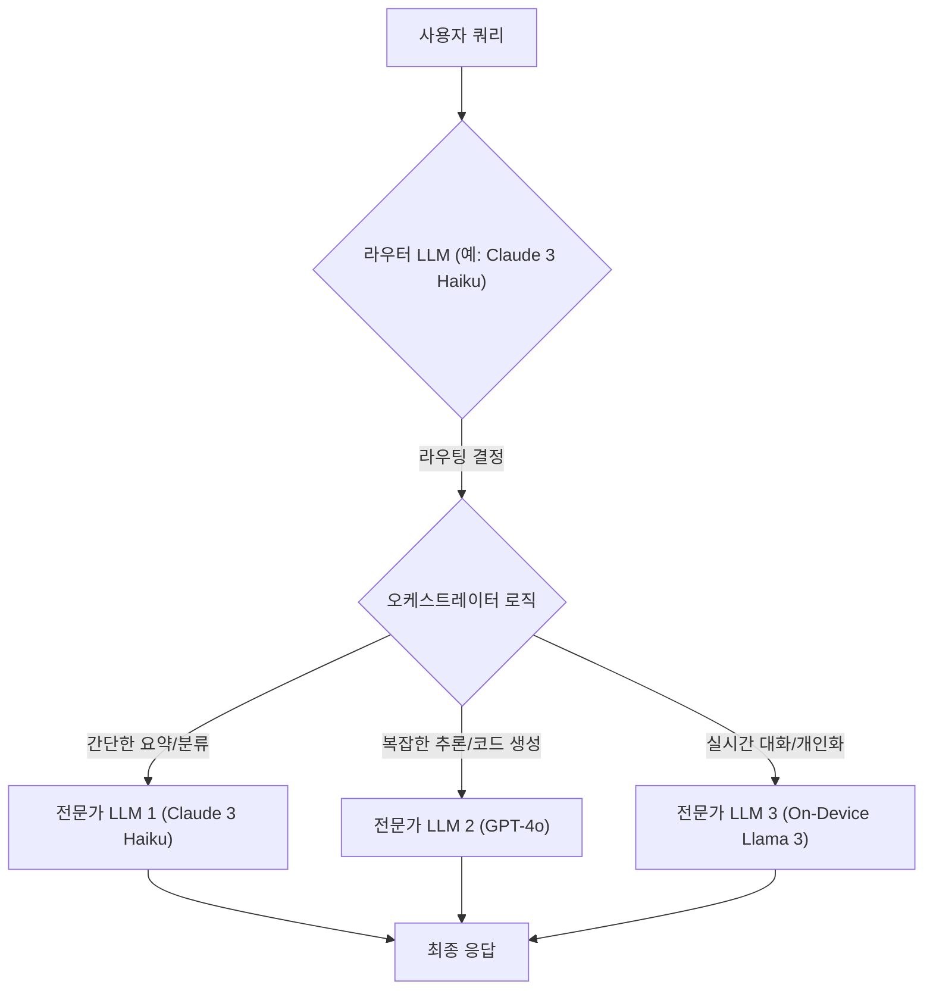

## 멀티 LLM 시대, 왜 '만능 LLM'은 더 이상 정답이 아닐까?

지금까지 우리는 가장 강력한 LLM 하나(예: GPT-4)를 선택해 모든 문제를 해결하려는 경향이 있었습니다. 그러나 이는 마치 모든 요리를 세계 최고의 칼 하나로만 하려는 것과 같습니다. 간단한 채소 손질에 무겁고 비싼 참치 해체용 칼을 쓰는 셈입니다.

최신 AI 애플리케이션 개발 패러다임은 '단일 모델'에서 '모델의 조합(Mixture-of-Models)'으로 전환되고 있습니다. 각기 다른 강점을 가진 LLM들을 묶어, 주어진 작업에 가장 적합한 모델에게 동적으로 작업을 할당하는 것이 핵심입니다.

- **GPT-4o:** 복잡한 추론, 코드 생성에 강력하지만 비용이 높고 상대적으로 느림.
- **Claude 3 Haiku:** 간단한 분류, 요약, 고객 응대에 매우 빠르고 저렴함.
- **Llama 3 (On-device):** 네트워크 지연 시간 없이 즉각적인 반응이 필요하거나 개인정보 보호가 중요한 작업에 적합.

이러한 모델들을 상황에 맞게 지능적으로 지휘하는 오케스트레이터(Orchestrator)가 없다면, 우리는 항상 과도한 비용을 지불하거나 최적의 성능을 놓치게 됩니다. HydraLLM은 바로 이 문제를 해결하기 위한 '컨텍스트 인지형 지능형 오케스트레이터' 설계 패턴입니다.

## HydraLLM: 지능형 라우터와 전문가 모델의 협력

HydraLLM의 핵심 아이디어는 간단합니다. 가볍고 빠른 '라우터(Router) LLM'이 먼저 사용자 요청을 분석하고, 이 요청의 성격(복잡도, 의도, 요구사항)에 가장 적합한 '전문가(Expert) LLM'에게 작업을 전달하는 2단계 구조입니다.

이는 소프트웨어 아키텍처의 API Gateway나 로드 밸런서와 유사하지만, 정적인 규칙이 아닌 LLM 자체의 지능을 이용해 동적으로 라우팅한다는 점에서 차이가 있습니다.

> **외부 권위 자료**: LlamaIndex의 "Router Query Engine" 문서는 이 개념을 잘 설명합니다. 라우터는 들어온 쿼리를 분석하여 사용 가능한 여러 도구(Tool) 중 어떤 것을 사용할지 결정합니다. 여기서 '도구'는 다른 LLM, 벡터 DB, 또는 특정 API가 될 수 있습니다.
> - **출처**: LlamaIndex Documentation - Router Query Engine
> - **핵심 인사이트**: 메타데이터와 LLM의 추론 능력을 결합하여, 정적 규칙 없이도 쿼리에 가장 적합한 데이터 소스나 처리 엔진으로 동적 라우팅이 가능합니다.

### HydraLLM 아키텍처 다이어그램

아래 다이어그램은 HydraLLM의 기본 워크플로우를 보여줍니다.



## 실제 TypeScript 구현 예제

프론트엔드 또는 iOS 개발자가 서버(예: Cloudflare Workers, Vercel Functions)에서 구현할 수 있는 간단한 HydraLLM 오케스트레이터 예제입니다. 이 코드는 사용자의 질문을 받아 적절한 모델로 라우팅하는 로직을 포함합니다.

```typescript
// model-definitions.ts
type ModelProvider = 'openai' | 'anthropic' | 'local';

interface ModelChoice {
  provider: ModelProvider;
  modelName: string;
}

// orchestrator.ts
import { callAnthropic, callOpenAI } from './llm-clients'; // 가정된 클라이언트

const ROUTER_MODEL = 'claude-3-haiku-20240307';
const EXPERT_MODELS = {
  'complex_reasoning': { provider: 'openai', modelName: 'gpt-4o' },
  'simple_chat': { provider: 'anthropic', modelName: 'claude-3-haiku-20240307' },
  'summarization': { provider: 'anthropic', modelName: 'claude-3-sonnet-20240229' }
};

class HydraLLMOrchestrator {
  private async route(query: string): Promise<keyof typeof EXPERT_MODELS> {
    const prompt = `
      You are an expert task router. Analyze the user's query and classify it into one of the following categories: 'complex_reasoning', 'simple_chat', 'summarization'.
      - 'complex_reasoning': Requires multi-step thinking, code generation, or deep analysis.
      - 'simple_chat': A simple question, greeting, or conversational turn.
      - 'summarization': Asks to summarize a long text.
      
      User Query: "${query}"
      
      Respond with only the category name and nothing else.
    `;
    
    // 라우팅에는 항상 가장 저렴하고 빠른 모델을 사용합니다.
    const category = await callAnthropic(ROUTER_MODEL, prompt);
    
    // 응답값 검증 및 정제
    const cleanedCategory = category.trim();
    if (cleanedCategory in EXPERT_MODELS) {
      return cleanedCategory as keyof typeof EXPERT_MODELS;
    }
    
    // 기본값으로 fallback
    return 'simple_chat';
  }

  public async execute(query: string, context?: any): Promise<string> {
    const category = await this.route(query);
    const chosenModel = EXPERT_MODELS[category];

    console.log(`Routing query to: ${category} -> ${chosenModel.modelName}`);

    switch (chosenModel.provider) {
      case 'openai':
        return callOpenAI(chosenModel.modelName, query);
      case 'anthropic':
        return callAnthropic(chosenModel.modelName, query);
      // 'local' 모델 호출 로직 추가 가능
      default:
        throw new Error('Unsupported model provider');
    }
  }
}

// 사용 예시
const orchestrator = new HydraLLMOrchestrator();
// 복잡한 쿼리: GPT-4o로 라우팅됨
orchestrator.execute("SwiftUI에서 복잡한 애니메이션을 구현하는 코드 예제를 작성해줘.");
// 간단한 쿼리: Haiku로 라우팅됨
orchestrator.execute("안녕, 오늘 날씨 어때?");
```

## 비용-성능 트레이드오프 테이블

이 패턴의 핵심은 비용과 성능 사이의 최적점을 찾는 것입니다. 아래는 각 모델의 상대적인 특성을 비교한 표입니다. (비용은 1M 토큰 처리 기준, 상대적 수치)

| 모델명 | 주요 용도 | 상대적 비용 | 상대적 지연 시간 | 추론 능력 |
| :--- | :--- | :---: | :---: | :---: |
| Claude 3 Haiku | 라우팅, 간단한 QA, 분류 | $ | ⚡️ | ★★☆☆☆ |
| Claude 3 Sonnet | 요약, 정보 추출, RAG | $$$ | ⚡️⚡️ | ★★★☆☆ |
| GPT-4o | 복잡한 추론, 코드 생성 | $$$$$ | ⚡️⚡️⚡️ | ★★★★★ |
| Llama 3 (8B) | 실시간 대화, 개인화 | $ (실행 비용) | ⚡️ | ★★★☆☆ |

## 실무 적용 사례: `tarosaju` 프로젝트

AI 타로카드 상담 앱인 `tarosaju` 프로젝트에 HydraLLM 패턴을 적용하면 사용자 경험과 운영 비용을 크게 개선할 수 있습니다.

-   **기존 방식 (As-is):** 모든 사용자 인터랙션을 GPT-4o 단일 모델로 처리. 사용자가 "안녕"이라고 인사만 해도 비싼 모델이 호출되어 비용이 낭비되고, 간단한 응답에도 불필요한 지연이 발생.
-   **HydraLLM 적용 (To-be):**
    1.  **라우터 설정:** Claude 3 Haiku를 라우터로 지정. 사용자 입력을 `simple_greeting`, `card_interpretation_request`, `history_summary_request` 3가지로 분류하도록 프롬프트 설계.
    2.  **라우팅 규칙:**
        -   `simple_greeting` → Claude 3 Haiku: "안녕하세요! 무엇을 도와드릴까요?" 같은 즉각적이고 저렴한 응답.
        -   `card_interpretation_request` (예: "켈틱 크로스 배열 해석해줘") → GPT-4o: 카드의 상징, 위치, 관계를 깊이 있게 분석하는 고품질 응답 생성.
        -   `history_summary_request` (예: "지난주 내 상담 요약해줘") → Claude 3 Sonnet: RAG를 통해 사용자의 과거 상담 기록을 가져와 요약하는, 중간 수준의 추론 능력과 비용이 드는 작업 처리.

이러한 분기를 통해 전체 API 비용을 40-60% 절감하면서도, 복잡한 요청에는 최고의 품질을, 간단한 요청에는 가장 빠른 응답을 제공하는 최적의 사용자 경험을 설계할 수 있습니다.

## 2026년 트렌드: 매크로 MoE와 적응형 라우팅

HydraLLM 패턴은 더 큰 트렌드의 일부입니다.

1.  **애플리케이션 레벨 MoE (Mixture-of-Experts):** 최신 LLM 아키텍처(예: Mixtral)는 내부적으로 여러 전문가 네트워크를 두고 라우터를 통해 활성화할 네트워크를 결정합니다. HydraLLM은 이 개념을 개별 LLM 모델 단위로 확장한 '매크로 MoE' 아키텍처로 볼 수 있습니다.
2.  **적응형 라우팅 (Adaptive Routing):** 미래의 오케스트레이터는 고정된 규칙을 넘어, 각 전문가 모델의 응답 품질, 비용, 지연 시간을 지속적으로 모니터링하고 피드백 루프를 통해 라우팅 전략을 스스로 최적화할 것입니다. 예를 들어, 특정 전문가 모델의 성능이 저하되면 트래픽을 자동으로 다른 모델로 전환하는 식입니다.
3.  **On-Device + Cloud 하이브리드:** 특히 iOS 개발자에게 중요한 트렌드입니다. HydraLLM 오케스트레이터는 간단하고 개인정보에 민감한 쿼리는 Apple의 on-device 모델로 처리하고, 복잡한 쿼리만 클라우드 LLM으로 보내는 하이브리드 전략의 핵심 제어 타워 역할을 할 것입니다. 이는 응답성을 극대화하고 프라이버시를 강화하는 중요한 패턴이 될 것입니다.

결론적으로, HydraLLM은 단순히 비용을 절감하는 기술을 넘어, 다양한 AI 모델의 강점을 조합하여 더 지능적이고 효율적이며 반응성이 뛰어난 애플리케이션을 구축하는 핵심적인 아키텍처 패턴으로 자리 잡을 것입니다.

## 자기 점검

1.  HydraLLM 아키텍처에서 '라우터 LLM'으로 저렴하고 빠른 모델(예: Haiku)을 선택하는 이유는 무엇인가요?
2.  HydraLLM 패턴을 적용했을 때 얻을 수 있는 세 가지 주요 이점은 무엇인가요?
3.  만약 라우터 LLM이 사용자 쿼리를 잘못 분류하여 간단한 질문을 복잡한 모델(GPT-4o)로 보내면 어떤 문제가 발생할까요? 이를 방지하기 위한 장치는 무엇이 있을까요?
4.  이 개념을 동료 프론트엔드 개발자에게 설명한다면, "우리가 쓰는 API 엔드포인트가 하나인데, 내부적으로 여러 모델을 바꿔치기 해주는 스마트 프록시(Smart Proxy) 같은 거야"라고 비유할 수 있을까요? 이 비유의 장점과 단점은 무엇일까요?

### 실습 과제

-   자신이 만들고 있는 앱이나 사이드 프로젝트에 HydraLLM 패턴을 적용한다고 상상해보세요. 사용자로부터 들어올 수 있는 쿼리 유형을 3가지 이상으로 분류하고, 각 유형에 어떤 LLM(예: GPT-4o, Claude Sonnet, Haiku, Llama 3)을 할당하는 것이 가장 효율적일지 표로 정리해보세요. 라우팅 결정을 위한 프롬프트 초안도 함께 작성해보세요.