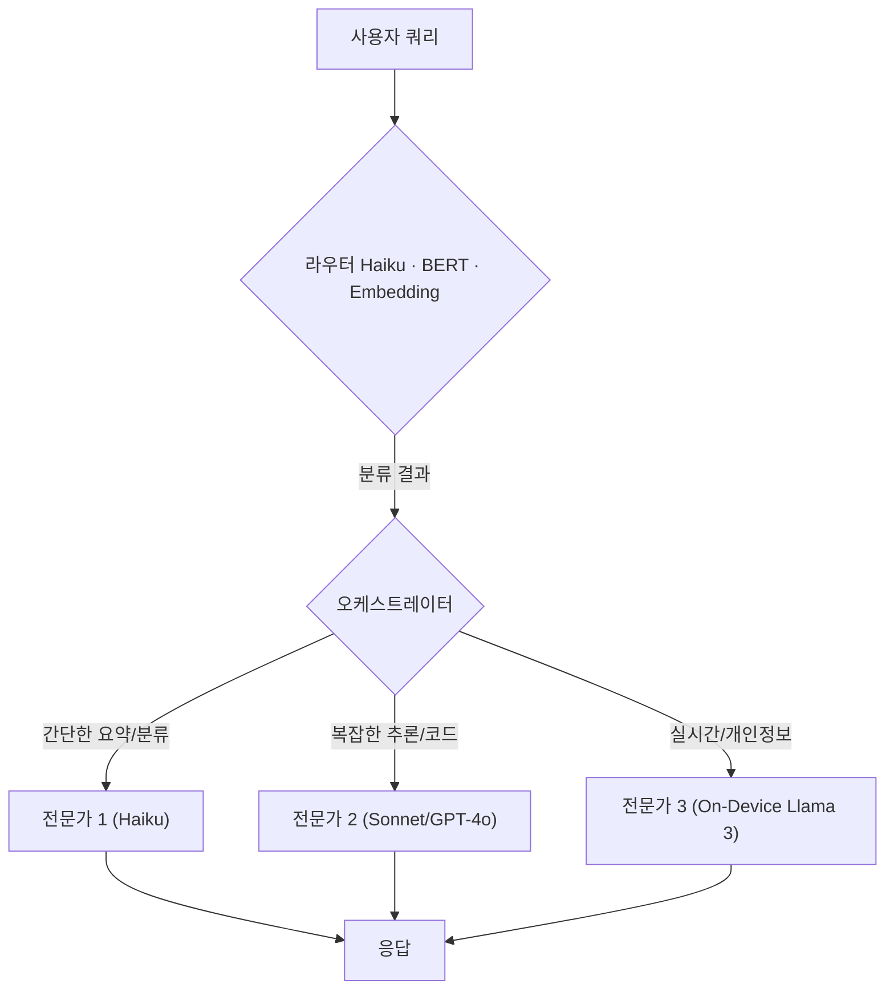

## 만능 LLM에서 모델의 조합으로

가장 강력한 LLM 하나로 모든 문제를 푸는 시기는 끝났습니다. **간단한 분류 한 번에 GPT-4 호출 비용을 내는 것**은 운영 차원에서 점점 정당화되기 어렵고, 사용자에게도 응답 지연이라는 비용을 떠넘깁니다.

이 글은 "복수의 LLM을 라우터로 묶어 작업에 맞는 모델로 동적으로 보내는" 패턴을 정리합니다. 핵심은 **추정이 아니라 실측에 근거한 라우팅**입니다 — RouteLLM(LMSys), FrugalGPT(Stanford), Not Diamond, Semantic Router 같은 프로덕션·논문 사례를 기준점으로 삼습니다.

## 라우터 LLM의 기본 구조

가볍고 빠른 **라우터(Router)** 가 사용자 요청을 분석하고, 그 결과를 바탕으로 작업에 맞는 **전문가(Expert)** 모델로 라우팅합니다. 소프트웨어 아키텍처의 API Gateway와 비슷하지만, 정적 규칙 대신 학습된/추론된 결정을 사용합니다.



### 라우터 구현 종류

라우터는 LLM 호출이어야만 하는 게 아닙니다. 비용·지연 시간 순으로:

| 구현 | 라우팅 비용 | 정확도 | 적합 도메인 |
| :--- | :--- | :--- | :--- |
| 정적 규칙 (정규식/키워드) | 거의 0 | 낮음 | 의도가 좁고 분기가 단순할 때 |
| Embedding 유사도 ([Semantic Router](https://github.com/aurelio-labs/semantic-router)) | 매우 낮음 (~ms) | 중 | 고정된 의도 클래스가 있는 경우 |
| BERT/소형 분류기 (RouteLLM `bert`) | 낮음 | 중-상 | 학습 데이터 확보 가능할 때 |
| Matrix Factorization (RouteLLM `mf`) | 매우 낮음 | 상 | 모델 페어별 선호 데이터 보유 |
| 라우터 LLM 프롬프트 (Haiku/Mini) | 중 | 상 | 도메인이 빠르게 변할 때, 콜드스타트 |

> 권장 시작점: **Embedding 라우터 + 소수의 정적 규칙**. LLM 라우터는 도메인이 정착하지 않았을 때만. 라우터 자체 비용이 의외의 누수원입니다.

## 측정된 결과들

추정 대신 공개된 수치로 기대치를 캘리브레이션합니다:

- **RouteLLM** ([github.com/lm-sys/RouteLLM](https://github.com/lm-sys/RouteLLM)): Matrix Factorization 라우터로 MT-Bench에서 **GPT-4 성능 95% 유지, 비용 최대 85% 절감**. GPT-4와 Mixtral 8x7B 페어로 학습 후 다른 모델 페어로도 일반화 보고.
- **FrugalGPT** (Stanford, 2023, [arxiv.org/abs/2305.05176](https://arxiv.org/abs/2305.05176)): 라우터 대신 **cascade**(저렴한 모델 먼저 호출, 신뢰도 낮으면 다음 모델로 escalation). 일부 태스크에서 GPT-4 단일 사용 대비 비용 98% 감소·정확도는 동등.
- **Not Diamond** ([notdiamond.ai](https://notdiamond.ai)): 트레이닝 데이터 없이도 작동하는 zero-shot 라우터. 사용자가 자체 eval 데이터로 커스텀 라우터 학습 가능.
- **Martian**: 동적 라우팅 + 비용 계산기 제공. OpenAI evals에서 GPT-4 단일 사용 대비 절감 보고.

이 수치들의 공통점: *"단일 모델보다 비용은 줄고 품질은 유지/거의 유지"* — 단, **eval 셋과 임계값 calibration이 필수**입니다. 캘리브레이션 없이는 절감 폭이 작거나 품질이 떨어집니다.

## TypeScript 구현 (Embedding 라우터 + LLM Fallback)

```typescript
// orchestrator.ts
type Category = 'complex_reasoning' | 'simple_chat' | 'summarization';

const ROUTES: Record<Category, { provider: 'openai' | 'anthropic'; modelName: string }> = {
  complex_reasoning: { provider: 'openai', modelName: 'gpt-4o' },
  simple_chat:       { provider: 'anthropic', modelName: 'claude-3-haiku-20240307' },
  summarization:     { provider: 'anthropic', modelName: 'claude-3-sonnet-20240229' },
};

// 1차: embedding 유사도 라우터 (수 ms, 비용 거의 0)
async function routeByEmbedding(query: string): Promise<{ category: Category; confidence: number }> {
  const queryVec = await embed(query); // e.g. text-embedding-3-small
  const best = topMatch(queryVec, EXEMPLAR_VECTORS); // 사전 임베딩된 클래스 예시
  return { category: best.category, confidence: best.cosine };
}

// 2차: confidence 낮을 때만 LLM 라우터로 fallback
async function routeByLLM(query: string): Promise<Category> {
  const prompt = `Classify into: complex_reasoning, simple_chat, summarization. Query: "${query}". Respond with only the category.`;
  const out = (await callAnthropic('claude-3-haiku-20240307', prompt)).trim();
  return (out as Category in ROUTES) ? (out as Category) : 'simple_chat';
}

class Orchestrator {
  async execute(query: string): Promise<string> {
    const { category, confidence } = await routeByEmbedding(query);
    const finalCategory = confidence > 0.78 ? category : await routeByLLM(query);
    const choice = ROUTES[finalCategory];
    return choice.provider === 'openai'
      ? callOpenAI(choice.modelName, query)
      : callAnthropic(choice.modelName, query);
  }
}
```

**왜 2-tier 라우터인가**: 단일 LLM 라우터는 모든 쿼리에 라우팅 비용을 부과합니다. Embedding 1차 + 신뢰도 임계값 + LLM 2차 fallback이면, 명확한 쿼리는 ms 단위로 라우팅되고 애매한 쿼리에만 LLM 비용이 듭니다.

## 함정과 운영 가드레일

1. **라우터 비용 누수**: 모든 요청에 라우터 LLM을 쓰면 절감의 절반이 사라질 수 있습니다. 라우터는 *embedding-first*로 시작하세요.
2. **오분류 비용**: 간단한 쿼리를 GPT-4로 보내면 손실 적음. 복잡한 쿼리를 Haiku로 보내면 *품질이 무너집니다*. 비대칭 비용 — eval 셋에서 후자의 빈도를 0에 수렴시켜야.
3. **응답 분산**: 같은 쿼리가 다른 모델로 라우팅되면 톤·포맷이 흔들립니다. 시스템 프롬프트로 출력 포맷을 강하게 제약하거나, 클래스별 후처리(스타일 맞춤)를 추가.
4. **eval 부재로 시작 금지**: "체감상 절감됐다"는 신호가 아닙니다. RouteLLM의 calibration 가이드처럼 도메인 eval 셋 + 비용/정확도 곡선을 그리고 임계값을 결정하세요.
5. **콜드 스타트**: 트래픽이 적으면 라우터 학습 데이터가 부족합니다. Not Diamond의 zero-shot 라우터로 시작 → 데이터 누적 후 자체 학습으로 이전.

## 비용-지연 비교 (참고용 상대 수치, 2026-05 기준)

> 절대 수치는 모델 가격표 변동에 따라 빠르게 노후화되므로 **상대 비교**로만 사용하세요.

| 모델군 | 주요 용도 | 상대 비용 | 상대 지연 | 추론 강도 |
| :--- | :--- | :---: | :---: | :---: |
| Haiku/Flash/Mini | 라우팅, 분류, 짧은 QA | 1× | 1× | ★★ |
| Sonnet/GPT-4o-mini | 요약, 추출, RAG 합성 | ~5–10× | 1.5–2× | ★★★ |
| Sonnet 4.5/GPT-4o | 복잡한 추론, 코드, 에이전트 | ~30–60× | 2–3× | ★★★★ |
| Opus 4.x | 최상위 추론, 멀티스텝 plan | ~100×+ | 3–5× | ★★★★★ |
| Llama 3 8B (on-device) | 실시간/오프라인/개인정보 | 인프라 비용만 | 1× (네트워크 0) | ★★★ |

## 프로젝트 적용

### tarosaju (운세)
- 라우팅 클래스: `simple_greeting`, `card_interpretation_request`, `history_summary_request`
- 1차 embedding 라우터 → 임계값 0.78 미만일 때만 Haiku 라우터로 fallback
- "전체 비용 40–60% 절감"은 *eval 후* 보고할 수치 — 사전 추정 금지. 시작점 캘리브레이션: 200개 실 쿼리 샘플링 → 클래스 분포 확인 → 비용 시뮬레이션.

### moneyflow (가계부)
- 트랜잭션 분류는 *embedding 라우터만으로 충분한 도메인*. LLM 라우터는 과잉 — 카테고리가 닫혀있고 안정적.
- "왜 이번 달 식비가 늘었나" 같은 자연어 인사이트만 Sonnet급으로 보냄.

### ai-study (이 위키)
- 검색은 이미 [JIT 위키 검색](../../CLAUDE.md)으로 임베딩 기반 — 별도 LLM 라우터 불필요.
- 글 생성 파이프라인(Gemini)은 단일 모델 사용. 라우터 도입은 ROI 부족 (생성 빈도 낮음).

## 2026 트렌드

1. **Cascade가 라우터를 잡아먹는다**: FrugalGPT 계열 cascade는 라우터의 오분류 위험을 구조적으로 회피합니다. 라우터 + cascade 하이브리드가 늘어날 것.
2. **온디바이스 우선**: iOS Foundation Models, Android Gemini Nano, Llama 3.x on-device가 무료 1차 라우터 + 1차 처리기로 자리 잡고 있습니다.
3. **라우팅 신뢰도의 표준화**: OpenRouter, Portkey 같은 게이트웨이가 라우팅 메타데이터(어떤 모델로 보냈는지, 신뢰도 얼마였는지)를 표준화 중. 사후 분석/리플레이 인프라가 강해집니다.

결론: 라우터는 단순히 "비용을 줄이는 트릭"이 아니라 **모델 다양성을 운영 규율로 묶는 인프라**입니다. *eval, 임계값, 라우터 비용 자체*가 함께 설계되지 않으면 추정만큼 절감되지 않습니다 — 이 글의 수치들은 그 함정을 피하기 위한 출발점입니다.

---

## 출처

- LMSys, RouteLLM (open source): https://github.com/lm-sys/RouteLLM
- Chen et al., FrugalGPT (Stanford, 2023): https://arxiv.org/abs/2305.05176
- Not Diamond, "Awesome AI Model Routing": https://github.com/Not-Diamond/awesome-ai-model-routing
- Aurelio Labs, Semantic Router: https://github.com/aurelio-labs/semantic-router
- LlamaIndex, Router Query Engine 공식 문서: https://docs.llamaindex.ai/en/stable/module_guides/querying/router/

## 자기 점검

1. RouteLLM이 "단일 LLM 라우터" 대신 Matrix Factorization 같은 작은 분류기를 권장하는 이유는 무엇인가요?
2. FrugalGPT의 cascade와 라우터 패턴의 차이는 무엇이며, 어떤 도메인에서 cascade가 더 안전한가요?
3. 임베딩 라우터에서 confidence 임계값을 어떻게 결정해야 할까요? (eval 셋 설계 관점)
4. 라우터 도입 *없이도* 비용을 줄일 수 있는 도메인의 특징 3가지를 말해보세요.
5. **실습**: 자신의 사이드 프로젝트에서 200개 실제 쿼리를 샘플링하고, 클래스 3–5개로 라벨링한 뒤, embedding 유사도 + 정적 규칙만으로 라우터를 만들어보세요. LLM 라우터를 추가하기 전과 후의 정확도/비용을 측정해 비교하세요.
